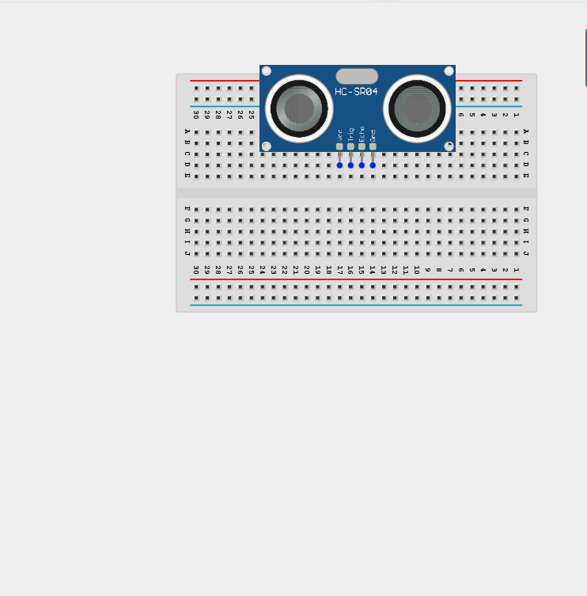
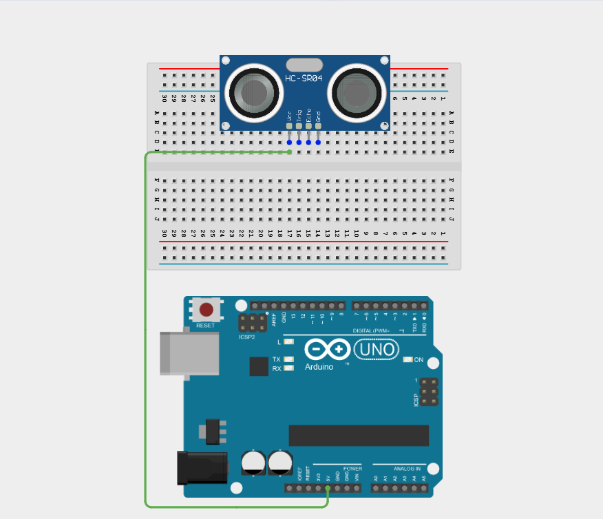
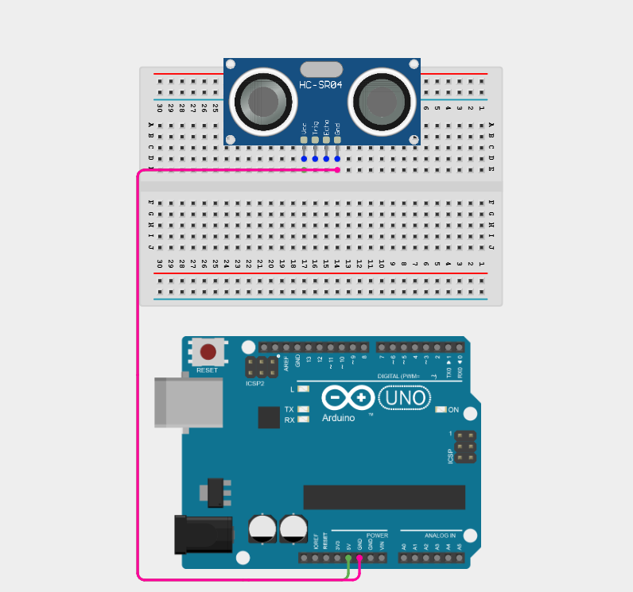
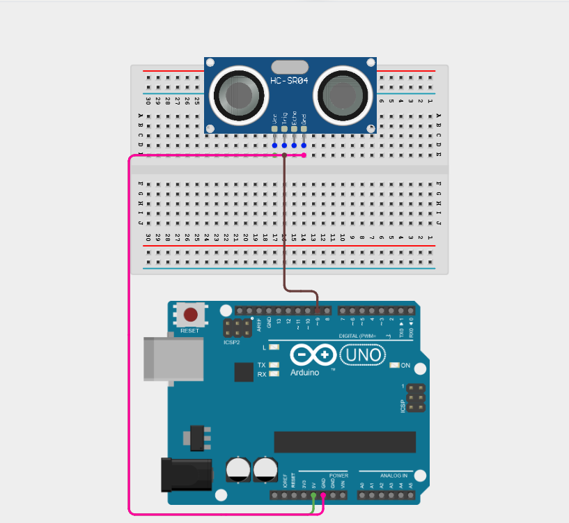
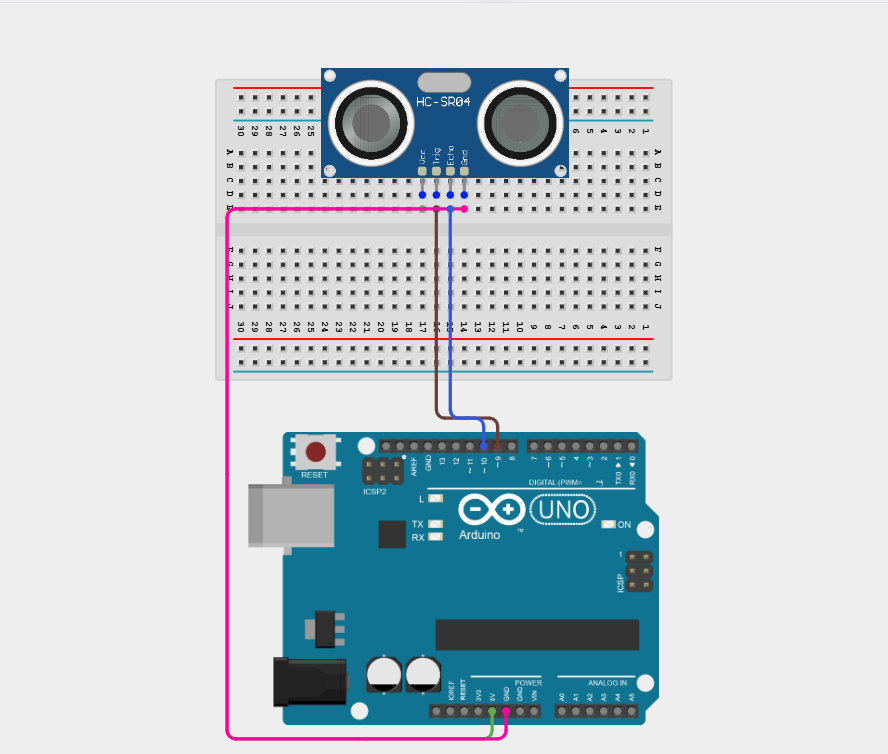
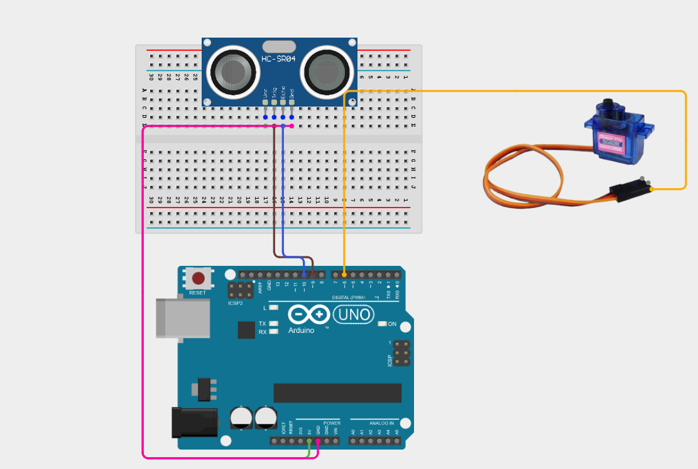
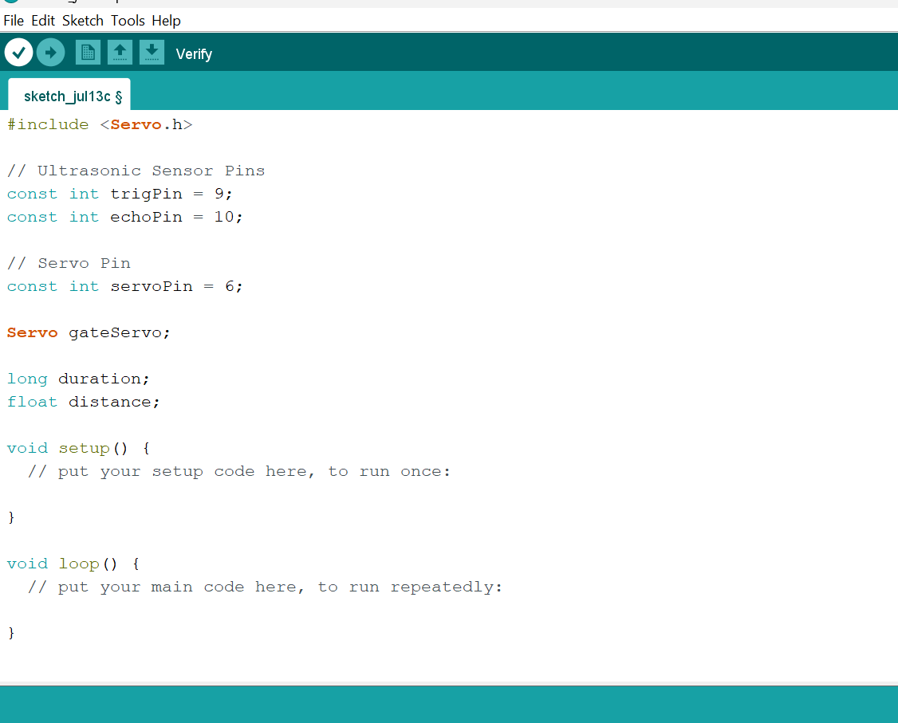
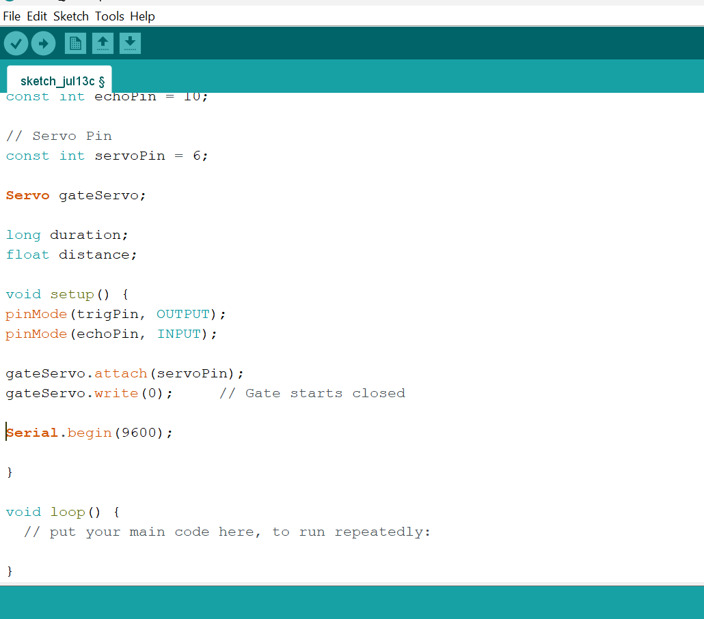
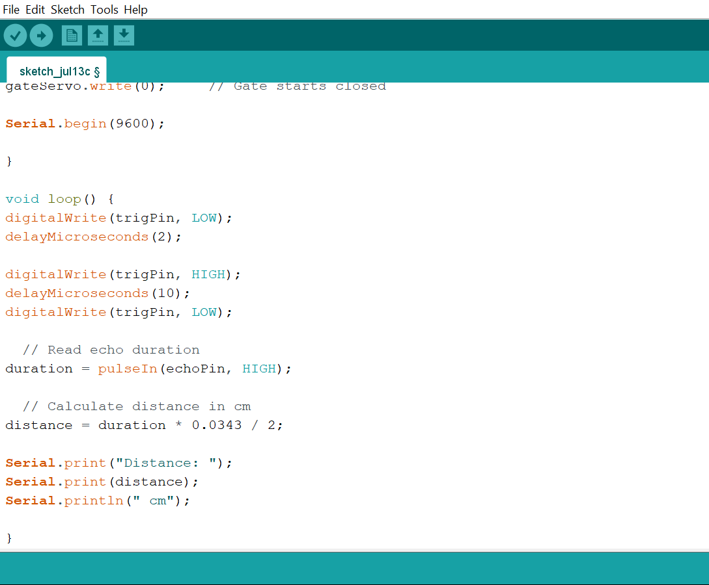
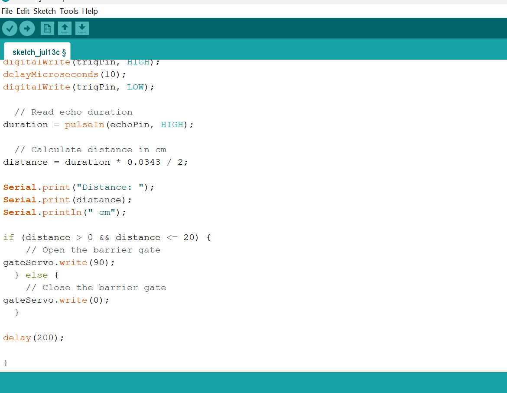

# Project 2.7.4: Automatic Barrier Gate

| **Description** | This project uses an ultrasonic sensor to detect objects and controls a servo motor to open a barrier gate when something is within 20cm, closing automatically when clear. |
|------------------|----------------------------------------------------------------|
| **Use case**     | This project can be used in automation systems, interactive installations, and embedded control applications. |

## Components (Things You will need)

| | | | | | |
|-------------------------|-------------------------|-------------------------|-------------------------|-------------------------|-------------------------|

## Building the circuit

Things Needed:

- Arduino Uno = 1
- Arduino USB cable = 1
- Ultrasonic sensor = 1
- Servo motor = 1
- Jumper wires 

## Mounting the component on the breadboard

**Step 1:** Place the Ultrasonic sensor on the breadboard.

_**NB:** Make sure all components are securely placed on the breadboard with correct orientation._

## WIRING THE CIRCUIT

**Step 2:** Connect the VCC pin of the sensor to the 5V pin on the Arduino using a male-to-male jumper wire.

**Step 3:** Connect the GND pin of the sensor to the GND pin on the Arduino using a male-to-male jumper wire.

**Step 4:** Connect the TRIG pin of the ultrasonic sensor to Digital Pin 9 on the Arduino using a male-to-male jumper wire.

**Step 5:** Connect the ECHO pin of the ultrasonic sensor to Digital Pin 10 on the Arduino using a male-to-male jumper wire.

**Step 6:** Connect the Signal(yellow/orange) wire of the servo motor to Digital Pin 6 on the Arduino using a male-to-male jumper wire.

**Step 7:** Connect the VCC (Red) wire to the positive rail on the Arduino on the breadboard using a male-to-male jumper wire as shown in the image.

_Since both components require a 5V supply from the single Arduino Uno, connect them using the positive (+) power rail of the breadboard. Jump 5V from the Arduino to the positive rail, then run a power wire from that rail to the servo motor._

**Step 7:** Connect the GND (Brown/Black) wire to the GND pin on the Arduino using a male-to-male jumper wire.

_Make sure to connect the Arduino USB cable to the Arduino board._

## PROGRAMMING

**Step 1:** Open your Arduino IDE. See how to set up here: [Getting Started](../../Getting Started/Arduino_IDE_Setup.md).

**Step 2:** Type the following code in your Arduino IDE: `#include <Servo.h>`, `const int trigPin = 9;`, `const int echoPin = 10;`, `const int servoPin = 6`, `Servo gateServo;`,`long duration;`, `float distance;` as shown in the image below.

**Step 3:** Type the following code in your Arduino IDE inside the void setup() `pinMode(trigPin, OUTPUT);`, ` pinMode(echoPin, INPUT);`, ` gateServo.attach(servoPin);`, `gateServo.write(0);`, `Serial.begin(9600);` as shown in the image below.

**Step 4:** Type the following code in your Arduino IDE inside the void loop() `digitalWrite(trigPin, LOW);`, `delay(200);`, `digitalWrite(trigPin, HIGH);`, `delay(100);`, `digitalWrite(trigPin, LOW);`, `duration = pulseIn(echoPin, HIGH);;`, `distance = duration * 0.0343 / 2;`, `Serial.print("Distance: ");`, `Serial.print(distance);`, ` Serial.println(" cm");`  as shown in the image below.

**Step 5:** Type the following code in your Arduino IDE inside the void loop() `if (distance > 0 && distance <= 20) { `, `gateServo.write(90); }`, `else { `, ` gateServo.write(0); }`, `delay(200);`  as shown in the image below.

**Step 6:** Save your code. _See the [Getting Started](../../Getting Started/Arduino_IDE_Setup.md) section_

**Step 7:** Select the Arduino board and port. _See the [Getting Started](../../Getting Started/Arduino_IDE_Setup.md) section_

**Step 8:** Upload your code.

## CONCLUSION

This project helps learners understand how to combine multiple components with Arduino to create more complex interactive systems and automation solutions.

