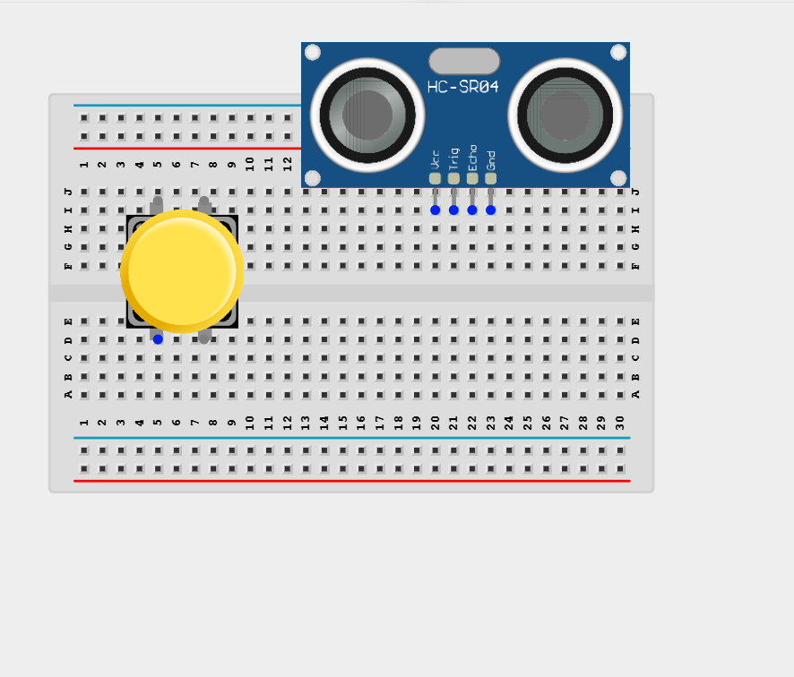
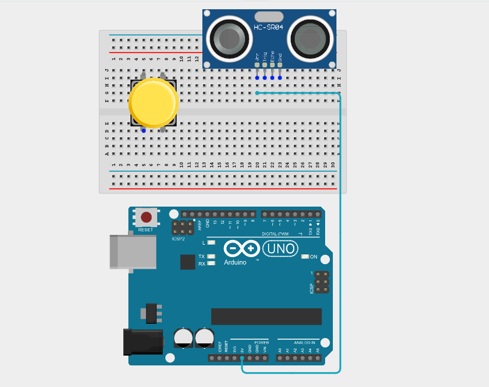
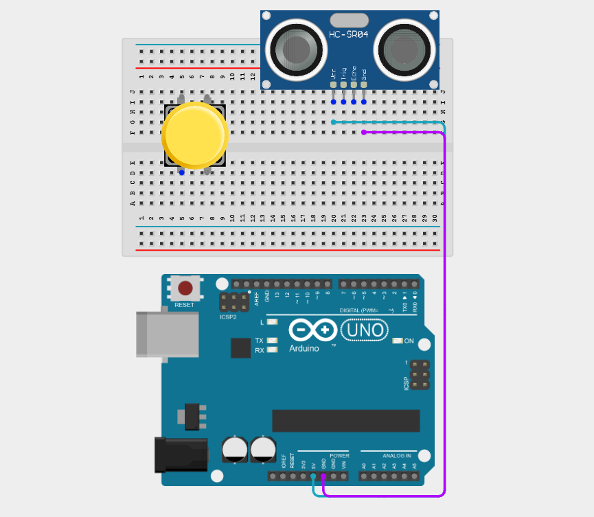
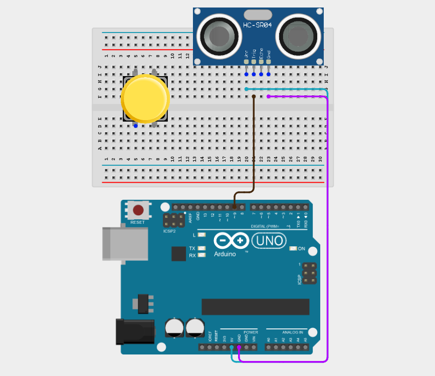
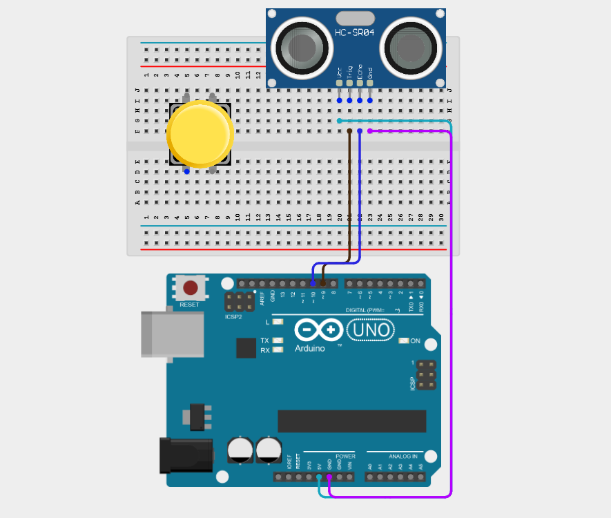
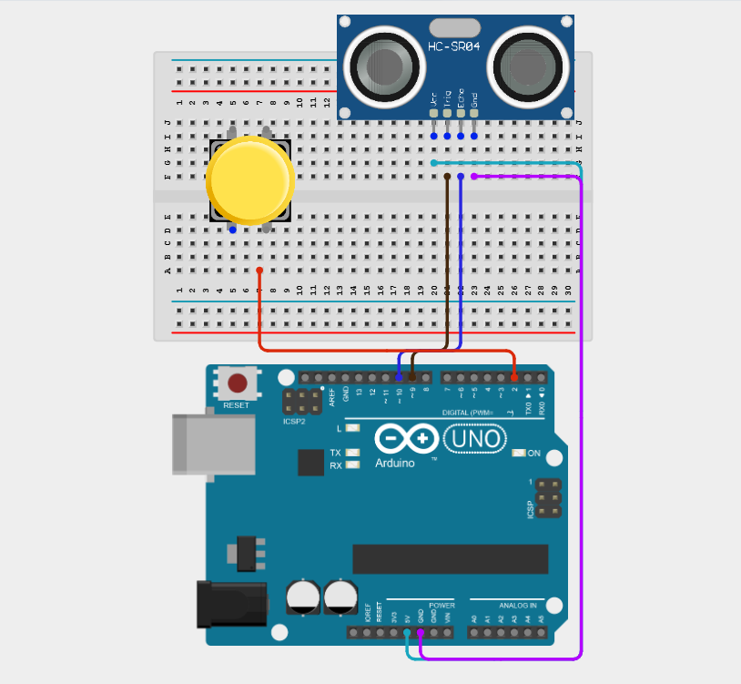
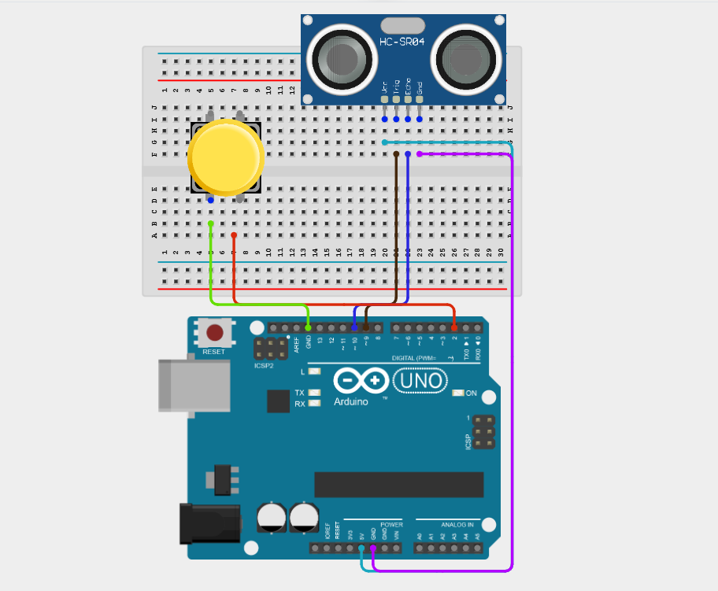
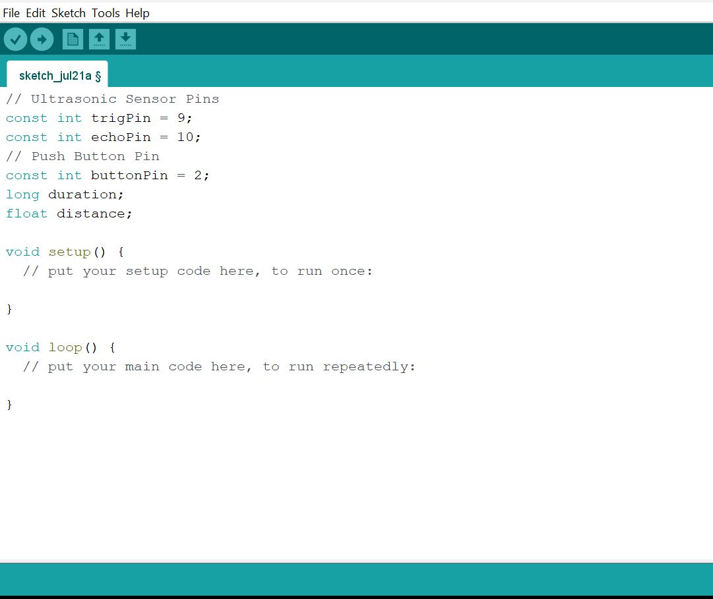
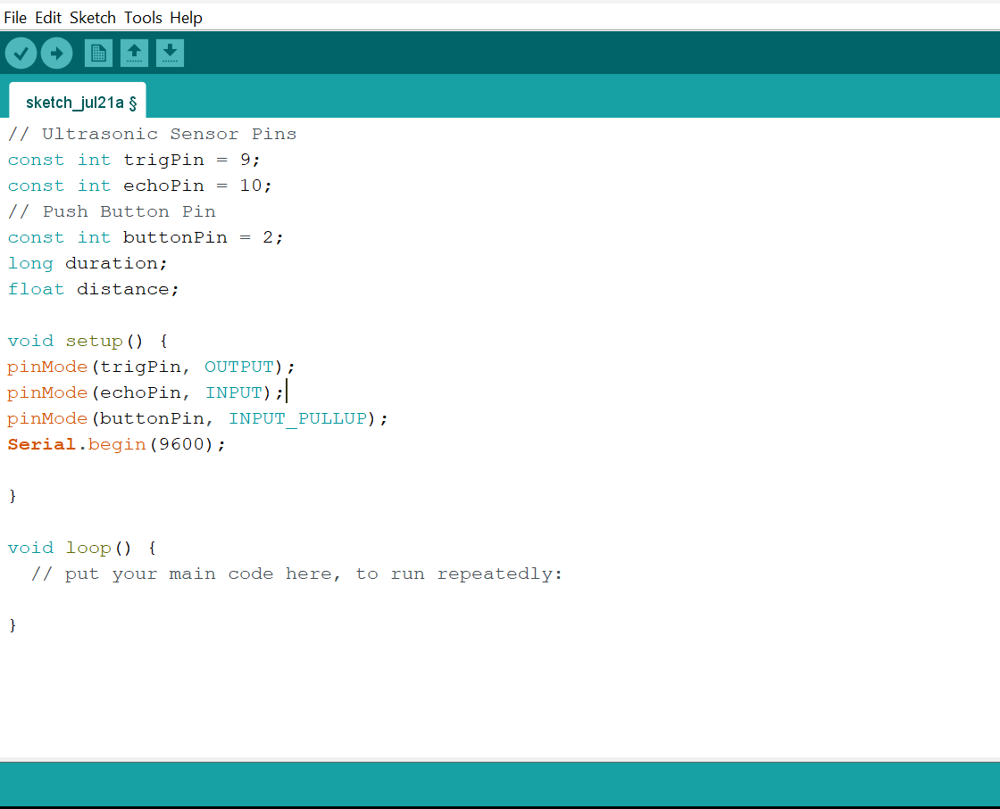
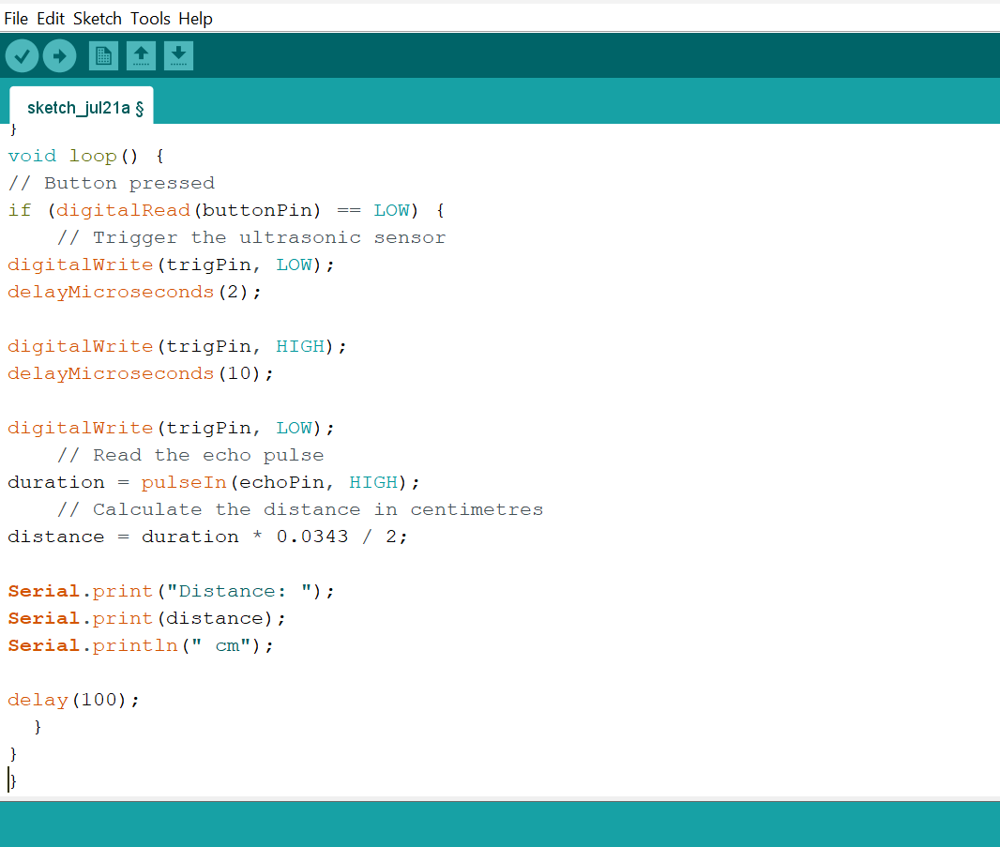

# Project 2.7.5: Manual Trigger Radar

| **Description** | This project activates ultrasonic distance measurement only when a push button is held down, conserving power and allowing on-demand readings. |
|------------------|----------------------------------------------------------------|
| **Use case**     | This project can be used in portable measuring devices, battery-powered systems, field inspection tools, and robotics, where distance measurements are taken only when requested to conserve power and reduce unnecessary sensor operation. |

## Components (Things You will need)

| | | | | 
| |
| --- | --- | --- | --- | --- | --- |

## Building the circuit

Things Needed:

- Arduino Uno = 1
- Arduino USB cable = 1
- Push button = 1
- Ultrasonic sensor = 1
- Breadboard = 1
- Jumper wires

## Mounting the component on the breadboard

**Step 1:** Place the Ultrasonic sensor and the Push button on the breadboard.

_**NB:** Make sure all components are securely placed on the breadboard with correct orientation._

## WIRING THE CIRCUIT

**Step 2:** Connect the VCC pin of the Ultrasonic Sensor to the Arduino 5V pin the Arduino Uno using male-to-male jumper wire.

**Step 3:** Connect the GND pin of the Ultrasonic Sensor to the Arduino GND pin the Arduino Uno using male-to-male jumper wire.

**Step 4:** Connect the TRIG pin of the Ultrasonic Sensor to the Arduino Digital Pin 9 using a male-to-male jumper wire.

**Step 5:** Connect the ECHO pin of the Ultrasonic Sensor to the Arduino Digital Pin 10 using a male-to-male jumper wire.

**Step 6:** Connect one terminal of the push button to Digital Pin 2 on the Arduino using a male-to-male jumper wire.

**Step 7:** Connect the opposite terminal of the push button to GND on the Arduino using a male-to-male jumper wire.

_Make sure to connect the Arduino USB cable to the Arduino board._

## PROGRAMMING

**Step 1:** Open your Arduino IDE. See how to set up here: [Getting Started](../../Getting Started/Arduino_IDE_Setup.md).

**Step 2:** Type the following code in your Arduino IDE: `const int trigPin = 9;`, `const int buttonPin = 2;`, `long duration;`, `float distance;`  as shown in the image below.

**Step 3:** Type the following code in your Arduino IDE inside the void setup() `pinMode(trigPin, OUTPUT);`, `pinMode(echoPin, INPUT);`, `pinMode(buttonPin, INPUT_PULLUP);`, `Serial.begin(9600);`  as shown in the image below.

**Step 4:** Type the following code in your Arduino IDE inside the void loop() `if (digitalRead(buttonPin) == LOW) {`, `digitalWrite(trigPin, LOW);`, `delayMicroseconds(2);`, `digitalWrite(trigPin, HIGH);`, `delayMicroseconds(10);`, `digitalWrite(trigPin, LOW);`, `duration = pulseIn(echoPin, HIGH);`, `distance = duration * 0.0343 / 2;`,`Serial.print("Distance: ");`, `Serial.print(distance);`, `Serial.println(" cm");`, `delay(100); }`  as shown in the image below.

**Step 5:** Save your code. _See the [Getting Started](../../Getting Started/Arduino_IDE_Setup.md) section_

**Step 6:** Select the Arduino board and port. _See the [Getting Started](../../Getting Started/Arduino_IDE_Setup.md) section_

**Step 7:** Upload your code.

_The measured distance is displayed continuously in the Serial Monitor while the button is held down._

## CONCLUSION

This project helps learners understand how to combine multiple components with Arduino to create more complex interactive systems and automation solutions.

