# Project 2.7.6: Solar Proximity Switch

| **Description** | This project activates ultrasonic proximity detection only when the LDR detects nighttime darkness, creating a solar-aware sensor system. |
|------------------|----------------------------------------------------------------|
| **Use case**     | This project can be used in solar-powered security systems, nighttime motion detection, smart outdoor lighting, and energy-efficient automation, where proximity sensing is required only after dark. |

## Components (Things You will need)

|  |  |  |  |  |  |
| --- | --- | --- | --- | --- | --- |

## Building the circuit

Things Needed:

- Arduino Uno = 1
- Arduino USB cable = 1
- LDR module = 1
- Ultrasonic sensor = 1
- Breadboard = 1
- Jumper wires 

## Mounting the component on the breadboard

**Step 1:** Place the Ultrasonic Sensor and the LDR Module on the breadboard.

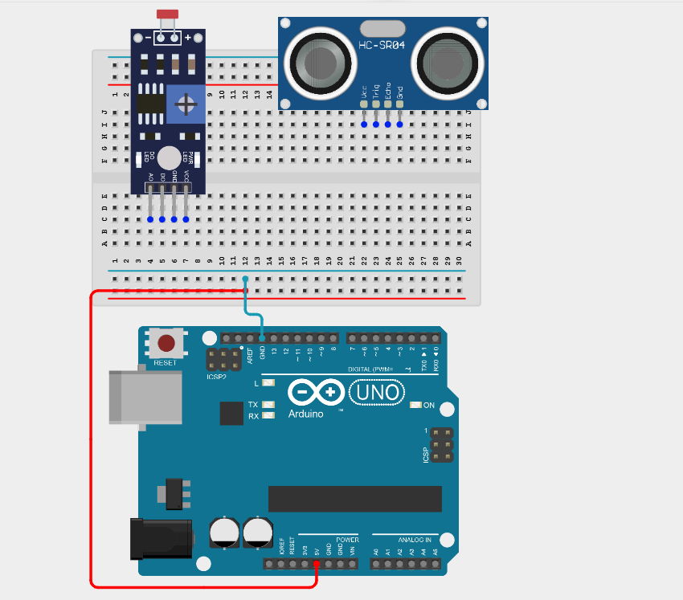

_Connect the Arduino 5V pin to the breadboard's positive (+) power rail and connect the Arduino GND pin to the breadboard's negative (–) power rail to distribute power._

_**NB:** Make sure all components are securely placed on the breadboard with correct orientation._

## WIRING THE CIRCUIT

**Step 2:** Connect the VCC pin of the Ultrasonic Sensor to the positive (+) rail on the breadboard using male-to-male jumper wire.

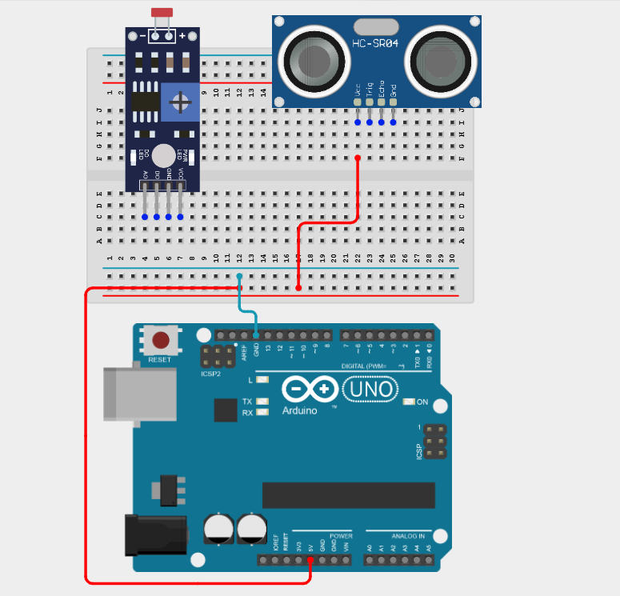

**Step 3:** Connect the GND pin of the Ultrasonic Sensor to the negative (–) rail of the breadboard using male-to-male jumper wire.

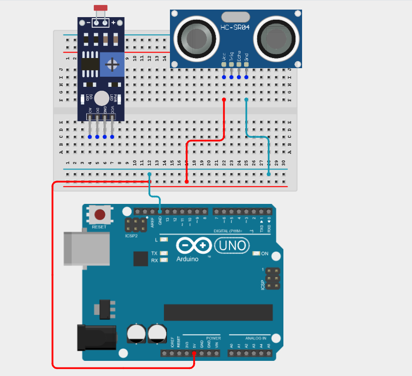

**Step 4:** Connect the TRIG pin of the Ultrasonic Sensor to the Arduino Digital Pin 9 on the Arduino Uno using male-to-male jumper wire.

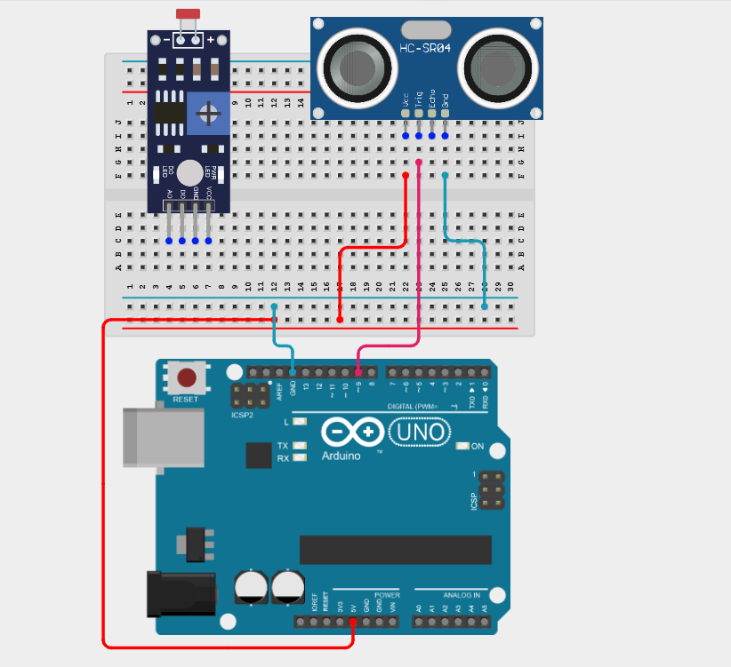

**Step 5:** Connect the ECHO pin of the Ultrasonic Sensor to the Arduino Digital Pin 10 on the Arduino Uno using male-to-male jumper wire.

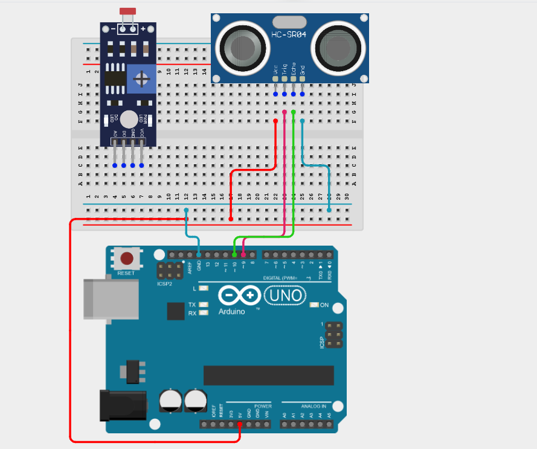

**Step 6:** Connect the D0 pin of the LDR to the Arduino Digital Pin 3 on the Arduino Uno using male-to-male jumper wire.

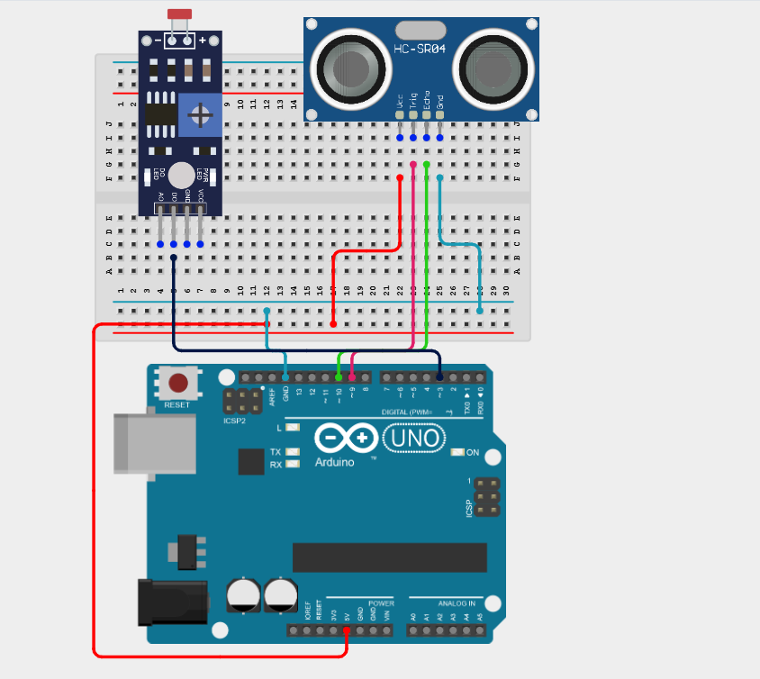

**Step 7:** Connect the VCC pin of the LDR to the positive (+) rail on the breadboard using male-to-male jumper wire.

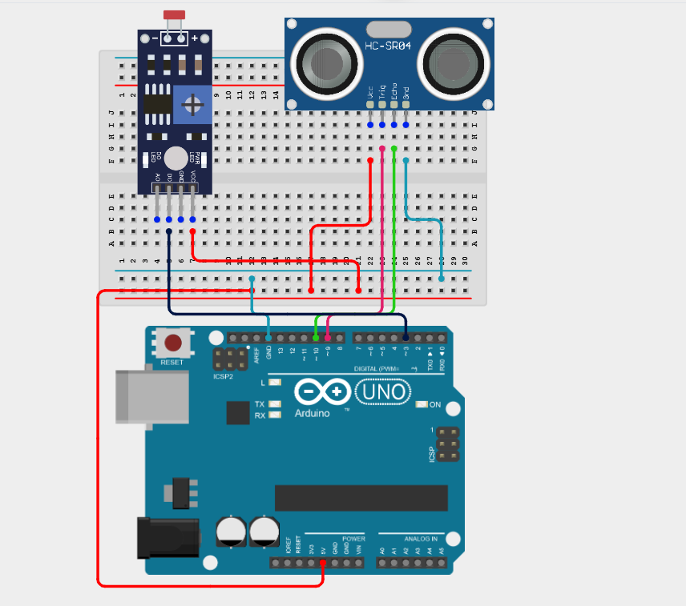

**Step 8:** Connect the GND pin of the LDR to the negative (–) rail of the breadboard using male-to-male jumper wire.

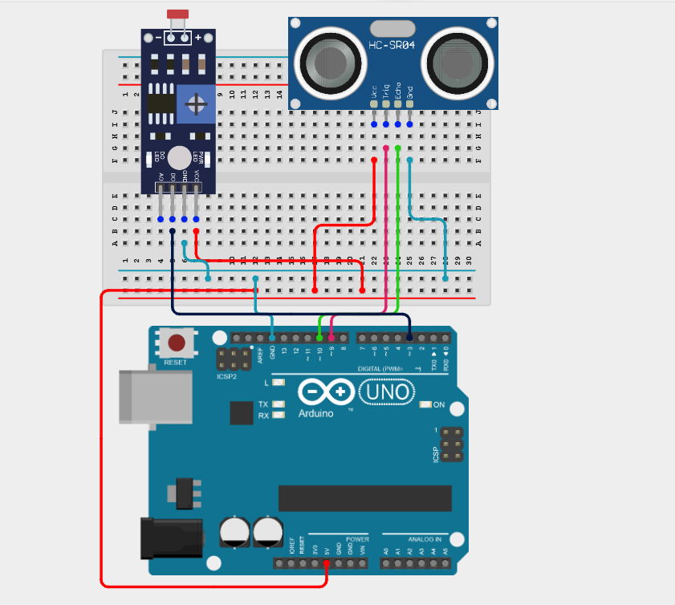

Connect the GND pin to the Arduino GND pin

_Make sure to connect the Arduino USB cable to the Arduino board._

## PROGRAMMING

**Step 1:** Open your Arduino IDE. See how to set up here: [Getting Started](../../Getting Started/Arduino_IDE_Setup.md).

**Step 2:** Type the following code in your Arduino IDE: `const int trigPin = 9;`, `const int echoPin = 10;`, `const int ldrPin = 3;`, `long duration`, `long distance`  as shown in the image below.

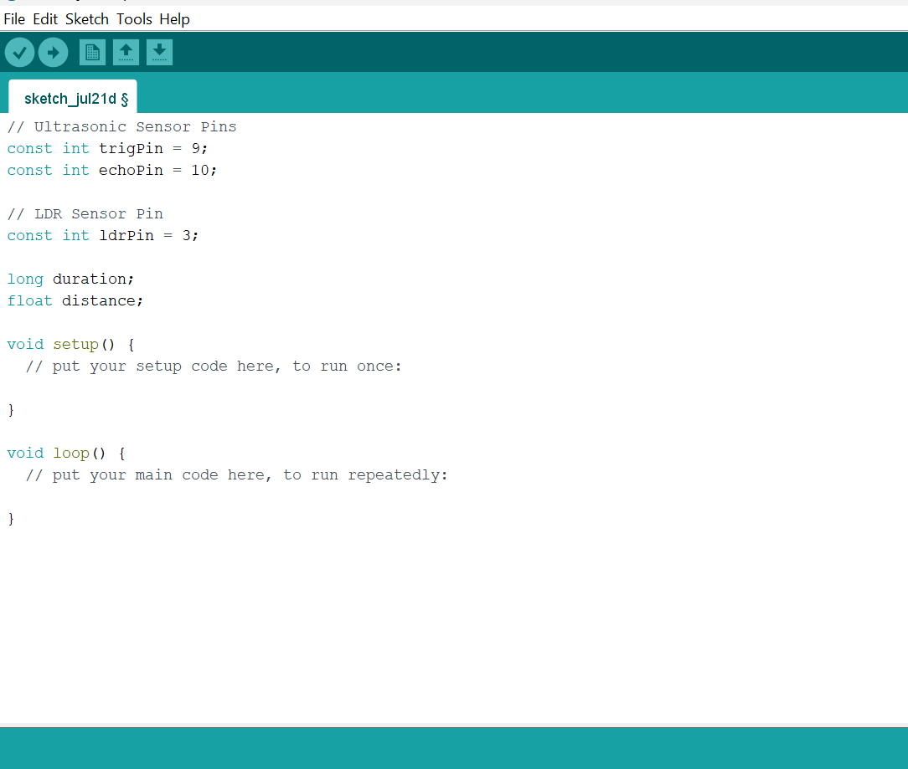

**Step 3:** Type the following code in your Arduino IDE inside the void setup() function: `pinMode(trigPin, OUTPUT);`, `pinMode(echoPin, INPUT);`, `pinMode(ldrPin, INPUT);`, `Serial.begin(9600);`  as shown in the image below.

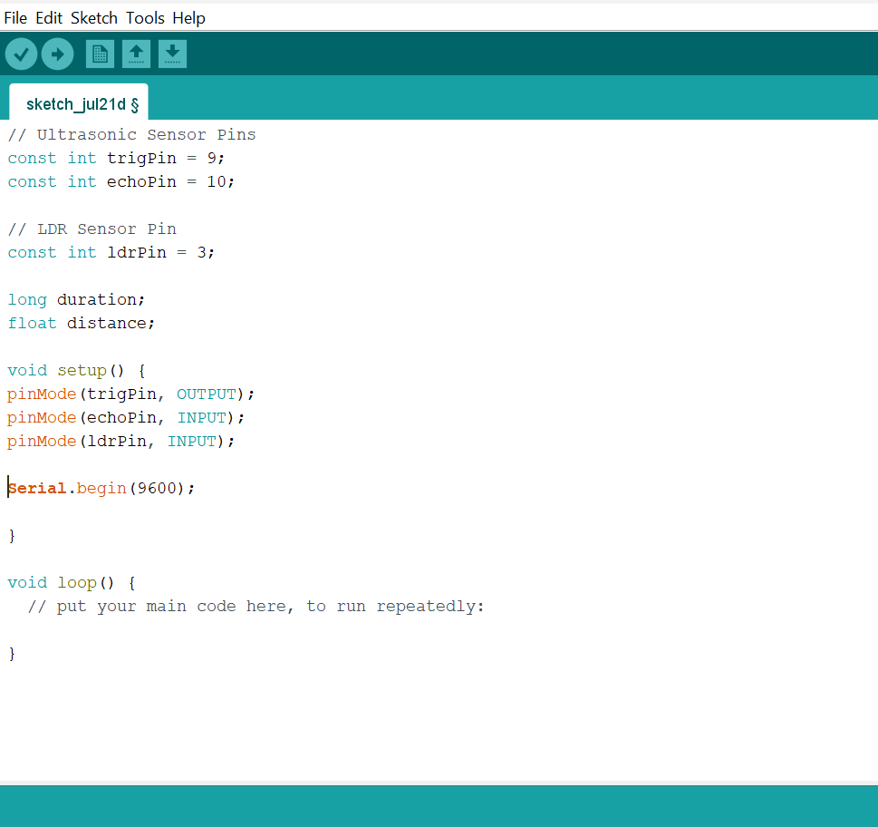

**Step 4:** Type the following code in your Arduino IDE inside the void loop() function: `if (digitalRead(ldrPin) == LOW) {`, `Serial.println("Night Detected");`, `digitalWrite(trigPin, LOW);`, `delayMicroseconds(2);`, `digitalWrite(trigPin, HIGH);`, `delayMicroseconds(10);`, `digitalWrite(trigPin, LOW);`, `duration = pulseIn(echoPin, HIGH);`, `distance = duration * 0.0343 / 2;`, `Serial.print("Distance: ");`, `Serial.print(distance);`, `Serial.println(" cm");}`, `else{`, `Serial.println("Daytime Detected");`, `Serial.println("Ultrasonic Sensor Inactive"); }`, `delay(500);`   as shown in the image below.

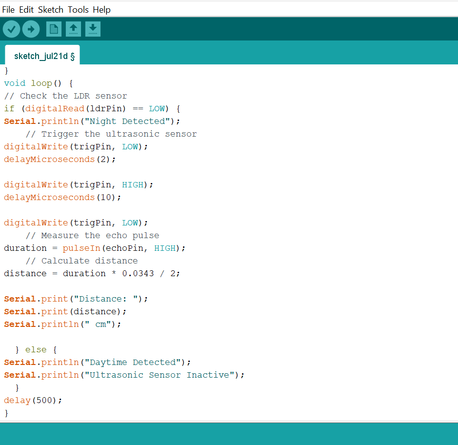
  
**Step 5:** Save your code. _See the [Getting Started](../../Getting Started/Arduino_IDE_Setup.md) section_

**Step 6:** Select the Arduino board and port. _See the [Getting Started](../../Getting Started/Arduino_IDE_Setup.md) section_

**Step 7:** Upload your code.

## OBSERVATION

The Arduino sends a 10 μs trigger pulse to the ultrasonic sensor. The sensor measures the distance to the nearest object. The measured distance is displayed in the Serial Monitor.

## CONCLUSION

This project helps learners understand how to combine multiple components with Arduino to create more complex interactive systems and automation solutions.

