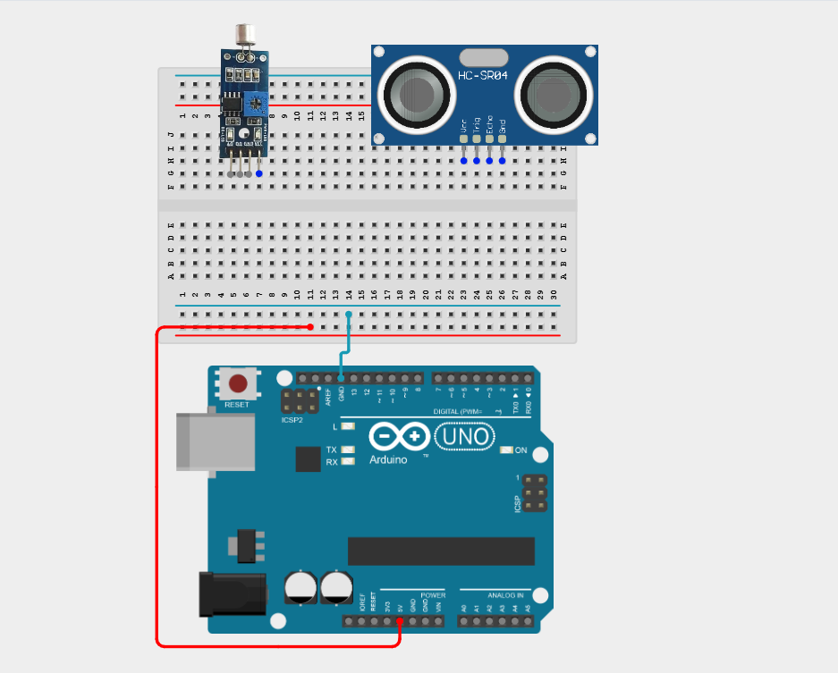
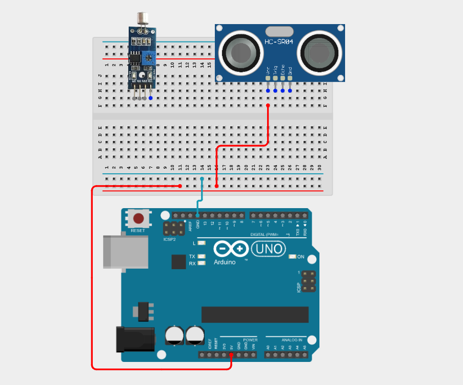
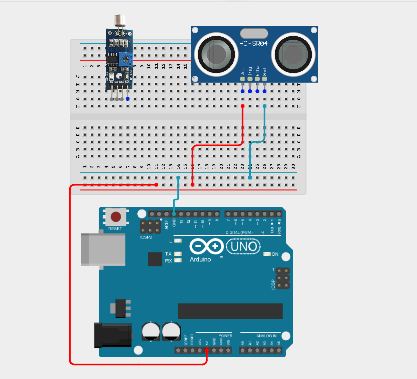
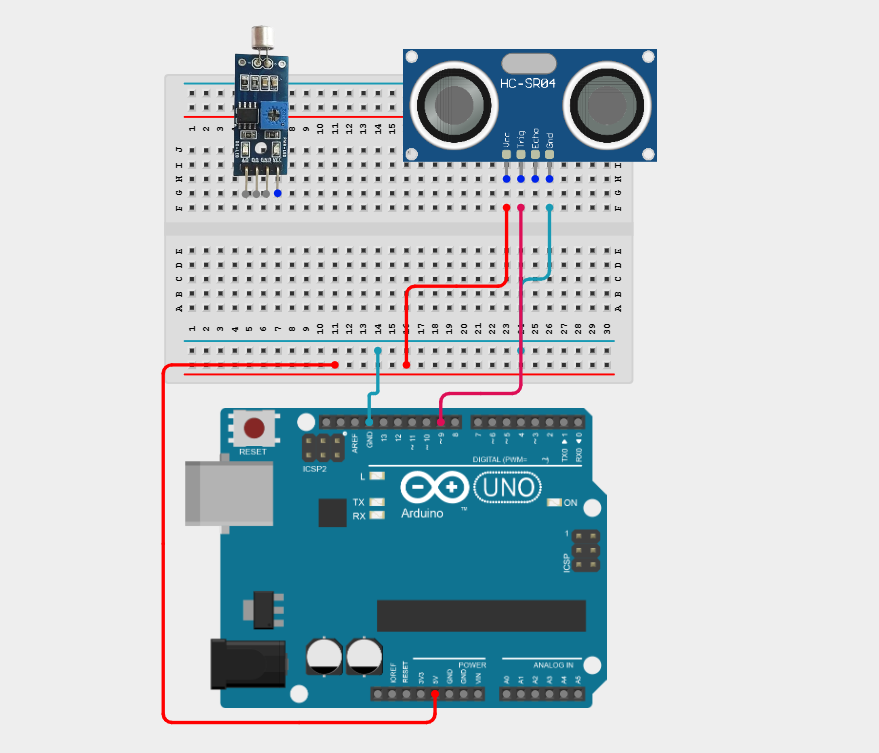
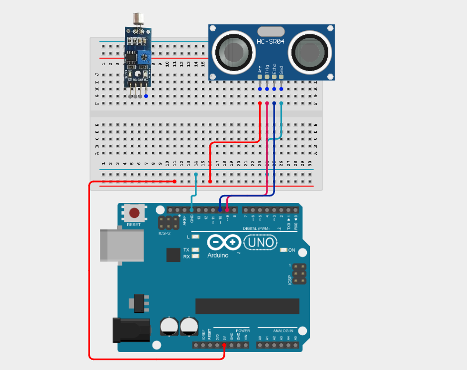
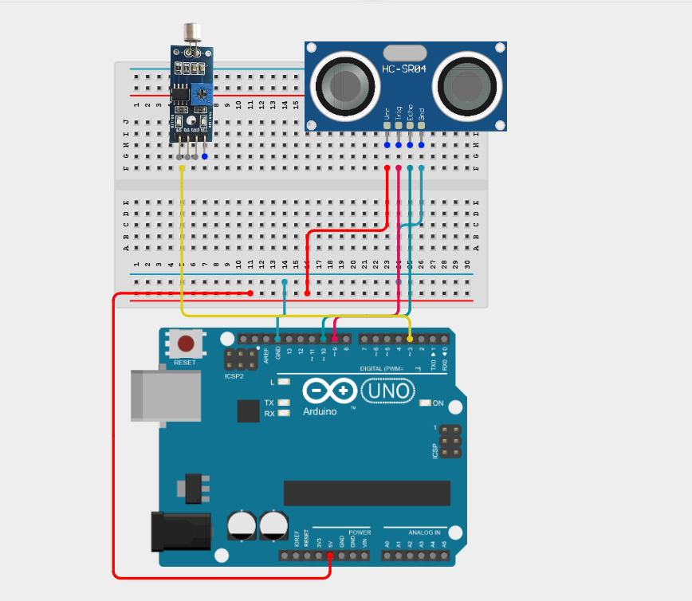
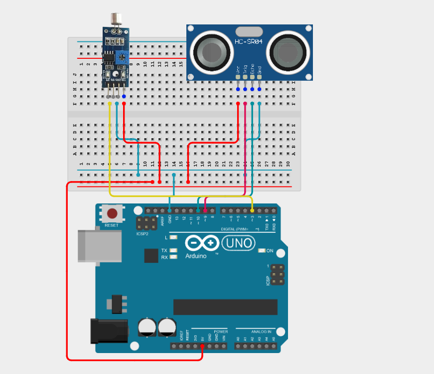
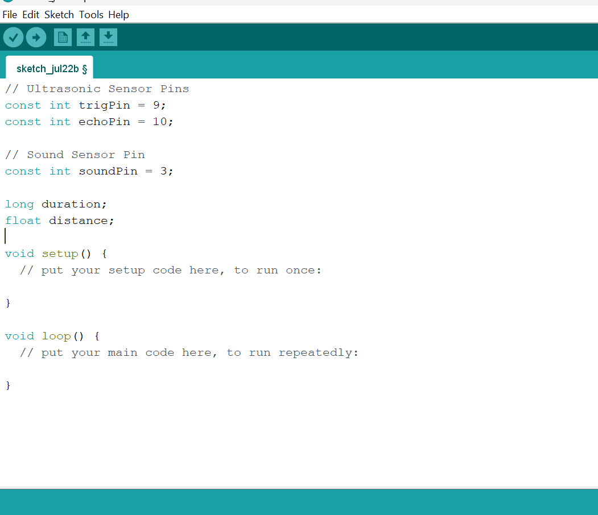
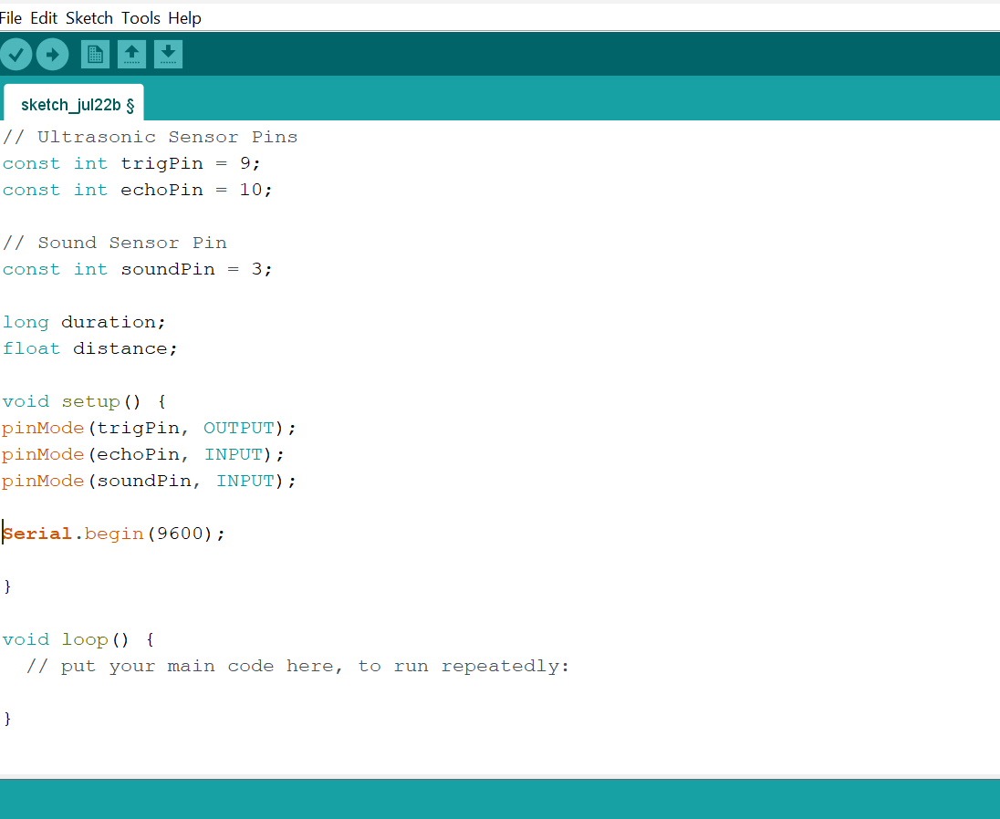
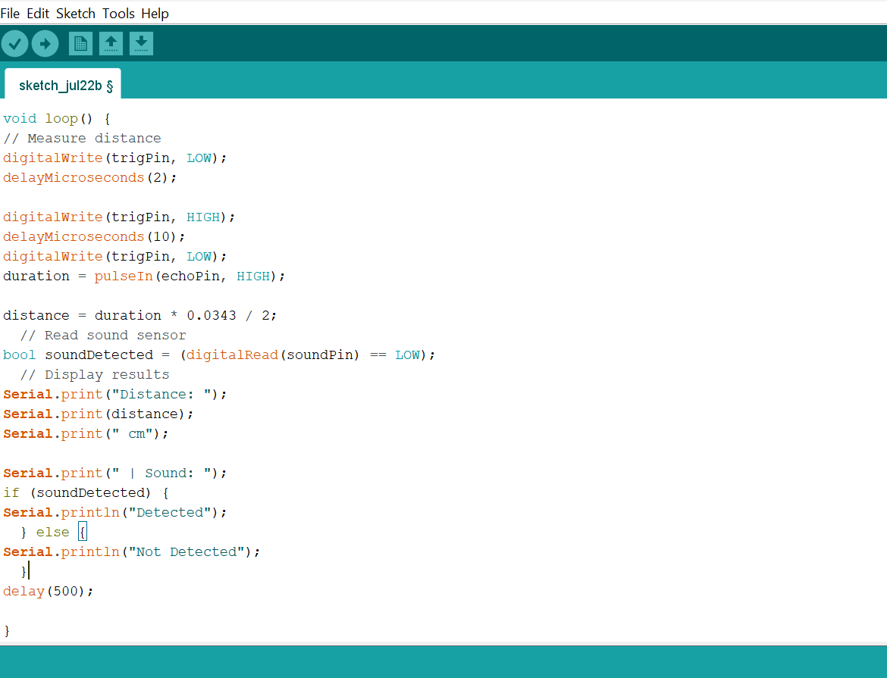

# Project 2.7.7: Multi-Factor Tracker

| **Description** | This project measures both proximity (ultrasonic) and sound levels simultaneously to log environmental events with multiple sensor inputs. |
|------------------|----------------------------------------------------------------|
| **Use case**     | This project can be used in environmental monitoring, security systems, smart buildings, and industrial automation to simultaneously monitor object proximity and sound levels for detecting and logging environmental events. |

## Components (Things You will need)

|  |  |  |  |  |  |
| --- | --- | --- | --- | --- | --- |

## Building the circuit

Things Needed:

- Arduino Uno = 1
- Arduino USB cable = 1
- Ultrasonic sensor = 1
- Sound sensor module = 1
- Breadboard = 1
- Jumper wires 

## Mounting the component on the breadboard

**Step 1:** Place the Ultrasonic sensor and the Sound sensor module on the breadboard following the circuit diagram.

_Both the ultrasonic sensor and the sound sensor module require a 5V power supply. Since the Arduino Uno has only one 5V pin, use the breadboard power rails to distribute power._

_**NB:** Make sure all components are securely placed on the breadboard with correct orientation._

## WIRING THE CIRCUIT

**Step 2:** Connect the VCC pin of the ultrasonic sensor to the positive (+) power rail on the breadboard using male-to-male jumper wire.

**Step 3:** Connect the GND pin of the ultrasonic sensor to the negative (–) power rail on the breadboard using male-to-male jumper wire.

**Step 4:** Connect the TRIG pin of the ultrasonic sensor to Digital Pin 9 on the Arduino Uno using male-to-male jumper wire.

**Step 5:** Connect the ECHO pin of the ultrasonic sensor to Digital Pin 10 on the Arduino Uno using male-to-male jumper wire.

**Step 6:** Connect the D0 pin of the sound sensor to Digital Pin 3 on the Arduino Uno using male-to-male jumper wire.

**Step 7:** Connect the VCC pin of the sound sensor to the positive (+) power rail and the GND pin of the sound sensor to the negative (–) power rail on the breadboard using male-to-male jumper wires.

_Make sure to connect the Arduino USB cable to the Arduino board._

## PROGRAMMING

**Step 1:** Open your Arduino IDE. See how to set up here: [Getting Started](../../Getting Started/Arduino_IDE_Setup.md).

**Step 2:** Type the following code in your Arduino IDE: `const int trigPin = 9;`, `const int echoPin = 10;`, `const int soundPin = 3;`, `long duration;`, `float distance;` as shown in the image below.

**Step 3:** Type the following code in your Arduino IDE inside the void setup() function: `pinMode(trigPin, OUTPUT);`, `pinMode(echoPin, INPUT);`, `pinMode(soundPin, INPUT);`, `Serial.begin(9600);` as shown in the image below.

**Step 4:** Type the following code in your Arduino IDE inside the void loop() function: `digitalWrite(trigPin, LOW);`, `delayMicroseconds(2);`, `digitalWrite(trigPin, HIGH);`, `delayMicroseconds(10);`, `digitalWrite(trigPin, LOW);`, `duration = pulseIn(echoPin, HIGH);`,`distance = duration * 0.0343 / 2;`, `bool soundDetected = (digitalRead(soundPin) == LOW);`, `Serial.print("Distance: ");`, `Serial.print(distance);`, `Serial.print(" cm");`, `Serial.print(" | Sound: ");`, `if (soundDetected) { `, `Serial.println("Detected"); }`, `else { `, `Serial.println("Not Detected"); } `, `delay(500);`  as shown in the image below.

**Step 5:** Save your code. _See the [Getting Started](../../Getting Started/Arduino_IDE_Setup.md) section_

**Step 6:** Select the Arduino board and port. _See the [Getting Started](../../Getting Started/Arduino_IDE_Setup.md) section_

**Step 7:** Upload your code.

## OBSERVATION

The Arduino continuously measures the distance to nearby objects while simultaneously detecting and logging loud sound events in the Serial Monitor.

## CONCLUSION

This project helps learners understand how to combine multiple components with Arduino to create more complex interactive systems and automation solutions.

