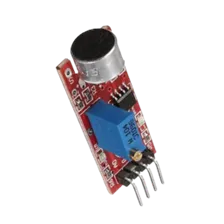
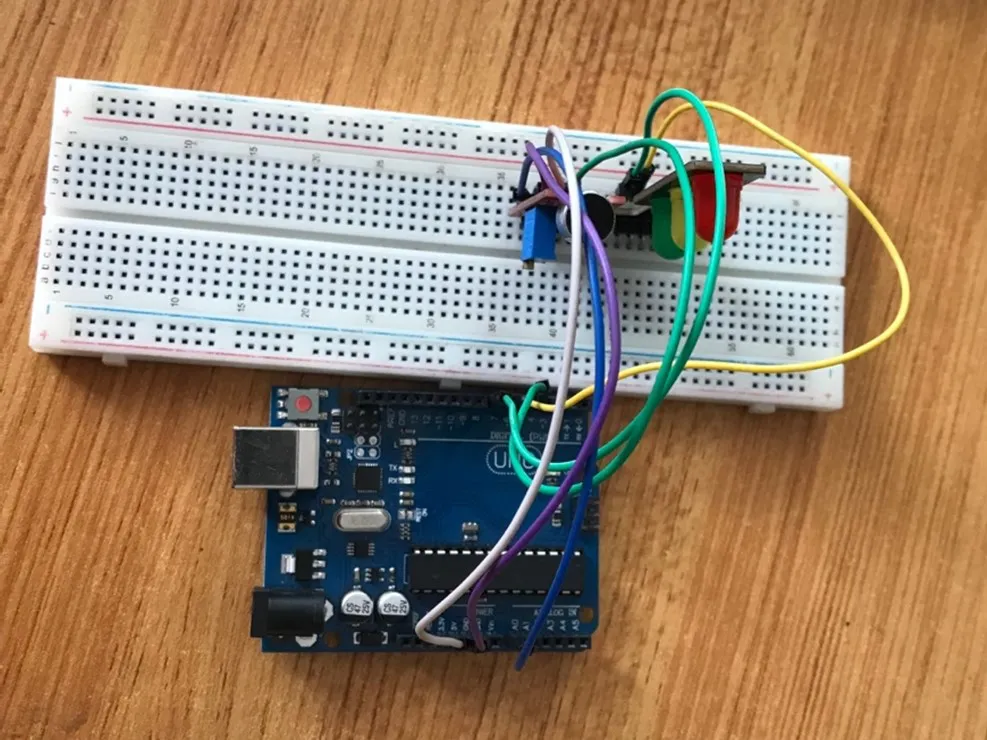
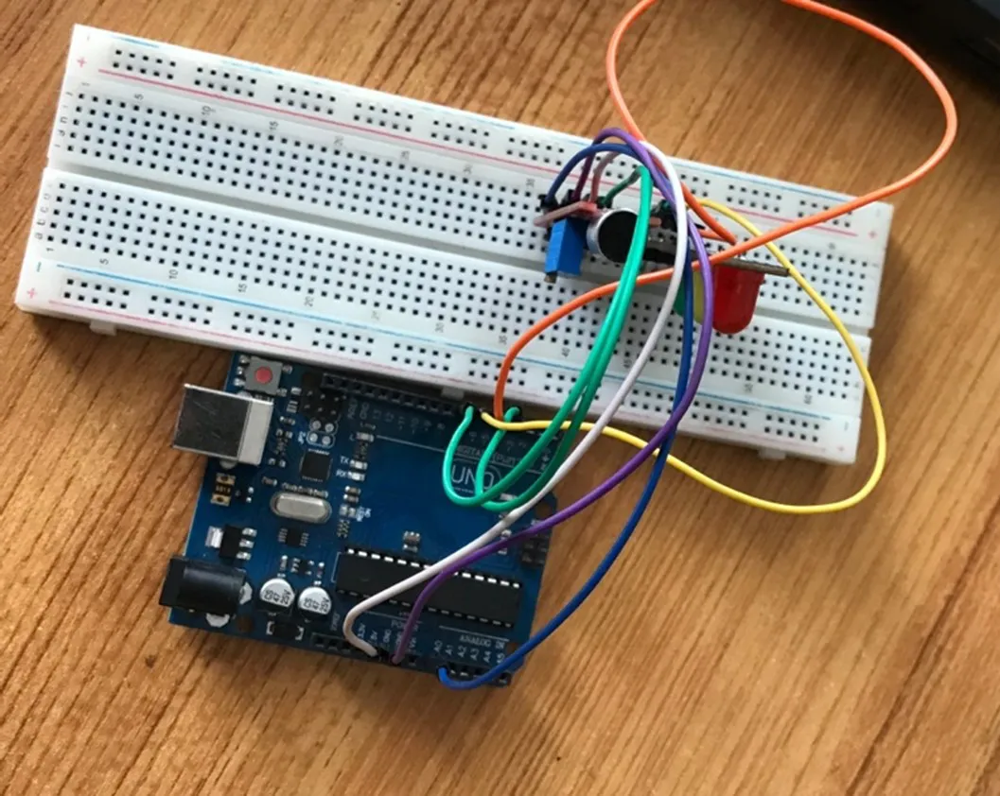
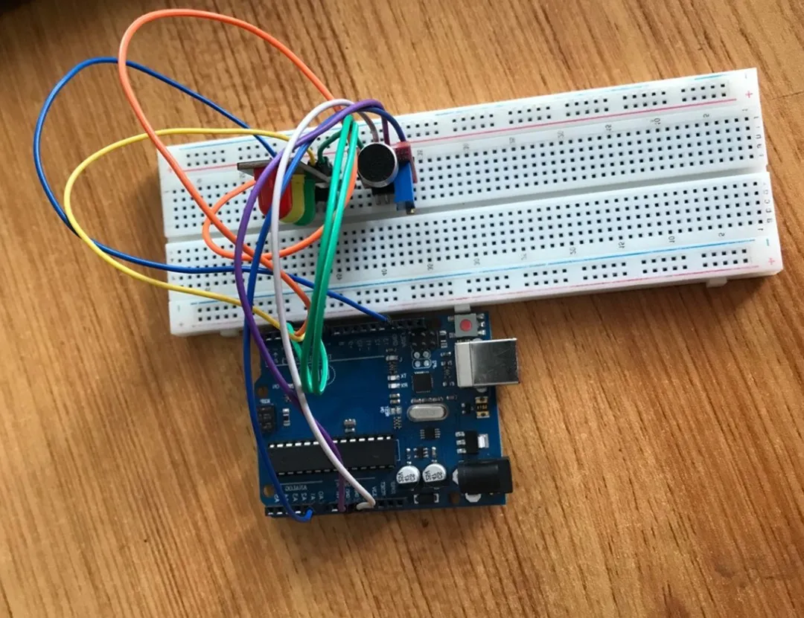

# Project 2.8.1:  Controlling a Traffic Light Using a Sound Sensor

| **Description** |Learn how to use a sound sensor with an Arduino Uno to detect sound and control a traffic light module. When the sound level exceeds a predefined threshold, the traffic light LEDs light up in sequence.  |
|------------------|----------------------------------------------------------------|
| **Use case**     | Sound-activated decorative lighting, music visualizers, sound-responsive displays, and interactive electronics projects. |

## Components (Things You will need)

|  |  |  ||||
|-------------------------|-------------------------|-------------------------|-------------------------|------------------------|--------------------------|

## Building the circuit

Things Needed:

- Arduino Uno = 1  
- Arduino USB cable = 1
- Sound Sensor  = 1
- Traffic module= 1
- Jumper Wires
- Breadboard = 1


## Mounting the component on the breadboard

**Step 1:** Take the Sound Sensor and the breadboard, insert the Sound Sensor into the horizontal connectors on the breadboard.


**Step 2:** Take the traffic light module and insert it into the horizontal connectors on the breadboard as shown in the picture below:


## WIRING THE COMPONENTS

**Step 1:** Take the blue male-to-male jumper wire, connect one end of the wire to the AO port in front of the sound sensor and the other end to the A0 port on the Arduino Uno, as shown in the picture below:


**Step 2:** Take the purple male-to-male jumper wire, connect one end of the wire to the “G” port in front of the sound sensor and the other end to the GND on the Arduino Uno, as shown in the picture below.


**Step 3:** Take the white male-to-male jumper wire. Connect one end to the “+” port in front of the sound sensor and the other end to the 5V port on the Arduino Uno, as shown in the picture below.


**Step 4:** Take the green male-to-male jumper wire, connect one end of the wire to the “DO” port in front of the sound sensor and the other end to digital pin 4 on the Arduino Uno, as shown in the picture below.


**Step 5:**Connect the Green (G) pin of the traffic light module to digital pin 7 on the Arduino Uno.


**Step 6:** Take the yellow male-to-male jumper wire, connect one end of the wire to the “Y” port in front of the sound sensor and the other end to digital pin 6 on the Arduino Uno, as shown in the picture below.



**Step 7:** Take the orange male-to-male jumper wire. Connect one end to the “R” port in front of the traffic light and the other end to digital pin 5 on the Arduino Uno, as shown in the picture below.



**Step 8:** Take the blue male-to-male jumper wire, connect one end of the wire to the “GND” port in front of the traffic light and the other end to the GND port on the Arduino Uno, as shown in the picture below.




## PROGRAMMING

**Step 1:** Open your Arduino IDE. See how to set up here: [Getting Started](../../Getting Started/Arduino_IDE_Setup.md).

**Step 2:** Type ``` const int SoundSensorAPin = A0; const int SoundSensorDOPIN = 4; ``` as shown in the picture below.


_**NB:** Make sure you avoid errors when typing. Do not omit any character or symbol especially the bracket {} and semicolons; and place them as you see in the image. The code that comes after the two  backslashes “//” are called comments. They are not part of the code that will be run, they only explain the lines of code. You can avoid typing them._

**Step 3:** Type ``` const int redPin = 7; ``` as shown below in the image.


**Step 4:** Type ``` const int yellowPin = 6; ``` as shown below in the image.


**Step 5:** Type ``` const int greenPin = 5; ``` as shown below in the image.


**Step 6:** In the { } after the void setup (),
Type
``` cpp
 pinMode (redPin, OUTPUT);
pinMode (yellowPin, OUTPUT);
pinMode (greenPin, OUTPUT);
pinMode (soundSensorDOPin, INPUT); 
 ``` 
as shown below in the image.


**Step 7:** In the { } after the void setup (), Type ``` Serial.begin(9600); ``` as shown below in the image.


**Step 8:** In the {} after the void loop (), Type as shown below in the image.

``` cpp
        int soundValue = analogRead (SoundSensorAPin); 
        int digitalValue= digitalRead (SoundSensorDOPin); 
``` 


- The above code reads data from the Soundsensor Pin.

**Step 9:** Type as shown below in the image.
``` cpp 
           Serial.print(“Sound Value:”);
	        Serial.printIn(soundValue);
```


**Step 10:** Type ``` if (soundValue > 100) {  } ; ``` as shown below in the image.


**Step 11:** Type 
``` cpp as shown below in the image.
           digitalWrite (redPin, HIGH); 
           digitalWrite (yellowPin, LOW);
           digitalWrite (greenPin, LOW);
	       delay (500); 
```


**Step 12:** Type as shown below in the image.
``` cpp
            digitalWrite (redPin, LOW); 
            digitalWrite (yellowPin, HIGH);
            digitalWrite (greenPin, LOW);
	         delay (500); 
``` 


**Step 13:** Type as shown below in the image.
``` cpp
           digitalWrite (yellowPin, LOW); 
           digitalWrite (greenPin, HIGH);
           digitalWrite (redPin, LOW);
	       delay (500); 
``` 


**Step 14:** Type as shown below in the image.
``` cpp
          else {
             digitalWrite (BLUE_PIN, HIGH);
             digitalWrite (RED_PIN, LOW);
             digitalWrite (GREEN_PIN, LOW);  }
```


## OBSERVATION

Open the Serial Monitor to view the sound sensor readings.

When the sound level exceeds the predefined threshold, the traffic light LEDs turn on one after another (Red → Yellow → Green). When the sound level is below the threshold, all LEDs remain off.

## CONCLUSION
You have successfully built a sound-activated traffic light system using an Arduino Uno and a sound sensor.

In this project, you learned how to:

- Read analog values from a sound sensor.
- Detect sound levels using a predefined threshold.
- Control multiple LEDs using digital output pins.
- Use conditional statements (`if...else`) to respond to sensor input.

This project demonstrates how sensors can be used to create interactive lighting systems for applications such as music visualizers, sound-activated displays, and smart automation projects.