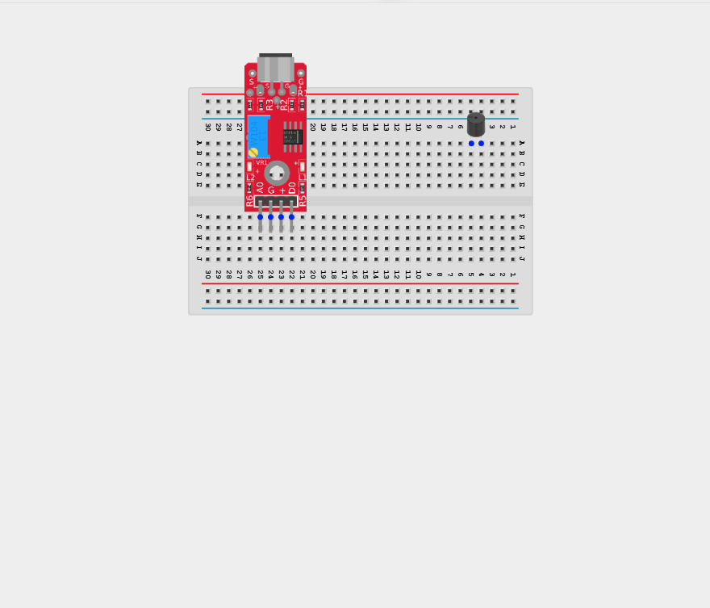
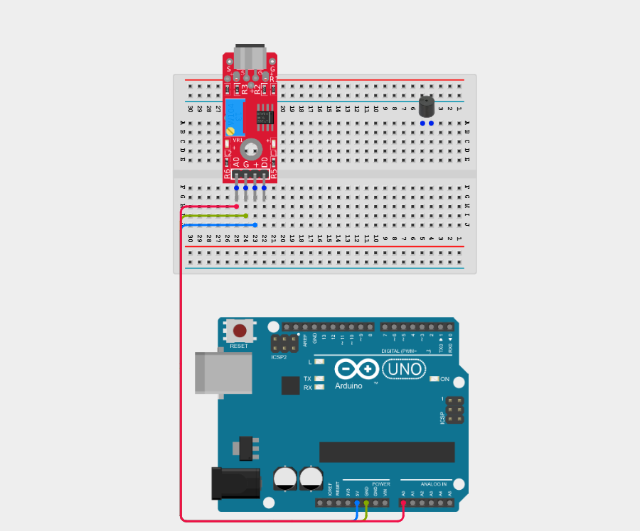
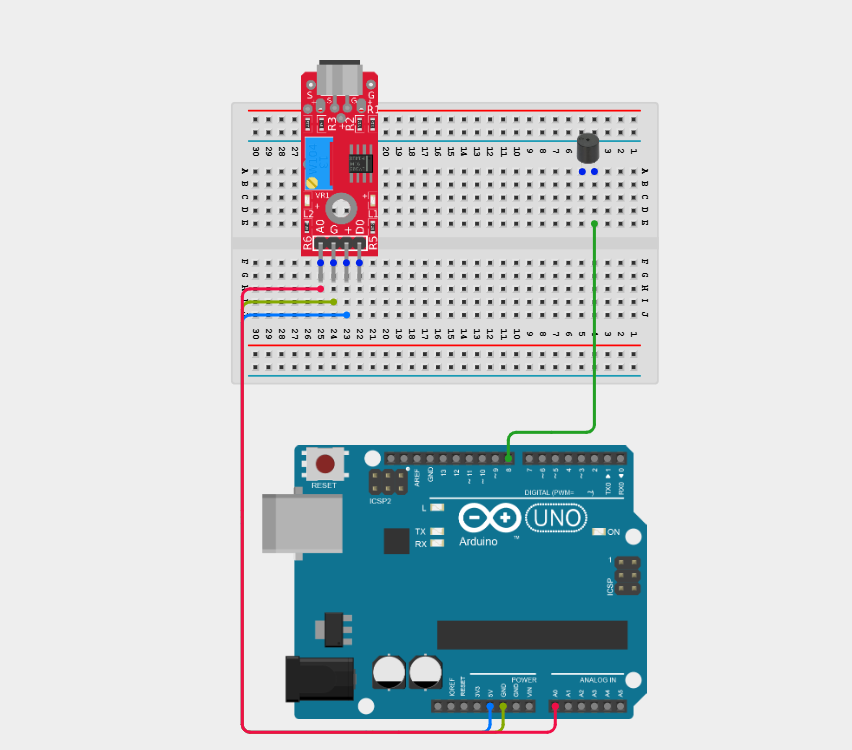
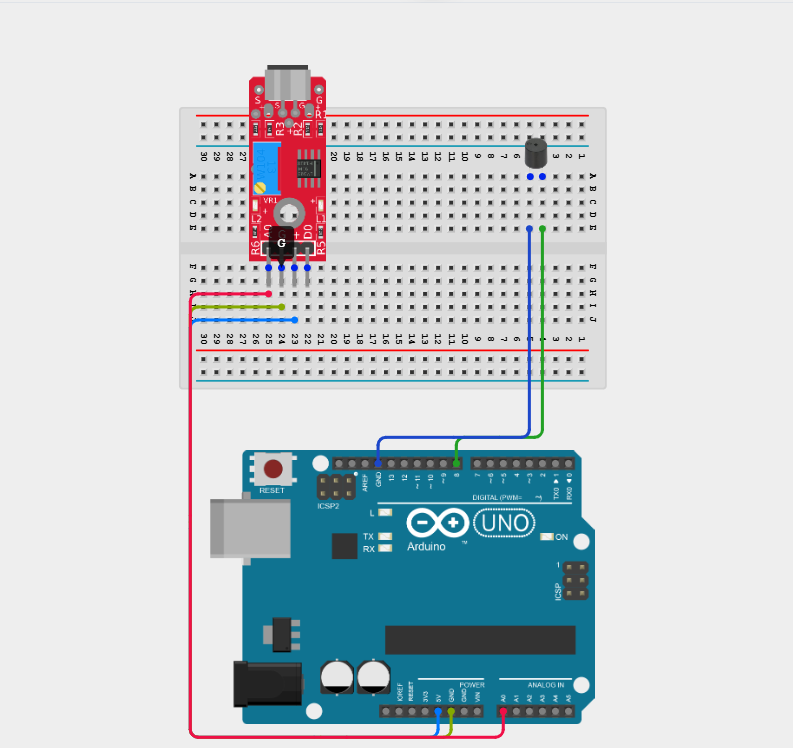
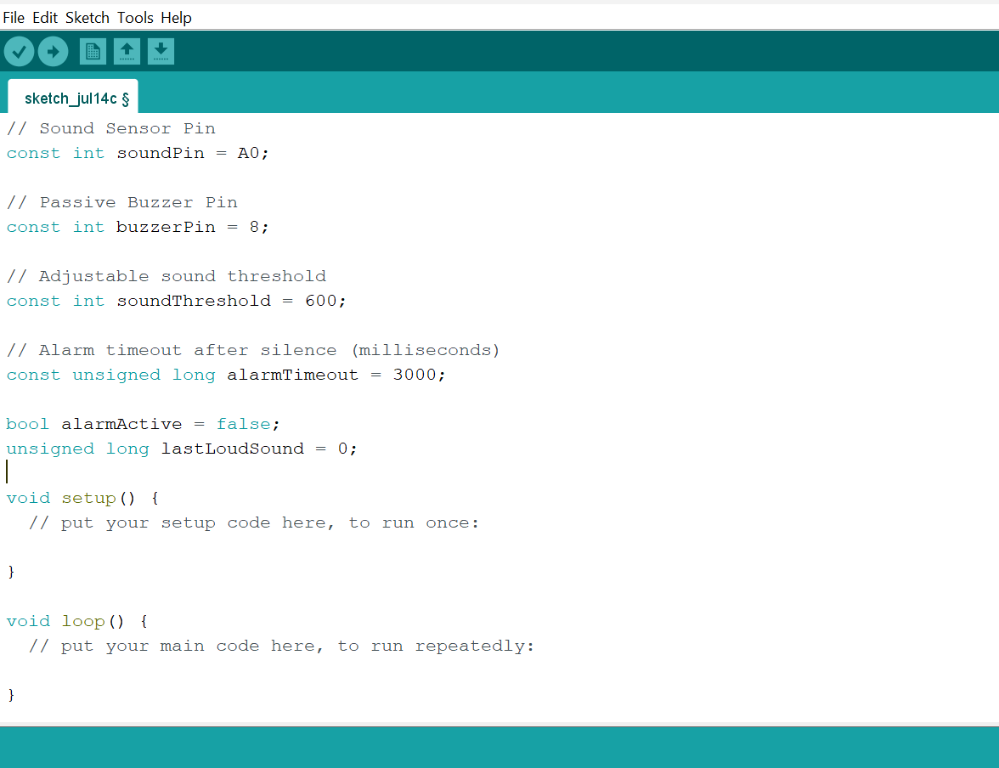
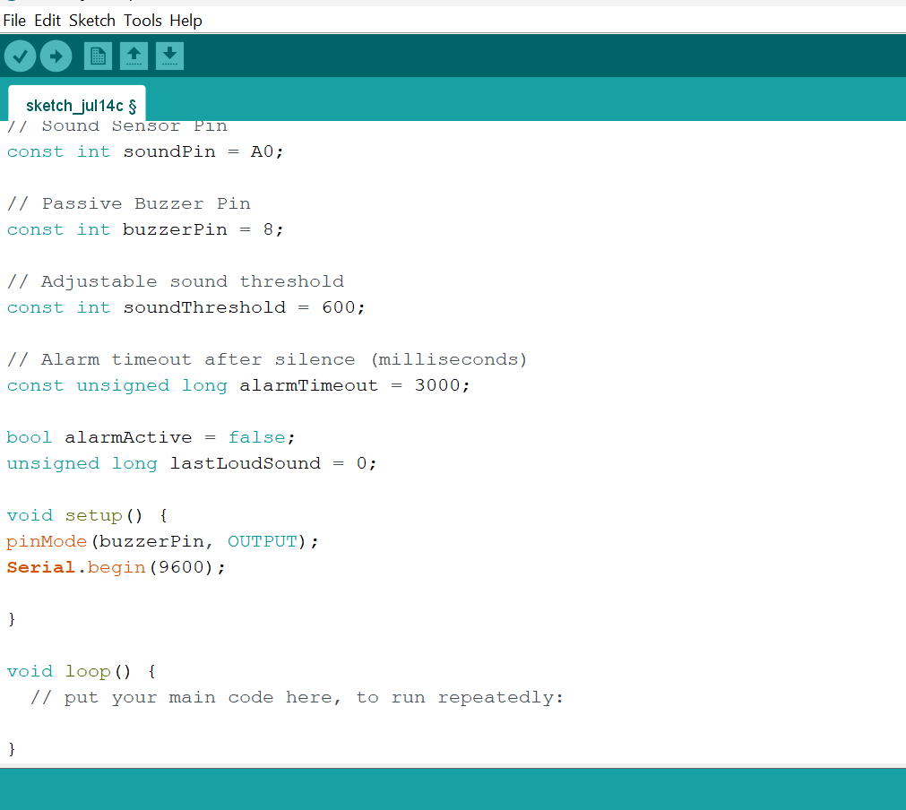
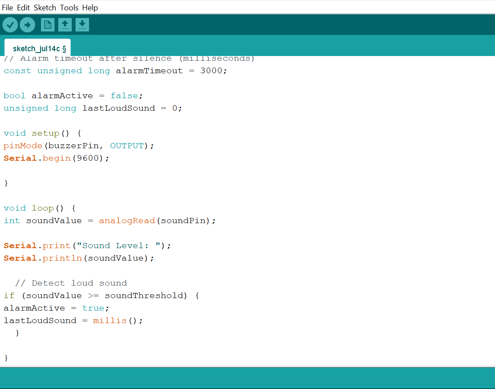
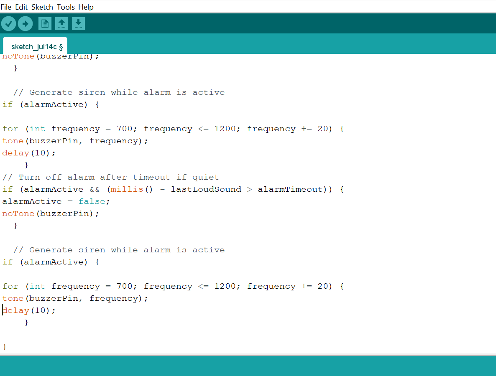
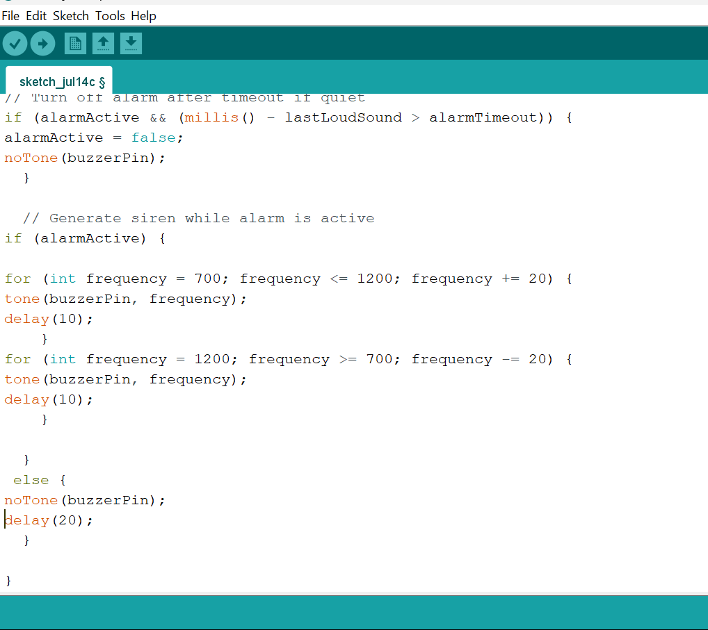

# Project 2.8.2: Sound Controlled Security Siren

| **Description** | This project uses a sound sensor to detect loud noises which triggers a buzzer to emit a siren pattern. The alarm resets after a timeout if silence returns. |
|------------------|----------------------------------------------------------------|
| **Use case**     | This project can be used in automation systems, interactive installations, and embedded control applications. |

## Components (Things You will need)

| | | | | | |
|-------------------------|-------------------------|-------------------------|-------------------------|-------------------------|-------------------------|

## Building the circuit

Things Needed:

- Arduino Uno = 1
- Arduino USB cable = 1
- Sound sensor module = 1
- Buzzer = 1
- Breadboard = 1
- Jumper wires

## Mounting the component on the breadboard

**Step 1:** Place the Sound Sensor and the Buzzer on the breadboard.

_**NB:** Make sure all components are securely placed on the breadboard with correct orientation._

## WIRING THE CIRCUIT

**Step 2:** Connect the VCC (+) pin of the Sound Sensor to the 5V pin on the Arduino using male-to-male jumper wires.

**Step 3:** Connect the GND pin of the Sound Sensor to the GND pin on the Arduino using male-to-male jumper wires.

**Step 4:** Connect the A0(Analog Ouput) pin of the Sound Sensor to the Analog pin A0 on the Arduino using male-to-male jumper wires.

_Leave the D0 (Digital Output) pin unconnected._

**Step 5:** Connect the positive pin (long) of the Buzzer to the Digital pin 8 on the Arduino using male-to-male jumper wires.

**Step 6:** Connect the negative pin (short) of the Buzzer to the GND pin on the Arduino using male-to-male jumper wires.

_Make sure to connect the Arduino USB cable to the Arduino board._

## PROGRAMMING

**Step 1:** Open your Arduino IDE. See how to set up here: [Getting Started](../../Getting Started/Arduino_IDE_Setup.md).

**Step 2:** Type the following code in your Arduino IDE: `const int soundPin = A0;`, `const int buzzerPin = 8;`, `const int soundThreshold = 600;`, `const unsigned long alarmTimeout = 3000;`, `bool alarmActive = false;`, `unsigned long lastLoudSound = 0;` as shown in the image below.

**Step 3:** Type the following code in your Arduino IDE inside the void setup() `pinMode(buzzerPin, OUTPUT);`, `Serial.begin(9600);` as shown in the image below.

**Step 4:** Type the following code in your Arduino IDE inside the void loop() `int soundValue = analogRead(soundPin);`, `Serial.print("Sound Level: ");`, `Serial.println(soundValue);`, `if (soundValue >= soundThreshold) {`, ` alarmActive = true;`, `lastLoudSound = millis(); }` as shown in the image below.

**Step 5:** Type the following code in your Arduino IDE inside the void loop() `if (alarmActive && (millis() - lastLoudSound > alarmTimeout)) {`, `alarmActive = false;`, `noTone(buzzerPin); }`, `if (alarmActive) {`, `for (int frequency = 700; frequency <= 1200; frequency += 20) {`, `tone(buzzerPin, frequency);`, `delay(10); }` as shown in the image below.

**Step 6:** Type the following code in your Arduino IDE inside the void loop() ` for (int frequency = 1200; frequency >= 700; frequency -= 20) {`, `tone(buzzerPin, frequency);`, `delay(10); } }`, ` else { `, `noTone(buzzerPin);`, `delay(20); }` as shown in the image below.

**Step 7:** Save your code. _See the [Getting Started](../../Getting Started/Arduino_IDE_Setup.md) section_

**Step 8:** Select the Arduino board and port. _See the [Getting Started](../../Getting Started/Arduino_IDE_Setup.md) section_

**Step 9:** Upload your code.

## CONCLUSION

This project helps learners understand how to combine multiple components with Arduino to create more complex interactive systems and automation solutions.

