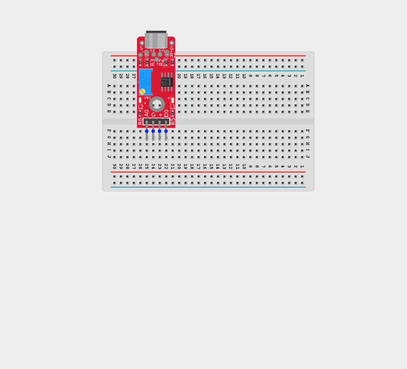
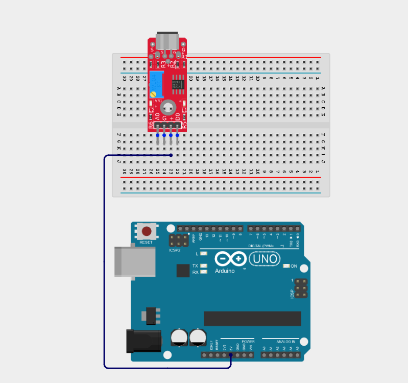
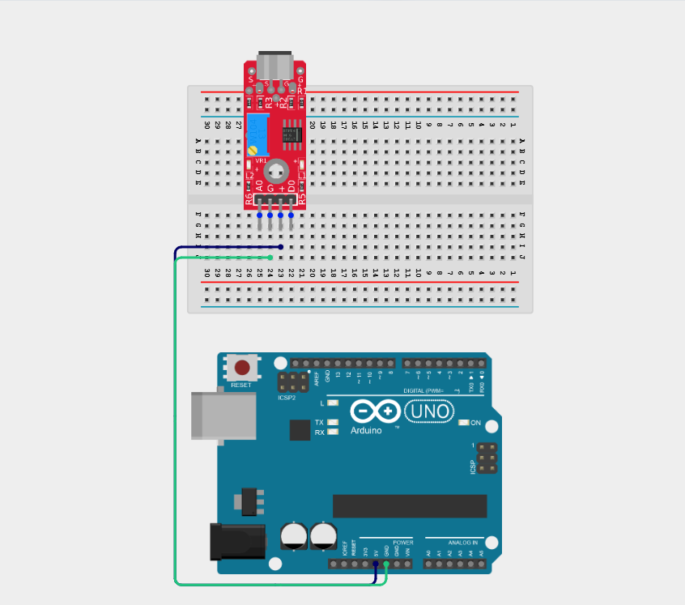
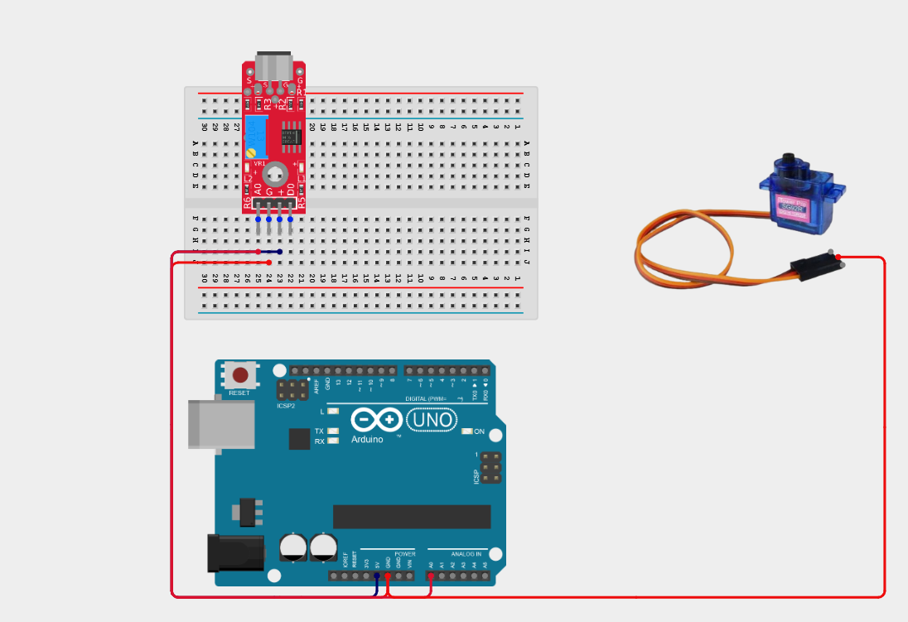
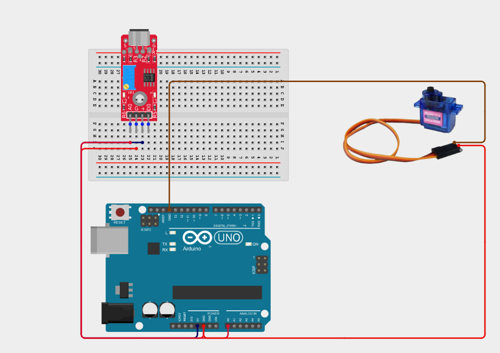
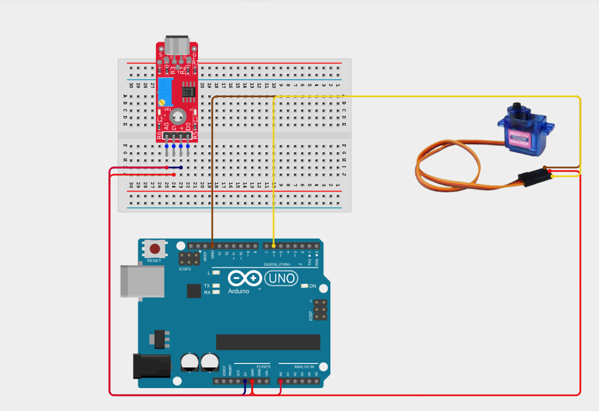
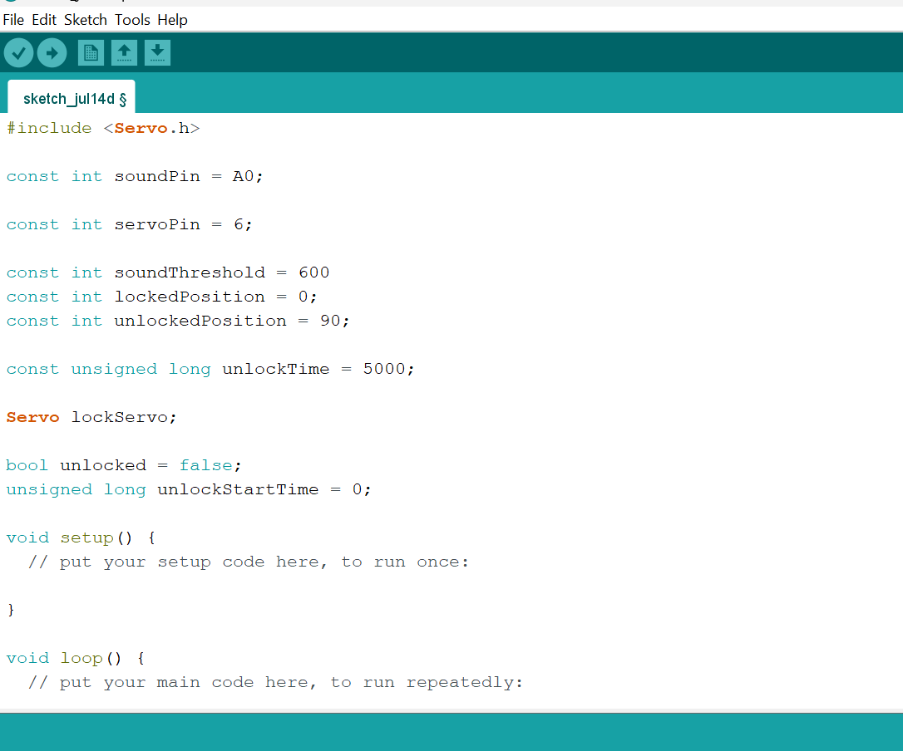
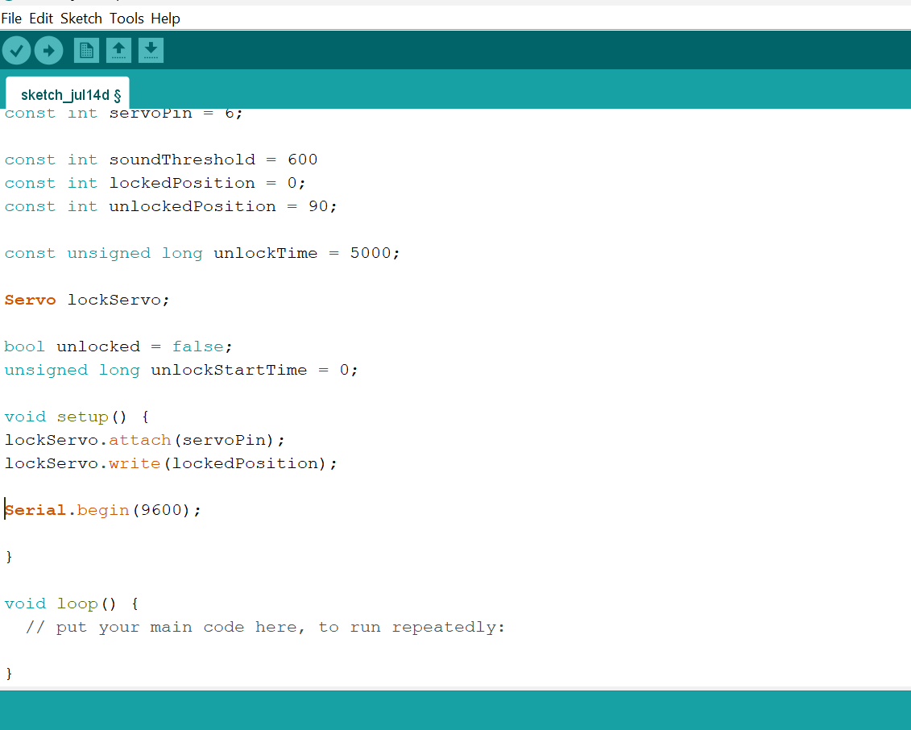
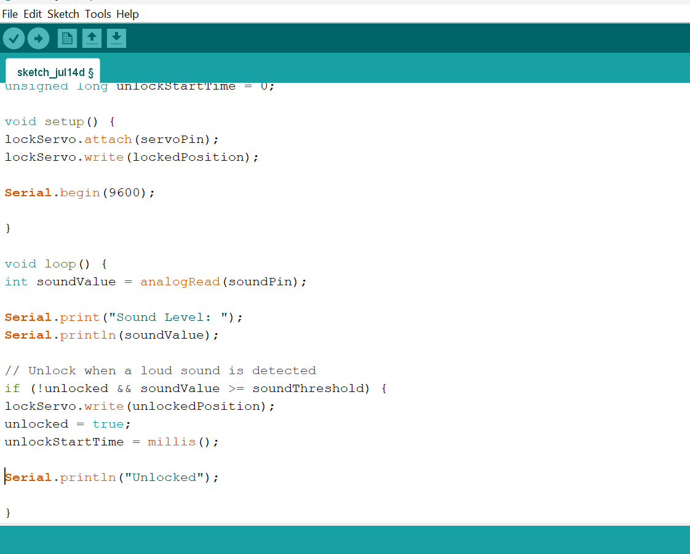
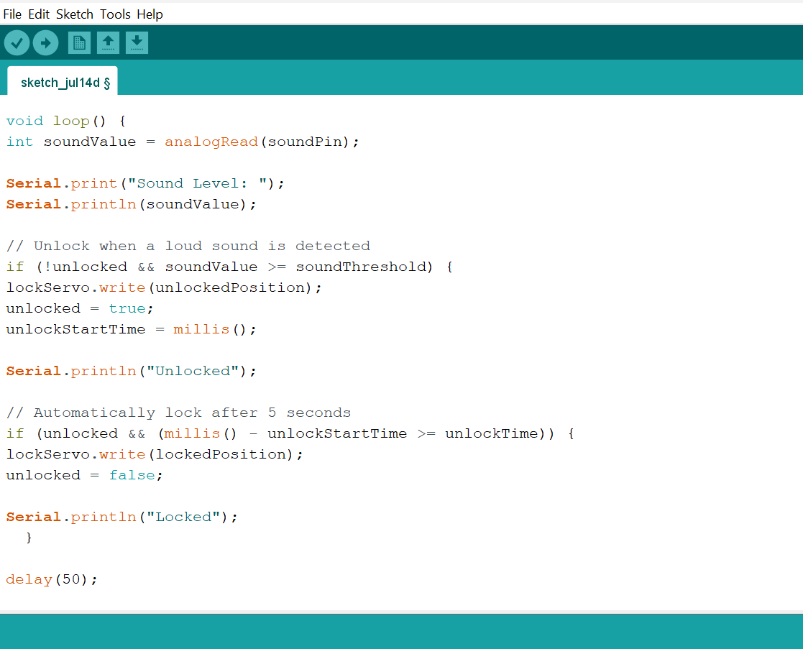

# Project 2.8.3: Acoustic Doggy Door Latch

| **Description** | This project uses a sound sensor to detect a specific sound (clap or bark) and activates a servo motor to unlock a latch for 5 seconds before auto-locking. |
|------------------|----------------------------------------------------------------|
| **Use case**     | This project can be used in automation systems, interactive installations, and embedded control applications. |

## Components (Things You will need)

|  |  |  |  |  |  |
|-------------------------|-------------------------|-------------------------|-------------------------|-------------------------|-------------------------|

## Building the circuit

Things Needed:

- Arduino Uno = 1
- Arduino USB cable = 1
- Sound sensor module = 1
- Servo motor = 1
- Breadboard = 1
- Jumper wires = 1

## Mounting the component on the breadboard

**Step 1:** Place the Sound Sensor on the breadboard.

_**NB:** Make sure all components are securely placed on the breadboard with correct orientation._

## WIRING THE CIRCUIT

**Step 2:** Connect the VCC (+) pin of the Sound Sensor to the 5V pin on the Arduino Uno using male-to-male jumper wires.

**Step 3:** Connect the GND pin of the Sound Sensor to the GND pin on the Arduino Uno using male-to-male jumper wires.

**Step 4:** Connect the A0 (Analog Output) pin to Analog Pin A0 on the Arduino Uno using male-to-male jumper wires.

_Leave the D0 (Digital Output) pin unconnected._

**Step 5:** Connect the VCC (Red) wire to the 5V pin on the Arduino using male-to-male jumper wires.

**Step 6:** Connect the GND (Brown/Black) wire to the GND pin on the Arduino using male-to-male jumper wires.

**Step 7:** Connect the Signal wire (yellow) of the servo motor to Digital Pin 6 using male-to-male jumper wires.

_Make sure to connect the Arduino USB cable to the Arduino board._

## PROGRAMMING

**Step 1:** Open your Arduino IDE. See how to set up here: [Getting Started](../../Getting Started/Arduino_IDE_Setup.md).

**Step 2:** Type the following code in your Arduino IDE: `#include <Servo.h>`, `const int soundPin = A0;`, `const int servoPin = 6;`, `const int soundThreshold = 600;`, `const int lockedPosition = 0;`, `const int unlockedPosition = 90;`, `const unsigned long unlockTime = 5000;`, `Servo lockServo;`, `bool unlocked = false;`, `unsigned long unlockStartTime = 0;` as shown in the image below.

**Step 3:** Type the following code in your Arduino IDE inside the void setup() `lockServo.attach(servoPin);`, `lockServo.write(lockedPosition);`, `Serial.begin(9600);`, as shown in the image below.

**Step 4:** Type the following code in your Arduino IDE inside the void loop() `int soundValue = analogRead(soundPin);`, `Serial.print("Sound Level: ");`, `Serial.println(soundValue);`, `if (!unlocked && soundValue >= soundThreshold) {`, ` lockServo.write(unlockedPosition);`, ` unlocked = true;`, `unlockStartTime = millis();`, ` Serial.println("Unlocked"); }` as shown in the image below.
  

**Step 5:** Type the following code in your Arduino IDE inside the void loop() `if (unlocked && (millis() - unlockStartTime >= unlockTime)) {`, `lockServo.write(lockedPosition);`, `unlocked = false;`, `Serial.println("Locked"); }` , `delay(50);` as shown in the image below.

**Step 6:** Save your code. _See the [Getting Started](../../Getting Started/Arduino_IDE_Setup.md) section_

**Step 7:** Select the Arduino board and port. _See the [Getting Started](../../Getting Started/Arduino_IDE_Setup.md) section_

**Step 8:** Upload your code.

## CONCLUSION

This project helps learners understand how to combine multiple components with Arduino to create more complex interactive systems and automation solutions.

