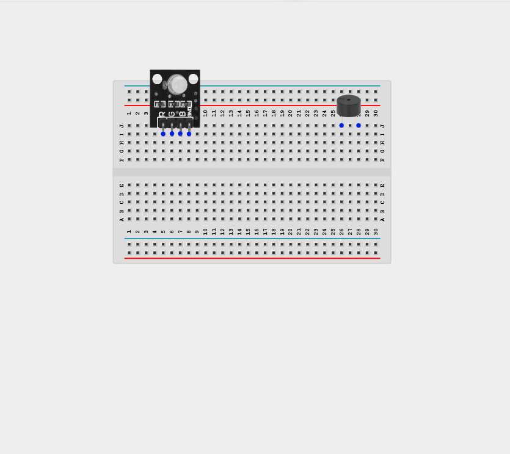
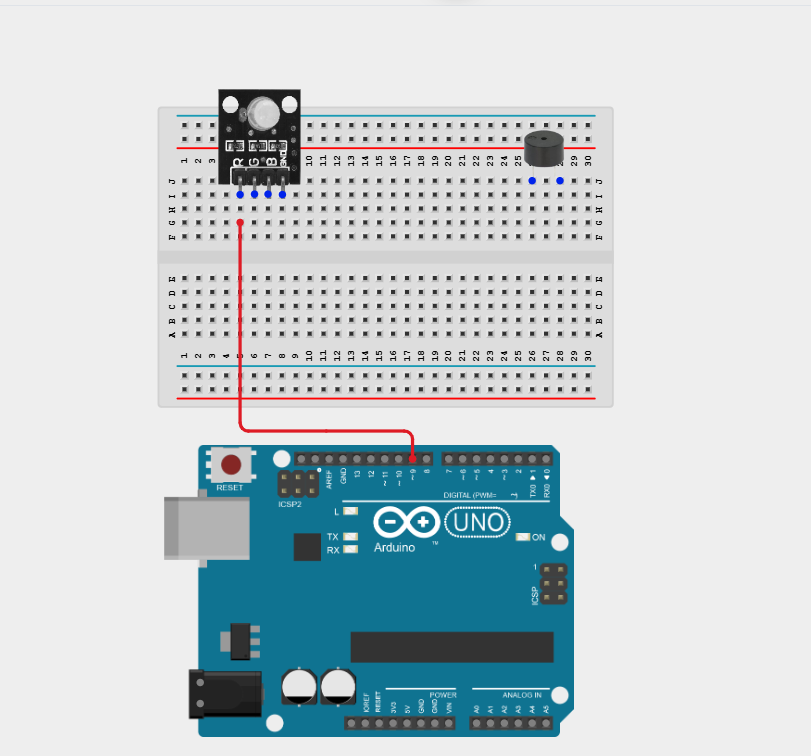
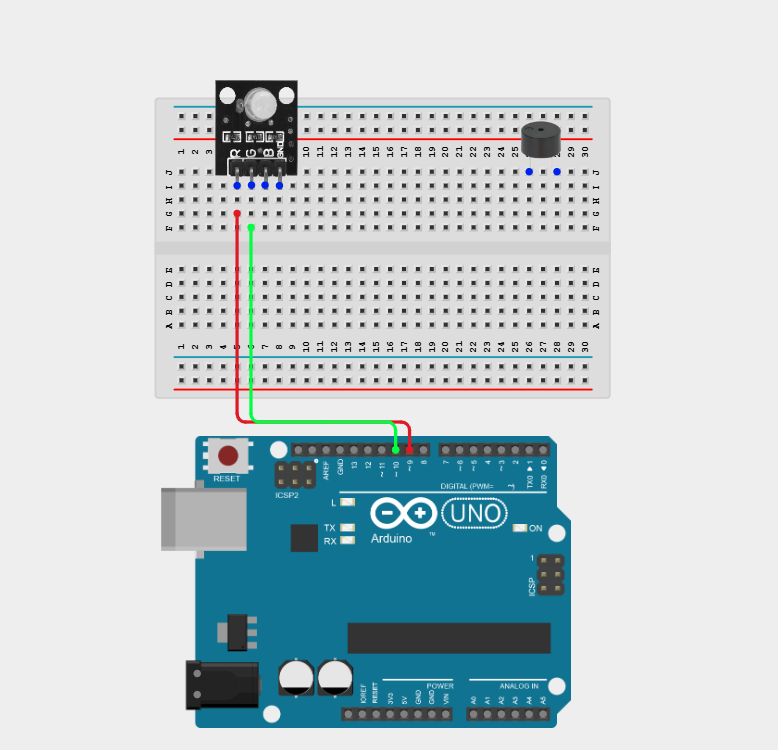
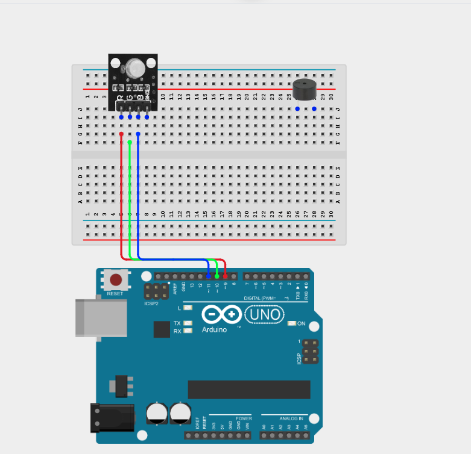
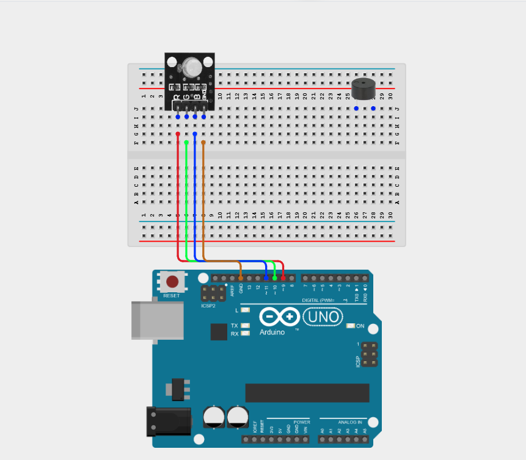
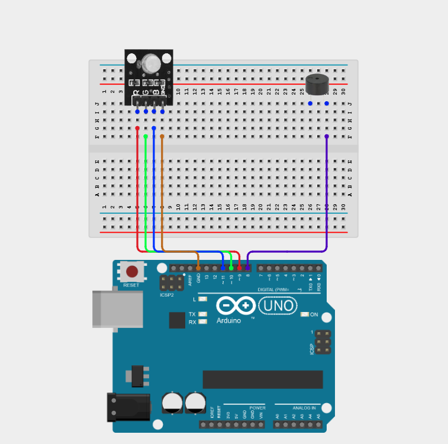
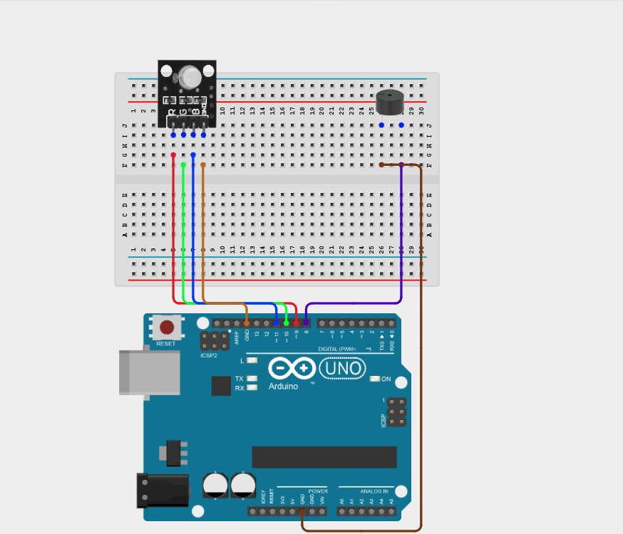
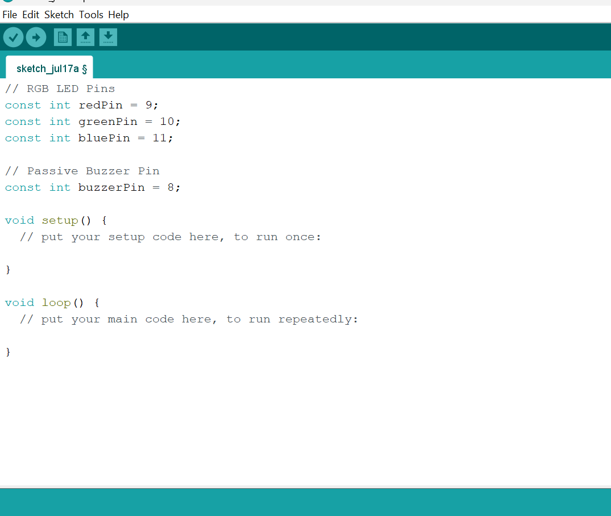
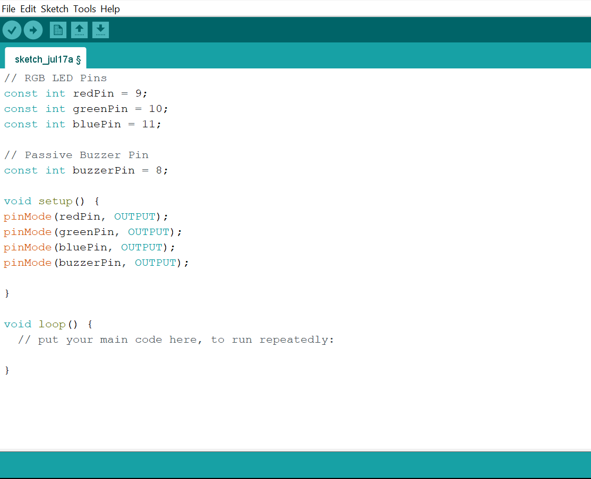
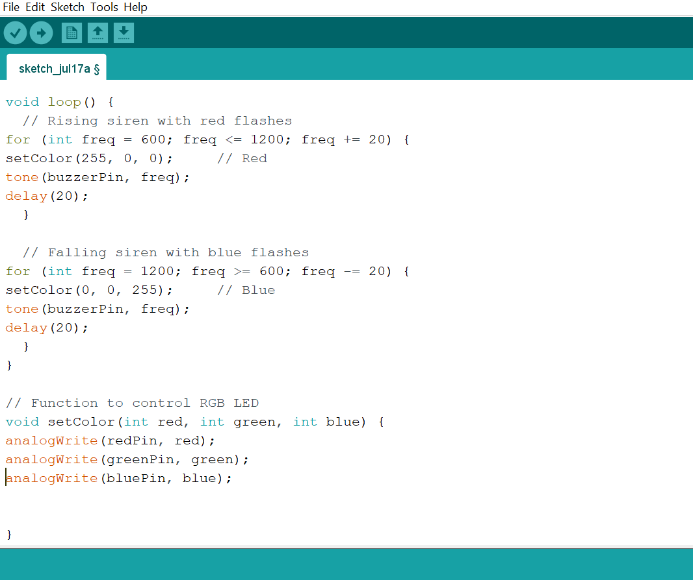

# Project 2.8.4: Visual Siren Alert

| **Description** | This project creates a police-style siren effect where the buzzer tones rise and fall in sync with red-blue alternating flashes on the RGB LED. |
|------------------|----------------------------------------------------------------|
| **Use case**     | This project can be used in automation systems, interactive installations, and embedded control applications. |

## Components (Things You will need)

| | | | | | |
|-------------------------|-------------------------|-------------------------|-------------------------|-------------------------|-------------------------|

## Building the circuit

Things Needed:

- Arduino Uno = 1
- Arduino USB cable = 1
- RGB LED module = 1
- Buzzer = 1
- Breadboard = 1
- Jumper wires

## Mounting the component on the breadboard

**Step 1:** Place the Buzzer and the RGB LED Module on the breadboard.

_**NB:** Make sure all components are securely placed on the breadboard with correct orientation._

## WIRING THE CIRCUIT

**Step 2:** Connect the Red (R) of the RGB LED to Digital Pin 9 on the Arduino Uno using male-to-male jumper wire.

**Step 3:** Connect the Green (G) of the RGB LED to Digital Pin 10 on the Arduino Uno using male-to-male jumper wire.

**Step 4:** Connect the Blue (B) of the RGB LED to Digital Pin 11 on the Arduino Uno using male-to-male jumper wire.

**Step 5:** Connect the GND of the RGB LED to GND on the Arduino Uno using male-to-male jumper wire.

**Step 6:** Connect the positive (+) of the Buzzer to Digital Pin 8 on the Arduino Uno using male-to-male jumper wire.

**Step 7:** Connect the negative (–) pin of the Buzzer to GND on the Arduino Uno using male-to-male jumper wire.

_Make sure to connect the Arduino USB cable to the Arduino board._

## PROGRAMMING

**Step 1:** Open your Arduino IDE. See how to set up here: [Getting Started](../../Getting Started/Arduino_IDE_Setup.md).

**Step 2:** Type the following code in your Arduino IDE: `const int redPin = 9;`, `const int greenPin = 10;`, `const int bluePin = 11;`, `const int buzzerPin = 8;;` as shown in the image below.

**Step 3:** Type the following code in your Arduino IDE inside void setup() `pinMode(redPin, OUTPUT);`, `pinMode(greenPin, OUTPUT);`, `pinMode(bluePin, OUTPUT);`, `pinMode(buzzerPin, OUTPUT);` as shown in the image below.

**Step 4:** Type the following code in your Arduino IDE inside void loop() `for (int freq = 600; freq <= 1200; freq += 20) {`, `setColor(255, 0, 0);`, `tone(buzzerPin, freq);`, `delay(20); }`, `for (int freq = 1200; freq >= 600; freq -= 20) {`, `setColor(0, 0, 255);`, `tone(buzzerPin, freq);`, `delay(20); } }`, `void setColor(int red, int green, int blue) {`, `analogWrite(redPin, red);`, `analogWrite(greenPin, green);`, `analogWrite(bluePin, blue);}` as shown in the image below.

**Step 5:** Save your code. _See the [Getting Started](../../Getting Started/Arduino_IDE_Setup.md) section_

**Step 6:** Select the Arduino board and port. _See the [Getting Started](../../Getting Started/Arduino_IDE_Setup.md) section_

**Step 7:** Upload your code.

## CONCLUSION

This project helps learners understand how to combine multiple components with Arduino to create more complex interactive systems and automation solutions.

