# Project 2.8.5: Audible Crosswalk Signal

| **Description** | This project makes the Traffic Light change colors while the buzzer chirps at different rates - slow beeps for Red, fast beeps for Green. |
| --- | --- |
| **Use case** | This project can be used in traffic control simulations, pedestrian crossing systems, industrial status indicators, and educational demonstrations, where visual signals are reinforced with audible alerts to indicate different operating states. |

## Components (Things You will need)

|  |  |  |  |  |  |
| --- | --- | --- | --- | --- | --- |

## Building the circuit

Things Needed:

- Arduino Uno = 1
- Arduino USB cable = 1
- Traffic light module = 1
- Buzzer = 1
- Breadboard = 1
- Jumper wires

## Mounting the component on the breadboard

**Step 1:** Place the Traffic Light Module and the Buzzer on the breadboard following the circuit diagram.

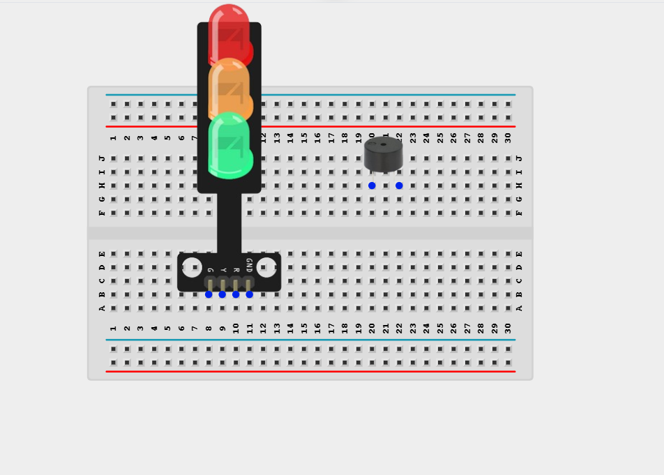

_**NB:** Make sure all components are securely placed on the breadboard with correct orientation._

## WIRING THE CIRCUIT

**Step 2:** Connect the Green LED pin of the Traffic Light Module to Digital Pin 4 on the Arduino Uno using male-to-male jumper wire.

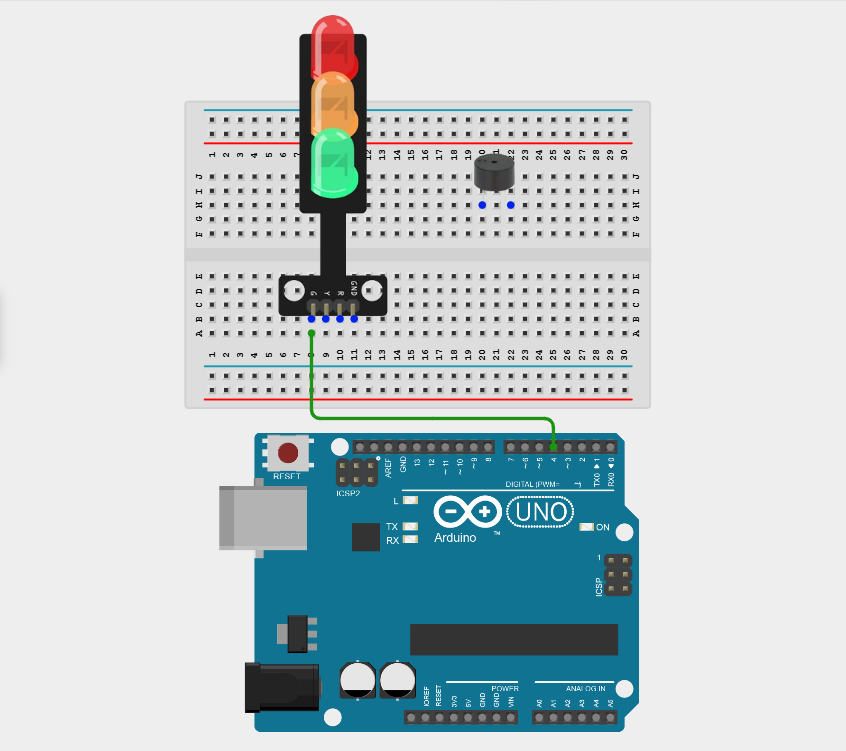

**Step 3:** Connect the Yellow LED pin of the Traffic Light Module to Digital Pin 5 on the Arduino Uno using male-to-male jumper wire.

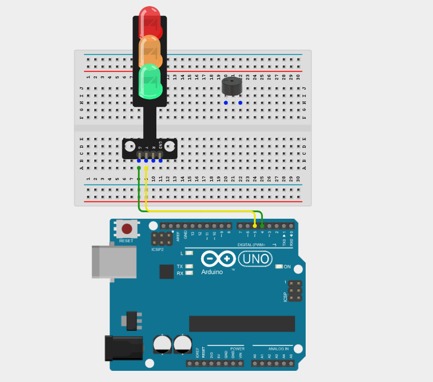

**Step 4:** Connect the Red LED pin of the Traffic Light Module to Digital Pin 6 on the Arduino Uno using male-to-male jumper wire.

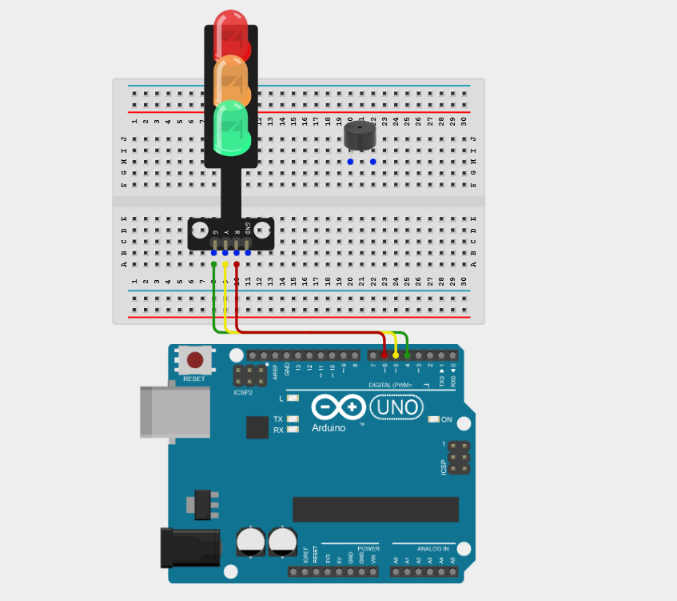

**Step 5:** Connect the GND pin of the Traffic Light Module to the Arduino GND using a male-to-male jumper wire.

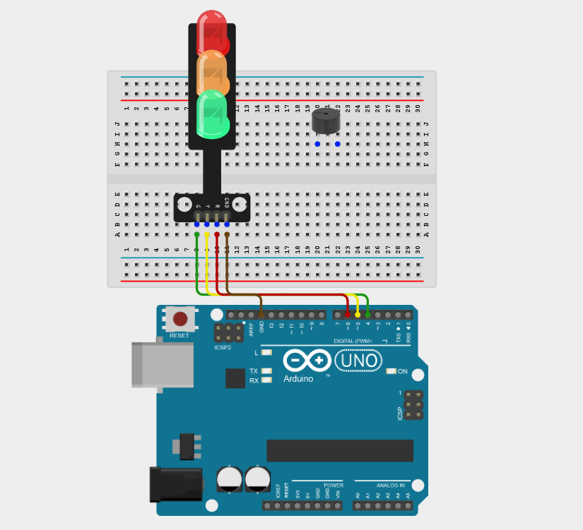

**Step 6:** Connect the positive (+) pin of the Buzzer to Digital Pin 8 on the Arduino Uno using a male-to-male jumper wire.

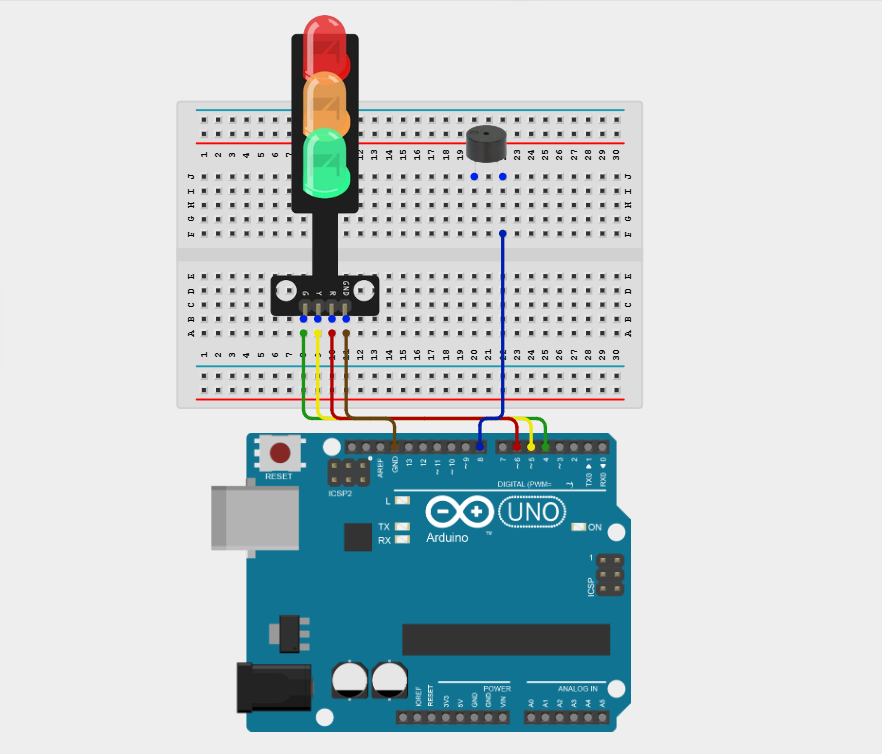

**Step 7:** Connect the negative (GND) pin of the Buzzer to the Arduino GND using a male-to-male jumper wire.

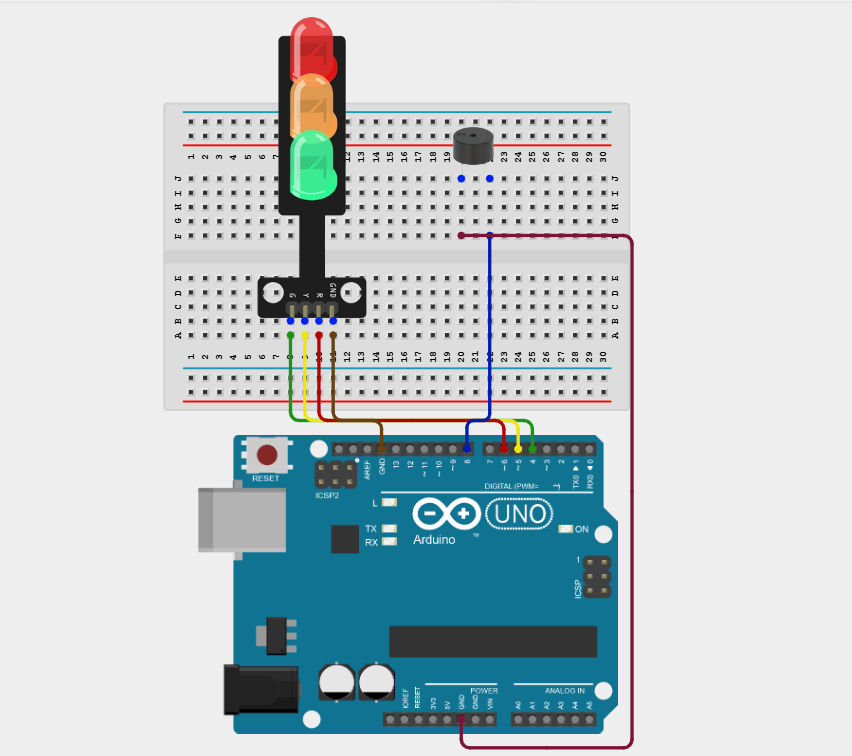

_Make sure to connect the Arduino USB cable to the Arduino board._

## PROGRAMMING

**Step 1:** Open your Arduino IDE. See how to set up here: [Getting Started](../../Getting Started/Arduino_IDE_Setup.md).

**Step 2:** Type the following code in your Arduino IDE: `const int greenLED = 4;`, `const int yellowLED = 5;`, `const int redLED = 6;`, `const int buzzerPin = 8;`  as shown in the image below.

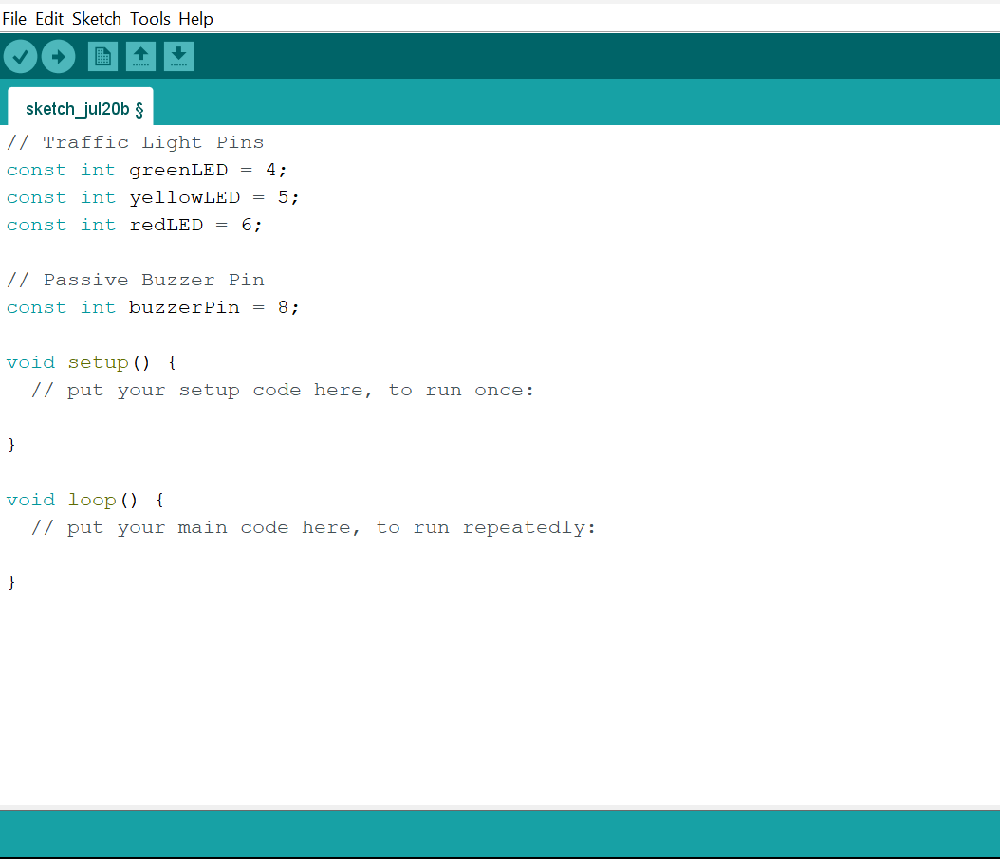

**Step 3:** Type the following code in your Arduino IDE inside the void setup() function: `pinMode(greenLED, OUTPUT);`, `pinMode(yellowLED, OUTPUT);`, `pinMode(redLED, OUTPUT);`, `pinMode(buzzerPin, OUTPUT);`  as shown in the image below.

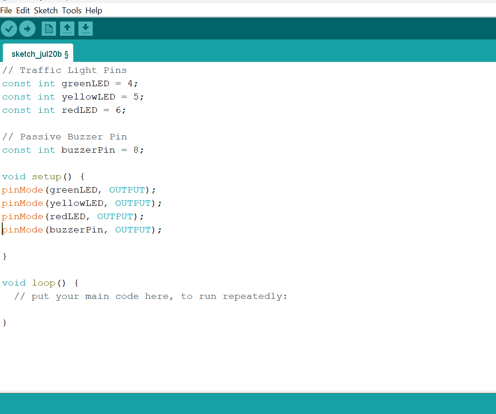

**Step 4:** Type the following code in your Arduino IDE inside the void loop() function: `digitalWrite(redLED, HIGH);`, `digitalWrite(yellowLED, LOW);`, `digitalWrite(greenLED, LOW);`, `beepPattern(3, 500);`, `digitalWrite(redLED, LOW);`, `digitalWrite(yellowLED, HIGH);`, `digitalWrite(greenLED, LOW);`, `beepPattern(4, 250); }`   as shown in the image below.
  
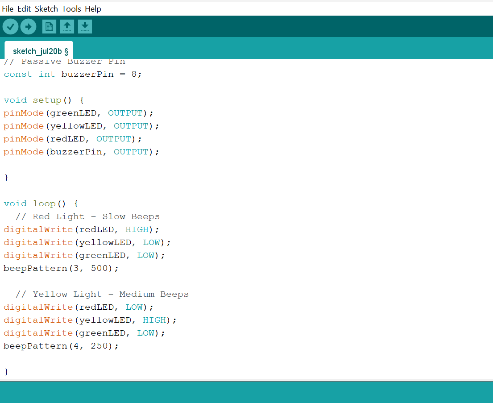

**Step 5:** Type the following code in your Arduino IDE inside the void loop() function: `digitalWrite(redLED, LOW);`, `digitalWrite(yellowLED, LOW);`, `digitalWrite(greenLED, HIGH);`, `beepPattern(8, 125);`, `void beepPattern(int count, int interval) {`, `for (int i = 0; i < count; i++) {`, `tone(buzzerPin, 1000);`, `delay(interval / 2);`, `noTone(buzzerPin);`, `delay(interval / 2); } }`   as shown in the image below.
  
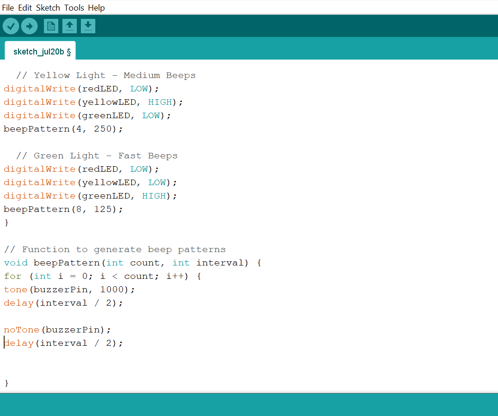

**Step 6:** Save your code. _See the [Getting Started](../../Getting Started/Arduino_IDE_Setup.md) section_

**Step 7:** Select the Arduino board and port. _See the [Getting Started](../../Getting Started/Arduino_IDE_Setup.md) section_

**Step 8:** Upload your code.

## CONCLUSION

This project helps learners understand how to combine multiple components with Arduino to create more complex interactive systems and automation solutions.

