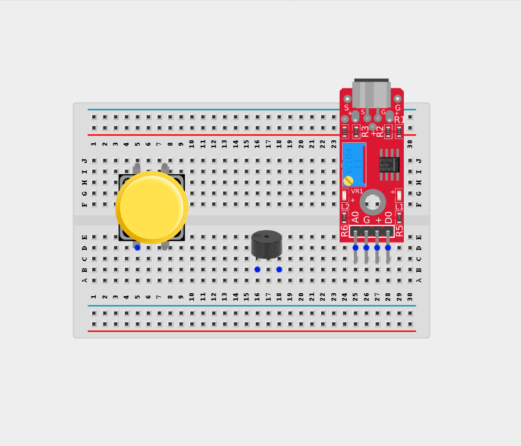
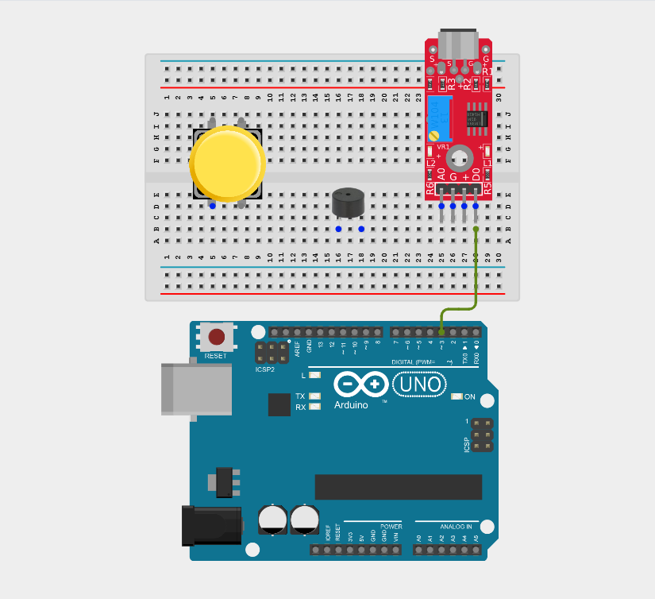
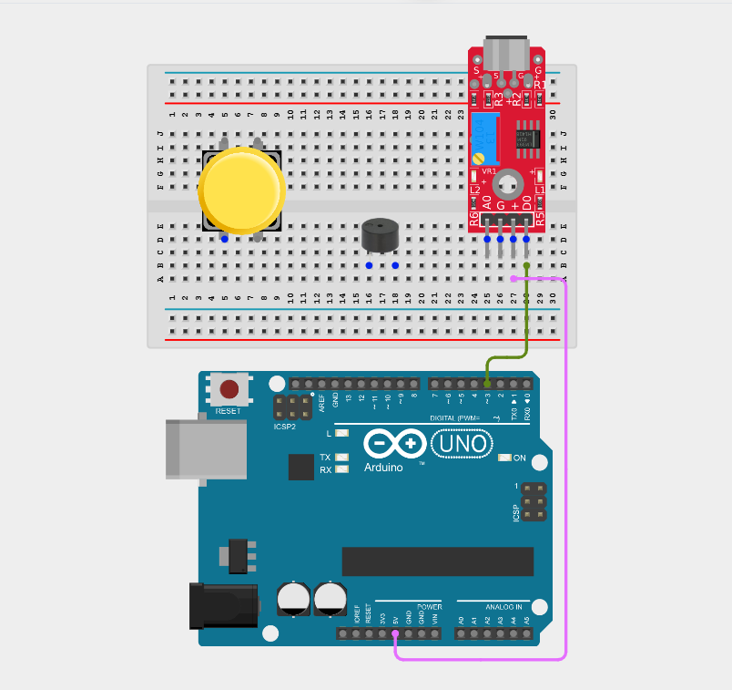
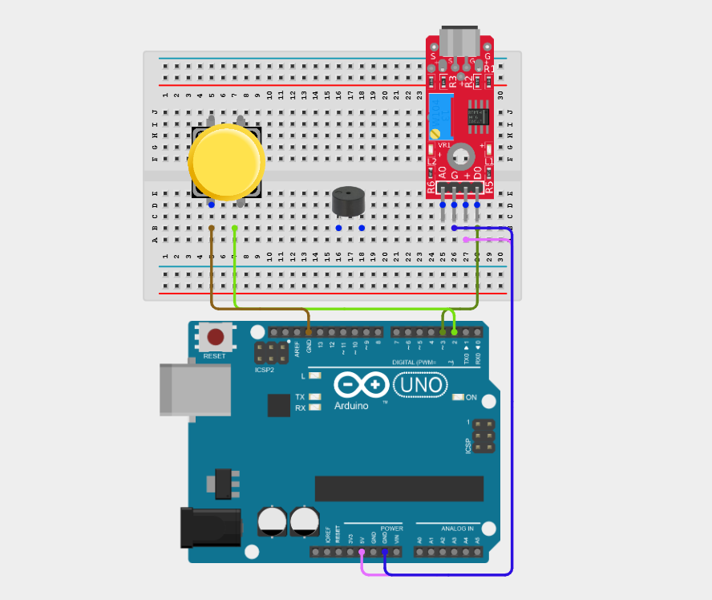
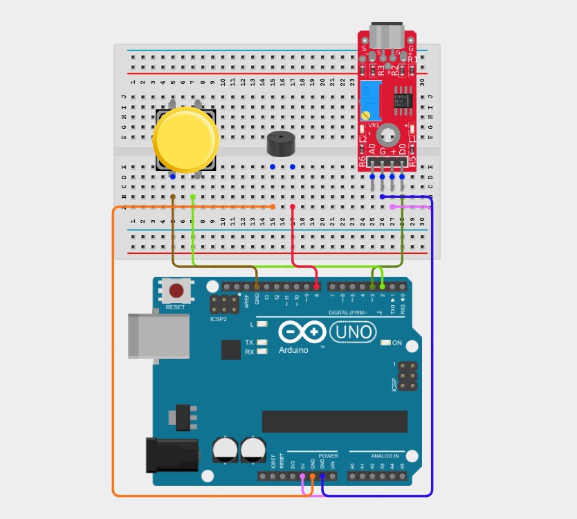
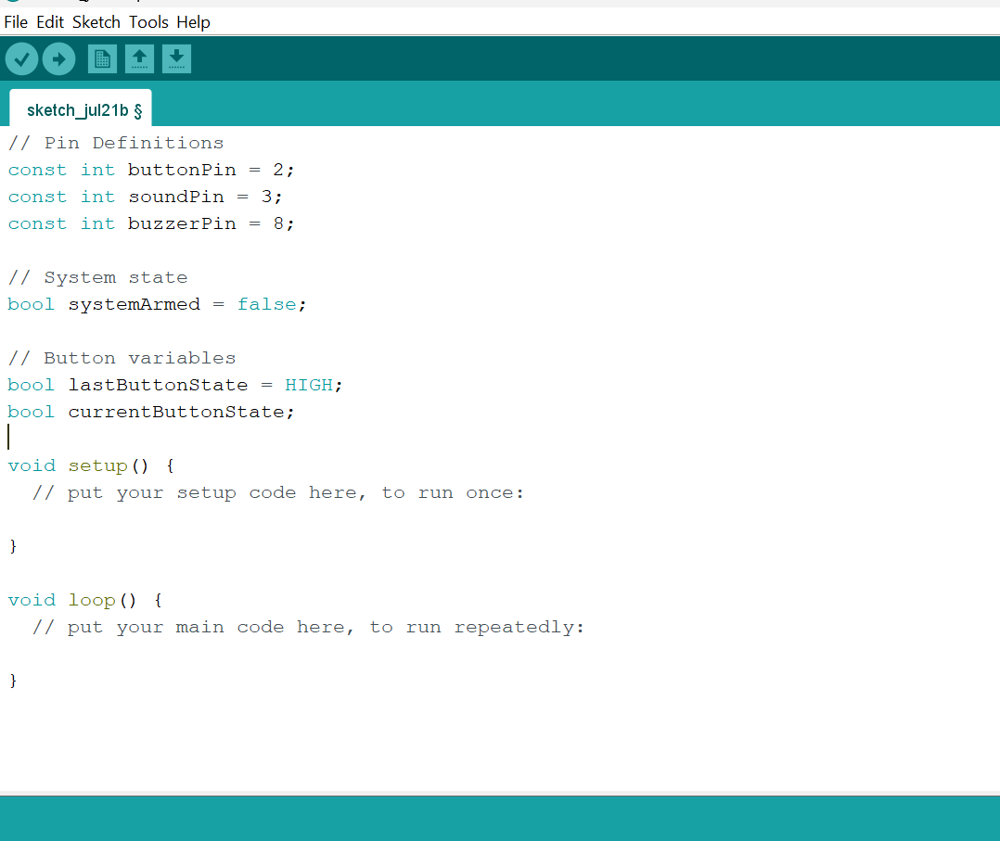
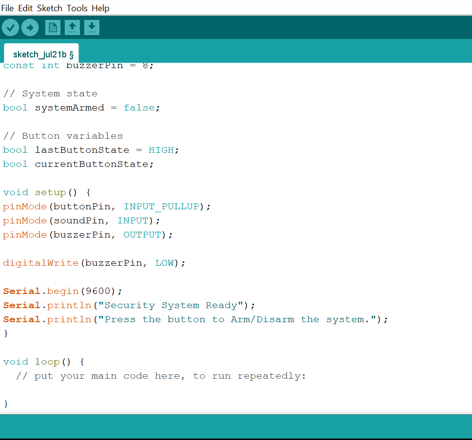
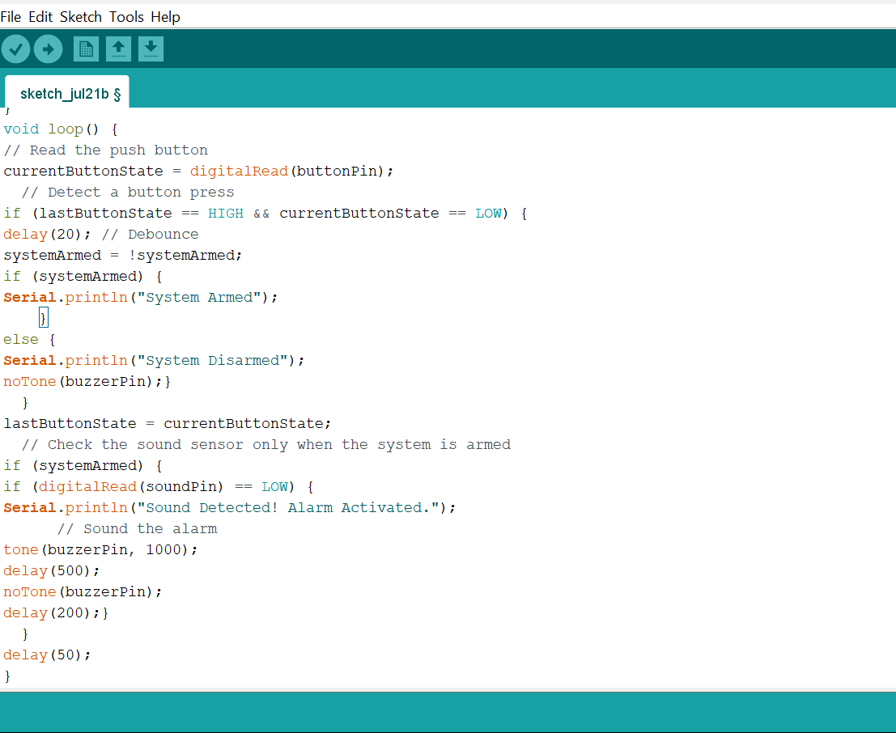

# Project 2.8.6: Arming Security Triggers

| **Description** | This project uses a push button to arm/disarm a security system - the sound sensor triggers an action only when the system is armed. |
|------------------|----------------------------------------------------------------|
| **Use case**     | This project can be used in home security systems, office access control, equipment monitoring, and intrusion detection, where monitoring can be enabled or disabled by the user to prevent unauthorized access or false alarms.|

## Components (Things You will need)

|  |  |  |  |  |  |  |
| --- | --- | --- | --- | --- | --- | --- |

## Building the circuit

Things Needed:

- Arduino Uno = 1
- Arduino USB cable = 1
- Push button = 1
- Sound sensor module = 1
- Breadboard = 1
- Buzzer = 1
- Jumper wires

## Mounting the component on the breadboard

**Step 1:** Place the Push button, Sound sensor, and Buzzer on the breadboard.

_**NB:** Make sure all components are securely placed on the breadboard with correct orientation._

## WIRING THE CIRCUIT

**Step 2:** Connect the D0 pin of the Sound sensor to Digital Pin 3 on the Arduino Uno using male-to-male jumper wire.

**Step 3:** Connect the VCC pin of the Sound sensor to the Arduino 5V pin using a male-to-male jumper wire.

**Step 4:** Connect the GND pin of the Sound sensor to the Arduino GND pin using a male-to-male jumper wire.

**Step 5:** Connect one terminal of the push button to Digital Pin 2 on the Arduino Uno and the other terminal to the Arduino GND pin using a male-to-male jumper wires.

**Step 6:** Connect the positive (+) pin of the buzzer to Digital Pin 8 and the negative (–) pin to GND using male-to-male jumper wires.

_Make sure to connect the Arduino USB cable to the Arduino board._

## PROGRAMMING

**Step 1:** Open your Arduino IDE. See how to set up here: [Getting Started](../../Getting Started/Arduino_IDE_Setup.md).

**Step 2:** Type the following code in your Arduino IDE: `const int buttonPin = 2;`, `const int SoundPin = 3;`, `const int buzzerPin = 8`, `bool systemArmed = false;`,`bool currentButtonState = HIGH;`, `bool currentButtonState;`  as shown in the image below.

**Step 3:** Type the following code in your Arduino IDE inside the void setup() function: `pinMode(buttonPin, INPUT_PULLUP);`, `pinMode(soundPin, INPUT);`, `pinMode(buzzerPin, OUTPUT);`, `digitalWrite(buzzerPin, LOW);`,`Serial.begin(9600);`, `Serial.println("Security System Ready");`, `Serial.println("Press the button to Arm/Disarm the system.");`  as shown in the image below.

**Step 4:** Type the following code in your Arduino IDE inside the void loop() function: `currentButtonState = digitalRead(buttonPin);`, `if (lastButtonState == HIGH && currentButtonState == LOW) {`, `delay(20);`, `systemArmed = !systemArmed;`,`if (systemArmed) {`, `Serial.println("System Armed"); }`, `else {`, `Serial.println("System Disarmed");`, `noTone(buzzerPin); } }`, `lastButtonState = currentButtonState;`, `if (systemArmed) {`, `if (digitalRead(soundPin) == LOW) {`, `Serial.println("Sound Detected! Alarm Activated.");`, `tone(buzzerPin, 1000);`, `delay(500);`, `noTone(buzzerPin);`, `delay(200); } }`, `delay(50);`  as shown in the image below.

**Step 5:** Save your code. _See the [Getting Started](../../Getting Started/Arduino_IDE_Setup.md) section_

**Step 6:** Select the Arduino board and port. _See the [Getting Started](../../Getting Started/Arduino_IDE_Setup.md) section_

**Step 7:** Upload your code.

## CONCLUSION

This project helps learners understand how to combine multiple components with Arduino to create more complex interactive systems and automation solutions.

