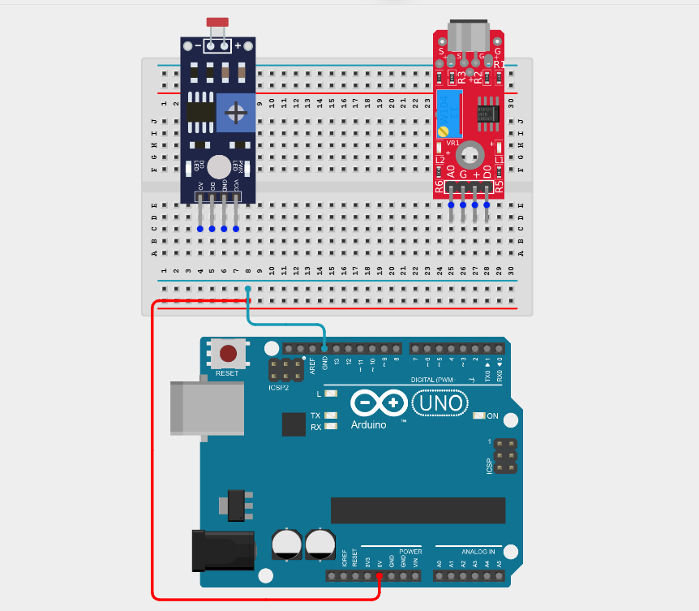
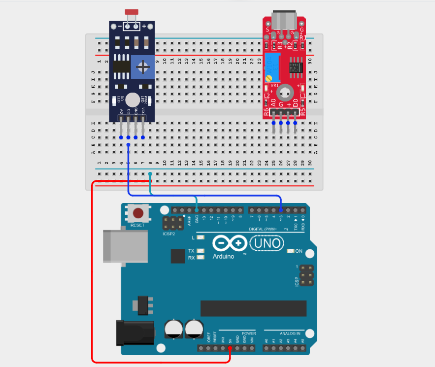
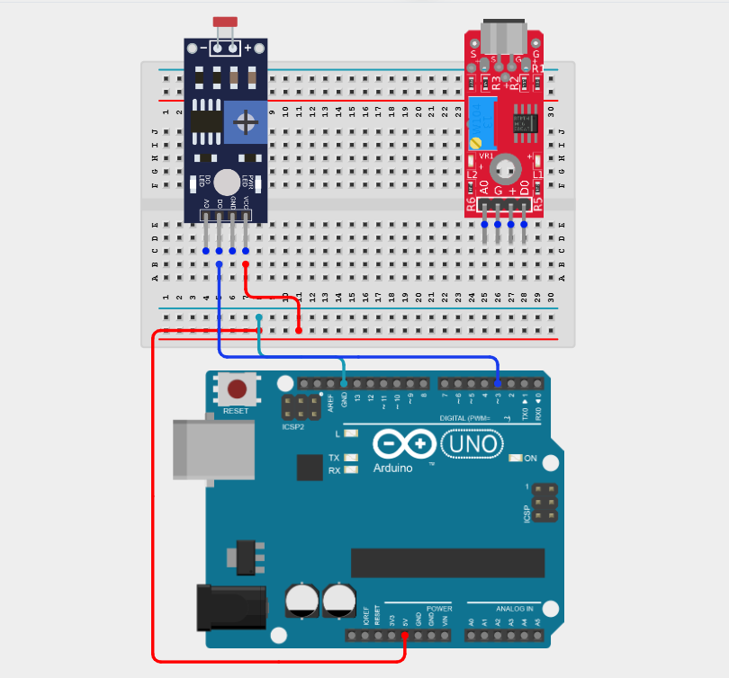
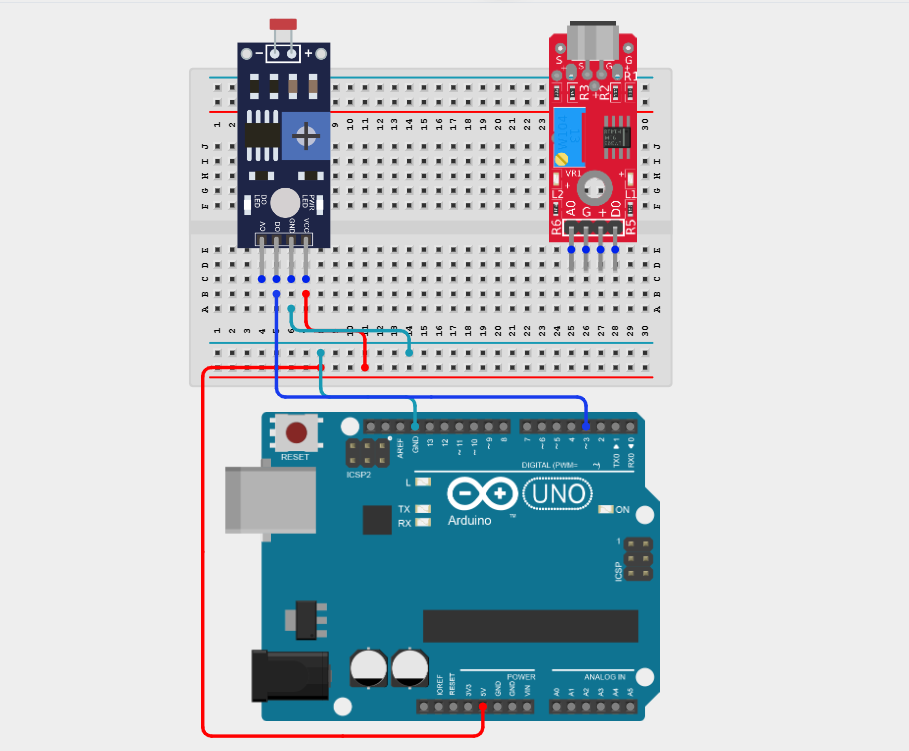
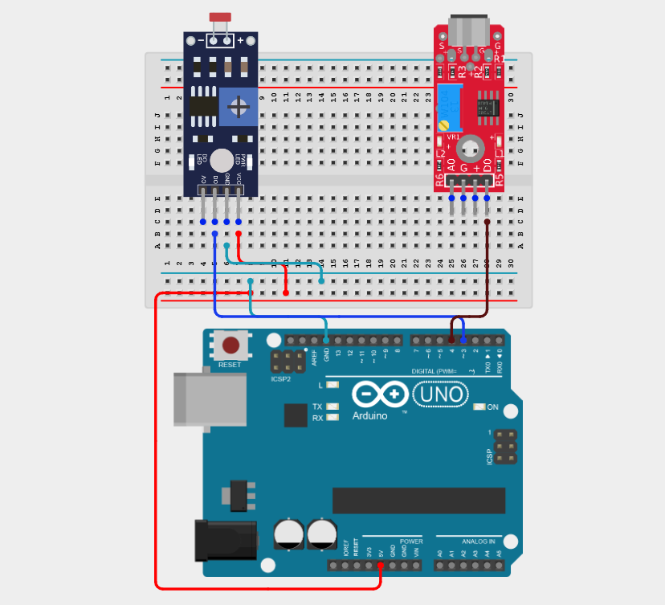
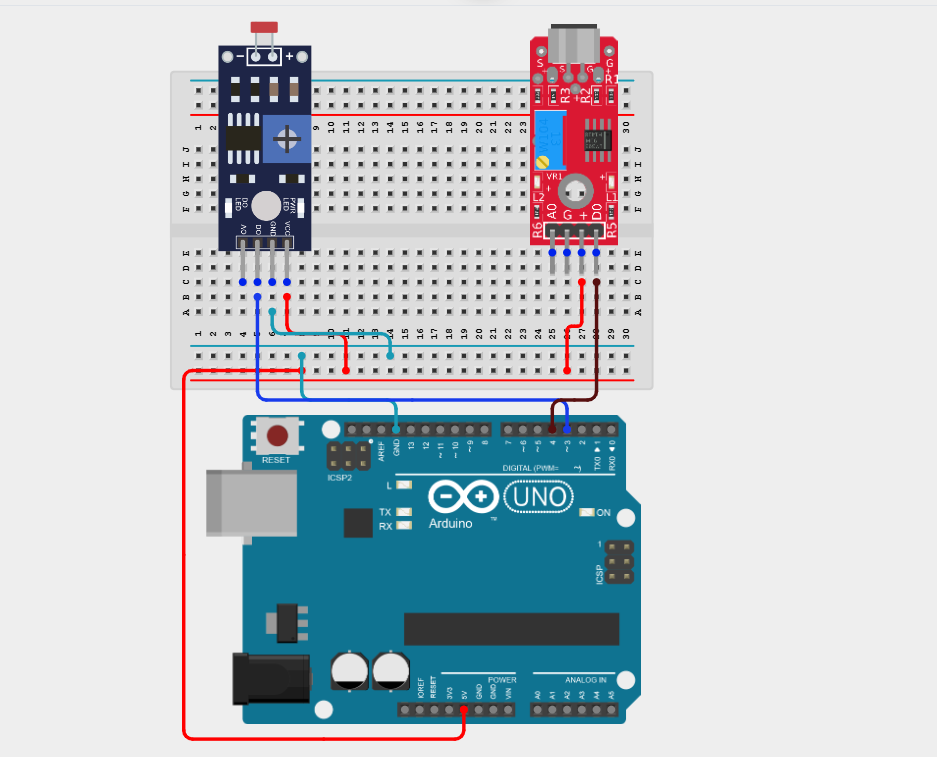
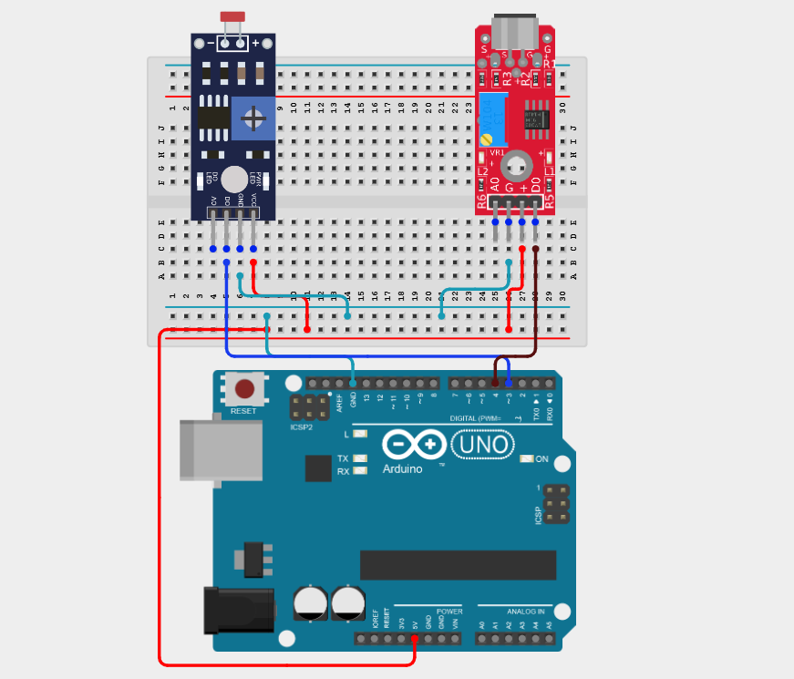
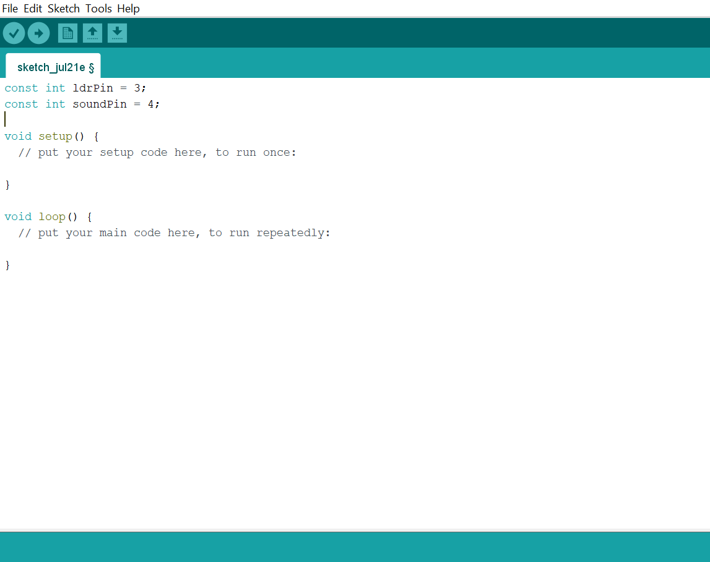
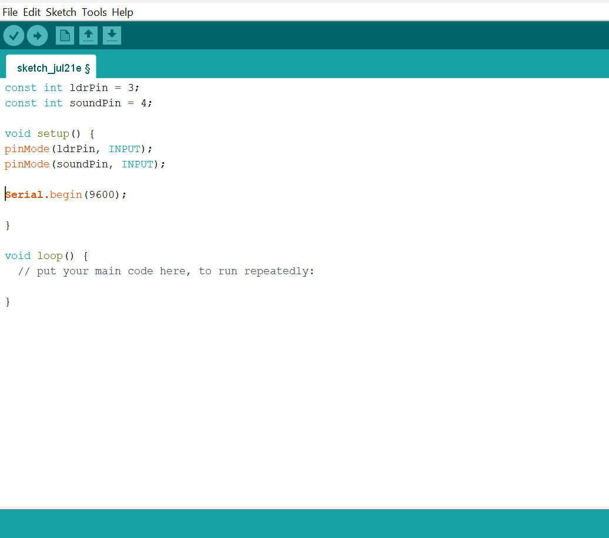
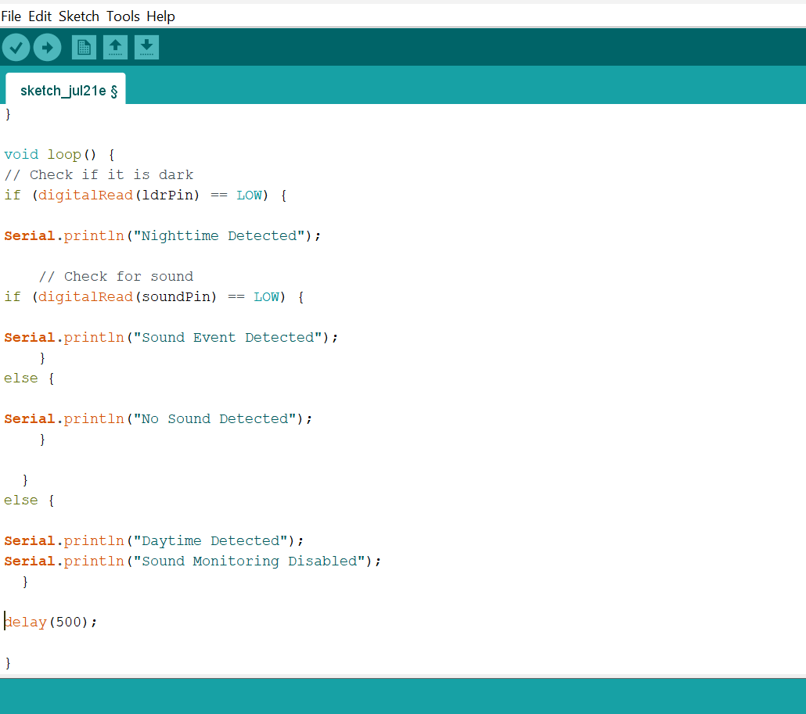

# Project 2.8.7: Darkness Audio Logger

| **Description** | This project logs sound levels only when the LDR detects darkness, allowing nighttime-only audio monitoring. |
|------------------|----------------------------------------------------------------|
| **Use case**     | This project can be used in nighttime environmental monitoring, wildlife observation, security surveillance, and smart outdoor systems to record sound events only during periods of darkness. |

## Components (Things You will need)

|  |  |  |  |  |  |
| --- | --- | --- | --- | --- | --- |

## Building the circuit

Things Needed:

- Arduino Uno = 1
- Arduino USB cable = 1
- LDR module = 1
- Sound sensor module = 1
- Breadboard = 1
- Jumper wires

## Mounting the component on the breadboard

**Step 1:** Place the Sound Sensor and the LDR Module on the breadboard following the circuit diagram.

_Connect the Arduino 5V pin to the breadboard's positive (+) power rail and connect the Arduino GND pin to the breadboard's negative (–) power rail to distribute power._

_**NB:** Make sure all components are securely placed on the breadboard with correct orientation._

## WIRING THE CIRCUIT

**Step 2:** Connect the D0 pin of the LDR to Digital Pin 3 on the Arduino Uno using male-to-male jumper wire.

**Step 3:** Connect the VCC pin of the LDR to the positive (+) power rail on the breadboard using male-to-male jumper wire.

**Step 4:** Connect the GND pin of the LDR to the negative (–) power rail on the breadboard using male-to-male jumper wire.

**Step 5:** Connect the D0 pin of the Sound Sensor to the Digital Pin 4 on the Arduino Uno using male-to-male jumper wire.

**Step 6:** Connect the VCC pin of the Sound Sensor to the positive (+) power rail on the breadboard using male-to-male jumper wire.

**Step 7:** Connect the GND pin of the Sound Sensor to the negative (–) power rail on the breadboard using male-to-male jumper wire.

_Make sure to connect the Arduino USB cable to the Arduino board._

## PROGRAMMING

**Step 1:** Open your Arduino IDE. See how to set up here: [Getting Started](../../Getting Started/Arduino_IDE_Setup.md).

**Step 2:** Type the following code in your Arduino IDE: `const int ldrPin = 3;`, `const int SoundPin = 4;`  as shown in the image below.

**Step 3:** Type the following code in your Arduino IDE inside the void setup() function: `pinMode(ldrPin, INPUT);`, `pinMode(soundPin, INPUT);`, `Serial.begin(9600);`  as shown in the image below.

**Step 4:** Type the following code in your Arduino IDE inside the void setup() function: `if (digitalRead(ldrPin) == LOW) {`, `Serial.println("Nighttime Detected");`, `if (digitalRead(soundPin) == LOW) {`, `Serial.println("Sound Event Detected"); }`,`else {`, `Serial.println("No Sound Detected"); }`, `else {`, `Serial.println("Daytime Detected");`, `Serial.println("Sound Monitoring Disabled"); }`, `delay(500);`  as shown in the image below.

**Step 5:** Save your code. _See the [Getting Started](../../Getting Started/Arduino_IDE_Setup.md) section_

**Step 6:** Select the Arduino board and port. _See the [Getting Started](../../Getting Started/Arduino_IDE_Setup.md) section_

**Step 7:** Upload your code.

## OBSERVATION

When the program runs, the Arduino monitors and logs sound events only when the LDR detects darkness, while sound monitoring remains disabled during daylight.

## CONCLUSION

This project helps learners understand how to combine multiple components with Arduino to create more complex interactive systems and automation solutions.

