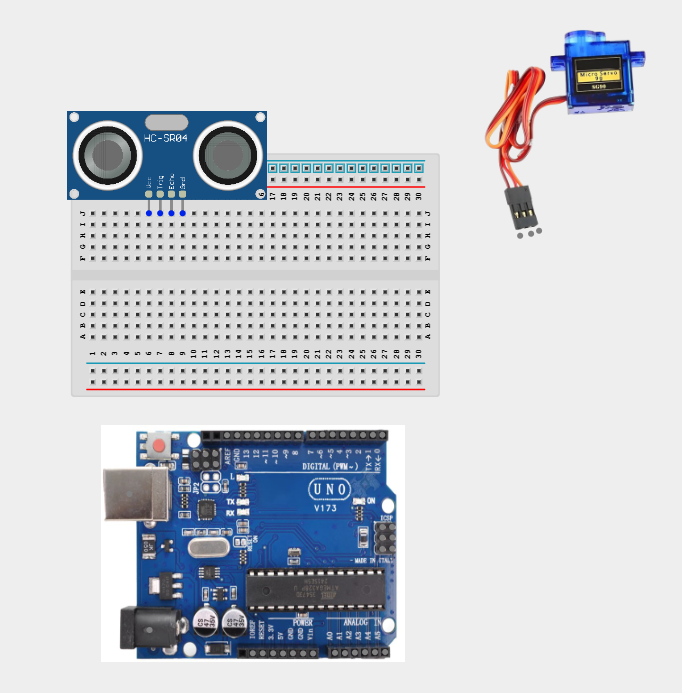
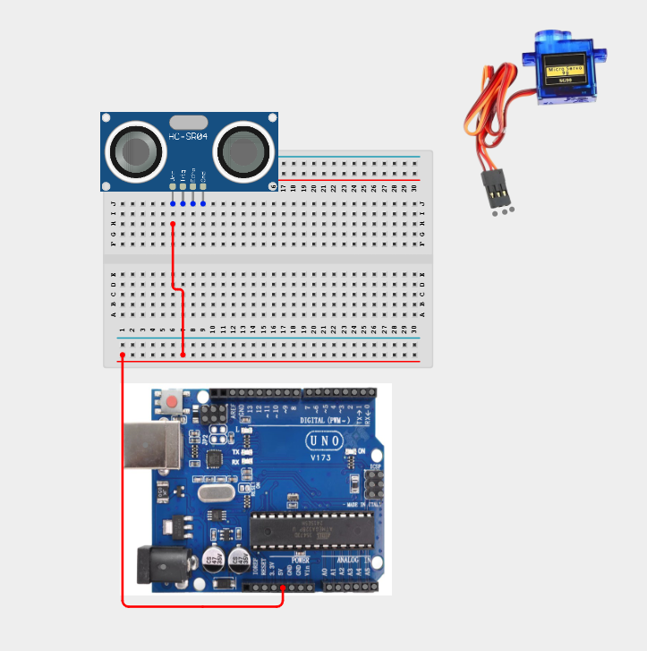
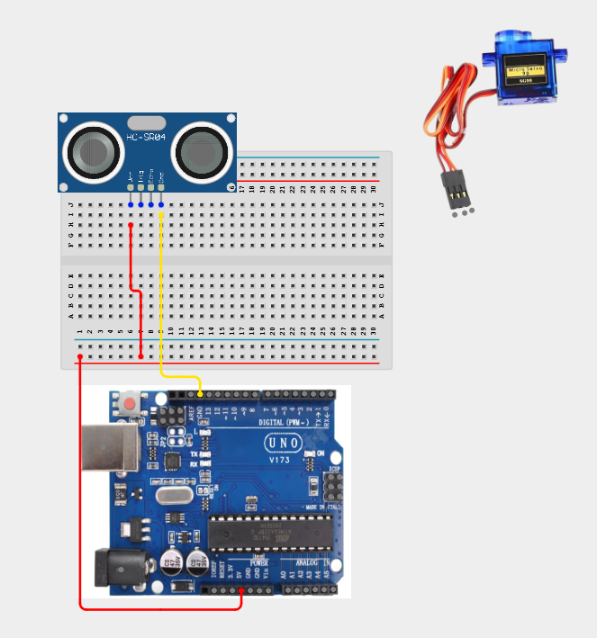
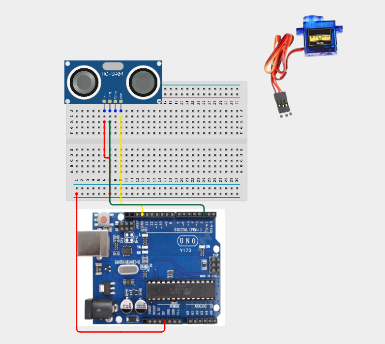
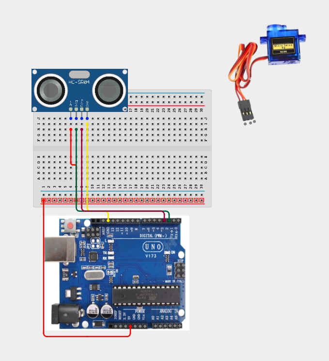
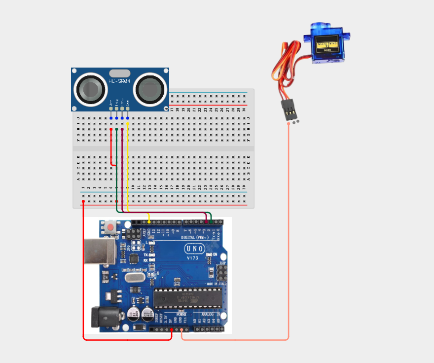
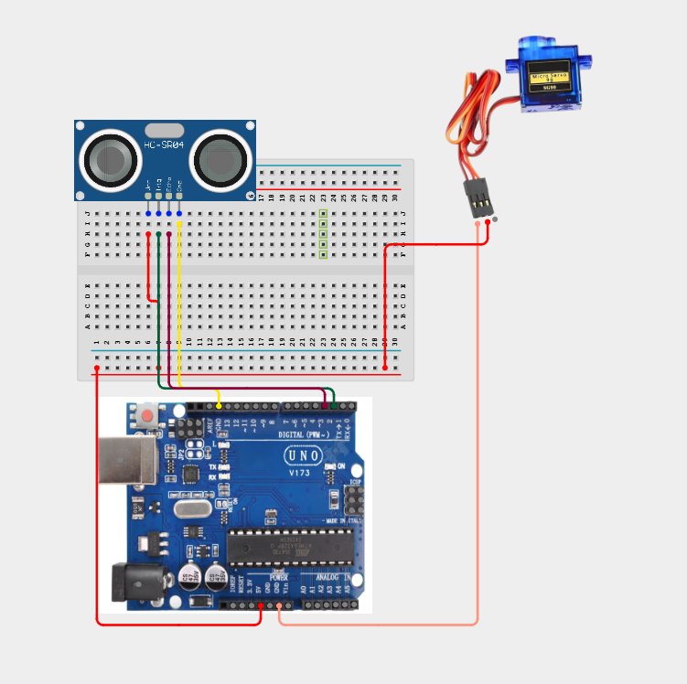
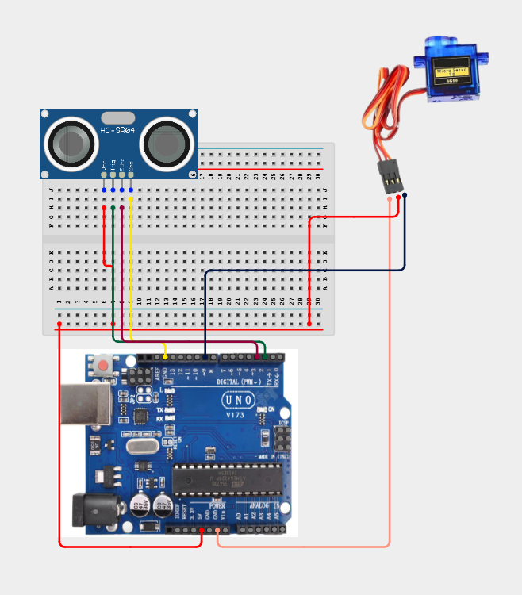

# Project 2.9.1: Servo Motor Control with Ultrasonic Sensor

| **Description** | This project demonstrates how to interface an Ultrasonic distance sensor with a Servo motor. The servo motor's shaft rotates to specific angles depending on the proximity of an object detected by the ultrasonic sensor. |
| --------------- | ---------------------------------------------------------------------------------------------------------------------------------------------------------------------------------------- |
| **Use case**    | This system forms the basis for obstacle-avoiding steering in robotics, automatic gate openers that swing open when a vehicle approaches, and visual gauge indicators.                  |

## Components (Things You will need)

|  |  |  |  |  |
| :--- | :--- | :--- | :--- | :--- |

### Things Needed:
*   Arduino Uno = 1
*   Arduino USB Cable = 1
*   Breadboard = 1
*   HC-SR04 Ultrasonic Sensor = 1
*   Servo Motor (e.g., SG90) = 1
*   Male-to-Male Jumper Wires = 8

## Building the Circuit

### Step 1: Mount the Components
**Step1:** Insert the **Ultrasonic Sensor** into the breadboard so that its four pins (VCC, Trig, Echo, GND) sit in separate columns. Connect the **Servo Motor** wiring harness. The SG04 servo motor has three colored wires:



## Wiring the Components

**Step 1:** Connect the VCC pin of the Ultrasonic Sensor to the 5V pin on the breadboard.


**Step 2:** Connect the GND pin of the Ultrasonic Sensor to the GND pin on the Arduino Uno.


**Step 3:** Connect the Trig pin of the Ultrasonic Sensor to digital pin 2 on the Arduino Uno.


**Step 4:** Connect the Echo pin of the Ultrasonic Sensor to digital pin 3 on the Arduino Uno.


**Step 5:** Connect the Brown (GND) wire of the Servo Motor to GND on the Arduino Uno.


**Step 6:** Connect the Red (VCC) wire of the Servo Motor to 5V on the breadboard.


**Step 7:** Connect the Orange (Signal) wire of the Servo Motor to digital pin 9 on the Arduino Uno.


Tip: Since both the Ultrasonic Sensor and the Servo Motor require power, you can use the breadboard power rails. Connect the Arduino's 5V and GND pins to the breadboard rails, then connect both devices to the rails.

## Programming

**Step 1:** Open your Arduino IDE. Make sure your Arduino Uno is connected.

**Step 2:** Write or copy the following code into the editor.

```cpp
#include <Servo.h> // Include the standard Servo library

// Define Ultrasonic Sensor Pin connections
const int trigPin = 2;
const int echoPin = 3;

// Define Servo Pin connection
const int servoPin = 9;

// Create a servo object to control the motor
Servo myServo;

// Variables to store pulse duration and distance
long duration;
int distance;
int servoAngle;

void setup() {
  // Initialize Serial Monitor for debugging
  Serial.begin(9600);

  // Set pin modes for the Ultrasonic Sensor
  pinMode(trigPin, OUTPUT);
  pinMode(echoPin, INPUT);

  // Attach the servo motor object to its control pin
  myServo.attach(servoPin);

  // Set the servo to its initial position (0 degrees)
  myServo.write(0);
}

void loop() {
  // Clear the trigger pin to ensure a clean pulse
  digitalWrite(trigPin, LOW);
  delayMicroseconds(2);

  // Send a 10-microsecond pulse to trigger distance measurement
  digitalWrite(trigPin, HIGH);
  delayMicroseconds(10);
  digitalWrite(trigPin, LOW);

  // Read the echo pin pulse duration (in microseconds)
  duration = pulseIn(echoPin, HIGH);

  // Calculate distance in centimeters
  // (Duration is divided by 2 to account for travel time to the object and back)
  distance = duration * 0.034 / 2;

  // Print the distance values to the Serial Monitor for observation
  Serial.print("Distance: ");
  Serial.print(distance);
  Serial.print(" cm -> ");

  // Limit distance readings to a stable sensing range (2cm to 30cm)
  if (distance > 30) {
    distance = 30;
  }
  if (distance < 2) {
    distance = 2;
  }

  // Map the distance (2cm to 30cm) to servo angle (0 to 180 degrees)
  // Closer distance = higher angle (e.g., warning state or physical block)
  // Farther distance = lower angle
  servoAngle = map(distance, 2, 30, 180, 0);

  // Command the servo to rotate to the mapped angle
  myServo.write(servoAngle);

  Serial.print("Servo Angle: ");
  Serial.println(servoAngle);

  // Small delay to allow the servo to reach the position and stabilize readings
  delay(100);
}
```

## Observation

Move your hand or another object in front of the Ultrasonic Sensor.

You should observe that:

As the object moves closer, the Servo Motor rotates towards 180°.
As the object moves farther away, the Servo Motor gradually returns towards 0°.
The Serial Monitor displays both the measured distance and the servo angle.

## Conclusion

You have successfully built a distance-controlled servo motor system using an Ultrasonic Sensor and an Arduino Uno.

In this project, you learned how to:

Measure distance using ultrasonic waves.
Read sensor data with an Arduino.
Control the position of a servo motor.
Convert sensor values into physical movement.

This project introduces one of the core principles of robotics and automation—using sensor input to control mechanical movement. These concepts are widely used in smart gates, robotic systems, automated machines, and many Internet of Things (IoT) applications.
