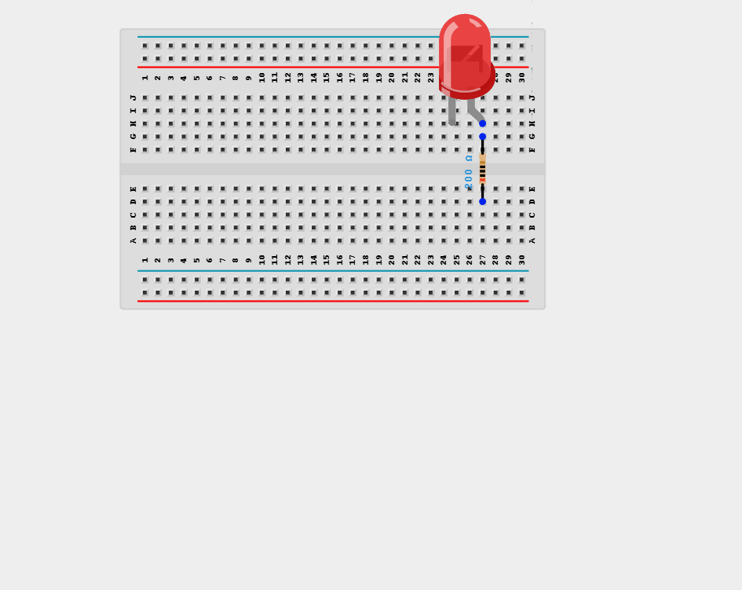
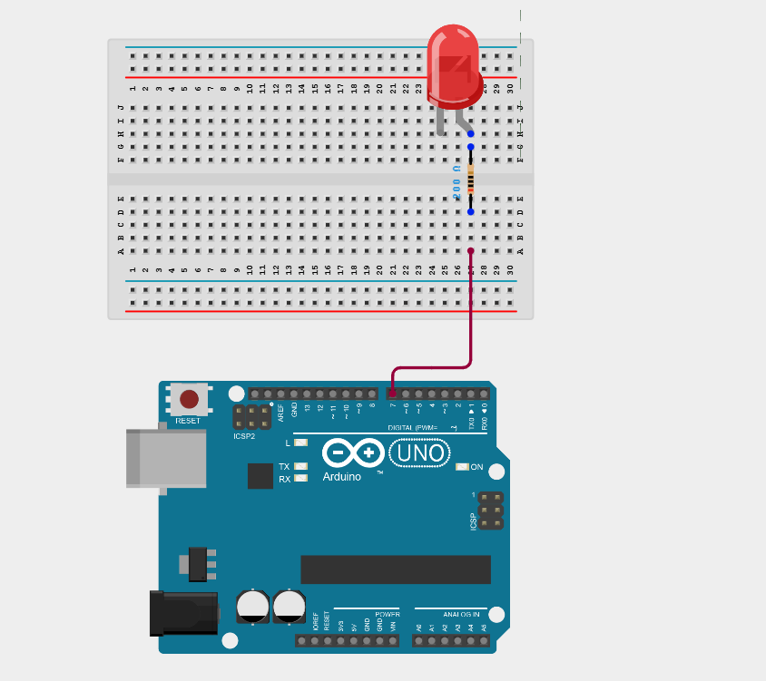
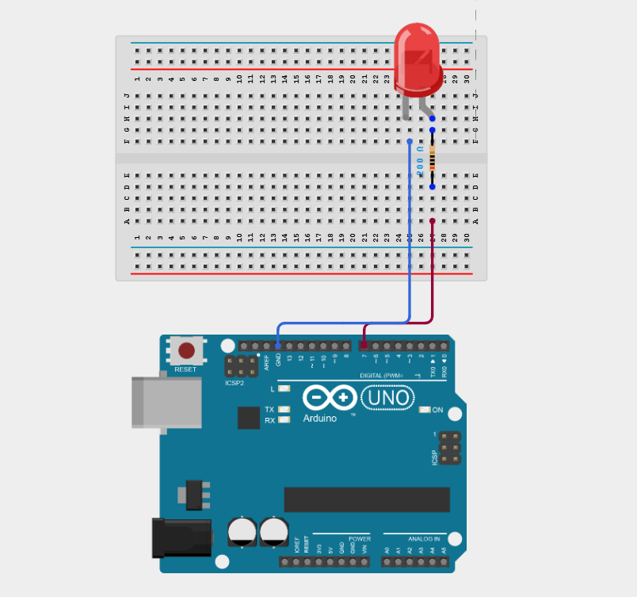
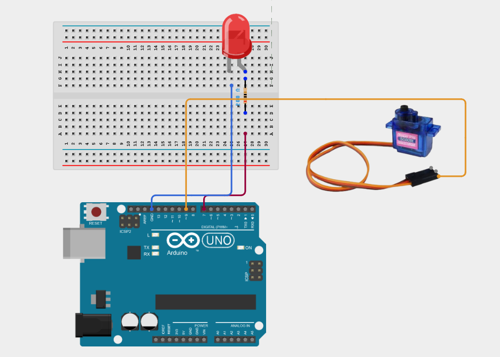
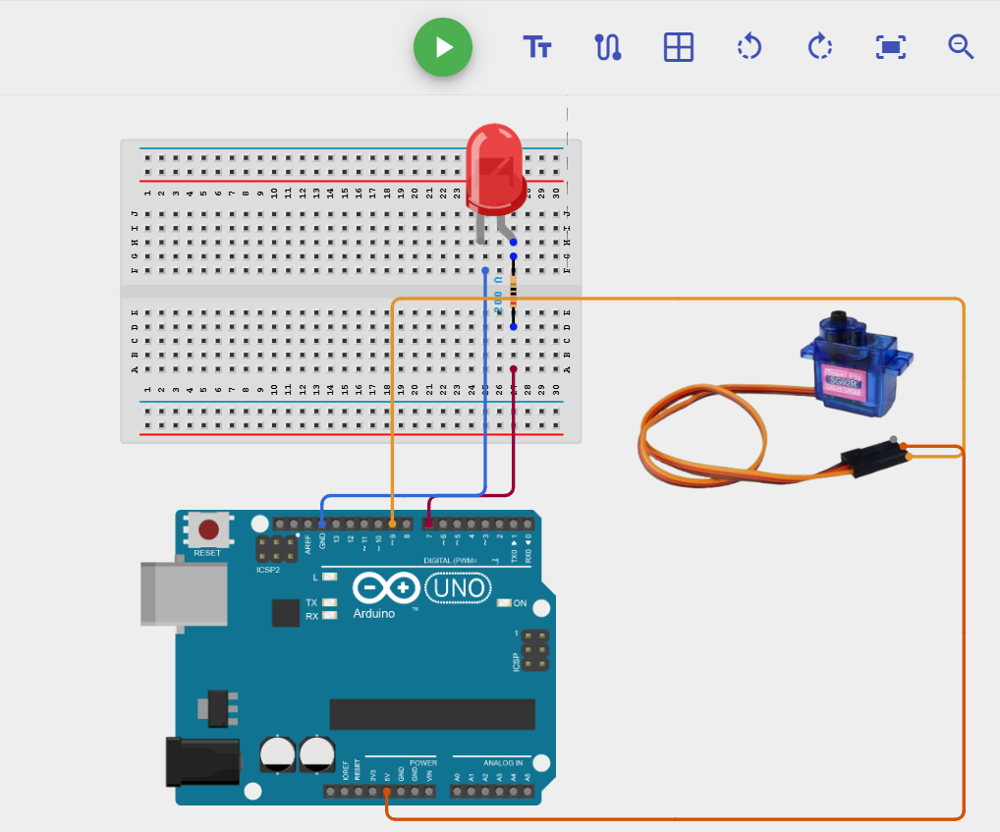
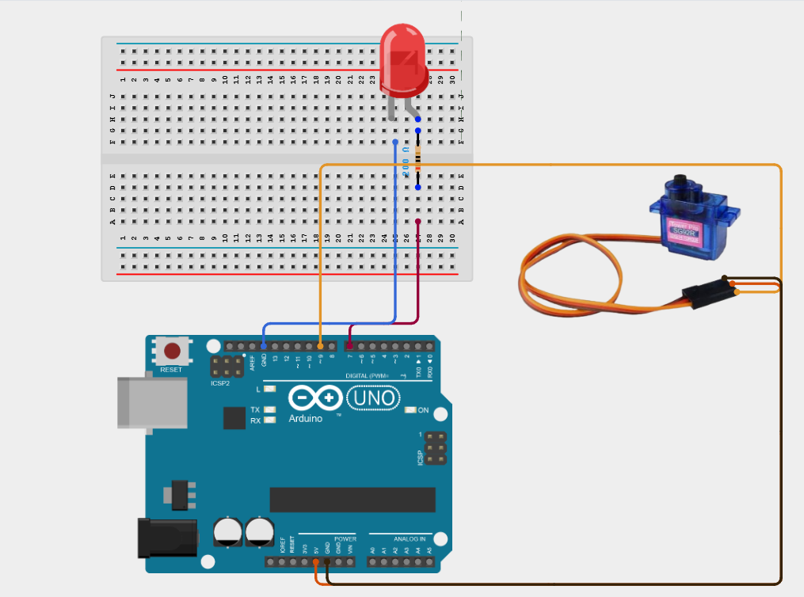
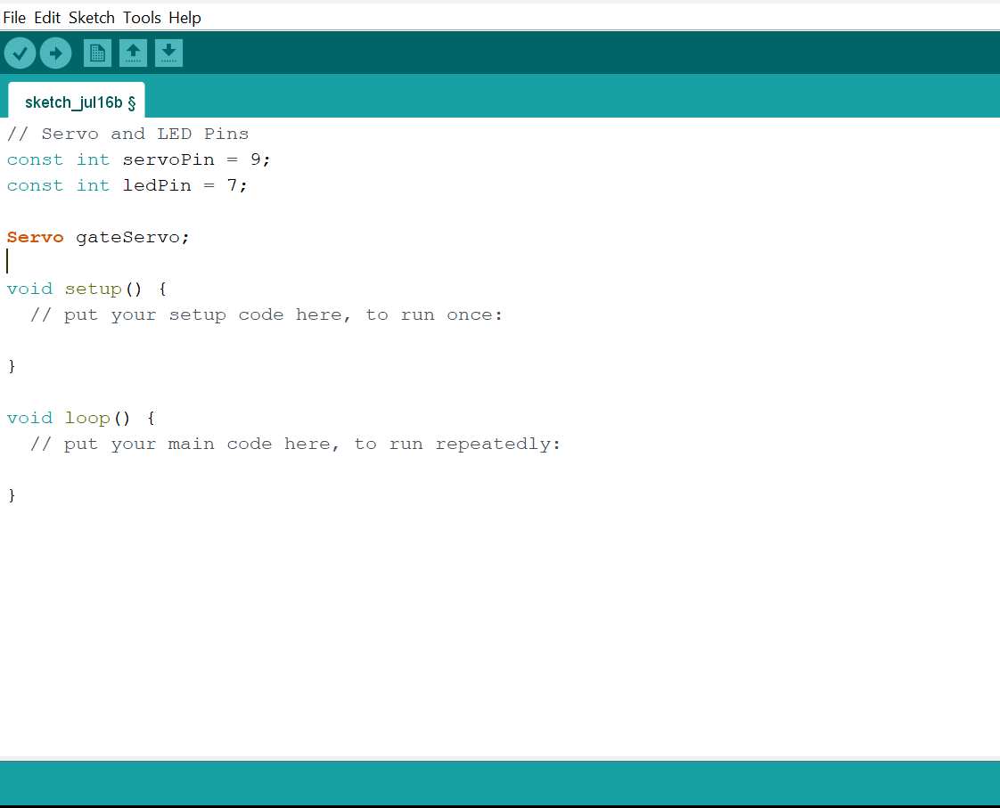
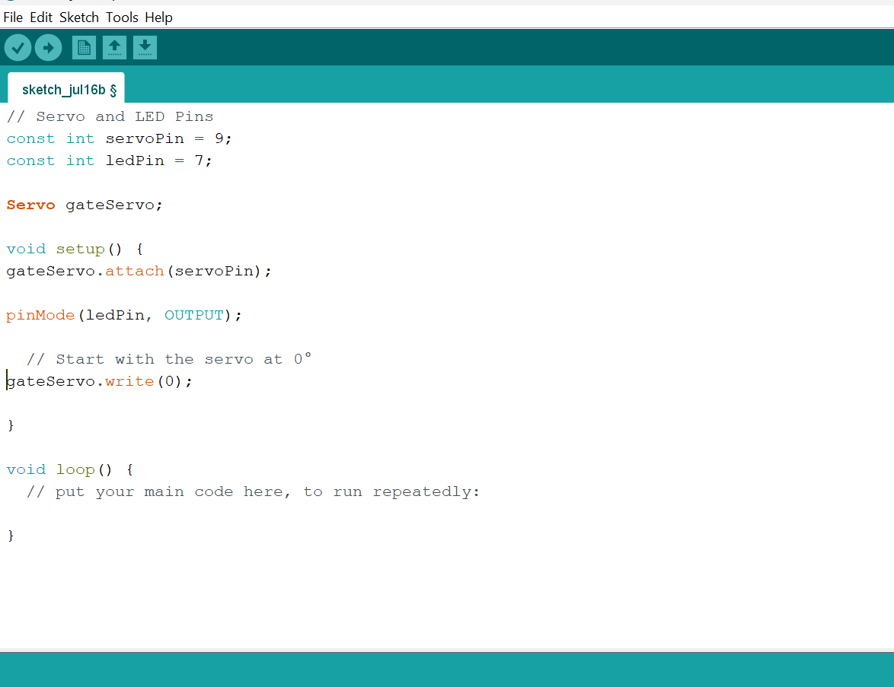
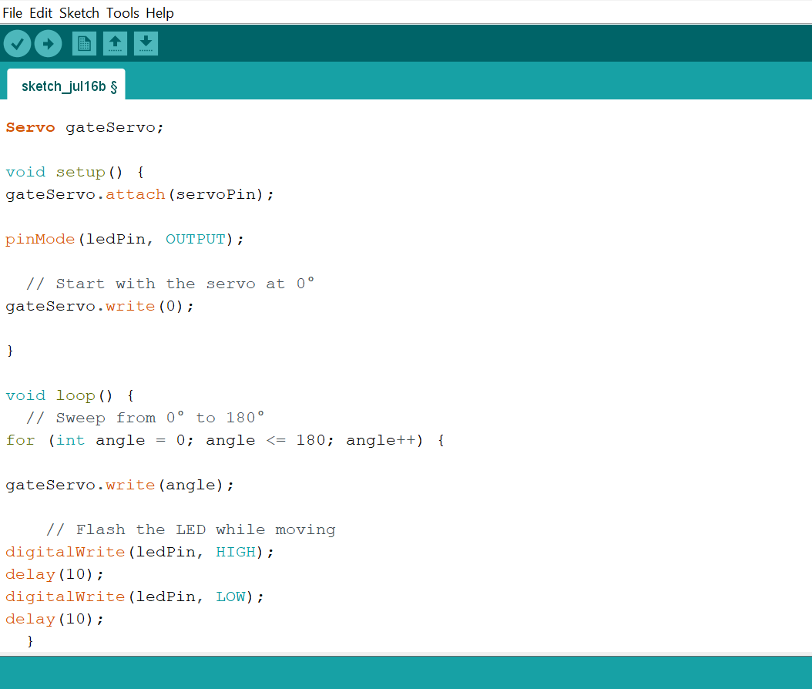
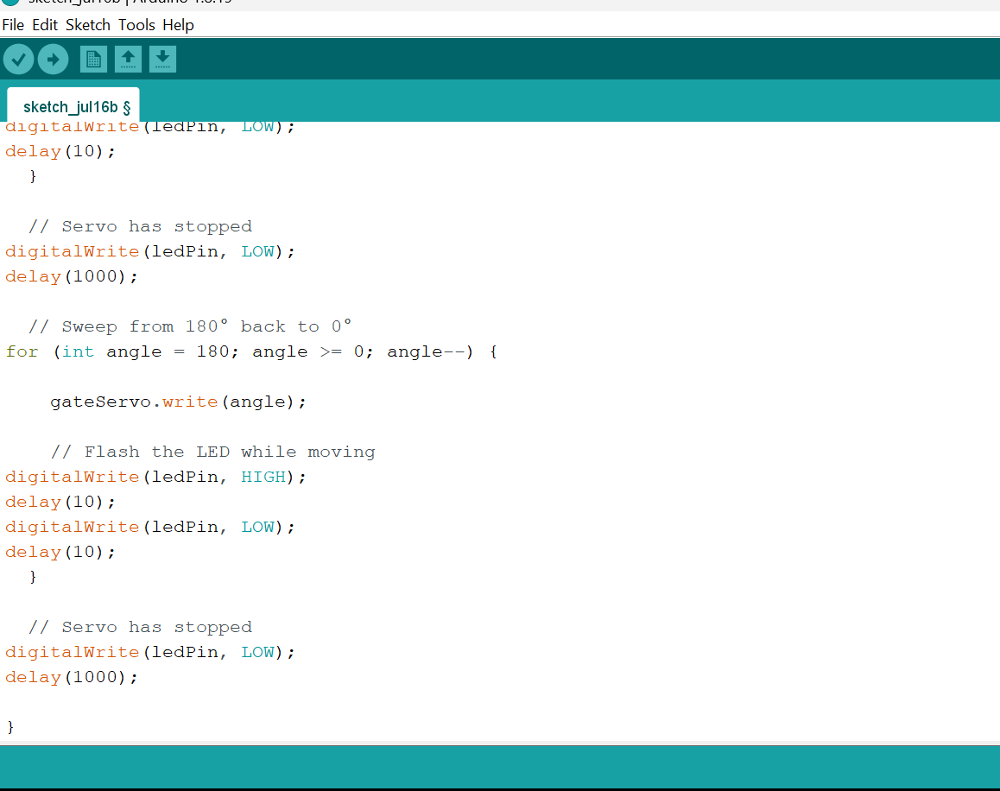

# Project 18: Moving Gate Warning Light

| **Description** | This project uses an LED that flashes only while the servo motor is actively sweeping, providing visual indication of gate movement. |
|------------------|----------------------------------------------------------------|
| **Use case**     | This project can be used in automation systems, interactive installations, and embedded control applications. |

## Components (Things You will need)

| | | | | | |
|-------------------------|-------------------------|-------------------------|-------------------------|-------------------------|-------------------------|

## Building the circuit

Things Needed:

- Arduino Uno = 1
- Arduino USB cable = 1
- LED = 1
- Servo motor = 1
- Breadboard = 1
- Jumper wires
- 220Ω resistor

## Mounting the component on the breadboard

**Step 1:** Place the LED and the Resistor on the breadboard.

_**NB:** Make sure all components are securely placed on the breadboard with correct orientation._

## WIRING THE CIRCUIT

**Step 2:** Connect the anode (long leg) of the LED to one end of a 220 Ω resistor. Connect the other end of the resistor to Digital Pin 7 on the Arduino using male-to-male jumper wire.

**Step 3:** Connect the cathode (short leg) of the LED to the GND pin on the Arduino using male-to-male jumper wire.

**Step 4:** Connect the Signal (Orange/Yellow) wire of the Servo Motor to Digital Pin 9 on the Arduino using male-to-male jumper wire.

**Step 5:** Connect the VCC (Red) wire of the Servo Motor to 5V on the Arduino using male-to-male jumper wire.

**Step 6:** Connect the GND (Brown/Black) wire of the Servo Motor to GND on the Arduino using male-to-male jumper wire.

_Make sure to connect the Arduino USB cable to the Arduino board._

## PROGRAMMING

**Step 1:** Open your Arduino IDE. See how to set up here: [Getting Started](../../Getting Started/Arduino_IDE_Setup.md).

**Step 2:** Type the following code in your Arduino IDE: `const int servoPin = 9;`, `const int ledPin = 7;`, `Servo gateServo;` as shown in the image below.

**Step 3:** Type the following code in your Arduino IDE inside the `setup()` function: `gateServo.attach(servoPin);`, `pinMode(ledPin, OUTPUT);`, `gateServo.write(0);` as shown in the image below.

**Step 4:** Type the following code in your Arduino IDE inside the `loop()` function: `for (int angle = 0; angle <= 180; angle++) {`, `gateServo.write(angle);`, `digitalWrite(ledPin, HIGH);`, `delay(10);`, `digitalWrite(ledPin, LOW);`, `delay(10); }` as shown in the image below.

**Step 5:** Type the following code in your Arduino IDE inside the `loop()` function: `digitalWrite(ledPin, LOW);`, `delay(1000);`, `for (int angle = 180; angle >= 0; angle--) {`, `gateServo.write(angle);`, `digitalWrite(ledPin, HIGH);`, `delay(10); }`, `digitalWrite(ledPin, LOW);`, `delay(10); }`, `digitalWrite(ledPin, LOW);`, `delay(1000);` as shown in the image below.

**Step 6:** Save your code. _See the [Getting Started](../../Getting Started/Arduino_IDE_Setup.md) section_

**Step 7:** Select the Arduino board and port. _See the [Getting Started](../../Getting Started/Arduino_IDE_Setup.md) section_

**Step 8:** Upload your code.

## CONCLUSION

This project helps learners understand how to combine multiple components with Arduino to create more complex interactive systems and automation solutions.

