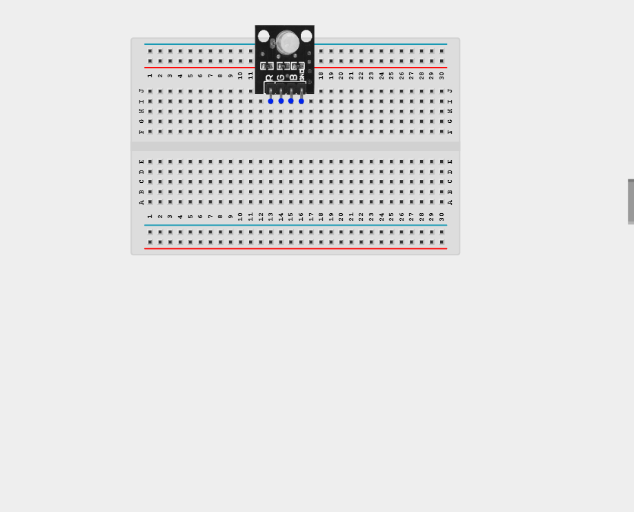
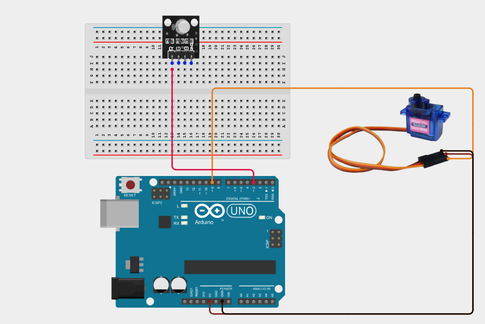
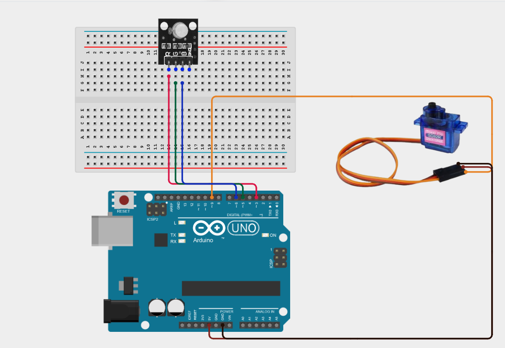
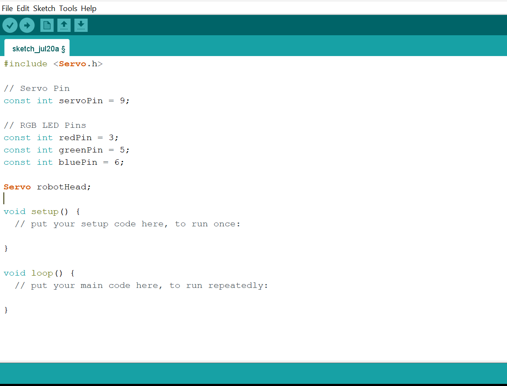
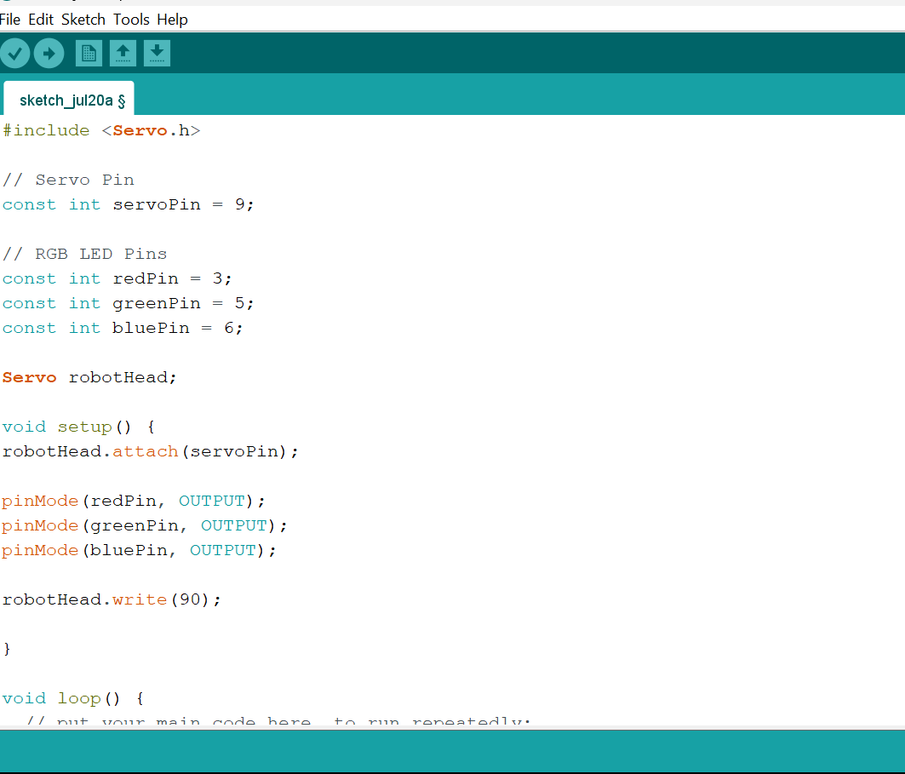
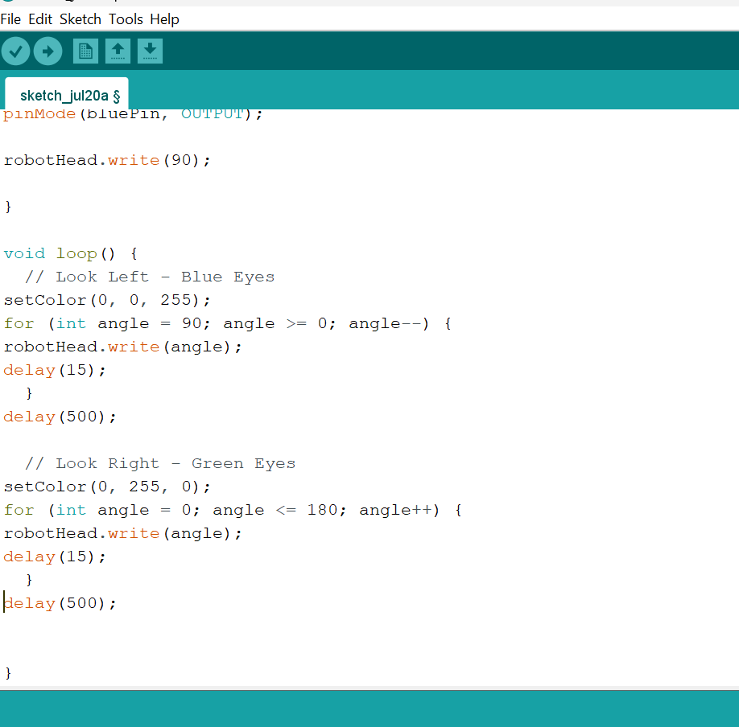
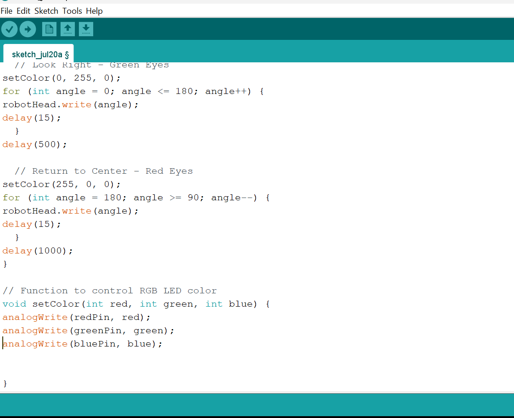

# Project 2.9.3: Mechanical Expression Display

| **Description** | This project makes a servo motor rotate a simulated robot head while the RGB LED changes eye colors for expressive effects. |
|------------------|----------------------------------------------------------------|
| **Use case**     | This project can be used in educational robotics, interactive exhibits, STEM demonstrations, and robotic companions to simulate expressive head movements and changing eye colors for enhanced human-robot interaction. |

## Components (Things You will need)

| | | | | | |
|-------------------------|-------------------------|-------------------------|-------------------------|-------------------------|-------------------------|

## Building the circuit

Things Needed:

- Arduino Uno = 1
- Arduino USB cable = 1
- RGB LED module = 1
- Servo motor = 1
- Breadboard = 1
- Jumper wires

## Mounting the component on the breadboard

**Step 1:** Place the RGB LED Module on the breadboard.

_**NB:** Make sure all components are securely placed on the breadboard with correct orientation._

## WIRING THE CIRCUIT

**Step 2:** Connect the Signal (Orange/Yellow) of the Servo Motor wire to Digital Pin 9 on the Arduino Uno using male-to-male jumper wire.

**Step 3:** Connect the VCC (Red) of the Servo Motor wire to 5V on the Arduino Uno using male-to-male jumper wire.

**Step 4:** Connect the GND (Brown/Black) of the Servo Motor wire to GND on the Arduino Uno using male-to-male jumper wire.

**Step 5:** Connect the Red (R) pin of the RGB LED to Digital Pin 3 on the Arduino Uno using male-to-male jumper wire.

**Step 6:** Connect the Green (G) pin of the RGB LED to Digital Pin 5 on the Arduino Uno using male-to-male jumper wire.

**Step 7:** Connect the Blue (B) pin of the RGB LED to Digital Pin 6 on the Arduino Uno using male-to-male jumper wire.

**Step 8:** Connect the GND pin of the RGB LED to GND on the Arduino Uno using male-to-male jumper wire.

_Make sure to connect the Arduino USB cable to the Arduino board._

## PROGRAMMING

**Step 1:** Open your Arduino IDE. See how to set up here: [Getting Started](../../Getting Started/Arduino_IDE_Setup.md).

**Step 2:** Type the following code in your Arduino IDE: `#include <Servo.h>`, `const int servoPin = 9;`, `const int redPin = 3;`, `const int greenPin = 5;`, `const int bluePin = 6;`,`Servo robotHead;`  as shown in the image below.

**Step 3:** Type the following code in your Arduino IDE inside the void setup() function: `robotHead.attach(servoPin);`, `pinMode(redPin, OUTPUT);`, `pinMode(greenPin, OUTPUT);`, `pinMode(bluePin, OUTPUT);`, `robotHead.write(90);`  as shown in the image below.

**Step 4:** Type the following code in your Arduino IDE inside the void loop() function: `setColor(0, 0, 255);`, `for (int angle = 90; angle >= 0; angle--) {`, `robotHead.write(angle);`, `delay(15); }`, `delay(500);`, `setColor(0, 255, 0);`, `for (int angle = 0; angle <= 180; angle++) {;`, `delay(500);`, `robotHead.write(angle);`, `delay(15); }`, `delay(500);`  as shown in the image below.

**Step 5:** Type the following code in your Arduino IDE inside the void loop() function: `setColor(255, 0, 0);`, `for (int angle = 180; angle >= 90; angle--) {`, `robotHead.write(angle);`, `delay(15); }`, `delay(1000);`, `void setColor(int red, int green, int blue) {`, `analogWrite(redPin, red);`, `analogWrite(greenPin, green);`, `analogWrite(bluePin, blue); }` as shown in the image below.

 
**Step 6:** Save your code. _See the [Getting Started](../../Getting Started/Arduino_IDE_Setup.md) section_

**Step 7:** Select the Arduino board and port. _See the [Getting Started](../../Getting Started/Arduino_IDE_Setup.md) section_

**Step 8:** Upload your code.

## CONCLUSION

This project helps learners understand how to combine multiple components with Arduino to create more complex interactive systems and automation solutions.

