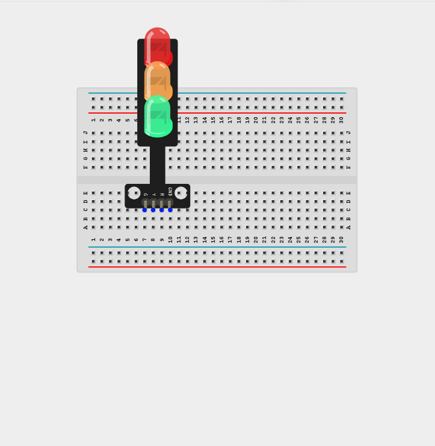
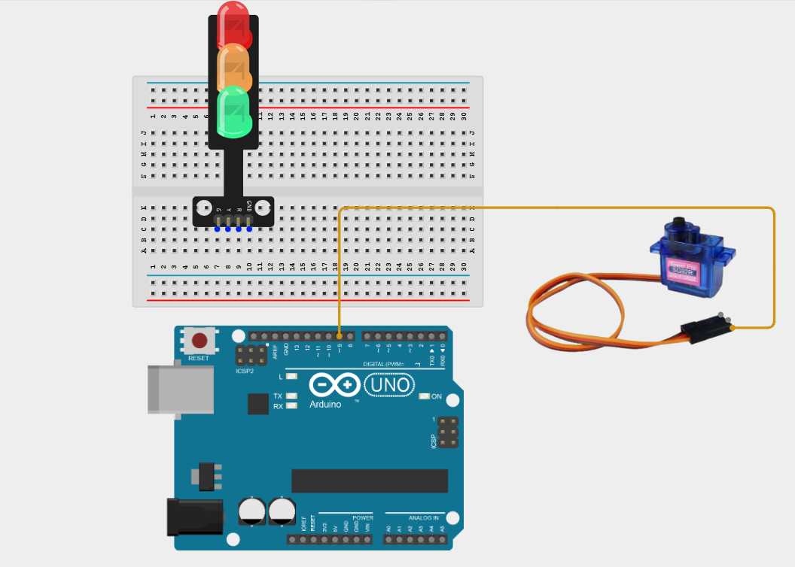
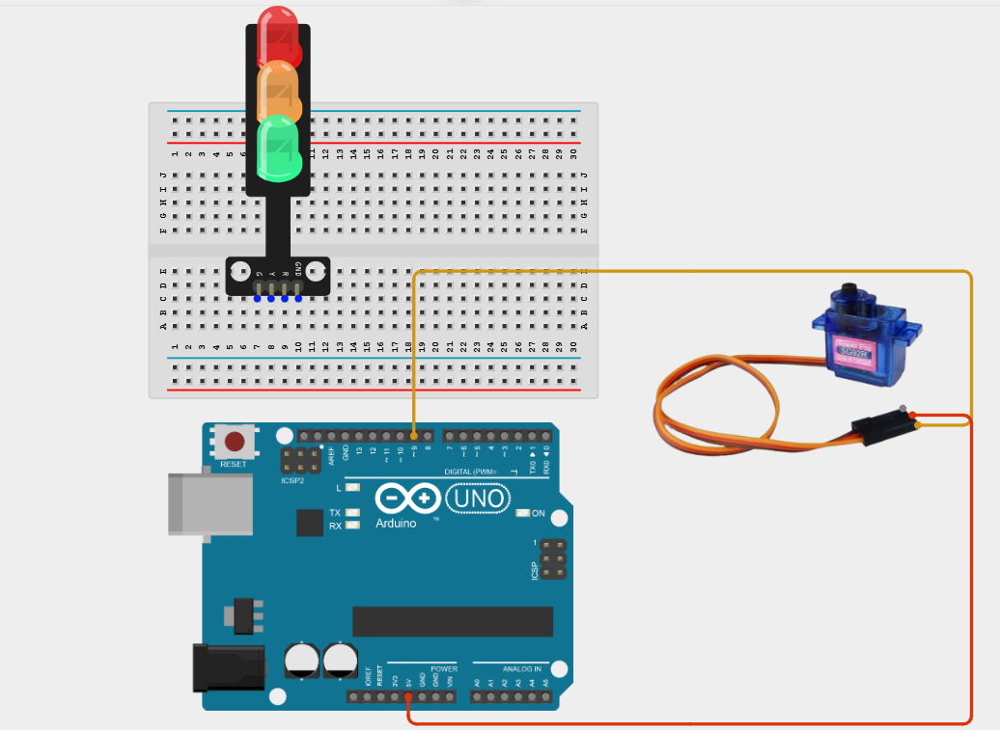
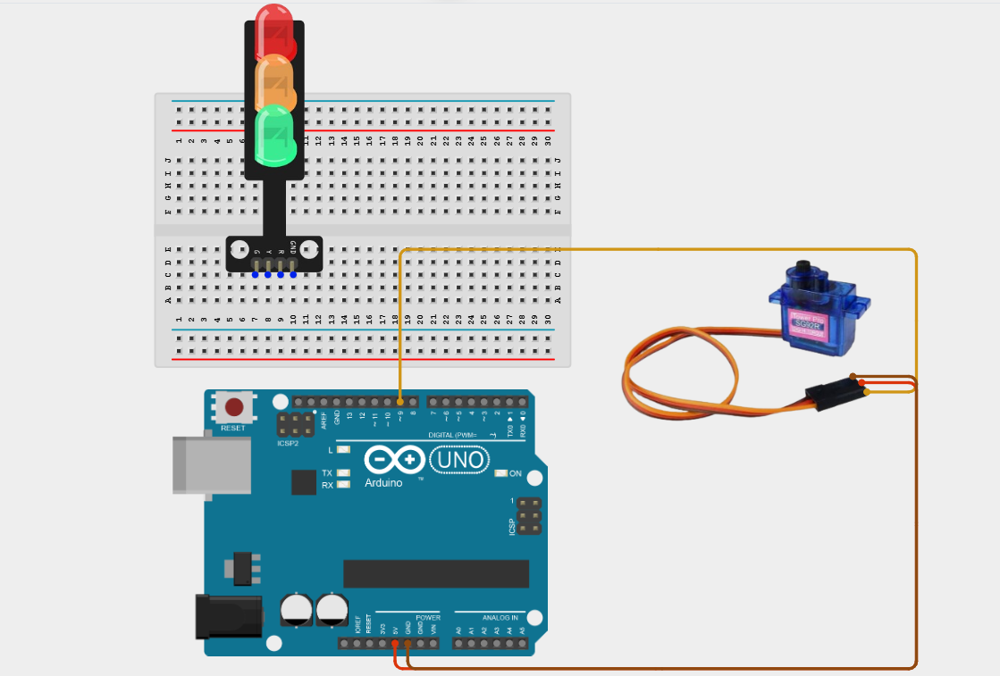
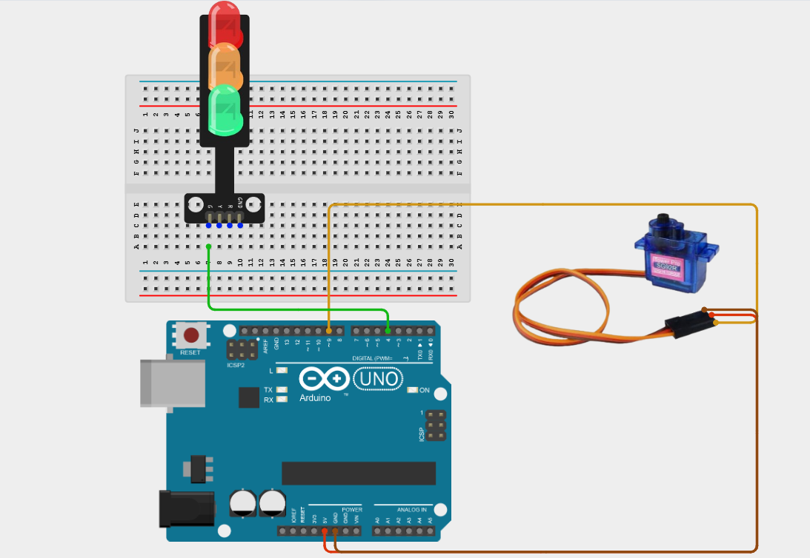
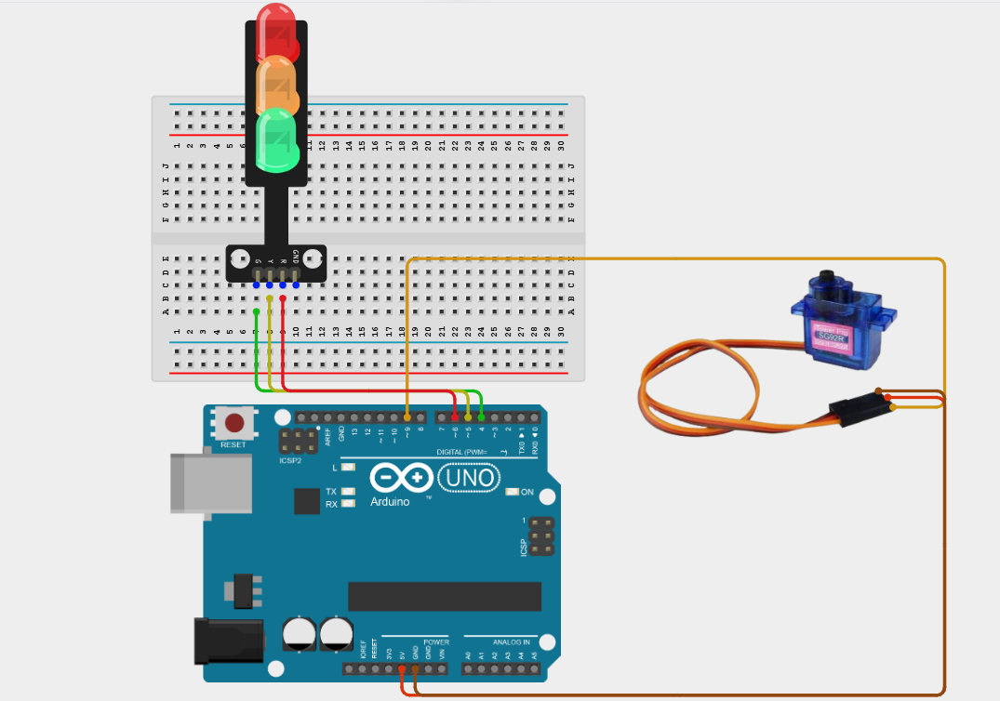
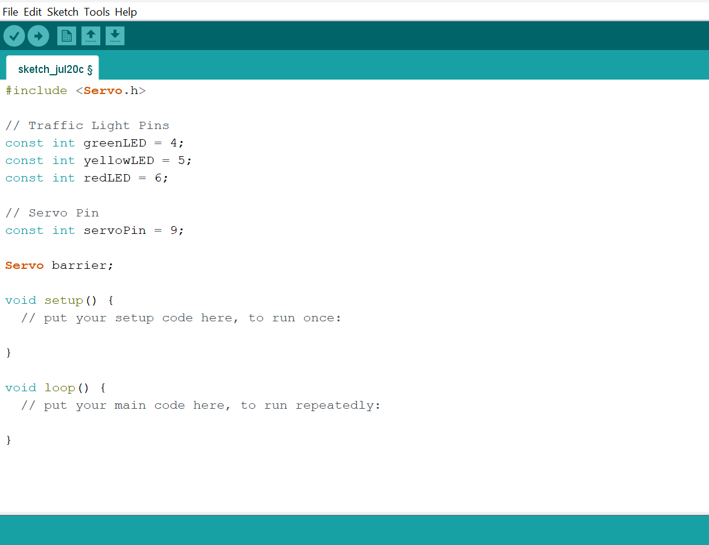
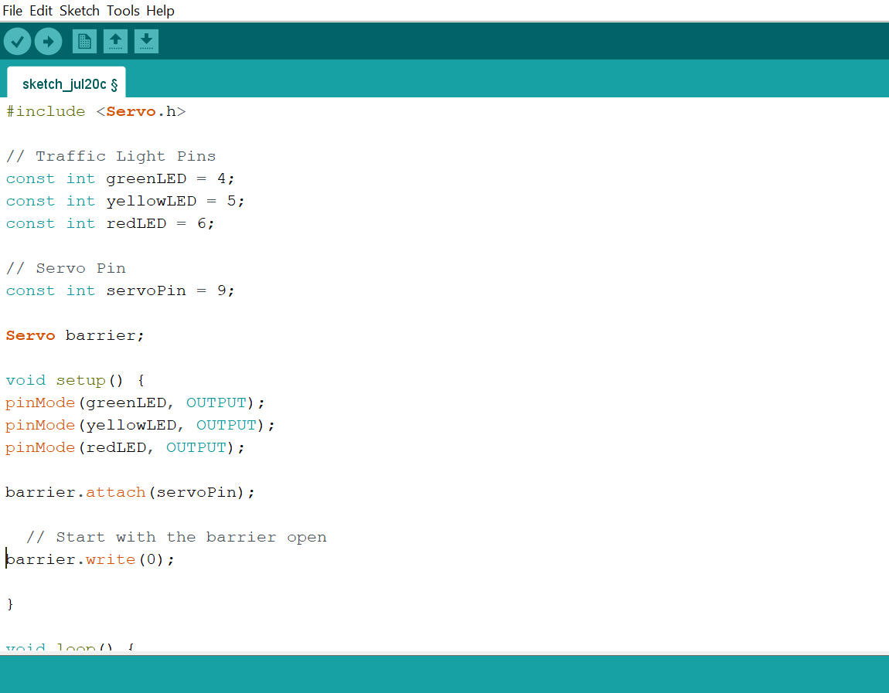
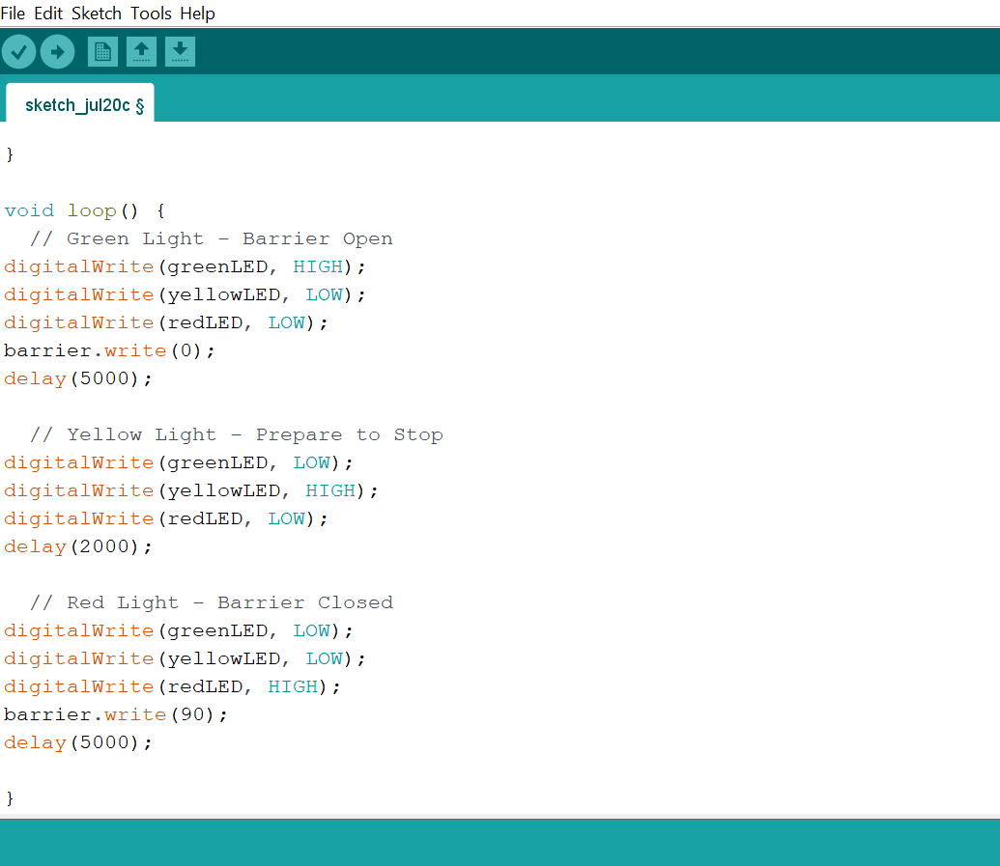

# Project 2.9.4: Traffic Barrier Gate

| **Description** | This project controls a servo barrier that opens when the Traffic Light shows Green and closes when it shows Red, simulating a railway crossing. |
|------------------|----------------------------------------------------------------|
| **Use case**     | This project can be used in railway crossing simulations, automated gate systems, parking access control, and traffic management systems, where a barrier is synchronized with traffic signals to control safe vehicle or pedestrian movement. |

## Components (Things You will need)

| | | | | | |
|-------------------------|-------------------------|-------------------------|-------------------------|-------------------------|-------------------------|

## Building the circuit

Things Needed:

- Arduino Uno = 1
- Arduino USB cable = 1
- Traffic light module = 1
- Servo motor = 1
- Breadboard = 1
- Jumper wires 

## Mounting the component on the breadboard

**Step 1:** Place the Traffic Light Module on the breadboard following the circuit diagram.

_**NB:** Make sure all components are securely placed on the breadboard with correct orientation._

## WIRING THE CIRCUIT

**Step 2:** Connect the Signal (Orange/Yellow) wire of the Servo Motor to Digital Pin 9 on the Arduino Uno using male-to-male jumper wire.

**Step 3:** Connect the VCC (Red) wire of the Servo Motor to 5V on the Arduino Uno using male-to-male jumper wire.

**Step 4:** Connect the GND (Brown/Black) wire of the Servo Motor to the GND pin on the Arduino Uno using male-to-male jumper wire.

**Step 5:** Connect the Green LED pin of the Traffic Light Module to Digital Pin 4 on the Arduino Uno using male-to-male jumper wire.

**Step 6:** Connect the Yellow LED pin of the Traffic Light Module to Digital Pin 5 on the Arduino Uno using male-to-male jumper wire.

**Step 7:** Connect the Red LED pin of the Traffic Light Module to Digital Pin 6 on the Arduino Uno using male-to-male jumper wire.

**Step 8:** Connect the GND pin of the Traffic Light Module to GND on the Arduino Uno using male-to-male jumper wire.

_Make sure to connect the Arduino USB cable to the Arduino board._

## PROGRAMMING

**Step 1:** Open your Arduino IDE. See how to set up here: [Getting Started](../../Getting Started/Arduino_IDE_Setup.md).

**Step 2:** Type the following code in your Arduino IDE: `#include <Servo.h>`, `const int greenLED = 4;`, `const int yellowLED = 5;`, `const int redLED = 6;`, `const int servoPin = 9;`, `Servo barrier;`  as shown in the image below.

**Step 3:** Type the following code in your Arduino IDE inside the void setup() function: `pinMode(greenLED, OUTPUT);`, `pinMode(yellowLED, OUTPUT);`, `pinMode(redLED, OUTPUT);`, `barrier.attach(servoPin);`, `barrier.write(0);`  as shown in the image below. 

**Step 4:** Type the following code in your Arduino IDE inside the void loop() function: `digitalWrite(greenLED, HIGH);`, `digitalWrite(yellowLED, LOW);`, `digitalWrite(redLED, LOW);`, `barrier.write(0);`, `delay(5000);`, `digitalWrite(greenLED, LOW);`, `digitalWrite(yellowLED, HIGH);`, `digitalWrite(redLED, LOW);`, `delay(2000);`, `digitalWrite(greenLED, LOW);`, `digitalWrite(yellowLED, LOW);`, `digitalWrite(redLED, HIGH);`,`barrier.write(90);`, `delay(5000);` as shown in the image below. 

**Step 4:** Save your code. _See the [Getting Started](../../Getting Started/Arduino_IDE_Setup.md) section_

**Step 5:** Select the Arduino board and port. _See the [Getting Started](../../Getting Started/Arduino_IDE_Setup.md) section_

**Step 6:** Upload your code.

## CONCLUSION

This project helps learners understand how to combine multiple components with Arduino to create more complex interactive systems and automation solutions.

