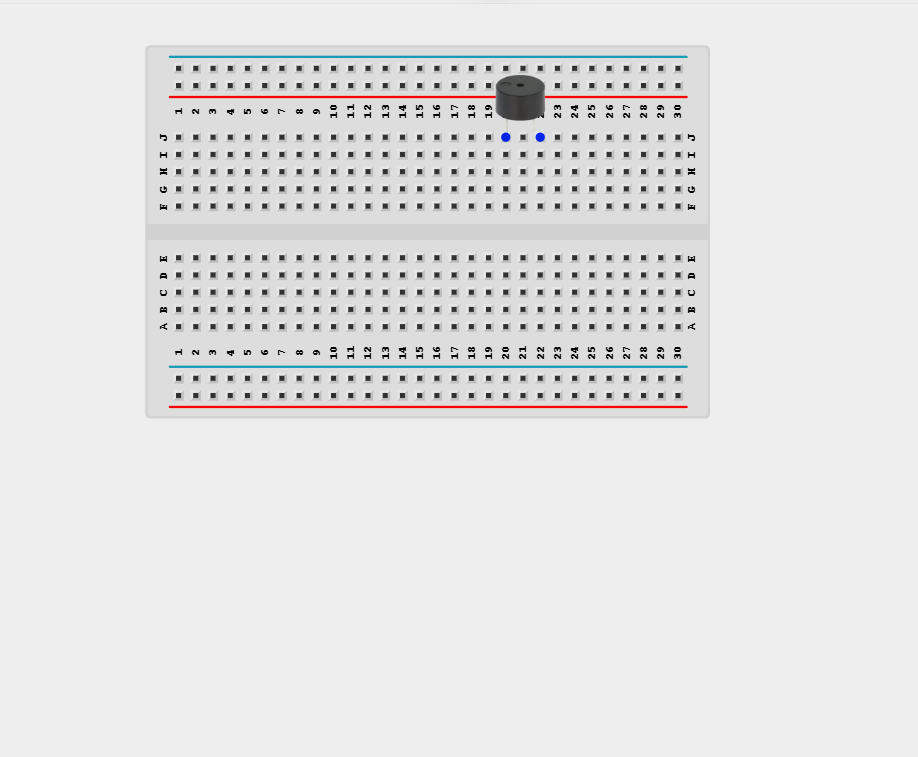
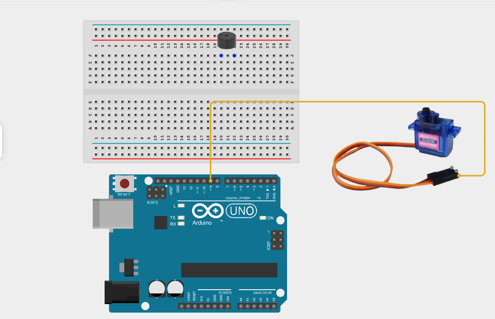
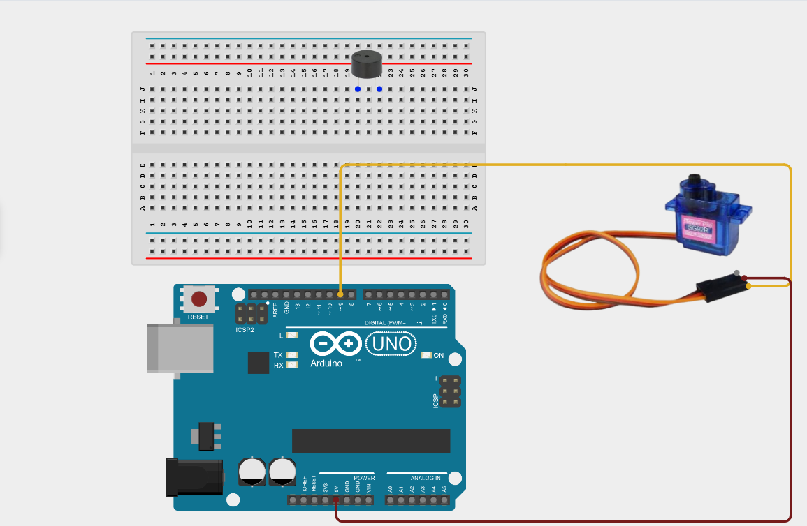
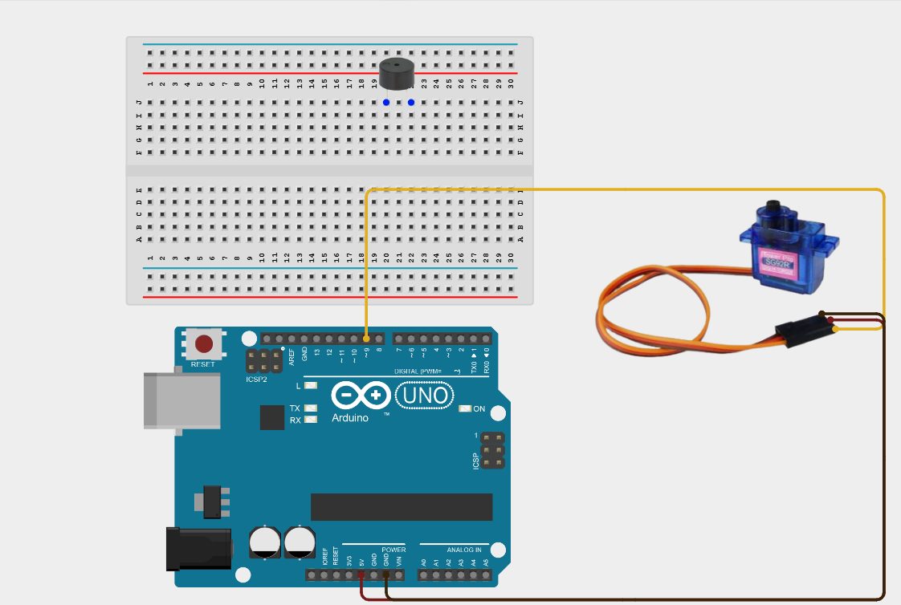
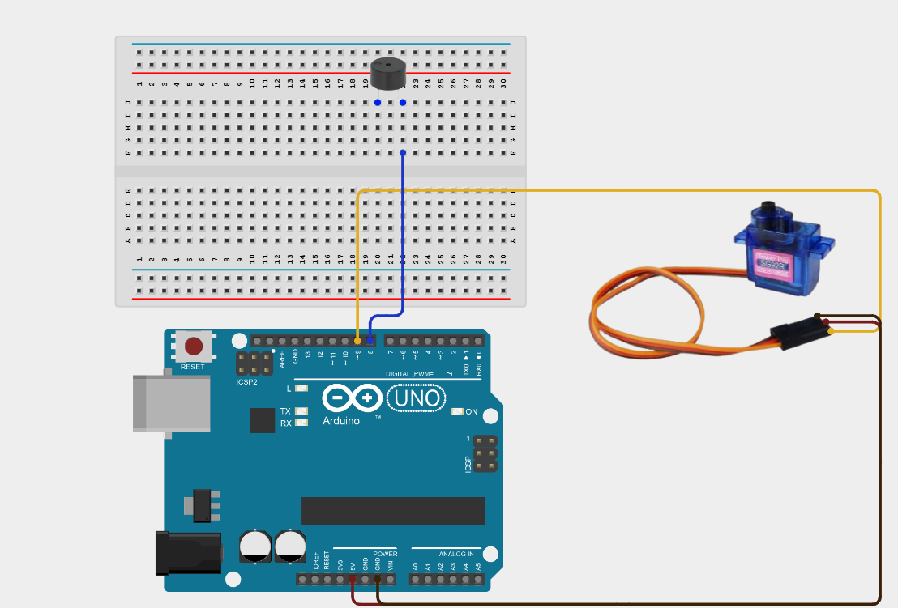
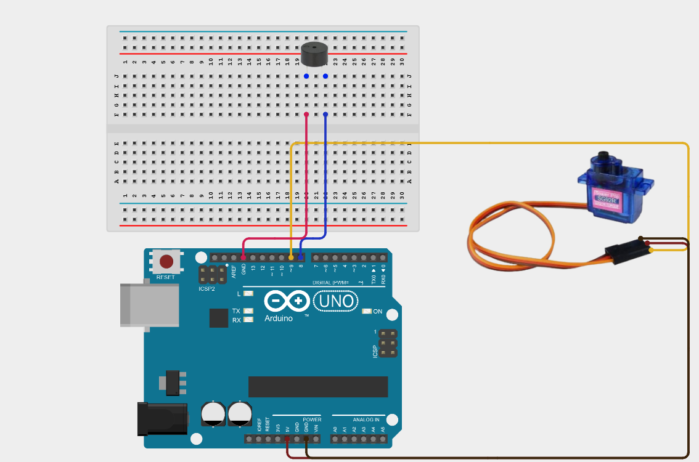
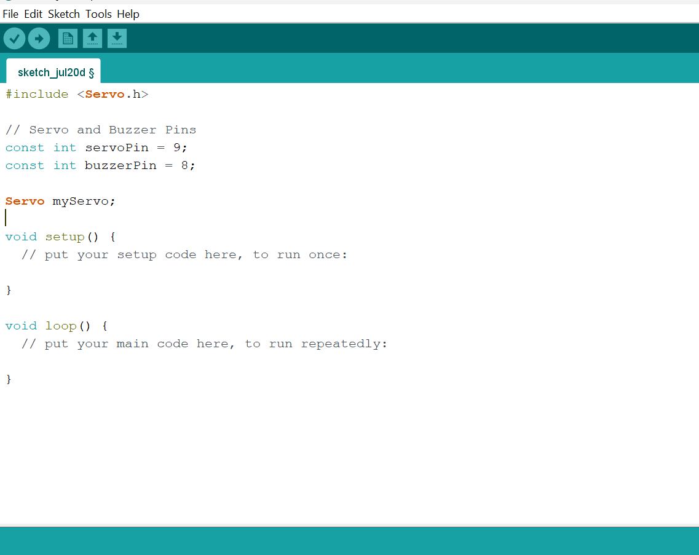
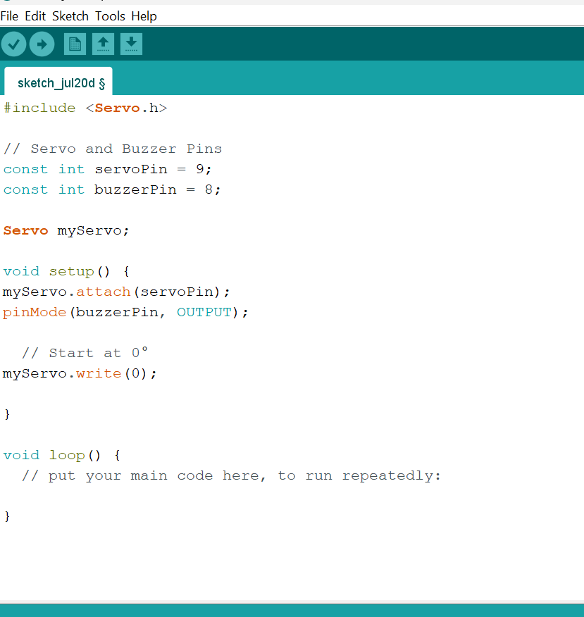
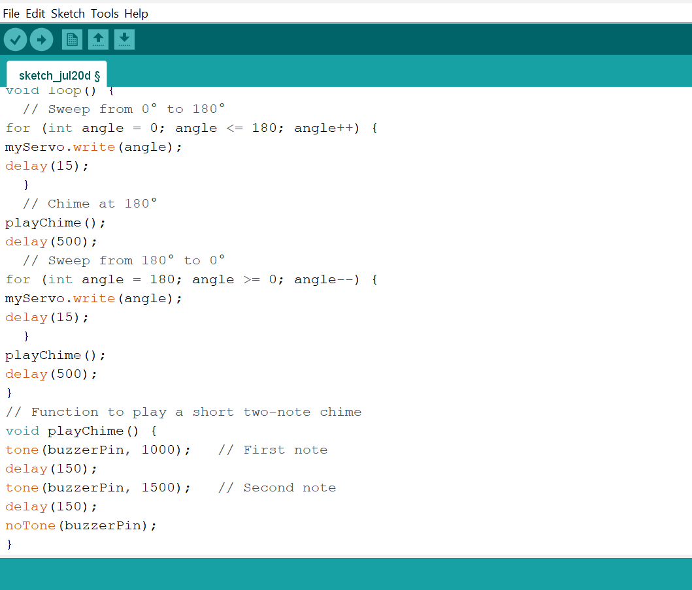

# Project 2.9.5: Chiming Sweep Display

| **Description** | This project makes a servo sweep back and forth while the buzzer emits a chime sound at each limit position. |
|------------------|----------------------------------------------------------------|
| **Use case**     | This project can be used in automated gates, robotic arms, interactive exhibits, and industrial machinery to provide audible feedback whenever a moving mechanism reaches its end positions.|

## Components (Things You will need)

| | | | | | |
|-------------------------|-------------------------|-------------------------|-------------------------|-------------------------|-------------------------|

## Building the circuit

Things Needed:

- Arduino Uno = 1
- Arduino USB cable = 1
- Buzzer = 1
- Servo motor = 1
- Breadboard = 1
- Jumper wires 

## Mounting the component on the breadboard

**Step 1:** Place the Buzzer on the breadboard following the circuit diagram.

_**NB:** Make sure all components are securely placed on the breadboard with correct orientation._

## WIRING THE CIRCUIT

**Step 2:** Connect the Signal (Orange/Yellow) wire of the Servo Motor to Digital Pin 9 on the Arduino Uno using male-to-male jumper wire.

**Step 3:** Connect the VCC (Red) wire of the Servo Motor to 5V on the Arduino Uno using male-to-male jumper wire.

**Step 4:** Connect the GND (Brown/Black) wire of the Servo Motor to the GND pin on the Arduino Uno using male-to-male jumper wire.

**Step 5:** Connect the positive (+) pin of the Buzzer to Digital Pin 8 on the Arduino Uno using male-to-male jumper wire.

**Step 6:** Connect the negative (–) pin of the Buzzer to the GND pin on the Arduino Uno using male-to-male jumper wire.

_Make sure to connect the Arduino USB cable to the Arduino board._

## PROGRAMMING

**Step 1:** Open your Arduino IDE. See how to set up here: [Getting Started](../../Getting Started/Arduino_IDE_Setup.md).

**Step 2:** Type the following code in your Arduino IDE: `#include <Servo.h>`, `const int servoPin = 9;`, `const int buzzerPin = 8;`, `Servo myServo;`  as shown in the image below.

**Step 3:** Type the following code in your Arduino IDE inside the void setup() function: `myServo.attach(servoPin);`, `pinMode(buzzerPin, OUTPUT);`, `myServo.write(0);`  as shown in the image below.

**Step 4:** Type the following code in your Arduino IDE inside the void loop() function: ` for (int angle = 0; angle <= 180; angle++) {`, `myServo.write(angle);`, `delay(15);}`, `playChime();`, `delay(500);}`, `for (int angle = 180; angle >= 0; angle--) {`,`myServo.write(angle);`, `delay(15);}`, `playChime();`, `delay(500);}`, `void playChime() {`, `tone(buzzerPin, 1000);`, `delay(150);`, `tone(buzzerPin, 1500);`, `delay(150);`, `tnoTone(buzzerPin); }`  as shown in the image below.

**Step 5:** Save your code. _See the [Getting Started](../../Getting Started/Arduino_IDE_Setup.md) section_

**Step 6:** Select the Arduino board and port. _See the [Getting Started](../../Getting Started/Arduino_IDE_Setup.md) section_

**Step 7:** Upload your code.

## CONCLUSION

This project helps learners understand how to combine multiple components with Arduino to create more complex interactive systems and automation solutions.

