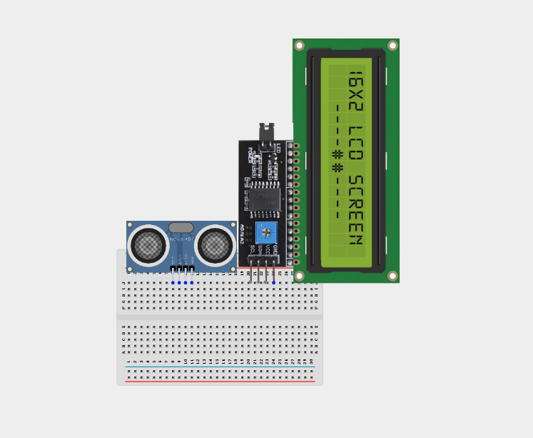
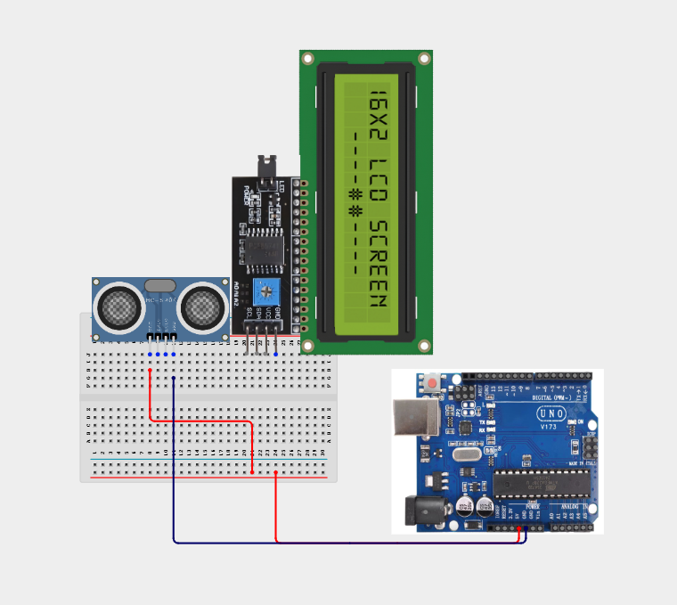
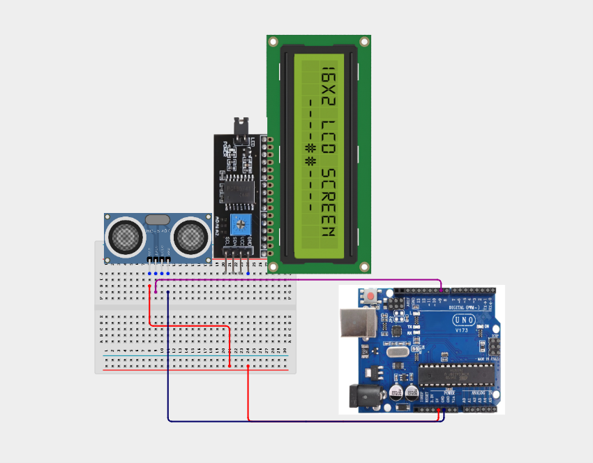
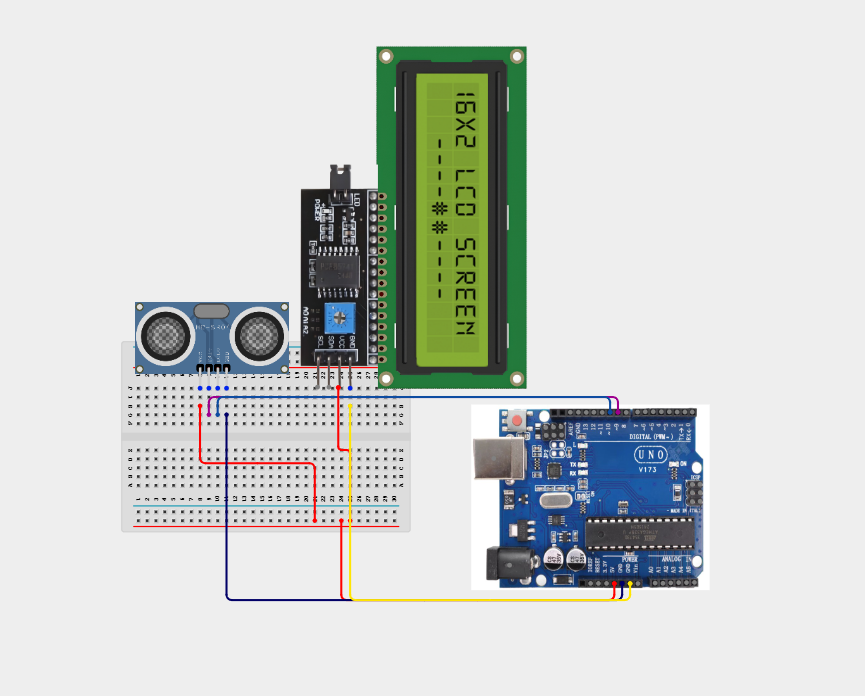

# Project 1.10: SonicRange Number Reporter

| **Description** Learners build a distance-reporting system using an ultrasonic sensor and LCD. The project introduces distance measurement using sound waves.
In this manual, learners will follow a practical build process, connect the circuit safely, upload the Arduino program, and observe how the prototype behaves when the input condition changes.|
|------------------|----------------------------------------------------------------|
| **Use case**     | This project is connected to real-world uses such as: Measuring object distance in centimetres.; Demonstrating parking-sensor ideas without using the same project.; Introducing non-contact measurement. |

## Components (Things You will need)

|  |  |  |  | | |
| --------------------------------------------------- | ------------------------------------------------------ | ----------------------------------------------------------- | --------------------------------------------------------- | ------------------------------------------------------ | ------------------------------------------------------ | 

## Building the circuit

Things Needed:

- Arduino Uno = 1
- Arduino USB cable = 1
- Servo motor = 1
- Jumper Wires
- Ultrasonic Sensor
- LCD Screen


## Mounting the component on the breadboard and wiring the circuit

**Step 1:**	Place the Ultrasonic Sensor and LCD screen on the Breadboard as shown below;



**Step 2:**	Using a jumper wire connect one point to 5V on the Arduino Uno and the other part to the positive section on the breadboard. Connect Ultrasonic Sensor VCC to 5V on the Breadboard. 


**Step 3:**	Connect Ultrasonic Sensor GND to GND (Ground).



**Step 4:** Connect Ultrasonic Sensor Trig to Pin 9 (Trig).



**Step 5:**	Connect Ultrasonic Sensor Echo to Pin 10 (Echo).


**Step 6:** Connect LCD VCC to 5V on the breadboard.


**Step 7:**	Connect LCD GND to GND on the Arduino Uno.



**Step 8:**	Connect LCD SDA to A4 on the Arduino Uno.


**Step 9:**	Connect LCD SCL to A5 on the Arduino Uno.


_Make sure to connect the Arduino USB cable to the Arduino board._

## PROGRAMMING

**Step 1:** Open your Arduino IDE. See how to set up here: [Getting Started](../../Getting Started/Arduino_IDE_Setup.md).

**Step 2:** Write the complete program implementing the system logic with appropriate pin definitions, setup configuration, and the main control loop.

```cpp

#include <Wire.h>
#include <LiquidCrystal_I2C.h>
LiquidCrystal_I2C lcd(0x27,16,2);
int trigPin = 9;
int echoPin = 10;
 
void setup() {
  Serial.begin(9600);
  lcd.init();
  lcd.backlight();
  lcd.setCursor(0,0);
  lcd.print("Ready");
  pinMode(trigPin, OUTPUT);
  pinMode(echoPin, INPUT);
}
 
void loop() {
  digitalWrite(trigPin, LOW);
  delayMicroseconds(2);
  digitalWrite(trigPin, HIGH);
  delayMicroseconds(10);
  digitalWrite(trigPin, LOW);
  long duration = pulseIn(echoPin, HIGH);
  int value = duration * 0.034 / 2; // distance in cm
  lcd.clear();
  lcd.setCursor(0,0);
  lcd.print("Value:");
  lcd.setCursor(0,1);
  lcd.print(value);
  delay(500);
}


```

**Step 7:** Save your code. _See the [Getting Started](../../Getting Started/Arduino_IDE_Setup.md) section_

**Step 8:** Select the arduino board and port _See the [Getting Started](../../Getting Started/Arduino_IDE_Setup.md) section:Selecting Arduino Board Type and Uploading your code_.

**Step 9:** Upload your code. _See the [Getting Started](../../Getting Started/Arduino_IDE_Setup.md) section:Selecting Arduino Board Type and Uploading your code_

## CONCLUSION

Normal/start-up condition: The SonicRange Number Reporter powers on and waits for sensor input or user action. Input or command changes: The display, buzzer, LED, motor, servo, relay, or RGB output responds according to the program logic. Threshold or event condition: The system gives visible, audible, movement, or display feedback when the condition is detected.