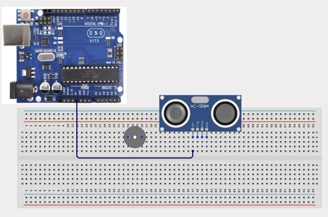
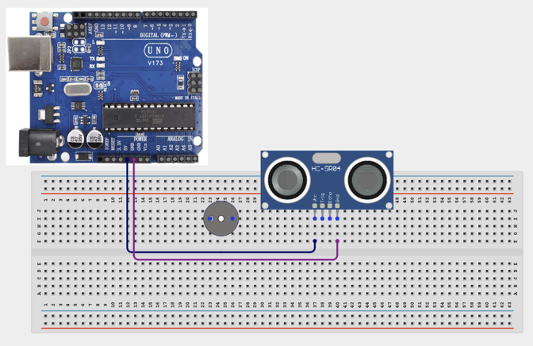
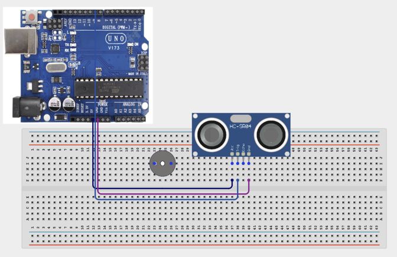
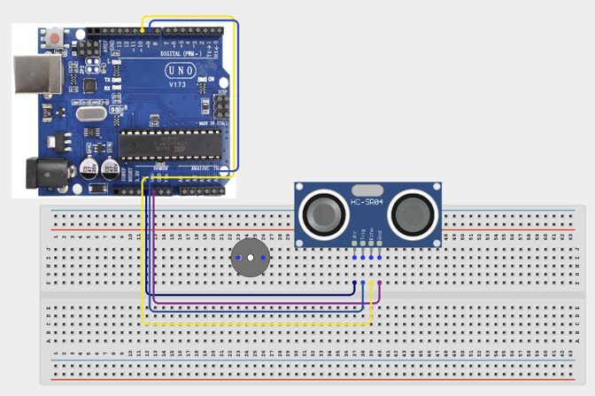
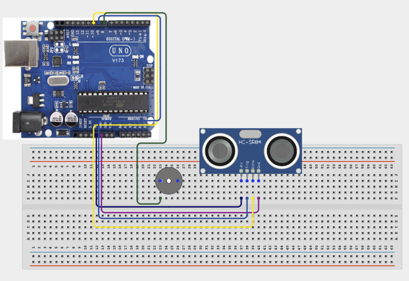
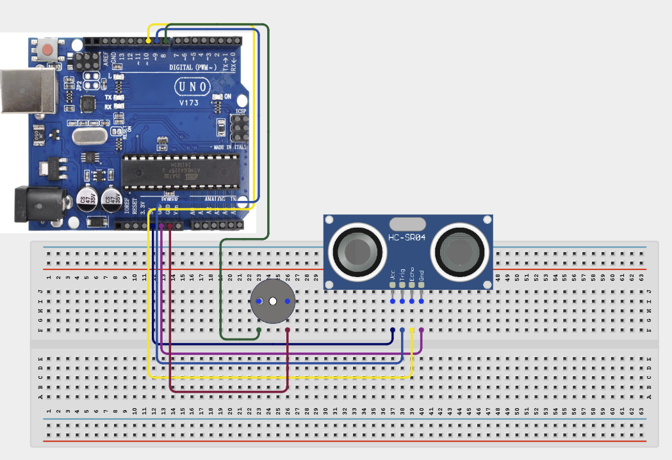

# Project 1.12: Distance Warning System

| **Description** | This project uses an ultrasonic sensor to detect nearby objects. When an object gets too close, a buzzer warns the user. |
|------------------|----------------------------------------------------------------|
| **Use case**     | This project is connected to real-world uses such as: This project demonstrates the basic principle behind parking sensors and collision avoidance systems. |

## Components (Things You will need)

|  |  |  |  | | |
| --------------------------------------------------- | ------------------------------------------------------ | ----------------------------------------------------------- | --------------------------------------------------------- | ------------------------------------------------------ | ------------------------------------------------------ | 

## Building the circuit

Things Needed:

- Arduino Uno = 1
- Arduino USB cable = 1
- Bread Board = 1
- Jumper Wires
- Ultrasonic Sensor
- Buzzer


## Mounting the component on the breadboard and wiring the circuit

**Step 1:**	Place the Ultrasonic Sensor and Buzzer on the breadboard.


**Step 2:**	Connect VCC pin of the ultrasonic sensor to 5V on the Arduino using the jumper wire.



**Step 3:**	Connect GND pin of the ultrasonic sensor to GND using a jumper wire.



**Step 4:**	Connect Trig pin of the ultrasonic sensor to Pin 9 using a jumper wire.



**Step 5:** Connect Echo pin of the ultrasonic sensor to Pin 10 using a jumper wire.



**Step 6:**	Connect Positive pin of the buzzer to Pin 8 using a jumper wire. 



**Step 7:**	Connect Negative pin of the buzzer to GND using a jumper wire. 



_Make sure to connect the Arduino USB cable to the Arduino board._

## PROGRAMMING

**Step 1:** Open your Arduino IDE. See how to set up here: [Getting Started](../../Getting Started/Arduino_IDE_Setup.md).

**Step 2:** Write the complete program implementing the system logic with appropriate pin definitions, setup configuration, and the main control loop.

```cpp
int trigPin = 9;
int echoPin = 10;
int buzzerPin = 8;
void setup() {
 pinMode(trigPin,OUTPUT);
 pinMode(echoPin,INPUT);
 pinMode(buzzerPin,OUTPUT);
}
void loop() {
 digitalWrite(trigPin,LOW);
 delayMicroseconds(2);
 digitalWrite(trigPin,HIGH);
 delayMicroseconds(10);
 digitalWrite(trigPin,LOW);
 long duration = pulseIn(echoPin,HIGH);
 int distance = duration * 0.034 / 2;
 if(distance < 15){
   digitalWrite(buzzerPin,HIGH);
 }
 else{
   digitalWrite(buzzerPin,LOW);
 }
}

```

**Step 3:** Save your code. _See the [Getting Started](../../STEMAIDE_CODER_Kit_Manual/Getting_Started/Arduino_IDE_Setup.md) section_

**Step 4:** Select the arduino board and port _See the [Getting Started](../../Getting Started/Arduino_IDE_Setup.md) section:Selecting Arduino Board Type and Uploading your code_.

**Step 5:** Upload your code. _See the [Getting Started](../../Getting Started/Arduino_IDE_Setup.md) section:Selecting Arduino Board Type and Uploading your code_

## CONCLUSION

Objects farther than 15cm produce no alarm. Objects closer than 15cm activate the buzzer.

