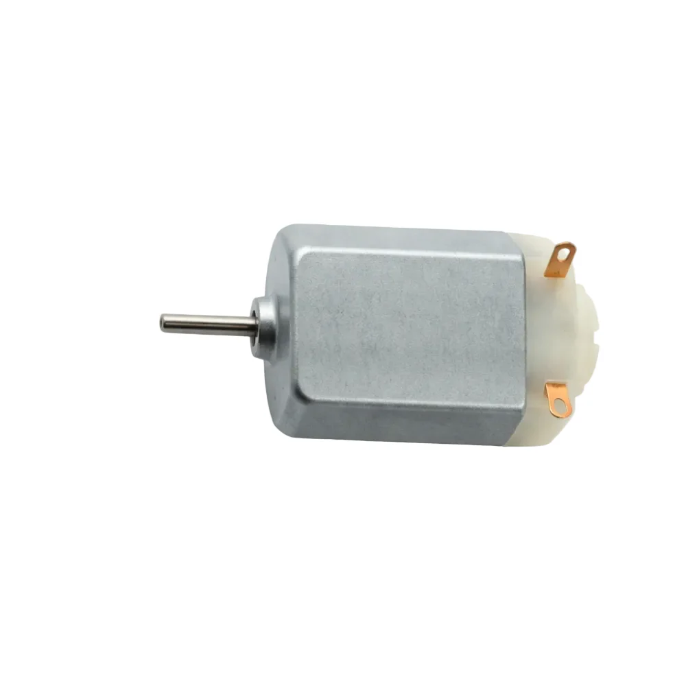
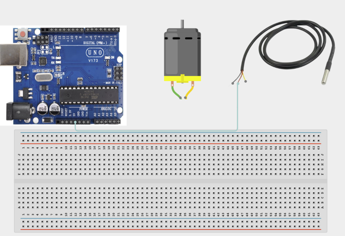
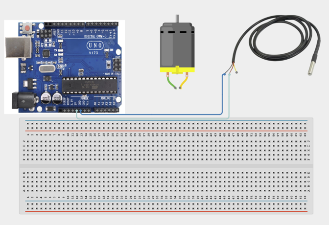
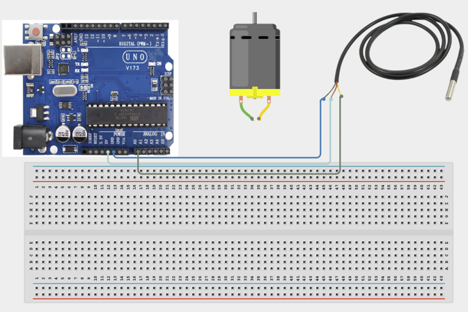
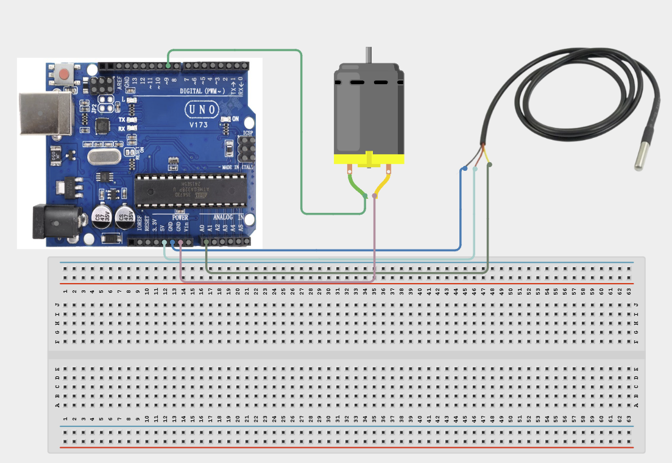

# Project 1.13: Smart Fan Indicator

| **Description** In this project, learners will build an automatic cooling system that switches on a DC fan whenever the temperature exceeds a predefined limit. The system continuously monitors temperature using a temperature sensor and activates a motor-driven fan when cooling is required.
This project introduces environmental automation and demonstrates how sensor data can directly control mechanical devices.|
|------------------|----------------------------------------------------------------|
| **Use case**     | This project is connected to real-world uses such as: This project demonstrates how environmental data can automate physical systems. Similar systems are used in computers, air conditioners, incubators, and industrial cooling equipment. |

## Components (Things You will need)

|  |  |  |  | | | |
| --------------------------------------------------- | ------------------------------------------------------ | ----------------------------------------------------------- | --------------------------------------------------------- | ------------------------------------------------------ | ------------------------------------------------------ | ------------------------------------------------------ | 

## Building the circuit

Things Needed:

- Arduino Uno = 1
- Arduino USB cable = 1
- Servo motor = 1
- Jumper Wires
- Temperature Sensor
- DC Motor
- Fan Blade


## Mounting the component on the breadboard and wiring the circuit

**Step 1:**	Place the Temperature Sensor (LM35 or equivalent) on the breadboard and prepare the DC Motor for connection. Connect VCC to 5V (signal/power). 




**Step 2:**	Connect GND to GND (signal/power). 



**Step 3:**	Connect OUT to A0 (signal/power).  



**Step 4:**	Connect one lead of the DC Motor to Pin 9 and the other lead to GND. 



_Make sure to connect the Arduino USB cable to the Arduino board._

## PROGRAMMING

**Step 1:** Open your Arduino IDE. See how to set up here: [Getting Started](../../Getting Started/Arduino_IDE_Setup.md).

**Step 2:** Write the complete program implementing the system logic with appropriate pin definitions, setup configuration, and the main control loop.

```cpp

// Temperature sensor connected to A0
int tempPin = A0;
// Motor control pin
int motorPin = 9;
// Temperature threshold
float threshold = 30.0;
void setup() {
 // Set motor pin as output
 pinMode(motorPin, OUTPUT);
 // Start serial monitor
 Serial.begin(9600);
}
void loop() {
 // Read sensor value
 int sensorValue = analogRead(tempPin);
 // Convert to voltage
 float voltage = sensorValue * (5.0 / 1023.0);
 // Convert voltage to temperature
 float temperature = voltage * 100;
 // Display temperature
 Serial.print("Temperature: ");
 Serial.println(temperature);
 // Check threshold
 if (temperature >= threshold) {
   // Turn fan ON
   digitalWrite(motorPin, HIGH);
 } else {
   // Turn fan OFF
   digitalWrite(motorPin, LOW);
 }
 delay(500);
}

```

**Step 7:** Save your code. _See the [Getting Started](../../Getting Started/Arduino_IDE_Setup.md) section_

**Step 8:** Select the arduino board and port _See the [Getting Started](../../Getting Started/Arduino_IDE_Setup.md) section:Selecting Arduino Board Type and Uploading your code_.

**Step 9:** Upload your code. _See the [Getting Started](../../Getting Started/Arduino_IDE_Setup.md) section:Selecting Arduino Board Type and Uploading your code_

## CONCLUSION

When the temperature is below 30°C, the fan remains OFF.
As the temperature rises above 30°C, the motor starts rotating. Temperature readings update continuously in the Serial Monitor.


