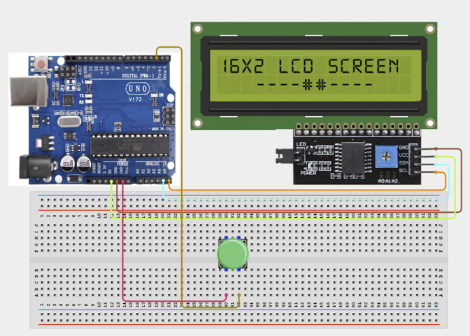

# Project 1.15: Mini Access Counter

| **Description**This project simulates a simple visitor-counting system. A push button acts as an entry sensor, and each press increases a visitor count displayed on an LCD screen.
This project introduces counting systems, data storage, and user-interface displays.|
|------------------|----------------------------------------------------------------|
| **Use case**     | This project is connected to real-world uses such as: This project demonstrates how electronic systems can track and display activity data. Similar concepts are used in attendance systems, people counters, production monitoring systems, and access-control solutions. |

## Components (Things You will need)

|  |  |  |  | | |
| --------------------------------------------------- | ------------------------------------------------------ | ----------------------------------------------------------- | --------------------------------------------------------- | ------------------------------------------------------ | ------------------------------------------------------ |

## Building the circuit

Things Needed:

- Arduino Uno = 1
- Arduino USB cable = 1
- Servo motor = 1
- Jumper Wires
- LCD Screens 
- Push Button

## Mounting the component on the breadboard and wiring the circuit

**Step 1:**		Place the Push Button and I2C LCD Display on the breadboard.
- Connect VCC to 5V (signal/power).
- Connect GND to GND (signal/power).
- Connect SDA to A4 (signal/power).
- Connect SCL to A5 (signal/power).
- Check that all GND connections share the same ground line if more than one module is used.



_Make sure to connect the Arduino USB cable to the Arduino board._

## PROGRAMMING

**Step 1:** Open your Arduino IDE. See how to set up here: [Getting Started](../../Getting Started/Arduino_IDE_Setup.md).

**Step 2:** Write the complete program implementing the system logic with appropriate pin definitions, setup configuration, and the main control loop.

```cpp

// Required Library: LiquidCrystal_I2C
#include <Wire.h>
#include <LiquidCrystal_I2C.h>
// LCD object
LiquidCrystal_I2C lcd(0x27,16,2);
// Button pin
int buttonPin = 2;
// Visitor count
int count = 0;
// Previous button state
int lastState = HIGH;
void setup() {
 pinMode(buttonPin, INPUT_PULLUP);
 lcd.init();
 lcd.backlight();
 lcd.setCursor(0,0);
 lcd.print("Visitors:");
}
void loop() {
 // Read button state
 int currentState = digitalRead(buttonPin);
 // Detect button press
 if(currentState == LOW && lastState == HIGH){
   count++;
   lcd.setCursor(0,1);
   lcd.print(count);
   lcd.print("     ");
   delay(200);
 }
 lastState = currentState;
}


```

**Step 7:** Save your code. _See the [Getting Started](../../Getting Started/Arduino_IDE_Setup.md) section_

**Step 8:** Select the arduino board and port _See the [Getting Started](../../Getting Started/Arduino_IDE_Setup.md) section:Selecting Arduino Board Type and Uploading your code_.

**Step 9:** Upload your code. _See the [Getting Started](../../Getting Started/Arduino_IDE_Setup.md) section:Selecting Arduino Board Type and Uploading your code_

## CONCLUSION

LCD initially displays zero visitors. Every button press increases the count by one. Count updates immediately on the display.


