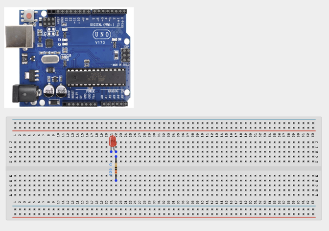
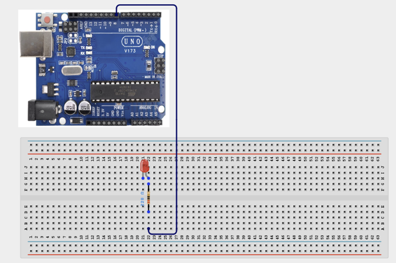
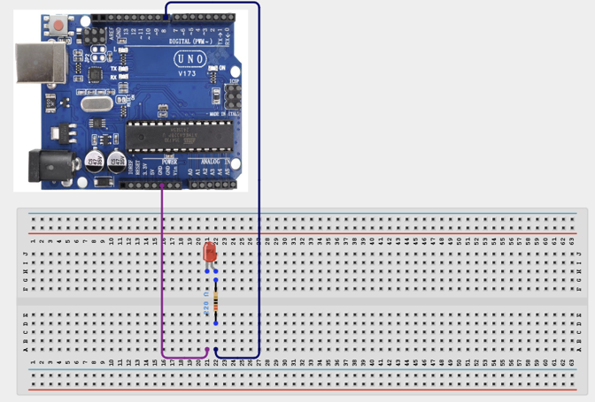

# Project 1.1: LED Morse Code Messenger

| **Description** In this project, learners will use an LED to transmit short messages in Morse code. Morse code represents letters and numbers using combinations of short and long flashes.
This activity introduces learners to controlling outputs using timing, one of the most important concepts in programming.
Instead of simply blinking an LED, learners will use code to create meaningful communication patterns.
 |
|------------------|----------------------------------------------------------------|
| **Use case**     | This project is connected to real-world uses such as: Morse code communication has been used in:  Maritime emergencies,  Aviation,  Military communication,  Amateur radio,  Emergency signaling.  This project demonstrates how simple outputs can be used to transmit meaningful information through programming. |

## Components (Things You will need)

|  |  |  |  |  | |
| --------------------------------------------------- | ------------------------------------------------------ | ----------------------------------------------------------- | --------------------------------------------------------- | ------------------------------------------------------ | ------------------------------------------------------ | ------------------------------------------------------ |

## Building the circuit

Things Needed:

- Arduino Uno = 1
- Arduino USB cable = 1
- Servo motor = 1
- Jumper Wires
- 220Ω resistor


## Mounting the component on the breadboard

**Step 1:**	Identify each component in the Required Components table before inserting anything on the breadboard.2.	Place the LED and 220Ω Resistor on the breadboard.



## WIRING THE CIRCUIT

**Step 2:** Connect Long Leg (+) to Arduino Pin 8 (signal/power).



**Step 3:** Connect Short Leg (–) to 220Ω Resistor (signal/power).5.	Connect Resistor End to GND (signal/power).



_Make sure to connect the Arduino USB cable to the Arduino board._

## PROGRAMMING

**Step 1:** Open your Arduino IDE. See how to set up here: [Getting Started](../../Getting Started/Arduino_IDE_Setup.md).

**Step 2:** Write the complete program implementing the system logic with appropriate pin definitions, setup configuration, and the main control loop.

```cpp
int ledPin = 8;
void setup() {
  pinMode(ledPin, OUTPUT);
}
void dot() {
  digitalWrite(ledPin, HIGH);
  delay(250);
  digitalWrite(ledPin, LOW);
  delay(250);
}
void dash() {
  digitalWrite(ledPin, HIGH);
  delay(750);
  digitalWrite(ledPin, LOW);
  delay(250);
}
void loop() {
  // S
  dot();
  dot();
  dot();
  delay(500);
  // O
  dash();
  dash();
  dash();
  delay(500);
  // S
  dot();
  dot();
  dot();
  delay(2000);
}

```

**Step 7:** Save your code. _See the [Getting Started](../../Getting Started/Arduino_IDE_Setup.md) section_

**Step 8:** Select the arduino board and port _See the [Getting Started](../../Getting Started/Arduino_IDE_Setup.md) section:Selecting Arduino Board Type and Uploading your code_.

**Step 9:** Upload your code. _See the [Getting Started](../../Getting Started/Arduino_IDE_Setup.md) section:Selecting Arduino Board Type and Uploading your code_

## CONCLUSION

Normal/start-up condition: The LED Morse Code Messenger powers on and waits for sensor input or user action. Input or command changes: The display, buzzer, LED, motor, servo, relay, or RGB output responds according to the program logic. Threshold or event condition: The system gives visible, audible, movement, or display feedback when the condition is detected.

