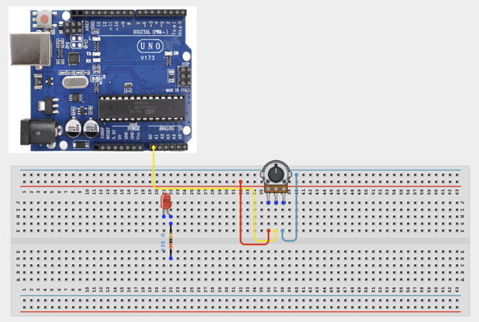
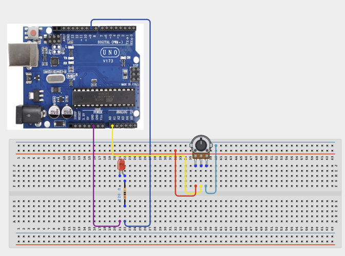

# Project 1.2: Adjustable LED Dimmer


| **Description** In this project, learners will use a potentiometer (variable resistor) to control the brightness of an LED.
Unlike the previous project where the LED was simply turned ON or OFF, this activity introduces the concept of gradual control. By turning the potentiometer knob, the brightness of the LED changes smoothly.
This project provides an excellent introduction to analog inputs and Pulse Width Modulation (PWM), which is widely used in electronics to control brightness, motor speed, and other variable outputs. |
|------------------|----------------------------------------------------------------|
| **Use case**     | This project is connected to real-world uses such as: Analog control systems are used in:  Light dimmer switches,  Volume knobs,  Motor speed controllers,  Temperature regulators,  Industrial process controls.  This project demonstrates how physical input devices allow users to interact with electronic systems in intuitive ways. |

## Components (Things You will need)

|  |  |  |  |  | | |
| --------------------------------------------------- | ------------------------------------------------------ | ----------------------------------------------------------- | --------------------------------------------------------- | ------------------------------------------------------ | ------------------------------------------------------ | ------------------------------------------------------ |------------------------------------------------------ |

## Building the circuit

Things Needed:

- Arduino Uno = 1
- Arduino USB cable = 1
- Servo motor = 1
- Jumper Wires
- 220Ω resistor
- Potentiometer 


## Mounting the component on the breadboard

**Step 1:**	Place the LED, Potentiometer and 220Ω Resistor on the breadboard.


## WIRING THE CIRCUIT

**Step 2:**Connecting the potentiometer.	Connect Left Pin to 5V (signal/power).Connect Middle Pin to A0 (signal/power).Connect Right Pin to GND (signal/power).



**Step 3:** Connect Long Leg (+) to Pin 9 (signal/power). Connect Short Leg (–) to 220Ω Resistor (signal/power). Connect Resistor End to GND (signal/power)



_Make sure to connect the Arduino USB cable to the Arduino board._

## PROGRAMMING

**Step 1:** Open your Arduino IDE. See how to set up here: [Getting Started](../../Getting Started/Arduino_IDE_Setup.md).

**Step 2:** Write the complete program implementing the system logic with appropriate pin definitions, setup configuration, and the main control loop.

```cpp
int potPin = A0;
int ledPin = 9;
int sensorValue;
int brightness;
void setup() {
}
void loop() {
  sensorValue = analogRead(potPin);
  brightness = map(sensorValue, 0, 1023, 0, 255);
  analogWrite(ledPin, brightness);
  delay(10);
}

```

**Step 7:** Save your code. _See the [Getting Started](../../Getting Started/Arduino_IDE_Setup.md) section_

**Step 8:** Select the arduino board and port _See the [Getting Started](../../Getting Started/Arduino_IDE_Setup.md) section:Selecting Arduino Board Type and Uploading your code_.

**Step 9:** Upload your code. _See the [Getting Started](../../Getting Started/Arduino_IDE_Setup.md) section:Selecting Arduino Board Type and Uploading your code_

## CONCLUSION

When the potentiometer is rotated:
Turned Fully Left.
LED is OFF.
Turned Halfway.
LED glows at medium brightness.
Turned Fully Right.
LED reaches maximum brightness.
The LED brightness should change smoothly as the knob turns.
