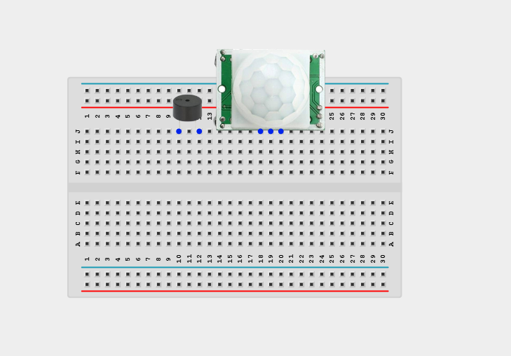
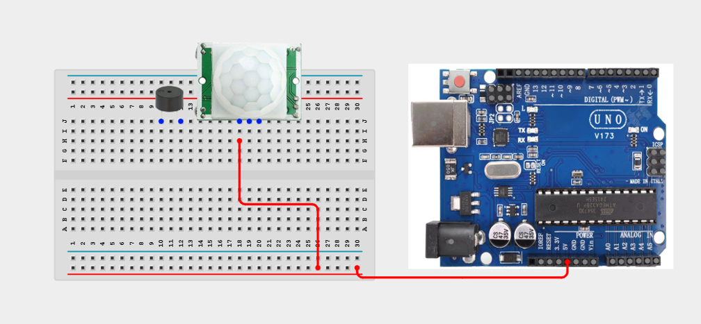
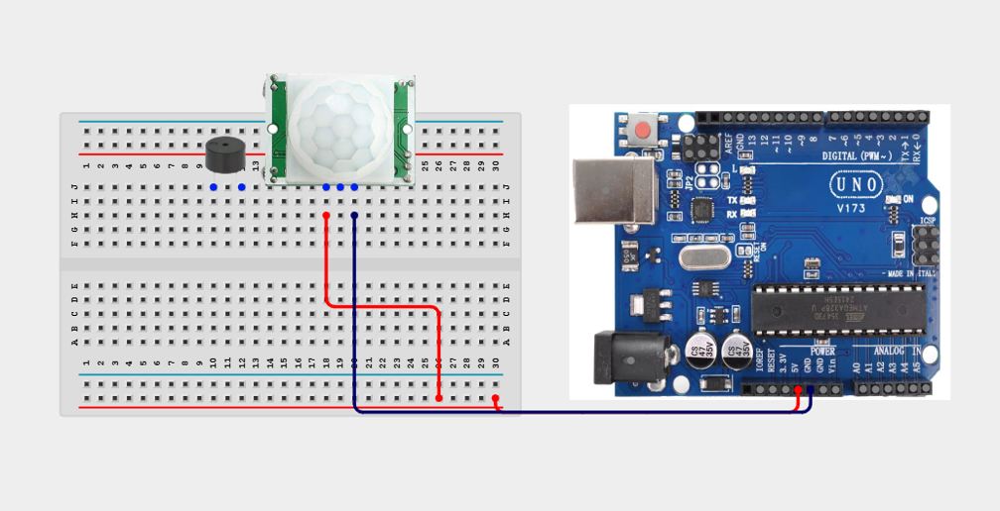
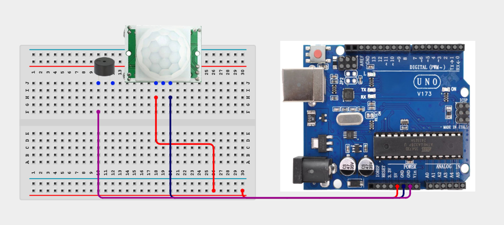
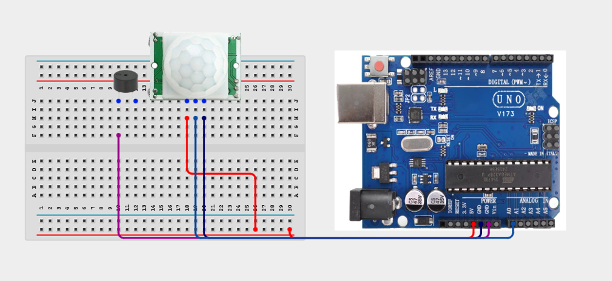
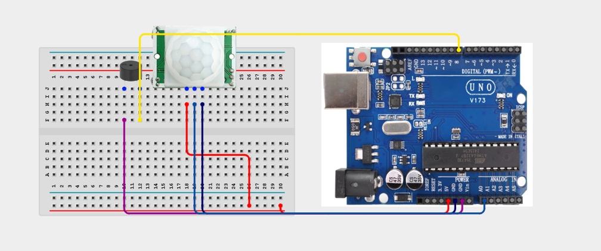

# Project 1.4: MotionBell Presence Trainer


| **Description** Learners build a device that detects movement and responds with a buzzer sound. The project introduces digital sensing, presence detection, and simple alerts.
In this manual, learners will follow a practical build process, connect the circuit safely, upload the Arduino program, and observe how the prototype behaves when the input condition changes.
are commonly used in digital games, educational tools, and simulations.|
|------------------|----------------------------------------------------------------|
| **Use case**     | This project is connected to real-world uses such as: Detecting entry into a room.; Demonstrating motion-triggered notification systems.; Introducing security and automation principles.. |

## Components (Things You will need)

|  |  |  |  | | |
| --------------------------------------------------- | ------------------------------------------------------ | ----------------------------------------------------------- | --------------------------------------------------------- | ------------------------------------------------------ | ------------------------------------------------------ | 

## Building the circuit

Things Needed:

- Arduino Uno = 1
- Arduino USB cable = 1
- Servo motor = 1
- Jumper Wires
- 220Ω resistor
- Potentiometer 


## Mounting the component on the breadboard and wiring the circuit

**Step 1:** Insert the Buzzer and Motion Sensor into the Breadboard as shown below



**Step 2:**	Use a jumper wire to connect 5V on the Arduino Uno to the Positive section on the Breadboard. Using a jumper wire connect VCC on the Motion Sensor to 5V on the Breadboard.




**Step 3:**	Using a jumper wire connect the GND on the Motion Sensor to the GND on the Arduino Uno.



**Step 4:**	Connect the Negative pin of the Buzzer to GND on the Arduino Uno.



**Step 5:**	Connect the OUPUT pin on the Motion Sensor to AO on the Arduino Uno.



**Step 6:**	Connect the positive Pin on the Buzzer to Pin number 8 on the Arduino Uno.



_Make sure to connect the Arduino USB cable to the Arduino board._

## PROGRAMMING

**Step 1:** Open your Arduino IDE. See how to set up here: [Getting Started](../../Getting Started/Arduino_IDE_Setup.md).

**Step 2:** Write the complete program implementing the system logic with appropriate pin definitions, setup configuration, and the main control loop.

```cpp
int buzzerPin = 8;
int digitalSensorPin = AO;
 
void setup() {
  Serial.begin(9600);
  pinMode(buzzerPin, OUTPUT);
  pinMode(digitalSensorPin, INPUT);
}
 
void loop() {
  int value = digitalRead(digitalSensorPin);
  if(value > 500 || value == HIGH){ digitalWrite(buzzerPin, HIGH); } else { digitalWrite(buzzerPin, LOW); }
  delay(500);
}

```

**Step 7:** Save your code. _See the [Getting Started](../../Getting Started/Arduino_IDE_Setup.md) section_

**Step 8:** Select the arduino board and port _See the [Getting Started](../../Getting Started/Arduino_IDE_Setup.md) section:Selecting Arduino Board Type and Uploading your code_.

**Step 9:** Upload your code. _See the [Getting Started](../../Getting Started/Arduino_IDE_Setup.md) section:Selecting Arduino Board Type and Uploading your code_

## CONCLUSION

The MotionBell Presence Trainer powers on and waits for sensor input or user action. Input or command changes: The display, buzzer, LED, motor, servo, relay, or RGB output responds according to the program logic. Threshold or event condition: The system gives visible, audible, movement, or display feedback when the condition is detected.
