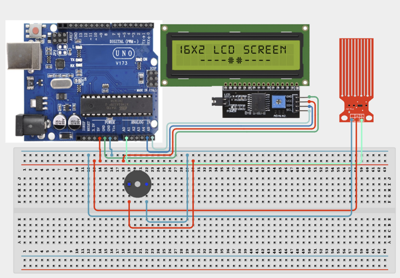

# Project 2.12: Multi-Level Security Alarm

| **Description** In this project, learners will build a security system that combines RFID authentication, motion detection, LCD notifications, and audible alarms. Authorized users gain access by scanning a registered RFID card, while unauthorized access or detected motion triggers an alarm.
This project introduces layered security systems used in modern buildings and smart facilities.
|------------------|----------------------------------------------------------------|
| **Use case**     |This project is connected to real-world uses such as: This project demonstrates multi-layered security principles used in offices, warehouses, schools, and residential smart-security systems.|

## Components (Things You will need)

|  |  |  |  | | | || || |
|------------------------------------------------------ | ----------------------------------------------------------- | --------------------------------------------------------- | ------------------------------------------------------ | ------------------------------------------------------ |------------------------------------------------------ |------------------------------------------------------ |------------------------------------------------------ |------------------------------------------------------ |

## Building the circuit

Things Needed:

- Arduino Uno = 1
- Arduino USB cable = 1
- Servo motor = 1
- Jumper Wires
- Motion Sensor
- RFID Tag/Card
- RFID Reader
- Buzzer
- LCD Display

## Mounting the component on the breadboard and wiring the circuit

**Step 1:**	Place the RFID Reader, Buzzer and RFID Tag/Card on the breadboard.

**Step 2:**	Connect the RFID MFRC522 module by connecting SDA to Digital Pin 10, SCK to Digital Pin 13, MOSI to 	Digital Pin 11, MISO to Digital Pin 12, and RST to Digital Pin 9.

**Step 3:**	Connect the I2C LCD Display by connecting SDA to A4 and SCL to A5.

**Step 4:**	Connect the PIR Sensor by connecting the Signal pin to Digital Pin 2.

**Step 5:**	Connect the Buzzer by connecting the Positive (+) terminal to Digital Pin 7 and the Negative (-) terminal to GND.

**Step 6:**	Since multiple components require 5V and GND connections, first connect the Arduino 5V pin to the breadboard’s positive (+) rail and the Arduino GND pin to the breadboard’s negative (-) rail. Connect all component VCC pins to the positive (+) rail and all GND pins to the negative (-) rail to provide shared power connections. Ensure that all GND connections share the same ground line when using multiple modules to maintain stable and reliable circuit operation.




_Make sure to connect the Arduino USB cable to the Arduino board._

## PROGRAMMING

**Step 1:** Open your Arduino IDE. See how to set up here: [Getting Started](../../Getting Started/Arduino_IDE_Setup.md).

**Step 2:** Write the complete program implementing the system logic with appropriate pin definitions, setup configuration, and the main control loop.

```cpp
#include <SPI.h>
#include <MFRC522.h>
#include <Wire.h>
#include <LiquidCrystal_I2C.h>

#define SS_PIN 10
#define RST_PIN 9

#define PIR_PIN 2
#define BUZZER_PIN 7

MFRC522 rfid(SS_PIN, RST_PIN);
LiquidCrystal_I2C lcd(0x27, 16, 2);

//----------------------------------------------------
// CHANGE THESE VALUES TO YOUR RFID CARD UID
//----------------------------------------------------
byte authorizedUID[4] = {0xDE, 0xAD, 0xBE, 0xEF};
// Example only.
// Replace with your own card UID.
//----------------------------------------------------

bool authorizedAccess = false;
unsigned long accessTimer = 0;
const unsigned long accessDuration = 10000;   //10 seconds

//----------------------------------------------------
void setup() {

  Serial.begin(9600);

  SPI.begin();
  rfid.PCD_Init();

  pinMode(PIR_PIN, INPUT);
  pinMode(BUZZER_PIN, OUTPUT);

  digitalWrite(BUZZER_PIN, LOW);

  lcd.init();
  lcd.backlight();

  lcd.clear();
  lcd.setCursor(0,0);
  lcd.print("Security");
  lcd.setCursor(0,1);
  lcd.print("System Ready");

  delay(2000);
  lcd.clear();

  Serial.println("Multi-Level Security Alarm Ready");
}

//----------------------------------------------------
void loop() {

  checkRFID();
  checkMotion();

  // Reset authorization after timeout
  if (authorizedAccess &&
      millis() - accessTimer > accessDuration) {

    authorizedAccess = false;

    lcd.clear();
    lcd.print("System Locked");
    delay(1500);
    lcd.clear();
  }
}

//----------------------------------------------------
// RFID CHECK
//----------------------------------------------------
void checkRFID() {

  if (!rfid.PICC_IsNewCardPresent())
    return;

  if (!rfid.PICC_ReadCardSerial())
    return;

  Serial.print("UID:");

  bool match = true;

  for (byte i = 0; i < 4; i++) {

    Serial.print(rfid.uid.uidByte[i], HEX);
    Serial.print(" ");

    if (rfid.uid.uidByte[i] != authorizedUID[i])
      match = false;
  }

  Serial.println();

  if (match) {

    authorizedAccess = true;
    accessTimer = millis();

    lcd.clear();
    lcd.setCursor(0,0);
    lcd.print("Access Granted");

    lcd.setCursor(0,1);
    lcd.print("Welcome!");

    tone(BUZZER_PIN, 2000, 150);

    Serial.println("Authorized Card");

  } else {

    authorizedAccess = false;

    lcd.clear();
    lcd.setCursor(0,0);
    lcd.print("Access Denied");

    lcd.setCursor(0,1);
    lcd.print("Unknown Card");

    alarm();

    Serial.println("Unauthorized Card");
  }

  rfid.PICC_HaltA();
  rfid.PCD_StopCrypto1();

  delay(1500);
  lcd.clear();
}

//----------------------------------------------------
// PIR CHECK
//----------------------------------------------------
void checkMotion() {

  int motion = digitalRead(PIR_PIN);

  if (motion == HIGH) {

    if (!authorizedAccess) {

      lcd.clear();

      lcd.setCursor(0,0);
      lcd.print("INTRUDER!");

      lcd.setCursor(0,1);
      lcd.print("Motion Detected");

      Serial.println("Unauthorized Motion");

      alarm();

      delay(1000);

      lcd.clear();

    } else {

      lcd.clear();

      lcd.setCursor(0,0);
      lcd.print("Authorized");

      lcd.setCursor(0,1);
      lcd.print("Movement");

      delay(500);

      lcd.clear();
    }
  }
}

//----------------------------------------------------
// BUZZER ALARM
//----------------------------------------------------
void alarm() {

  for (int i = 0; i < 5; i++) {

    tone(BUZZER_PIN, 1000);
    delay(150);

    noTone(BUZZER_PIN);
    delay(150);
  }
}

```

**Step 7:** Save your code. _See the [Getting Started](../../Getting Started/Arduino_IDE_Setup.md) section_

**Step 8:** Select the arduino board and port _See the [Getting Started](../../Getting Started/Arduino_IDE_Setup.md) section:Selecting Arduino Board Type and Uploading your code_.

**Step 9:** Upload your code. _See the [Getting Started](../../Getting Started/Arduino_IDE_Setup.md) section:Selecting Arduino Board Type and Uploading your code_

## CONCLUSION

Normal/start-up condition: The Multi-Level Security Alarm powers on and waits for sensor input or user action. Input or command changes: The display, buzzer, LED, motor, servo, relay, or RGB output responds according to the program logic. Threshold or event condition: The system gives visible, audible, movement, or display feedback when the condition is detected.
