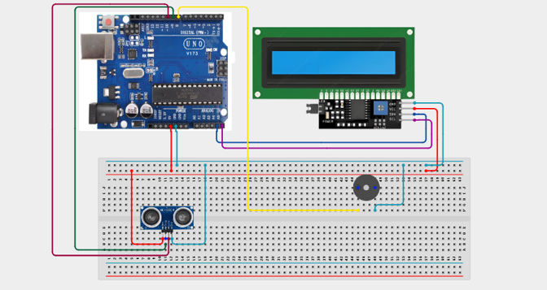

# Project 2.1: Smart Parking Assistant

| **Description** | This project uses an ultrasonic sensor, buzzer, and LCD display to assist drivers when parking. As an object gets closer, the system displays the distance and increases the buzzer frequency. |
|------------------|----------------------------------------------------------------------------------------------------------------------------------------------------------------------------------------------|
| **Use case**     | This project is connected to real-world uses such as parking sensors commonly used in modern vehicles. |

## Components (Things You will need)

|  |  |  |  | | | |
| --------------------------------------------------- | ------------------------------------------------------ | ----------------------------------------------------------- | --------------------------------------------------------- | ------------------------------------------------------ | ------------------------------------------------------ |------------------------------------------------------ |

## Building the circuit

Things Needed:

- Arduino Uno = 1
- Arduino USB cable = 1
- Breadboard = 1
- Jumper Wires
- Ultrasonic Sensor
- LCD Display
- Buzzer

## Mounting the component on the breadboard and wiring the circuit

**Step 1:**	Place the Ultrasonic Sensor and I2C LCD Display on the breadboard.

- Connect the I2C LCD display by connecting SDA to A4, SCL to A5, VCC to 5V, and GND to GND on the Arduino Uno board using jumper wires.

- Connect the ultrasonic sensor by connecting VCC to 5V, GND to GND, Trig to Pin 9, and Echo to Pin 10 on the Arduino Uno board using jumper wires.

- Connect the positive (+) pin of the buzzer to Digital Pin 8 and the negative (-) pin to GND on the Arduino Uno board using jumper wires.



_Make sure to connect the Arduino USB cable to the Arduino board._

## PROGRAMMING

**Step 1:** Open your Arduino IDE. See how to set up here: [Getting Started](../../Getting Started/Arduino_IDE_Setup.md).

**Step 2:** Write the complete program implementing the system logic with appropriate pin definitions, setup configuration, and the main control loop.

```cpp

//#include <LiquidCrystal_I2C.h>
LiquidCrystal_I2C lcd(0x27,16,2);
int trigPin = 9;
int echoPin = 10;
int buzzerPin = 8;
void setup() {
 pinMode(trigPin, OUTPUT);
 pinMode(echoPin, INPUT);
 pinMode(buzzerPin, OUTPUT);
 lcd.init();
 lcd.backlight();
}
void loop() {
 // Generate ultrasonic pulse
 digitalWrite(trigPin, LOW);
 delayMicroseconds(2);
 digitalWrite(trigPin, HIGH);
 delayMicroseconds(10);
 digitalWrite(trigPin, LOW);
 // Measure echo time
 long duration = pulseIn(echoPin, HIGH);
 // Calculate distance
 int distance = duration * 0.034 / 2;
 // Display distance
 lcd.setCursor(0,0);
 lcd.print("Distance:");
 lcd.print(distance);
 lcd.print("cm ");
 // Alert zones
 if(distance < 10){
   tone(buzzerPin,1000);
 }
 else if(distance < 20){
   tone(buzzerPin,500);
 }
 else{
   noTone(buzzerPin);
 }
 delay(100);
}


```

**Step 3:** Save your code. _See the [Getting Started](../../Getting Started/Arduino_IDE_Setup.md) section_

**Step 4:** Select the arduino board and port _See the [Getting Started](../../Getting Started/Arduino_IDE_Setup.md) section:Selecting Arduino Board Type and Uploading your code_.

**Step 5:** Upload your code. _See the [Getting Started](../../Getting Started/Arduino_IDE_Setup.md) section:Selecting Arduino Board Type and Uploading your code_

## CONCLUSION

Distance appears on the LCD. Buzzer beeps faster as objects move closer. No sound when objects are far away.


