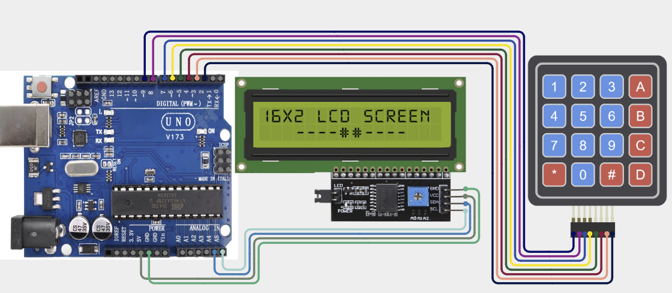

# Project 2.2: Digital Safe Lock

| **Description** Build a password-protected safe using a Keypad and LCD Display. Users must enter the correct PIN to unlock the system.|
|------------------|----------------------------------------------------------------|
| **Use case**     | This project is connected to real-world uses such as: This project introduces authentication systems used in ATMs, smart locks, and security devices. |

## Components (Things You will need)

|  |  |  |  | | |
|------------------------------------------------------ | ----------------------------------------------------------- | --------------------------------------------------------- | ------------------------------------------------------ | ------------------------------------------------------ |------------------------------------------------------ |

## Building the circuit

Things Needed:

- Arduino Uno = 1
- Arduino USB cable = 1
- Servo motor = 1
- Jumper Wires
- Ultrasonic Sensor
- LCD Display
- Buzzer

## Mounting the component on the breadboard and wiring the circuit

**Step 1:**	Place the ×4 Keypad and I2C LCD Display on the breadboard.
- Connect SDA to A4 (signal/power).
- Connect SCL to A5 (signal/power).
-	Keypad Row 1-4	R1 to D9, R2 to D8, R3 to D7, R4 to D6.
- Keypad Column 1-4	C1 to D5, C2 to D4, C3 to D3, C4 to D2.
-	Check that all GND connections share the same ground line if more than one module is used.




_Make sure to connect the Arduino USB cable to the Arduino board._

## PROGRAMMING

**Step 1:** Open your Arduino IDE. See how to set up here: [Getting Started](../../Getting Started/Arduino_IDE_Setup.md).

**Step 2:** Write the complete program implementing the system logic with appropriate pin definitions, setup configuration, and the main control loop.

```cpp

#include <Keypad.h>
#include <LiquidCrystal_I2C.h>
// LCD setup
LiquidCrystal_I2C lcd(0x27,16,2);
// Keypad setup
const byte ROWS = 4;
const byte COLS = 4;
char keys[ROWS][COLS] = {
{'1','2','3','A'},
{'4','5','6','B'},
{'7','8','9','C'},
{'*','0','#','D'}
};
byte rowPins[ROWS] = {9,8,7,6};
byte colPins[COLS] = {5,4,3,2};
Keypad keypad = Keypad(makeKeymap(keys),
rowPins,colPins,ROWS,COLS);
String password = "1234";
String input = "";
void setup() {
 lcd.init();
 lcd.backlight();
 lcd.print("Enter PIN:");
}
void loop() {
 char key = keypad.getKey();
 if(key){
   input += key;
   lcd.setCursor(0,1);
   lcd.print(input);
 }
 if(input.length() == 4){
   lcd.clear();
   if(input == password){
     lcd.print("Access Granted");
   }
   else{
     lcd.print("Access Denied");
   }
   delay(2000);
   input = "";
   lcd.clear();
   lcd.print("Enter PIN:");
 }
}


```

**Step 7:** Save your code. _See the [Getting Started](../../Getting Started/Arduino_IDE_Setup.md) section_

**Step 8:** Select the arduino board and port _See the [Getting Started](../../Getting Started/Arduino_IDE_Setup.md) section:Selecting Arduino Board Type and Uploading your code_.

**Step 9:** Upload your code. _See the [Getting Started](../../Getting Started/Arduino_IDE_Setup.md) section:Selecting Arduino Board Type and Uploading your code_

## CONCLUSION

Users enter a PIN using the keypad. LCD displays entered characters. Correct password grants access. Incorrect password displays an error message.


