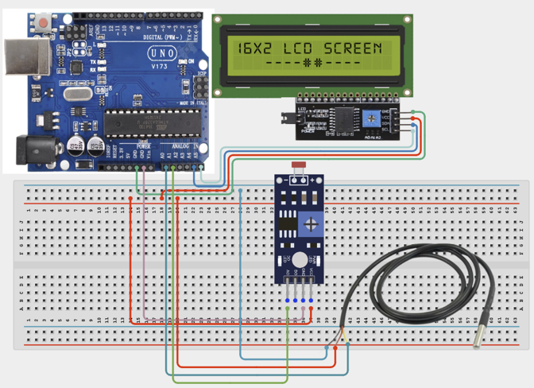

# Project 2.4: RFID Attendance Logger

| **Description**In this project, learners will build a digital attendance logging system using an RFID reader, RFID cards/tags, and an LCD display. When a registered RFID card is presented to the reader, the system displays the user's attendance status on the LCD.
RFID (Radio Frequency Identification) technology is widely used in schools, offices, libraries, and access-control systems. This project introduces contactless identification and data verification.|
|------------------|----------------------------------------------------------------|
| **Use case**     |This project is connected to real-world uses such as: This project demonstrates how RFID technology can be used for identification and attendance systems. Similar systems are used in schools, workplaces, libraries, hotels, and access-control facilities.|

## Components (Things You will need)

|  |  |  |  | | | |
|------------------------------------------------------ | ----------------------------------------------------------- | --------------------------------------------------------- | ------------------------------------------------------ | ------------------------------------------------------ |------------------------------------------------------ |------------------------------------------------------ |

## Building the circuit

Things Needed:

- Arduino Uno = 1
- Arduino USB cable = 1
- Servo motor = 1
- Jumper Wires
- RFID Reader
- LCD Display
- RFID Card

## Mounting the component on the breadboard and wiring the circuit

**Step 1:**	Place the RFID Reader (MFRC522) and RFID Tag/Card on the breadboard. 



_Make sure to connect the Arduino USB cable to the Arduino board._

## PROGRAMMING

**Step 1:** Open your Arduino IDE. See how to set up here: [Getting Started](../../Getting Started/Arduino_IDE_Setup.md).

**Step 2:** Write the complete program implementing the system logic with appropriate pin definitions, setup configuration, and the main control loop.

```cpp

#include <LiquidCrystal_I2C.h>
LiquidCrystal_I2C lcd(0x27,16,2);
void setup() {
lcd.init();
lcd.backlight();
}
void loop() {
int tempValue = analogRead(A0);
int lightValue = analogRead(A1);
lcd.setCursor(0,0);
lcd.print("Temp:");
lcd.print(tempValue);
lcd.setCursor(0,1);
lcd.print("Light:");
lcd.print(lightValue);
delay(500);
}


```

**Step 7:** Save your code. _See the [Getting Started](../../Getting Started/Arduino_IDE_Setup.md) section_

**Step 8:** Select the arduino board and port _See the [Getting Started](../../Getting Started/Arduino_IDE_Setup.md) section:Selecting Arduino Board Type and Uploading your code_.

**Step 9:** Upload your code. _See the [Getting Started](../../Getting Started/Arduino_IDE_Setup.md) section:Selecting Arduino Board Type and Uploading your code_

## CONCLUSION

LCD displays temperature readings. LCD displays light intensity values. Both values update continuously.
