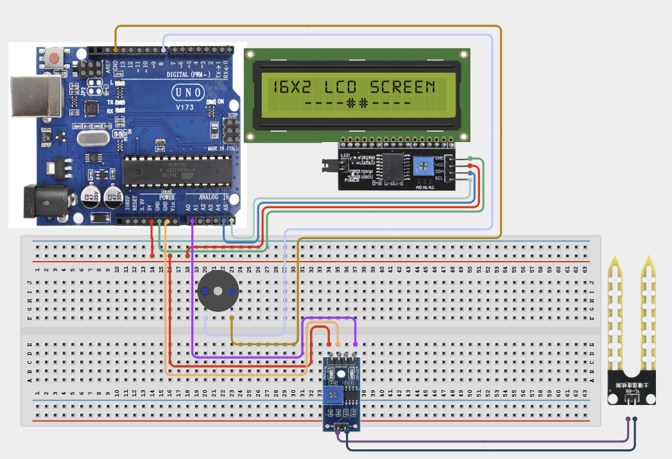

# Project 2.6: Smart Irrigation Monitor

| **Description** | In this project, learners will build a simple smart irrigation monitoring system that measures soil moisture levels and alerts users when watering is needed. The system displays moisture readings on an LCD and sounds a buzzer when the soil becomes too dry. This project introduces precision agriculture and environmental monitoring concepts. |
|------------------|---------------------------------------------------------------------------------------------------------------------------------------------------------------------------------------------------------------------------------------------------------------------------------------------------------------------------------------------------------------------------------------------------|
| **Use case**     | This project is connected to real-world uses such as smart farms, greenhouse irrigation systems, and home gardening automation. |

## Components (Things You will need)

|  |  |  |  |  |  |  |
|------------------------------------------------------ | ----------------------------------------------------------- | --------------------------------------------------------- | ------------------------------------------------------ | ------------------------------------------------------ | ------------------------------------------------------ | ------------------------------------------------------ |

## Building the circuit

Things Needed:

- Arduino Uno = 1
- Arduino USB cable = 1
- Breadboard = 1
- Jumper Wires
- Soil Moisture Sensor
- LCD Display
- Buzzer

## Mounting the component on the breadboard and wiring the circuit

**Step 1:**	Place the soil moisture sensor, the buzzer, and I2C LCD display on the breadboard.

-	Connect VCC pin of the temperature sensor to postive power rail on the breadboard.

-	Connect GND pin of the temperature sensor to the negative power rail on the breadboard.

-	Connect OUT of the temperature sensor to A0 on the Arduino Uno board.

-	Connect Positive of the buzzer to Pin 8 on the Arduino Uno board.

-	Connect Negative of the buzzer to GND on the Arduino Uno board.

-	Connect SDA of the LCD display to A4 on the Arduino Uno board.

-	Connect SCL of the LCD display to A5 on the Arduino Uno board.

-	Connect VCC of the LCD display to 5V on the Arduino Uno board.

-	Connect GND of the LCD display to GND on the Arduino Uno board.



_Make sure to connect the Arduino USB cable to the Arduino board._

## PROGRAMMING

**Step 1:** Open your Arduino IDE. See how to set up here: [Getting Started](../../Getting Started/Arduino_IDE_Setup.md).

**Step 2:** Write the complete program implementing the system logic with appropriate pin definitions, setup configuration, and the main control loop.

```cpp
#include <Wire.h>
#include <LiquidCrystal_I2C.h>
LiquidCrystal_I2C lcd(0x27,16,2);
int moisturePin = A0;
int buzzerPin = 8;
void setup() {
 lcd.init();
 lcd.backlight();
 pinMode(buzzerPin, OUTPUT);
}
void loop() {
 int moistureValue = analogRead(moisturePin);
 lcd.setCursor(0,0);
 lcd.print("Moisture:");
 lcd.print(moistureValue);
 lcd.print("   ");
 if(moistureValue < 400){
   digitalWrite(buzzerPin, HIGH);
   lcd.setCursor(0,1);
   lcd.print("Water Needed ");
 }
 else{
   digitalWrite(buzzerPin, LOW);
   lcd.setCursor(0,1);
   lcd.print("Soil Healthy ");
 }
 delay(500);
}

```

**Step 3:** Save your code. _See the [Getting Started](../../Getting Started/Arduino_IDE_Setup.md) section_

**Step 4:** Select the arduino board and port _See the [Getting Started](../../Getting Started/Arduino_IDE_Setup.md) section:Selecting Arduino Board Type and Uploading your code_.

**Step 5:** Upload your code. _See the [Getting Started](../../Getting Started/Arduino_IDE_Setup.md) section:Selecting Arduino Board Type and Uploading your code_

## CONCLUSION

When the soil is dry, the buzzer sounds to indicate that watering is needed. When the soil is moist, the buzzer remains off, indicating that the moisture level is sufficient. The system continuously monitors and updates the soil moisture readings in real time, allowing for ongoing detection of changes in soil conditions.
