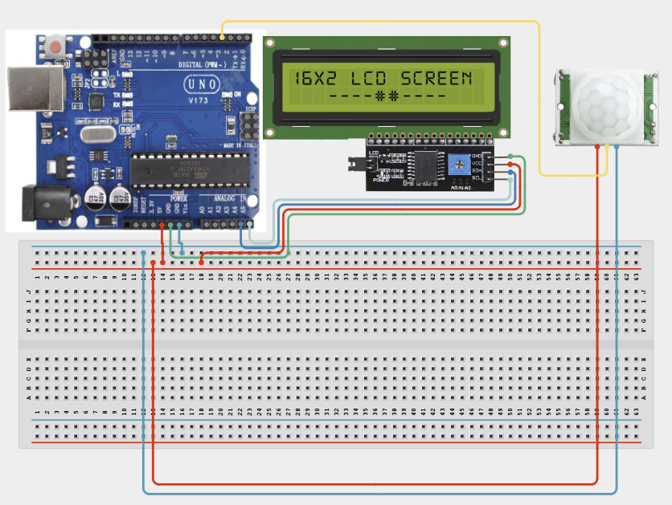

# Project 2.7: Motion-Activated Welcome Display

| **Description** This project uses a PIR Motion Sensor and LCD Display to greet visitors automatically when movement is detected.|
|------------------|----------------------------------------------------------------|
| **Use case**     |This project is connected to real-world uses such as: Motion-activated systems are commonly used in automatic doors, smart lighting systems, and security devices.|

## Components (Things You will need)

|  |  |  |  | | |
|------------------------------------------------------ | ----------------------------------------------------------- | --------------------------------------------------------- | ------------------------------------------------------ | ------------------------------------------------------ |------------------------------------------------------ |------------------------------------------------------ |

## Building the circuit

Things Needed:

- Arduino Uno = 1
- Arduino USB cable = 1
- Servo motor = 1
- Jumper Wires
- Motion Sensor
- LCD Display

## Mounting the component on the breadboard and wiring the circuit

**Step 1:**	Place the PIR Motion Sensor and I2C LCD Display on the breadboard.
- Connect the PIR sensor by connecting VCC to 5V, GND to GND, and OUT to Digital Pin 2 on the Arduino Uno. Next, connect the I2C LCD by connecting VCC to 5V, GND to GND, SDA to A4, and SCL to A5. 
- Finally, ensure that all GND connections are connected to a common ground line when using multiple modules to guarantee proper operation.



_Make sure to connect the Arduino USB cable to the Arduino board._

## PROGRAMMING

**Step 1:** Open your Arduino IDE. See how to set up here: [Getting Started](../../Getting Started/Arduino_IDE_Setup.md).

**Step 2:** Write the complete program implementing the system logic with appropriate pin definitions, setup configuration, and the main control loop.

```cpp
#include <Wire.h>
#include <LiquidCrystal_I2C.h>
LiquidCrystal_I2C lcd(0x27,16,2);
int pirPin = 2;
void setup() {
 pinMode(pirPin, INPUT);
 lcd.init();
 lcd.backlight();
 lcd.print("Waiting...");
}
void loop() {
 int motion = digitalRead(pirPin);
 if(motion == HIGH){
   lcd.clear();
   lcd.print("Welcome!");
   lcd.setCursor(0,1);
   lcd.print("Motion Found");
 }
 else{
   lcd.clear();
   lcd.print("Waiting...");
 }
 delay(500);
}


```

**Step 7:** Save your code. _See the [Getting Started](../../Getting Started/Arduino_IDE_Setup.md) section_

**Step 8:** Select the arduino board and port _See the [Getting Started](../../Getting Started/Arduino_IDE_Setup.md) section:Selecting Arduino Board Type and Uploading your code_.

**Step 9:** Upload your code. _See the [Getting Started](../../Getting Started/Arduino_IDE_Setup.md) section:Selecting Arduino Board Type and Uploading your code_

## CONCLUSION

When no motion is detected by the PIR sensor, the LCD displays "Waiting..." to indicate that the system is in standby mode. When motion is detected, the LCD displays a welcome message, indicating that a person has approached and the system has successfully detected their presence.