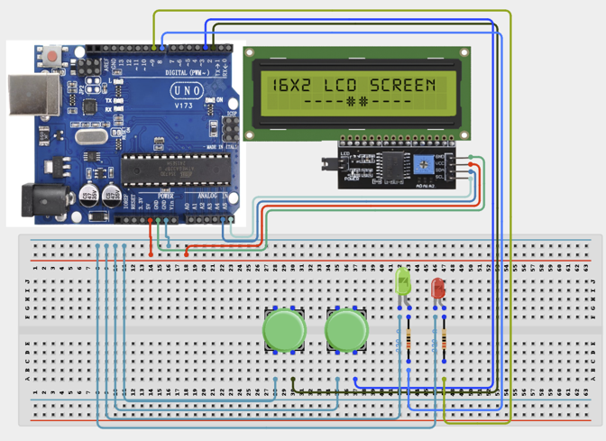

# Project 2.9: Interactive Quiz Console

| **Description** | This project introduces user interaction, decision-making logic, score tracking, and feedback systems. Similar systems are used in educational games, classroom response systems, and training simulators. |
|------------------|----------------------------------------------------------------|
| **Use case**     | This project is connected to real-world uses such as: This project demonstrates how computers collect user input, evaluate responses, and provide feedback. Similar systems are used in online tests, learning games, and classroom assessment platforms. |

## Components (Things You will need)

|  |  |  |  |  |  |  |  |
| --- | --- | --- | --- | --- | --- | --- | --- |

## Building the circuit

Things Needed:

- Arduino Uno
- Push Buttons
- I2C LCD Display
- Green LED
- Red LED
- × 220Ω Resistors
- Breadboard
- Jumper Wires
- Arduino USB Cable

## Mounting the component on the breadboard and wiring the circuit

**Step 1:**	Place the two push buttons, green LED, red LED, and I2C LCD display on the breadboard. Ensure that the components are positioned correctly and securely.

- Connect the 5V pin on the Arduino Uno board to the positive power rail on the breadboard using a jumper wire. Then, connect a GND pin on the Arduino Uno board to the ground rail on the breadboard.

- Connect the first push button to Digital Pin 2 on the Arduino Uno board and the second push button to Digital Pin 3 using jumper wires. Connect the other terminals of both push buttons to the ground rail on the breadboard.

- Place the green LED on the breadboard. Connect the positive leg of the green LED to Digital Pin 8 through a 220Ω resistor. Then, connect the negative leg of the LED to the ground rail.

- Place the red LED on the breadboard. Connect the positive leg of the red LED to Digital Pin 9 through a 220Ω resistor. Then, connect the negative leg of the LED to the ground rail.

- Connect the VCC pin of the I2C LCD display to the 5V power rail and the GND pin to the ground rail. Then, connect the SDA pin to A4 on the Arduino Uno board and the SCL pin to A5 using jumper wires.

- Ensure that the GND connections of the push buttons, LEDs, LCD display, and Arduino Uno share the same ground line. This provides a common ground for all components.

- Compare all connections with the Circuit Connections table and the circuit diagram. Check that the LEDs are connected with the correct polarity and that the 220Ω resistors are correctly connected before powering the circuit.

- After confirming that all connections are correct, connect the USB cable to the Arduino Uno board and the computer to power the circuit.



_Make sure to connect the Arduino USB cable to the Arduino board._

## PROGRAMMING

**Step 1:** Open your Arduino IDE. See how to set up here: [Getting Started](../../Getting Started/Arduino_IDE_Setup.md).

**Step 2:** Write the complete program implementing the system logic with appropriate pin definitions, setup configuration, and the main control loop.

```cpp

// LCD libraries
#include <Wire.h>
#include <LiquidCrystal_I2C.h>
// Create LCD object
LiquidCrystal_I2C lcd(0x27,16,2);
// Button pins
int trueButton = 2;
int falseButton = 3;
// LED pins
int greenLED = 8;
int redLED = 9;
// Score variable
int score = 0;
void setup() {
  // Configure buttons
  pinMode(trueButton, INPUT_PULLUP);
  pinMode(falseButton, INPUT_PULLUP);
  // Configure LEDs
  pinMode(greenLED, OUTPUT);
  pinMode(redLED, OUTPUT);
  // Start LCD
  lcd.init();
  lcd.backlight();
  // Display question
  lcd.setCursor(0,0);
  lcd.print("Arduino Uno");
  lcd.setCursor(0,1);
  lcd.print("is a MCU?");
}
void loop() {
  // TRUE button pressed
  if(digitalRead(trueButton) == LOW){
    score++;
    digitalWrite(greenLED,HIGH);
    lcd.clear();
    lcd.print("Correct!");
    lcd.setCursor(0,1);
    lcd.print("Score:");
    lcd.print(score);
    delay(2000);
    digitalWrite(greenLED,LOW);
  }
  // FALSE button pressed
  if(digitalRead(falseButton) == LOW){
    digitalWrite(redLED,HIGH);
    lcd.clear();
    lcd.print("Incorrect!");
    lcd.setCursor(0,1);
    lcd.print("Try Again");
    delay(2000);
    digitalWrite(redLED,LOW);
  }
}


```

**Step 3:** Save your code. _See the [Getting Started](../../Getting Started/Arduino_IDE_Setup.md) section_

**Step 4:** Select the arduino board and port _See the [Getting Started](../../Getting Started/Arduino_IDE_Setup.md) section:Selecting Arduino Board Type and Uploading your code_.

**Step 5:** Upload your code. _See the [Getting Started](../../Getting Started/Arduino_IDE_Setup.md) section:Selecting Arduino Board Type and Uploading your code_

## CONCLUSION

The Interactive Quiz Console powers on and waits for sensor input or user action. Input or command changes: The display, buzzer, LED, motor, servo, relay, or RGB output responds according to the program logic. Threshold or event condition: The system gives visible, audible, movement, or display feedback when the condition is detected.
