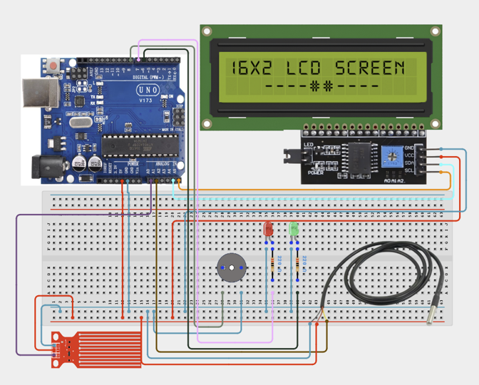

# Project 3.10: Smart Disaster Early Warning System

| **Description** | In this project, learners will build a Smart Disaster Early Warning System capable of monitoring environmental conditions that may indicate danger. The system uses a Water Level Sensor and Temperature Sensor to detect abnormal conditions. Information is displayed on an LCD screen, while LEDs and a Buzzer provide visual and audible alerts.
This project demonstrates the principles used in flood monitoring, wildfire detection, and environmental hazard warning systems.|
|------------------|----------------------------------------------------------------|
| **Use case**     |This project is connected to real-world uses such as: This project demonstrates how environmental conditions can be monitored continuously to provide early warnings. Similar systems are used for flood monitoring, wildfire detection, and industrial safety applications.|

## Components (Things You will need)

|  |  |  |  |  |  |  |  |  | |
|---|---|---|---|---|---|---|---|---|

## Building the circuit

Things Needed:

- Arduino Uno
- Water Level Sensor
- LM35 Temperature Sensor
- I2C LCD Display
- Green LED
- Red LED
- Buzzer
- 220Ω Resistors
- Breadboard
- Jumper Wires

## Mounting the component on the breadboard and wiring the circuit

**Step 1:**	Identify each component listed in the Required Components table before assembling the circuit.

- Place the Water Level Sensor, LM35 Temperature Sensor, I²C LCD Display, and buzzer on the breadboard.

- Connect the Water Level Sensor by connecting the VCC pin to 5V, the GND pin to GND, and the signal (AO) pin to the specified analog input pin on the Arduino Uno.

- Connect the LM35 Temperature Sensor by connecting the VCC pin to 5V, the GND pin to GND, and the OUT pin to the specified analog input pin on the Arduino Uno.

- Connect the buzzer by connecting the positive (+) pin to Digital Pin 8 and the negative (–) pin to the GND pin on the Arduino Uno.

- Connect the I²C LCD Display by connecting the SDA pin to Analog Pin A4, the SCL pin to Analog Pin A5, the VCC pin to 5V, and the GND pin to GND on the Arduino Uno.

- Ensure all components share a common 5V and GND connection, then carefully verify every connection before connecting the Arduino Uno to your computer using the USB cable.



_Make sure to connect the Arduino USB cable to the Arduino board._

## PROGRAMMING

**Step 1:** Open your Arduino IDE. See how to set up here: [Getting Started](../../Getting Started/Arduino_IDE_Setup.md).

**Step 2:** Write the complete program implementing the system logic with appropriate pin definitions, setup configuration, and the main control loop.

```cpp

#include <Wire.h>
#include <LiquidCrystal_I2C.h>
// Create LCD object
LiquidCrystal_I2C lcd(0x27,16,2);
// Sensor pins
int waterPin = A0;
int tempPin = A1;
// Output pins
int greenLED = 6;
int redLED = 7;
int buzzerPin = 8;
void setup() {
  // Initialize LCD
  lcd.init();
  lcd.backlight();
  // Configure output pins
  pinMode(greenLED, OUTPUT);
  pinMode(redLED, OUTPUT);
  pinMode(buzzerPin, OUTPUT);
}
void loop() {
  // Read water sensor
  int waterLevel = analogRead(waterPin);
  // Read temperature sensor
  int sensorValue = analogRead(tempPin);
  // Convert to voltage
  float voltage = sensorValue * (5.0 / 1023.0);
  // Convert voltage to Celsius
  float temperature = voltage * 100;
  // Display readings
  lcd.setCursor(0,0);
  lcd.print("W:");
  lcd.print(waterLevel);
  lcd.print(" T:");
  lcd.print(temperature,0);
  // Safe condition
  if(waterLevel < 600 && temperature < 40){
    digitalWrite(greenLED,HIGH);
    digitalWrite(redLED,LOW);
    digitalWrite(buzzerPin,LOW);
    lcd.setCursor(0,1);
    lcd.print("Status: SAFE ");
  }
  // Danger condition
  else{
    digitalWrite(greenLED,LOW);
    digitalWrite(redLED,HIGH);
    digitalWrite(buzzerPin,HIGH);
    lcd.setCursor(0,1);
    lcd.print("DANGER ALERT!");
  }
  delay(500);
}

```

**Step 7:** Save your code. _See the [Getting Started](../../Getting Started/Arduino_IDE_Setup.md) section_

**Step 8:** Select the arduino board and port _See the [Getting Started](../../Getting Started/Arduino_IDE_Setup.md) section:Selecting Arduino Board Type and Uploading your code_.

**Step 9:** Upload your code. _See the [Getting Started](../../Getting Started/Arduino_IDE_Setup.md) section:Selecting Arduino Board Type and Uploading your code_

## CONCLUSION

When the program is running, the Smart Disaster Early Warning System continuously monitors the water level and temperature. The LCD displays the current sensor readings, while the green LED indicates safe conditions. If the water level or temperature exceeds the predefined threshold, the red LED lights up, the buzzer sounds, and the LCD displays a danger alert, providing an immediate visual and audible warning of potential hazardous conditions.
