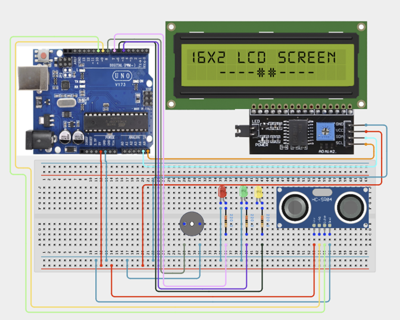

# Project 3.12: Smart City Traffic Monitoring System

| **Description** | In this project, learners will build a Smart City Traffic Monitoring System using Ultrasonic Sensors, LEDs, a Buzzer, and an LCD Display. The system monitors traffic congestion levels and warns operators when congestion becomes excessive.|
|------------------|----------------------------------------------------------------|
| **Use case**     |This project is connected to real-world uses such as: This project demonstrates how smart-city systems monitor and manage traffic congestion to improve transportation efficiency.|

## Components (Things You will need)

|  |  |  |  |  |  |  |  |  |
|---|---|---|---|---|---|---|---|---|

## Building the circuit

Things Needed:

- Arduino Uno
- Ultrasonic Sensor
- LCD Display
- Green LED
- Yellow LED
- Red LED
- Buzzer
- Breadboard
- Jumper Wires
- Arduino USB Cable

## Mounting the component on the breadboard and wiring the circuit

**Step 1:** Connect the Arduino 5V pin to the breadboard's positive (+) power rail and the Arduino GND pin to the negative (-) power rail.

**Step 2:** Ensure that all GND connections share the same ground line to maintain stable and reliable circuit operation.



**Step 3:** After confirming that all connections are correct, connect the USB cable to the Arduino Uno board and the computer to power the circuit.

_Make sure to connect the Arduino USB cable to the Arduino board._

## PROGRAMMING

**Step 1:** Open your Arduino IDE. See how to set up here: [Getting Started](../../STEMAIDE_CODER_Kit_Manual/Getting_Started/Arduino_IDE_Setup.md).

**Step 2:** Write the complete program implementing the system logic with appropriate pin definitions, setup configuration, and the main control loop.

```cpp

#include <Wire.h>
#include <LiquidCrystal_I2C.h>

// Create LCD object
LiquidCrystal_I2C lcd(0x27, 16, 2);

// Pin definitions
const int trigPin = 9;
const int echoPin = 10;

const int greenLED = 5;
const int yellowLED = 6;
const int redLED = 7;

const int buzzerPin = 8;

void setup() {

  // Initialize LCD
  lcd.init();
  lcd.backlight();

  // Configure pins
  pinMode(trigPin, OUTPUT);
  pinMode(echoPin, INPUT);

  pinMode(greenLED, OUTPUT);
  pinMode(yellowLED, OUTPUT);
  pinMode(redLED, OUTPUT);

  pinMode(buzzerPin, OUTPUT);

  // Ensure outputs are OFF initially
  digitalWrite(greenLED, LOW);
  digitalWrite(yellowLED, LOW);
  digitalWrite(redLED, LOW);
  digitalWrite(buzzerPin, LOW);

  // Startup message
  lcd.setCursor(0, 0);
  lcd.print("Traffic System");
  lcd.setCursor(0, 1);
  lcd.print("Starting...");
  delay(1500);
  lcd.clear();
}

void loop() {

  // Send ultrasonic pulse
  digitalWrite(trigPin, LOW);
  delayMicroseconds(2);

  digitalWrite(trigPin, HIGH);
  delayMicroseconds(10);

  digitalWrite(trigPin, LOW);

  // Measure echo duration
  long duration = pulseIn(echoPin, HIGH);

  // No object detected
  if (duration == 0) {

    digitalWrite(greenLED, LOW);
    digitalWrite(yellowLED, LOW);
    digitalWrite(redLED, LOW);
    digitalWrite(buzzerPin, LOW);

    lcd.clear();
    lcd.setCursor(0, 0);
    lcd.print("No Object");
    lcd.setCursor(0, 1);
    lcd.print("Detected");
    delay(300);

    return;
  }

  // Calculate distance (cm)
  int distance = duration * 0.034 / 2;

  // Display distance
  lcd.setCursor(0, 0);
  lcd.print("Traffic:");
  lcd.print(distance);
  lcd.print("cm   ");

  // Traffic conditions
  if (distance > 30) {

    digitalWrite(greenLED, HIGH);
    digitalWrite(yellowLED, LOW);
    digitalWrite(redLED, LOW);
    digitalWrite(buzzerPin, LOW);

    lcd.setCursor(0, 1);
    lcd.print("Free Flow      ");

  }
  else if (distance > 15) {

    digitalWrite(greenLED, LOW);
    digitalWrite(yellowLED, HIGH);
    digitalWrite(redLED, LOW);
    digitalWrite(buzzerPin, LOW);

    lcd.setCursor(0, 1);
    lcd.print("Moderate       ");

  }
  else {

    digitalWrite(greenLED, LOW);
    digitalWrite(yellowLED, LOW);
    digitalWrite(redLED, HIGH);
    digitalWrite(buzzerPin, HIGH);

    lcd.setCursor(0, 1);
    lcd.print("Congestion!    ");

  }

  delay(300);
}

```

**Step 7:** Save your code. _See the [Getting Started](../../STEMAIDE_CODER_Kit_Manual/Getting_Started/Arduino_IDE_Setup.md) section_

**Step 8:** Select the arduino board and port _See the [Getting Started](../../Getting Started/Arduino_IDE_Setup.md).

**Step 9:** Upload your code.

## CONCLUSION

When traffic is light, the LCD displays the measured distance (for example, Traffic: 40 cm) and the message "Free Flow." The green LED turns on to indicate normal traffic conditions, while the yellow LED, red LED, and buzzer remain off.

When traffic becomes heavy, the LCD displays the measured distance (for example, Traffic: 8 cm) and the message "Congestion." The red LED turns on and the buzzer sounds to alert users that traffic congestion has been detected.
