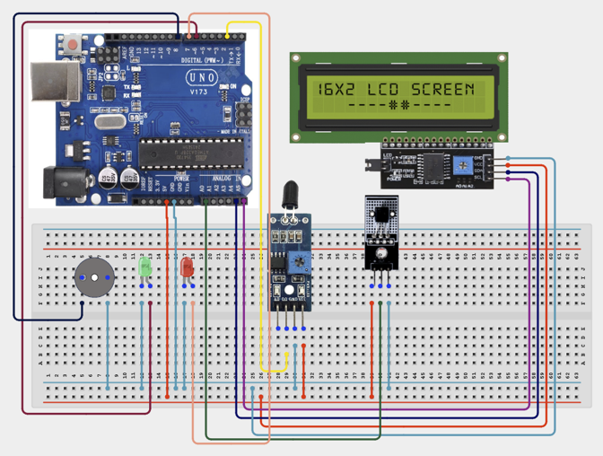

# Project 3.13: Smart Industrial Safety Monitoring System

| **Description** |In this project, learners will build an Industrial Safety Monitoring System that monitors workplace conditions using a Temperature Sensor, Flame Sensor, LCD Display, LEDs, and a Buzzer. The system provides immediate warnings when dangerous temperatures or fire conditions are detected. This project simulates safety-monitoring systems commonly used in factories, warehouses, laboratories, and manufacturing plants.|
|------------------|----------------------------------------------------------------|
| **Use case**     | This project is connected to real-world uses such as: demonstrates industrial safety systems used to protect personnel, equipment, and facilities from hazardous conditions. |

## Components (Things You will need)

|  |  |  |  |  |  |  |  |  |  |
|---|---|---|---|---|---|---|---|---|---|

## Building the circuit

Things Needed:

- Arduino Uno
- Flame Sensor Module
- LM35 Temperature Sensor
- I2C LCD Display
- Red LED
- Green LED
- Buzzer
- Breadboard
- Jumper Wires
- 220Ω Resistors
- Arduino USB Cable

## Mounting the component on the breadboard and wiring the circuit

**Step 1:** Connect the Arduino 5V pin to the breadboard's positive (+) power rail and the Arduino GND pin to the negative (-) power rail.

**Step 2:** Place the Flame Sensor Module on the breadboard.

  - Connect the VCC pin to the 5V power rail on the breadboard

  - Connect the GND pin to the ground rail on the breadboard

  - Connect the Signal pin to Digital Pin 2 on the Arduino Uno.

**Step 3:** Place the LM35 Temperature Sensor on the breadboard.

  - Connect the VCC pin to the 5V power rail on the breadboard

  - Connect the GND pin to the ground rail on the breadboard

  - Connect the VOUT pin to Analog Pin A0 on the Arduino Uno.

**Step 4:** Place the buzzer on the breadboard.

  - Connect the positive (+) pin to Digital Pin 8

  - Connect the negative (–) pin to the ground rail on the breadboard.

**Step 5:** Place the Red LED on the breadboard.

  - Connect the positive (anode) pin to Digital Pin 7

  - Connect the negative (cathode) pin to the ground rail on the breadboard.

**Step 6:** Place the Green LED on the breadboard.

  - Connect the positive (anode) pin to Digital Pin 6

  - Connect the negative (cathode) pin to the ground rail on the breadboard.

**Step 7:** Place the I²C LCD Display on the breadboard.

  - Connect the SDA pin to Analog Pin A4

  - Connect the SCL pin to Analog Pin A5

  - Connect the VCC pin to the 5V power rail on the breadboard

  - Connect the GND pin to the ground rail on the breadboard.

**Step 8:** Ensure all components share a common 5V and GND connection, then carefully verify every connection before connecting the Arduino Uno to your computer using the USB cable.



**Step 9:** After confirming that all connections are correct, connect the USB cable to the Arduino Uno board and the computer to power the circuit.

_Make sure to connect the Arduino USB cable to the Arduino board._

## PROGRAMMING

**Step 1:** Open your Arduino IDE. See how to set up here: [Getting Started](../../Getting Started/Arduino_IDE_Setup.md).

**Step 2:** Write the complete program implementing the system logic with appropriate pin definitions, setup configuration, and the main control loop.

```cpp

#include <Wire.h>
#include <LiquidCrystal_I2C.h>

// Create LCD object
LiquidCrystal_I2C lcd(0x27, 16, 2);

// Sensor pins
const int flamePin = 2;
const int tempPin = A0;

// Alert pins
const int greenLED = 6;
const int redLED = 7;
const int buzzerPin = 8;

void setup() {

  // Initialize LCD
  lcd.init();
  lcd.backlight();

  // Configure pin modes
  pinMode(flamePin, INPUT);
  pinMode(greenLED, OUTPUT);
  pinMode(redLED, OUTPUT);
  pinMode(buzzerPin, OUTPUT);

  // Initialize outputs
  digitalWrite(greenLED, LOW);
  digitalWrite(redLED, LOW);
  digitalWrite(buzzerPin, LOW);

  // Startup message
  lcd.setCursor(0, 0);
  lcd.print("Fire Monitor");
  lcd.setCursor(0, 1);
  lcd.print("Starting...");
  delay(1500);
  lcd.clear();
}

void loop() {

  // Read flame sensor
  int flameDetected = digitalRead(flamePin);

  // Read LM35 temperature sensor
  int sensorValue = analogRead(tempPin);

  // Convert analog reading to temperature
  float voltage = sensorValue * (5.0 / 1023.0);
  float temperature = voltage * 100.0;

  // Display temperature
  lcd.setCursor(0, 0);
  lcd.print("Temp:");
  lcd.print(temperature, 1);
  lcd.print((char)223);   // Degree symbol
  lcd.print("C ");

  // Determine alarm conditions
  bool fireDetected = (flameDetected == LOW);   // Change to HIGH if your flame sensor is active HIGH
  bool highTemperature = (temperature > 50.0);

  if (fireDetected || highTemperature) {

    digitalWrite(redLED, HIGH);
    digitalWrite(greenLED, LOW);
    digitalWrite(buzzerPin, HIGH);

    lcd.setCursor(0, 1);
    lcd.print("FIRE WARNING! ");

  }
  else {

    digitalWrite(redLED, LOW);
    digitalWrite(greenLED, HIGH);
    digitalWrite(buzzerPin, LOW);

    lcd.setCursor(0, 1);
    lcd.print("Area Safe     ");
  }

  delay(500);
}

```

**Step 3:** Save your code. _See the [Getting Started](../../Getting Started/Arduino_IDE_Setup.md) section_

**Step 4:** Select the arduino board and port _See the [Getting Started](../../Getting Started/Arduino_IDE_Setup.md) section:Selecting Arduino Board Type and Uploading your code_.

**Step 5:** Upload your code. _See the [Getting Started](../../Getting Started/Arduino_IDE_Setup.md) section:Selecting Arduino Board Type and Uploading your code_

## CONCLUSION

When the program is running, the Industrial Safety Monitoring System continuously monitors the surrounding area for flames and high temperatures. The LCD displays the current temperature, while the green LED indicates that the area is safe. If a flame is detected or the temperature exceeds the preset threshold, the red LED lights up, the buzzer sounds, and the LCD displays a "FIRE WARNING!" message, providing immediate visual and audible alerts to warn users of a potential fire hazard.
