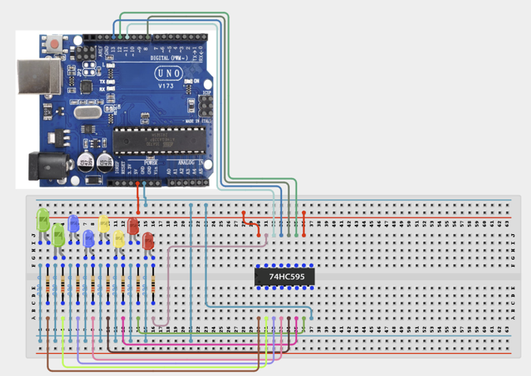

# Project 3.16: 74HC595 LED Chaser

| **Description** | In this project, learners will use a 74HC595 shift register to control eight LEDs in a chasing sequence using only three Arduino pins. This project introduces the concept of serial-to-parallel data output and pin expansion, which is essential when a project requires more output devices than the Arduino has available pins. Learners will discover how data is shifted out bit by bit to control all eight LED outputs, and how this technique scales in real embedded systems designs.|
|------------------|----------------------------------------------------------------|
| **Use case**     | This project is connected to real-world uses such as: The 74HC595 shift register allows one Arduino board to control far more outputs than its physical pins. This technique is used in LED matrices, multiplexed displays, and industrial control panels. |

## Components (Things You will need)

|  |  |  |  |  |  |  |
|----------------------------- |------------------------ | -------------------- |---------------------------- | -------------------------- | ------------------------ |------------------------ |

## Building the circuit

Things Needed:

- Arduino Uno
- 74HC595 Shift Register
- LEDs
- 220Ω Resistors
- Breadboard
- Jumper Wires
- Arduino USB Cable

## Mounting the component on the breadboard and wiring the circuit

**Step 1:** Place the 74HC595 Shift Register and the 8 LEDs with 220Ω resistors on the breadboard.

- Connect the 74HC595 control pins to the Arduino Uno:

- Connect Pin 14 (DS / Serial Data Input) to Digital Pin 11.

- Connect Pin 12 (ST_CP / Latch Clock) to Digital Pin 8.

- Connect Pin 11 (SH_CP / Shift Clock) to Digital Pin 12.

- Connect the power pins of the 74HC595:

- Connect Pin 16 (VCC) to 5V on the Arduino Uno.

- Connect Pin 8 (GND) to GND on the Arduino Uno.

- Connect Pin 10 (SRCLR / Master Reset) to 5V to keep the shift register active.

- Connect Pin 13 (OE / Output Enable) to GND to enable the outputs.

- Connect the LED outputs from the 74HC595:

- Connect Q0 to Q7 output pins (Pins 15, 1, 2, 3, 4, 5, 6, and 7) to the LED anodes (+) through 220Ω resistors.

- Connect all LED cathodes (-) to the common GND rail on the breadboard.



_Make sure to connect the Arduino USB cable to the Arduino board._

## PROGRAMMING

**Step 1:** Open your Arduino IDE. See how to set up here: [Getting Started](../../STEMAIDE_CODER_Kit_Manual/Getting_Started/Arduino_IDE_Setup.md).

**Step 2:** Write the complete program implementing the system logic with appropriate pin definitions, setup configuration, and the main control loop.

```cpp

// 74HC595 Shift Register — LED Chaser
int dataPin = 11;   // DS: Serial Data
int latchPin = 8;   // ST_CP: Latch
int clockPin = 12;  // SH_CP: Shift Clock

void setup() {
  pinMode(dataPin, OUTPUT);
  pinMode(latchPin, OUTPUT);
  pinMode(clockPin, OUTPUT);
}

void loop() {
  // Chase from LED 0 to LED 7
  for (int i = 0; i < 8; i++) {
    byte pattern = (1 << i); // Shift 1 bit left
    digitalWrite(latchPin, LOW);
    shiftOut(dataPin, clockPin, MSBFIRST, pattern);
    digitalWrite(latchPin, HIGH);
    delay(100);
  }
  // Chase from LED 7 back to LED 0
  for (int i = 6; i >= 0; i--) {
    byte pattern = (1 << i);
    digitalWrite(latchPin, LOW);
    shiftOut(dataPin, clockPin, MSBFIRST, pattern);
    digitalWrite(latchPin, HIGH);
    delay(100);
  }
}

```

**Step 3:** Save your code. _See the [Getting Started](../../Getting Started/Arduino_IDE_Setup.md) section_

**Step 4:** Select the arduino board and port _See the [Getting Started](../../STEMAIDE_CODER_Kit_Manual/Getting_Started/Arduino_IDE_Setup.md).

**Step 5:** Upload your code.

## CONCLUSION

When the program starts, the 8 LEDs connected through the 74HC595 shift register begin a continuous chasing pattern.

The LEDs illuminate one at a time in sequence from LED 0 to LED 7, creating a moving light effect. After reaching LED 7, the pattern reverses direction and the LEDs light up from LED 7 back to LED 0.
The sequence repeats continuously, creating a back-and-forth LED chasing animation. The speed of the animation can be adjusted by changing the delay(100) value in the program. A smaller delay value makes the LED chase faster, while a larger delay value slows down the movement.
