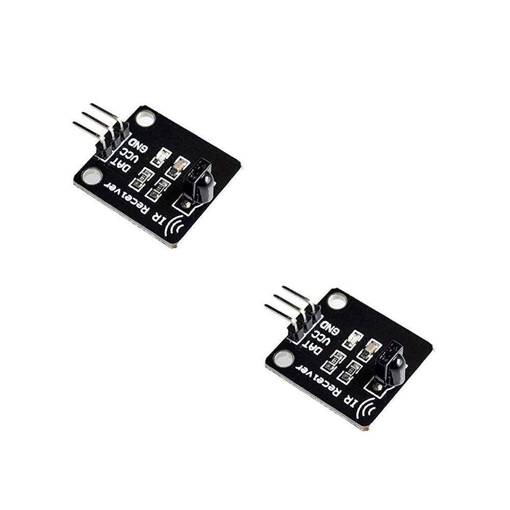
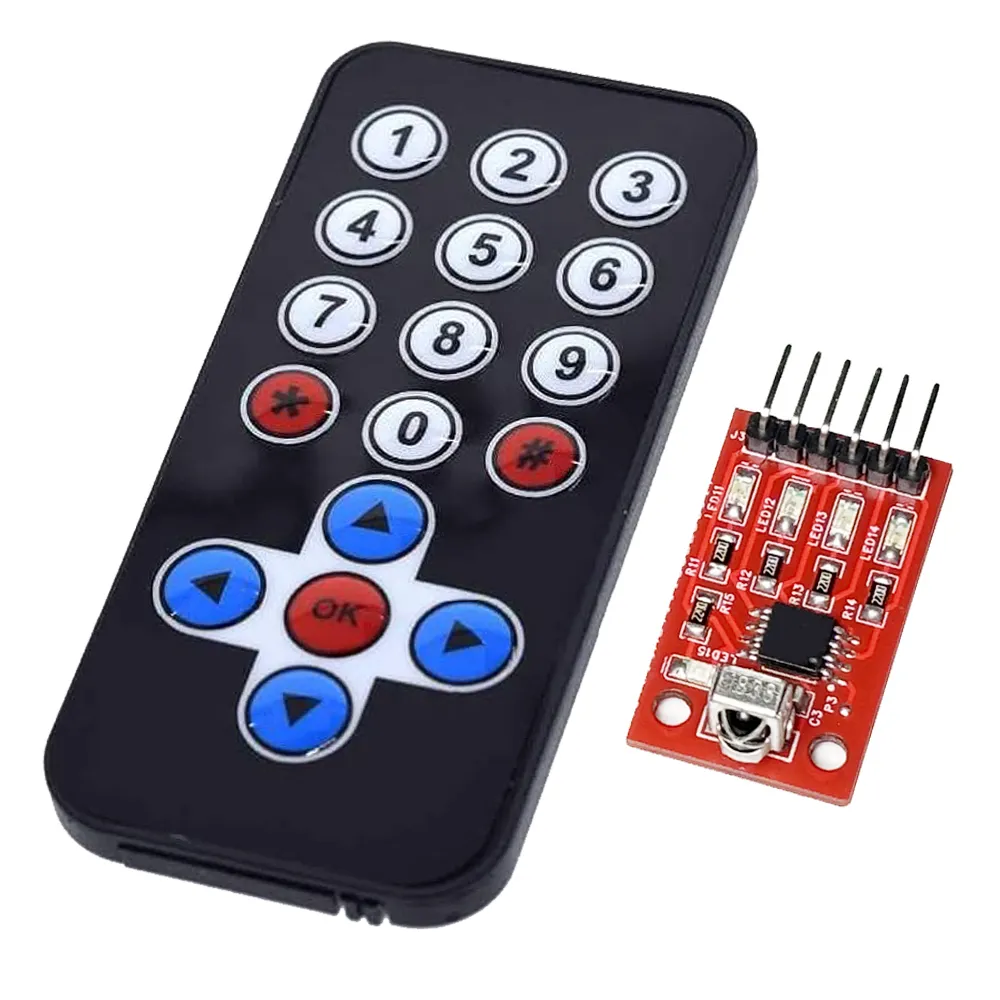
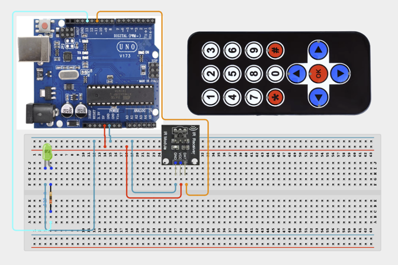

# Project 3.17: IR Remote LED Controller

| **Description** | In this project, learners will use an infrared (IR) receiver module and the included remote control to turn an LED on and off wirelessly. This project introduces the concept of infrared wireless communication, which is the same technology used in television remote controls and home automation devices.
Learners will use the IRremote library to decode button press signals from the remote control and use those signals to control a real-world output.|
|------------------|----------------------------------------------------------------|
| **Use case**     |This project is connected to real-world uses such as: Infrared communication allows wireless control of devices over short distances. This technique is used in TV remotes, air conditioner controllers, and smart home systems.|

## Components (Things You will need)

|  |  |  |  |  |  |  |  |
| --- | --- | --- | --- | --- | --- | --- | --- |

## Building the circuit

Things Needed:

- Arduino Uno
- IR Receiver Module (TSOP38238 or similar)
- IR Remote Control
- LED
- 220Ω Resistor
- Breadboard
- Jumper Wires
- Arduino USB Cable


## Mounting the component on the breadboard and wiring the circuit

**Step 1:**	Identify each component listed in the Required Components table before assembling the circuit.

- Place the IR Receiver Module (TSOP38238 or similar), IR Remote Control, and LED with a 220Ω resistor on the breadboard.

- Connect the IR Receiver Module:
-Connect the OUT pin to Digital Pin 11 on the Arduino Uno to receive IR signal data.

- Connect the VCC pin to 5V for power supply.

- Connect the GND pin to GND for the ground connection.

- Connect the LED indicator:

- Connect the LED Anode (+) pin to Digital Pin 13 through a 220Ω resistor.

- Connect the LED Cathode (-) pin to GND on the Arduino Uno.

- Ensure all GND connections share the same ground line on the breadboard.

- Check the polarity of the LED and verify that the resistor is connected in series before supplying power.



_Make sure to connect the Arduino USB cable to the Arduino board._

## PROGRAMMING

**Step 1:** Open your Arduino IDE. See how to set up here: [Getting Started](../../Getting Started/Arduino_IDE_Setup.md).

**Step 2:** Write the complete program implementing the system logic with appropriate pin definitions, setup configuration, and the main control loop.

```cpp

// IR Remote LED Controller
// Requires: IRremote Library (Install through Arduino Library Manager)

#include <IRremote.hpp>

// Pin definitions
const int receiverPin = 11;
const int ledPin = 13;

// LED state
bool ledState = false;


void setup() {

  Serial.begin(9600);

  // Start IR receiver
  IrReceiver.begin(receiverPin, ENABLE_LED_FEEDBACK);

  // Configure LED pin
  pinMode(ledPin, OUTPUT);

  // Ensure LED starts OFF
  digitalWrite(ledPin, LOW);

  Serial.println("IR Receiver Ready");
  Serial.println("Press any remote button...");
}


void loop() {

  // Check if an IR signal is received
  if (IrReceiver.decode()) {

    // Read received command
    uint8_t code = IrReceiver.decodedIRData.command;

    Serial.print("IR Code: ");
    Serial.println(code, HEX);


    // Toggle LED state
    ledState = !ledState;

    digitalWrite(ledPin, ledState);


    // Prepare receiver for the next signal
    IrReceiver.resume();
  }
}

```

**Step 3:** Save your code. _See the [Getting Started](../../Getting Started/Arduino_IDE_Setup.md) section_

**Step 4:** Select the arduino board and port _See the [Getting Started](../../Getting Started/Arduino_IDE_Setup.md) section:Selecting Arduino Board Type and Uploading your code_.

**Step 5:** Upload your code. _See the [Getting Started](../../Getting Started/Arduino_IDE_Setup.md) section:Selecting Arduino Board Type and Uploading your code_

## CONCLUSION

When any button on the IR remote is pressed, the system receives the IR signal and toggles the LED between ON and OFF states. Each button press is detected by the IR receiver, and the corresponding hexadecimal code is displayed on the Serial Monitor.

The displayed IR codes can be used to program specific buttons to perform different actions, such as controlling multiple LEDs, activating a buzzer, or switching other connected devices.
