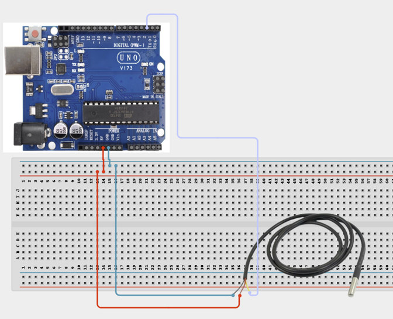

# Project 3.18: DS18B20 Digital Thermometer

| **Description** | In this project, learners will build a precise digital thermometer using the DS18B20 one-wire temperature sensor. Unlike simple analog temperature sensors, the DS18B20 communicates digitally and provides accurate readings in degrees Celsius directly. This project introduces the 1-Wire communication protocol and demonstrates how multiple digital sensors can share a single data wire, which is a key technique in professional temperature monitoring systems.|
|------------------|----------------------------------------------------------------|
| **Use case**     |This project is connected to real-world uses such as: The DS18B20 provides highly accurate digital temperature readings. Its 1-Wire protocol allows multiple sensors to share one data line, making it ideal for temperature monitoring in greenhouses, data centres, and food storage systems.|

## Components (Things You will need)

|  |  |  |  |  |  | 
| --- | --- | --- | --- | --- | --- |

## Building the circuit

Things Needed:

- Arduino Uno
- DS18B20 Temperature Module / Sensor
- 4.7kΩ Resistor
- Breadboard
- Jumper Wires
- Arduino USB Cable


## Mounting the component on the breadboard and wiring the circuit

**Step 1:** Connect the Arduino 5V pin to the breadboard's positive (+) power rail and the Arduino GND pin to the negative (-) power rail.

**Step 2:** Connect the DS18B20 Temperature Sensor:

**Step 3:** Connect the VDD (Red) wire to the 5V power rail on the breadboard.

**Step 4:** Connect the GND (Black) wire to the ground rail on the breadboard.

**Step 5:** Connect the DQ (Yellow/Data) wire to Digital Pin 2 on the Arduino Uno.

**Step 6:** Place the 4.7kΩ pull-up resistor on the breadboard.

  - Connect one end to Digital Pin 2 (DQ)

  - Connect the other end to the 5V power rail on the breadboard. This resistor is required for reliable 1-Wire communication between the Arduino Uno and the DS18B20 sensor.

**Step 7:** Ensure all GND connections share the same ground line before powering the circuit. Verify that the 4.7kΩ pull-up resistor is correctly connected between Digital Pin 2 and 5V, and check all wiring before connecting USB power.



**Step 8:** After confirming that all connections are correct, connect the USB cable to the Arduino Uno board and the computer to power the circuit.

_Make sure to connect the Arduino USB cable to the Arduino board._

## PROGRAMMING

**Step 1:** Open your Arduino IDE. See how to set up here: [Getting Started](../../STEMAIDE_CODER_Kit_Manual/Getting_Started/Arduino_IDE_Setup.md).

**Step 2:** Write the complete program implementing the system logic with appropriate pin definitions, setup configuration, and the main control loop.

```cpp

// DS18B20 Digital Thermometer
// Requires: OneWire and DallasTemperature libraries
#include <OneWire.h>
#include <DallasTemperature.h>

#define ONE_WIRE_BUS 2

OneWire oneWire(ONE_WIRE_BUS);
DallasTemperature sensors(&oneWire);

void setup() {
  Serial.begin(9600);
  sensors.begin();
  Serial.println("DS18B20 Thermometer Ready");
}

void loop() {
  sensors.requestTemperatures();
  float tempC = sensors.getTempCByIndex(0);

  if (tempC == DEVICE_DISCONNECTED_C) {
    Serial.println("Error: Sensor not connected!");
  } else {
    Serial.print("Temperature: ");
    Serial.print(tempC);
    Serial.println(" C");
  }
  delay(1000);
}

```

**Step 3:** Save your code. _See the [Getting Started](../../STEMAIDE_CODER_Kit_Manual/Getting_Started/Arduino_IDE_Setup.md) section_

**Step 4:** Select the arduino board and port _See the [Getting Started](../../STEMAIDE_CODER_Kit_Manual/Getting_Started/Arduino_IDE_Setup.md).

**Step 5:** Upload your code.

## CONCLUSION

After the program starts, the Serial Monitor displays the temperature measured by the DS18B20 temperature sensor every second.

When you hold the sensor between your fingers, the measured temperature gradually increases as the sensor detects the warmth from your hand. When you remove your hand and blow cool air across the sensor, the temperature reading gradually decreases within a few seconds as the sensor responds to the lower temperature. This demonstrates the DS18B20's ability to provide accurate, real-time digital temperature measurements.
