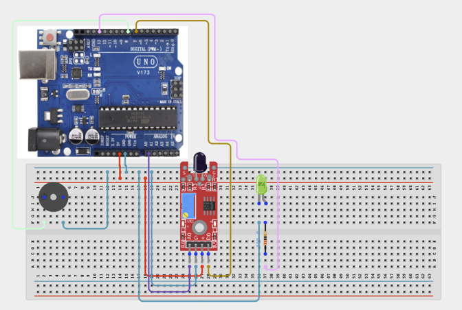

# Project 3.19: Flame Alert Guardian

| **Description** | In this project, learners will build a flame detection system that activates a buzzer and an LED alert when fire or a strong infrared light source is detected. The flame sensor module detects infrared radiation emitted by flames in a detection range of approximately 60 cm. This project introduces environmental safety sensing and threshold-based alerting, which are foundational concepts in fire alarm systems and industrial safety automation.|
|------------------|----------------------------------------------------------------|
| **Use case**     |This project is connected to real-world uses such as: Flame sensors detect infrared radiation from fire. Combined with a buzzer and alarm system, they form the core of fire detection systems used in homes, kitchens, server rooms, and factories.|

## Components (Things You will need)

|  |  |  |  |  |  |  |  | 
| --- | --- | --- | --- | --- | --- | --- | --- |

## Building the circuit

Things Needed:

- Arduino Uno
- Flame Sensor Module
- 5V Active Buzzer
- LED
- 220Ω Resistor
- Breadboard
- Jumper Wires
- Arduino USB Cable

## Mounting the component on the breadboard and wiring the circuit

**Step 1:** Connect the Arduino 5V pin to the breadboard's positive (+) power rail and the Arduino GND pin to the negative (-) power rail.

**Step 2:** Connect the Flame Sensor Module:

**Step 3:** Connect the VCC pin  of the Flame Sensor Module to the 5V power rail on the breadboard.

**Step 4:** Connect the GND pin to the ground rail on the breadboard.

**Step 5:** Connect the A0 (Analog) pin to Analog Pin A0 to read the flame intensity.

**Step 6:** Connect the D0 (Digital) pin to Digital Pin 7 to detect when the flame intensity exceeds the preset threshold.

**Step 7:** Connect the Active Buzzer:

**Step 8:** Connect the positive (+) pin to Digital Pin 8 on the Arduino Uno.

**Step 9:** Connect the negative (-) pin to the ground rail on the breadboard.

**Step 10:** Connect the LED indicator:

**Step 11:** Connect the LED Anode (+) to Digital Pin 13 through a 220Ω resistor.

**Step 12:** Connect the LED Cathode (-) to the ground rail on the breadboard.

**Step 13:** Ensure all GND connections share the same ground line on the breadboard. Check the polarity of the LED, buzzer, and Flame Sensor Module, and verify that the LED is connected through a 220Ω resistor before supplying power



**Step 14:** After confirming that all connections are correct, connect the USB cable to the Arduino Uno board and the computer to power the circuit.

_Make sure to connect the Arduino USB cable to the Arduino board._

## PROGRAMMING

**Step 1:** Open your Arduino IDE. See how to set up here: [Getting Started](../../Getting Started/Arduino_IDE_Setup.md).

**Step 2:** Write the complete program implementing the system logic with appropriate pin definitions, setup configuration, and the main control loop.

```cpp

// Flame Alert Guardian
int flameSensorAnalog = A0;
int flameSensorDigital = 7;
int buzzerPin = 8;
int ledPin = 13;

void setup() {
  Serial.begin(9600);
  pinMode(flameSensorDigital, INPUT);
  pinMode(buzzerPin, OUTPUT);
  pinMode(ledPin, OUTPUT);
  Serial.println("Flame Alert Guardian Ready");
}

void loop() {
  int analogValue = analogRead(flameSensorAnalog);
  int digitalValue = digitalRead(flameSensorDigital);

  Serial.print("Flame Intensity: ");
  Serial.print(analogValue);
  Serial.print(" | Digital: ");
  Serial.println(digitalValue);

  if (digitalValue == LOW) {
    // Flame detected — digital output goes LOW
    digitalWrite(buzzerPin, HIGH);
    digitalWrite(ledPin, HIGH);
    Serial.println("WARNING: FLAME DETECTED!");
  } else {
    digitalWrite(buzzerPin, LOW);
    digitalWrite(ledPin, LOW);
  }
  delay(200);
}

```

**Step 3:** Save your code. _See the [Getting Started](../../STEMAIDE_CODER_Kit_Manual/Getting_Started/Arduino_IDE_Setup.md) section_

**Step 4:** Select the arduino board and port _See the [Getting Started](../../STEMAIDE_CODER_Kit_Manual/Getting_Started/).

**Step 5:** Upload your code.

## CONCLUSION

Under normal conditions, when no flame is present, the buzzer remains silent and the LED stays OFF. The Serial Monitor continuously displays a high analog value (typically close to 1023), indicating that no flame has been detected.

When a flame, such as from a lighter, is brought close to the sensor, the buzzer activates and the LED turns ON to provide an audible and visual warning. At the same time, the Serial Monitor displays a lower analog value along with the message "WARNING: FLAME DETECTED!", indicating that the sensor has detected the presence of a flame.
