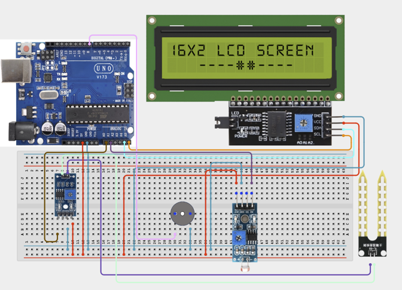

# Project 3.1: Smart Greenhouse Controller

| **Description** | In this project, learners will build a Smart Greenhouse Controller using a Soil Moisture Sensor, LDR Module, LCD Display, and Buzzer. The system monitors greenhouse conditions and alerts users when moisture or light levels become unsuitable for healthy plant growth. |
|------------------|----------------------------------------------------------------|
| **Use case**     | This project is connected to real-world uses such as smart farms, plant nurseries, and greenhouse monitoring systems. It demonstrates how sensors can track soil moisture and light conditions to support healthy plant growth. |

## Components (Things You will need)

|  |  |  |  |  |  |  |  |
| --- | --- | --- | --- | --- | --- | --- | --- |

## Building the circuit

Things Needed:

- Arduino Uno
- Arduino USB cable
- Jumper Wires
- Breadboard
- LDR Module
- 12C LCD Display
- Buzzer
- Soil Moisture Sensor

## Mounting the component on the breadboard and wiring the circuit

**Step 1:** Connect the Arduino 5V pin to the breadboard's positive (+) power rail and the Arduino GND pin to the negative (-) power rail.

**Step 2:** Place the Soil Moisture Sensor on the breadboard.

  - Connect the VCC pin to the 5V power rail on the breadboard

  - Connect the GND pin to the ground rail on the breadboard

  - Connect the AO pin to Analog Pin A1.

**Step 3:** Place the LDR Module on the breadboard.

  - Connect the positive (+) pin to Digital Pin 8

  - Connect the negative (–) pin to the ground rail on the breadboard.

**Step 4:** Place the LCD Module on the breadboard.

  - Connect the VCC pin to the 5V power rail on the breadboard

  - Connect the GND pin to the ground rail on the breadboard

  - Connect the SDA pin to Analog Pin A4

  - Connect the SCL pin to Analog Pin A5.

**Step 5:** Place the buzzer on the breadboard.

  - Connect its positive (+) pin to the specified digital pin on the Arduino Uno

  - Connect its negative (–) pin to the ground rail on the breadboard.

**Step 6:** Ensure all components share a common 5V and GND connection, then verify all wiring before connecting the Arduino Uno to your computer using the USB cable.



**Step 7:** After confirming that all connections are correct, connect the USB cable to the Arduino Uno board and the computer to power the circuit.

_Make sure to connect the Arduino USB cable to the Arduino board._

## PROGRAMMING

**Step 1:** Open your Arduino IDE. See how to set up here: [Getting Started](../../STEMAIDE_CODER_Kit_Manual/Getting_Started/Arduino_IDE_Setup.md).

**Step 2:** Write the complete program implementing the system logic with appropriate pin definitions, setup configuration, and the main control loop.

```cpp

// Include LCD libraries
#include <Wire.h>
#include <LiquidCrystal_I2C.h>
// Create LCD object
LiquidCrystal_I2C lcd(0x27,16,2);
// Sensor pins
int moisturePin = A0;
int lightPin = A1;
// Buzzer pin
int buzzerPin = 8;
void setup() {
 // Initialize LCD
 lcd.init();
 lcd.backlight();
 // Configure buzzer pin
 pinMode(buzzerPin, OUTPUT);
}
void loop() {
 // Read moisture sensor
 int moisture = analogRead(moisturePin);
 // Read light sensor
 int light = analogRead(lightPin);
 // Display moisture level
 lcd.setCursor(0,0);
 lcd.print("M:");
 lcd.print(moisture);
 // Display light level
 lcd.print(" L:");
 lcd.print(light);
 // Check plant conditions
 if(moisture < 300 || light < 250){
   // Alert user
   digitalWrite(buzzerPin,HIGH);
   lcd.setCursor(0,1);
   lcd.print("Check Plants! ");
 }
 else{
   digitalWrite(buzzerPin,LOW);
   lcd.setCursor(0,1);
   lcd.print("Conditions OK ");
 }
 delay(500);
}
```

**Step 3:** Save your code. _See the [Getting Started](../../STEMAIDE_CODER_Kit_Manual/Getting_Started/Arduino_IDE_Setup.md) section_

**Step 4:** Select the arduino board and port _See the [Getting Started](../../STEMAIDE_CODER_Kit_Manual/Getting_Started/Arduino_IDE_Setup.md).

**Step 5:** Upload your code. 

## CONCLUSION

When the program is running, the system continuously monitors the soil moisture and light intensity. If either reading falls below the predefined threshold, the LCD displays a warning message and the buzzer sounds to alert the user to check the plants. When both readings are within the acceptable range, the LCD indicates that conditions are suitable, and the buzzer remains off. This demonstrates how the Smart Greenhouse Controller can automatically monitor environmental conditions and provide timely feedback to support healthy plant growth.
