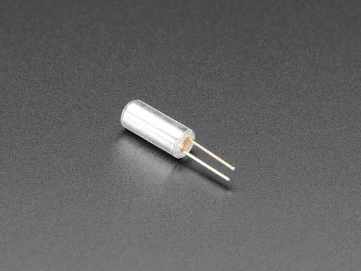

# Project 3.20: Ball Switch Orientation Alert

| **Description** | In this project, learners will use a ball switch (tilt switch) to detect changes in physical orientation and trigger a visual and audible alert. A ball switch contains a small conductive ball that rolls to complete or break the circuit depending on the angle it is held.
This project introduces orientation sensing and its real-world applications in anti-tamper systems, fall detection devices, and security enclosures.|
|------------------|----------------------------------------------------------------|
| **Use case**     |This project is connected to real-world uses such as: Ball switches detect orientation changes reliably and cheaply. They are used in anti-tamper enclosures, fall detection wearables, equipment tilt alarms, and toy activation mechanisms.|

## Components (Things You will need)

|  |  |  |  |  |   |  |  |
| --- | --- | --- | --- | --- | --- | --- | --- |

## Building the circuit

Things Needed:

- Arduino Uno
- Ball Switch (Tilt Sensor)
- 5V Active Buzzer
- LED 
- 10kΩ Resistor
- Breadboard
- Jumper Wires
- Arduino USB Cable

## Mounting the component on the breadboard and wiring the circuit

**Step 1:**	Identify each component listed in the Required Components table before assembling the circuit.

- Place the Ball Switch (Tilt Sensor), 5V Active Buzzer, and LED with a 220Ω resistor on the breadboard.

- Connect the Ball Switch (Tilt Sensor):

  - Connect Pin 1 to Digital Pin 2 on the Arduino Uno to provide the signal input.

  - Connect Pin 2 to GND on the Arduino Uno.

  - Connect a 10kΩ pull-up resistor between Digital Pin 2 and 5V. This keeps the input pin HIGH when the switch is open and ensures stable readings.

- Connect the Active Buzzer:

  - Connect the positive (+) pin to Digital Pin 8 on the Arduino Uno.

  - Connect the negative (-) pin to GND on the Arduino Uno.

- Connect the LED indicator:

  - Connect the LED Anode (+) to Digital Pin 13 through a 220Ω resistor.

  - Connect the LED Cathode (-) to GND on the Arduino Uno.

- Ensure all GND connections share the same ground line on the breadboard.

- Check the polarity of the LED and buzzer, and verify that the 10kΩ pull-up resistor and 220Ω current-limiting resistor are correctly connected before supplying power.

 _Make sure to connect the Arduino USB cable to the Arduino board._

## PROGRAMMING

**Step 1:** Open your Arduino IDE. See how to set up here: [Getting Started](../../Getting Started/Arduino_IDE_Setup.md).

**Step 2:** Write the complete program implementing the system logic with appropriate pin definitions, setup configuration, and the main control loop.

```cpp

// Ball Switch Orientation Alert

// Pin definitions
const int tiltPin = 2;
const int buzzerPin = 8;
const int ledPin = 13;

void setup() {

  Serial.begin(9600);

  // Configure pins
  pinMode(tiltPin, INPUT_PULLUP);
  pinMode(buzzerPin, OUTPUT);
  pinMode(ledPin, OUTPUT);

  // Initial output state
  digitalWrite(buzzerPin, LOW);
  digitalWrite(ledPin, LOW);

  Serial.println("Orientation Alert Ready");
}

void loop() {

  // Read the ball switch
  int tiltState = digitalRead(tiltPin);

  // Ball switch closed (tilted)
  if (tiltState == LOW) {

    digitalWrite(buzzerPin, HIGH);
    digitalWrite(ledPin, HIGH);

    Serial.println("ALERT: Tilt detected!");

  }

  // Ball switch open (upright)
  else {

    digitalWrite(buzzerPin, LOW);
    digitalWrite(ledPin, LOW);

    Serial.println("Normal: Upright position.");

  }

  delay(200);
}

```

**Step 3:** Save your code. _See the [Getting Started](../../Getting Started/Arduino_IDE_Setup.md) section_

**Step 4:** Select the arduino board and port _See the [Getting Started](../../Getting Started/Arduino_IDE_Setup.md) section:Selecting Arduino Board Type and Uploading your code_.

**Step 5:** Upload your code. _See the [Getting Started](../../Getting Started/Arduino_IDE_Setup.md) section:Selecting Arduino Board Type and Uploading your code_

## CONCLUSION

When the ball switch is held upright, the switch remains open, causing the LED to stay OFF and the buzzer to remain silent. The Serial Monitor continuously displays the message "Normal: Upright position." to indicate that no tilt has been detected.

When the ball switch is tilted or inverted, the switch closes, causing the LED to turn ON and the buzzer to activate. At the same time, the Serial Monitor displays the message "ALERT: Tilt detected!" to notify the user that the sensor has detected a change in orientation.
