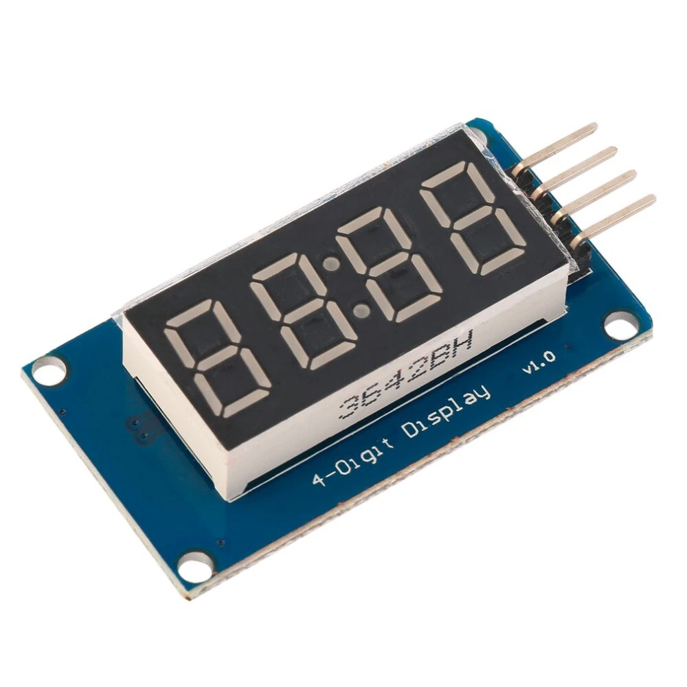
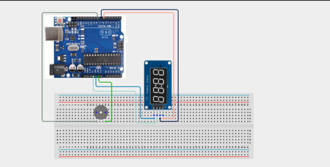

# Project 3.21: 4-Digit Countdown Timer

| **Description** | In this project, learners will build a countdown timer using the 4-digit 7-segment display module. The display counts down from 9999 to 0000, updating every second. When the timer reaches zero, a buzzer activates to signal completion. 
|------------------|----------------------------------------------------------------|
| **Use case**     | This project is connected to real-world uses such as: The TM1637 display module simplifies driving a 4-digit display. Countdown timers are used in sports equipment, cooking timers, exam boards, and industrial process control panels. |

## Components (Things You will need)

|  |  |  |  |  |  |
| --- | --- | --- | --- | --- | --- |

## Building the circuit

Things Needed:

- Arduino Uno
- 4-Digit Display Tube (TM1637)
- 5V Active Buzzer
- Breadboard
- Jumper Wires
- Arduino USB Cable

## Mounting the component on the breadboard and wiring the circuit

**Step 1:**	Identify each component listed in the Required Components table before assembling the circuit.

- Place the TM1637 4-Digit Display Module and the 5V Active Buzzer on the breadboard.

- Connect the TM1637 Display Module:

 - Connect the CLK pin to Digital Pin 6 on the Arduino Uno.

 - Connect the DIO pin to Digital Pin 7 on the Arduino Uno.

 - Connect the VCC pin to 5V on the Arduino Uno.

 - Connect the GND pin to GND on the Arduino Uno.

- Connect the Active Buzzer:

 - Connect the positive (+) pin to Digital Pin 8 on the Arduino Uno.

 - Connect the negative (-) pin to GND on the Arduino Uno.

 - Ensure all GND connections share the same ground line on the breadboard.

 - Check the polarity of the TM1637 display module and the active buzzer before supplying power.

 - Connect the Arduino Uno to the computer only after the wiring has been checked by you or a facilitator.

_Note: The TM1637 4-digit display communicates with the Arduino using only two signal pins (CLK and DIO), making it a simple and efficient way to display numbers, timers, counters, and other numerical information._



 _Make sure to connect the Arduino USB cable to the Arduino board._

## PROGRAMMING

**Step 1:** Open your Arduino IDE. See how to set up here: [Getting Started](../../Getting Started/Arduino_IDE_Setup.md).

**Step 2:** Write the complete program implementing the system logic with appropriate pin definitions, setup configuration, and the main control loop.

```cpp

// 4-Digit Countdown Timer
// Requires: TM1637Display library

#include <TM1637Display.h>

// Pin definitions
const int clkPin = 6;
const int dioPin = 7;
const int buzzerPin = 8;

// Create display object
TM1637Display display(clkPin, dioPin);

// Starting countdown value
int countdown = 9999;

void setup() {

  Serial.begin(9600);

  // Set display brightness (0–7)
  display.setBrightness(7);

  // Configure buzzer pin
  pinMode(buzzerPin, OUTPUT);
  digitalWrite(buzzerPin, LOW);

  Serial.println("Countdown Timer Started");
}

void loop() {

  // Continue counting down
  if (countdown >= 0) {

    // Display current value with leading zeros
    display.showNumberDecEx(countdown, 0, true);

    // Print value to Serial Monitor
    Serial.println(countdown);

    countdown--;

    delay(1000);

  }

  // Countdown finished
  else {

    // Sound buzzer three times
    for (int i = 0; i < 3; i++) {

      digitalWrite(buzzerPin, HIGH);
      delay(300);

      digitalWrite(buzzerPin, LOW);
      delay(300);
    }

    // Display 0000
    display.showNumberDecEx(0, 0, true);

    delay(5000);

    // Restart countdown
    countdown = 9999;
  }
}
```

**Step 3:** Save your code. _See the [Getting Started](../../Getting Started/Arduino_IDE_Setup.md) section_

**Step 4:** Select the arduino board and port _See the [Getting Started](../../Getting Started/Arduino_IDE_Setup.md) section:Selecting Arduino Board Type and Uploading your code_.

**Step 5:** Upload your code. _See the [Getting Started](../../Getting Started/Arduino_IDE_Setup.md) section:Selecting Arduino Board Type and Uploading your code_

## CONCLUSION

When the program starts, the TM1637 4-digit display shows 9999 and begins counting down by one every second. The current countdown value is also displayed in the Serial Monitor.

When the countdown reaches 0000, the active buzzer sounds three short beeps to indicate that the timer has finished. After a brief pause, the countdown automatically resets to 9999 and begins counting down again, repeating the cycle continuously.
