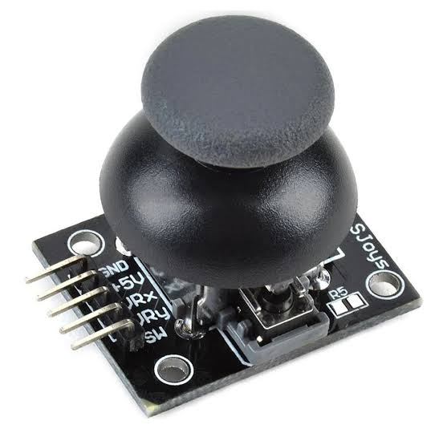
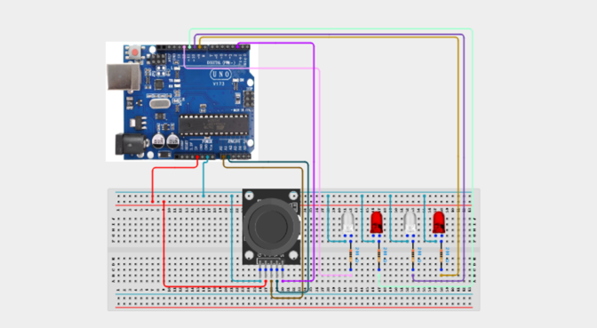

# Project 3.25: Joystick LED Direction Control

| **Description** | In this project, learners will use an XY joystick module to control different LEDs based on the direction the joystick is pushed. Moving the joystick left, right, up, or down will light up a corresponding LED, and pressing the joystick button will turn all LEDs off. This project introduces analog dual-axis input reading and directional threshold mapping — core skills for game controllers, robotic navigation, and user interface design.|
|------------------|----------------------------------------------------------------|
| **Use case**     | This project is connected to real-world uses such as: Joystick modules provide intuitive dual-axis control for robots, cameras, games, and navigation interfaces. The XY values can also be mapped to motor speed and direction in a robot driving system.|

## Components (Things You will need)

|  |  |  |  |  |  |  |
| --- | --- | --- | --- | --- | --- | --- |

## Building the circuit

Things Needed:

- Arduino Uno
- XY Joystick Module
- LEDs 
- 220Ω Resistors
- Breadboard
- Jumper Wires
- Arduino USB Cable

## Mounting the component on the breadboard and wiring the circuit

**Step 1:**	Identify each component listed in the Required Components table before assembling the circuit.

- Place the XY Joystick Module and the 5 mm LEDs (different colours) on the breadboard.

- Connect the XY Joystick Module:

 - Connect the VCC pin to 5V on the Arduino Uno.

 - Connect the GND pin to GND on the Arduino Uno.

 - Connect the VRX (X-axis) pin to Analog Pin A0 on the Arduino Uno.

 - Connect the VRY (Y-axis) pin to Analog Pin A1 on the Arduino Uno.

 - Connect the SW (push button) pin to Digital Pin 2 on the Arduino Uno.

- Connect the Direction LEDs:

 - Connect the anode (+) of the Up LED to Digital Pin 9 through a 220Ω resistor.

 - Connect the anode (+) of the Down LED to Digital Pin 10 through a 220Ω resistor.

 - Connect the anode (+) of the Left LED to Digital Pin 11 through a 220Ω resistor.

 - Connect the anode (+) of the Right LED to Digital Pin 12 through a 220Ω resistor
 .
 - Connect the cathodes (-) of all four LEDs to GND on the Arduino Uno.

 - Ensure all GND connections share the same ground line on the breadboard.

 - Verify the polarity of each LED and confirm that every LED is connected through a 220Ω current-limiting resistor before supplying power.

_Note: The XY Joystick Module provides two analog outputs (VRX and VRY) to detect horizontal and vertical movement, along with a built-in push button (SW). In this project, each LED indicates the direction in which the joystick is moved, making it easy to visualize joystick inputs._



 _Make sure to connect the Arduino USB cable to the Arduino board._

## PROGRAMMING

**Step 1:** Open your Arduino IDE. See how to set up here: [Getting Started](../../STEMAIDE_CODER_Kit_Manual/Getting_Started/Arduino_IDE_Setup.md).

**Step 2:** Write the complete program implementing the system logic with appropriate pin definitions, setup configuration, and the main control loop.

```cpp

// Joystick LED Direction Control

// Joystick pins
const int vrx = A0;
const int vry = A1;
const int sw  = 2;

// LED pins
const int ledUp    = 9;
const int ledDown  = 10;
const int ledLeft  = 11;
const int ledRight = 12;

void setup() {
  Serial.begin(9600);

  pinMode(sw, INPUT_PULLUP);

  pinMode(ledUp, OUTPUT);
  pinMode(ledDown, OUTPUT);
  pinMode(ledLeft, OUTPUT);
  pinMode(ledRight, OUTPUT);

  Serial.println("Joystick Direction Control Ready");
}

void loop() {

  // Read joystick values
  int x = analogRead(vrx);
  int y = analogRead(vry);
  int button = digitalRead(sw);

  // Display readings
  Serial.print("X: ");
  Serial.print(x);

  Serial.print(" | Y: ");
  Serial.print(y);

  Serial.print(" | Button: ");
  Serial.println(button);

  // Turn off all LEDs
  digitalWrite(ledUp, LOW);
  digitalWrite(ledDown, LOW);
  digitalWrite(ledLeft, LOW);
  digitalWrite(ledRight, LOW);

  if (button == LOW) {
    Serial.println("Button Pressed: All LEDs OFF");
  }
  else if (y < 300) {
    digitalWrite(ledUp, HIGH);
    Serial.println("Direction: UP");
  }
  else if (y > 700) {
    digitalWrite(ledDown, HIGH);
    Serial.println("Direction: DOWN");
  }
  else if (x < 300) {
    digitalWrite(ledLeft, HIGH);
    Serial.println("Direction: LEFT");
  }
  else if (x > 700) {
    digitalWrite(ledRight, HIGH);
    Serial.println("Direction: RIGHT");
  }
  else {
    Serial.println("Direction: CENTER");
  }

  delay(100);
}

```

**Step 3:** Save your code. _See the [Getting Started](../../STEMAIDE_CODER_Kit_Manual/Getting_Started/Arduino_IDE_Setup.md) section_

**Step 4:** Select the arduino board and port _See the [Getting Started](../../STEMAIDE_CODER_Kit_Manual/Getting_Started/Arduino_IDE_Setup.md).

**Step 5:** Upload your code.

## CONCLUSION

When the joystick is moved up, down, left, or right, the corresponding LED illuminates to indicate the direction of movement. Only one direction LED lights at a time, depending on the joystick's position. When the joystick is returned to its center position, all direction LEDs turn OFF.
Pressing the joystick's built-in push button turns all LEDs OFF, regardless of the joystick's position. The Serial Monitor continuously displays the real-time X-axis, Y-axis, and button state values, along with the detected joystick direction. These readings can be used to calibrate the joystick thresholds and verify that the joystick is operating correctly.
