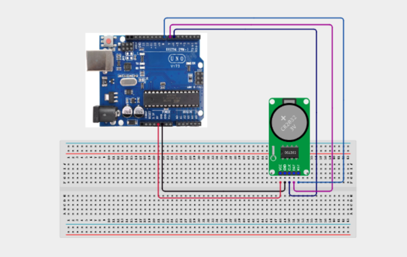

# Project 3.26: Real-Time Clock Serial Display

| **Description** | In this project, learners will use a DS1302 Real-Time Clock (RTC) module to keep accurate time and display the current date and time in the Serial Monitor. The DS1302 uses a 3-wire serial protocol (CLK, DAT, RST) and keeps time even when the Arduino is powered off using a backup battery.
This project introduces 3-wire serial communication, RTC modules, and time management — used in digital clocks, data loggers, scheduling systems, and alarms.|
|------------------|----------------------------------------------------------------|
| **Use case**     | This project is connected to real-world uses such as: RTC modules maintain accurate time independently. They are used in digital alarm clocks, data loggers, industrial scheduling systems, and any device that needs to know the current time.|

## Components (Things You will need)

|  |  |  |  |  |  | 
| --- | --- | --- | --- | --- | --- | 

## Building the circuit

Things Needed:

- Arduino Uno
- DS1302 RTC Clock Module
- CR2032 Coin Battery (if not included)
- Breadboard
- Jumper Wires
- Arduino USB Cable

## Mounting the component on the breadboard and wiring the circuit

**Step 1:**	Identify each component listed in the Required Components table before assembling the circuit.

- Place the DS1302 RTC Module on the breadboard or connect it directly to the Arduino Uno.

- Connect the VCC pin of the DS1302 module to the 5V pin on the Arduino Uno.

- Connect the GND pin of the DS1302 module to the GND pin on the Arduino Uno.

- Connect the CLK pin of the DS1302 module to Digital Pin 6 on the Arduino Uno.

- Connect the DAT pin of the DS1302 module to Digital Pin 7 on the Arduino Uno.

- Connect the RST pin of the DS1302 module to Digital Pin 8 on the Arduino Uno.

- Ensure that all GND connections share a common ground.

- Verify that all wiring connections are secure before connecting the USB cable.



 _Make sure to connect the Arduino USB cable to the Arduino board._

## PROGRAMMING

**Step 1:** Open your Arduino IDE. See how to set up here: [Getting Started](../../Getting Started/Arduino_IDE_Setup.md).

**Step 2:** Write the complete program implementing the system logic with appropriate pin definitions, setup configuration, and the main control loop.

```cpp

// Real-Time Clock Serial Display (DS1302)
// Requires: Rtc by Makuna Library

#include <ThreeWire.h>
#include <RtcDS1302.h>

// DS1302 Pins
const int DAT_PIN = 7;
const int CLK_PIN = 6;
const int RST_PIN = 8;

// Create RTC object
ThreeWire myWire(DAT_PIN, CLK_PIN, RST_PIN);
RtcDS1302<ThreeWire> Rtc(myWire);

void setup() {

  Serial.begin(9600);

  // Initialize RTC
  Rtc.Begin();

  // Check if the RTC contains a valid date and time
  if (!Rtc.IsDateTimeValid()) {
    Serial.println("RTC lost confidence in the DateTime!");
    Rtc.SetDateTime(RtcDateTime(__DATE__, __TIME__));
  }

  // Start RTC if it is not running
  if (!Rtc.GetIsRunning()) {
    Serial.println("RTC was not actively running. Starting now...");
    Rtc.SetIsRunning(true);
  }

  Serial.println("Real-Time Clock Ready");
}

void loop() {

  // Read current date and time
  RtcDateTime now = Rtc.GetDateTime();

  Serial.print("Date: ");

  Serial.print(now.Year());
  Serial.print("/");

  if (now.Month() < 10) Serial.print("0");
  Serial.print(now.Month());
  Serial.print("/");

  if (now.Day() < 10) Serial.print("0");
  Serial.print(now.Day());

  Serial.print(" | Time: ");

  if (now.Hour() < 10) Serial.print("0");
  Serial.print(now.Hour());
  Serial.print(":");

  if (now.Minute() < 10) Serial.print("0");
  Serial.print(now.Minute());
  Serial.print(":");

  if (now.Second() < 10) Serial.print("0");
  Serial.println(now.Second());

  delay(1000);
}

```

**Step 3:** Save your code. _See the [Getting Started](../../Getting Started/Arduino_IDE_Setup.md) section_

**Step 4:** Select the arduino board and port _See the [Getting Started](../../Getting Started/Arduino_IDE_Setup.md) section:Selecting Arduino Board Type and Uploading your code_.

**Step 5:** Upload your code. _See the [Getting Started](../../Getting Started/Arduino_IDE_Setup.md) section:Selecting Arduino Board Type and Uploading your code_

## CONCLUSION

The Serial Monitor displays the current date and time, updating automatically every second to reflect the real-time values stored in the DS1302 RTC module.

If the Arduino Uno is unplugged and powered on again, the DS1302 RTC module continues keeping the correct date and time using its backup battery. When the Arduino reconnects, the Serial Monitor immediately displays the correct current date and time without requiring the program to be uploaded again, provided the backup battery is installed and functioning properly.
