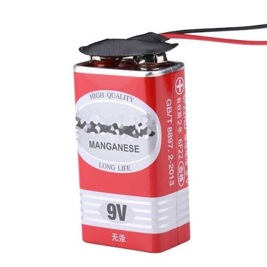
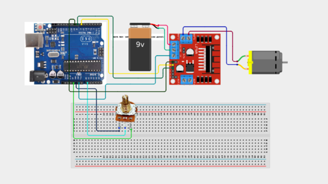

# Project 3.27: DC Motor Speed Controller

| **Description** | In this project, learners will control the speed and direction of a DC motor using a potentiometer and the L298N motor driver module. The motor speed is set by turning the potentiometer, while two buttons or fixed logic control the direction. This project introduces PWM-based motor speed control and H-bridge motor driver operation — the core of electric vehicle speed controllers, robotic drive systems, and fan speed controllers.|
|------------------|----------------------------------------------------------------|
| **Use case**     | This project is connected to real-world uses such as: PWM-based speed control is used in electric vehicles, drone motors, conveyor belts, and computer cooling fans. The L298N H-bridge allows both speed and direction control from a single driver module.|

## Components (Things You will need)

|  |  |  |  |  |  |  |  |  |
| --- | --- | --- | --- | --- | --- | --- | --- | --- |

## Building the circuit

Things Needed:

- Arduino Uno
- DC Motor
- Fan Blade / Motor Blade
- L298N Motor Driver Module
- Potentiometer
- Breadboard
- Jumper Wires
- 9V Battery + Snap connector
- Arduino USB Cable

## Mounting the component on the breadboard and wiring the circuit

**Step 1:**	Identify each component listed in the Required Components table before assembling the circuit.

- Identify the Arduino Uno, L298N motor driver, DC motor, potentiometer, battery, and fan blade before starting.

- Connect L298N IN1 to Arduino Digital Pin 7. This controls one motor direction input.

- Connect L298N IN2 to Arduino Digital Pin 8. This controls the second motor direction input.

- Connect L298N ENA to Arduino Digital Pin 9, which is a PWM pin. This allows the Arduino to control the motor speed.

- Connect the two motor wires to L298N Motor Output A+ and A−.

- Connect the L298N motor power input to the external battery positive terminal. For a 9V battery, connect the positive terminal to the driver's motor supply input.

- Connect the battery negative terminal to L298N GND.

- Connect L298N GND to Arduino GND. This common ground is essential so that the Arduino's control signals have the correct reference.

- Connect the potentiometer middle pin (wiper) to Arduino A0. This provides the variable speed-control signal.

- Connect one outer potentiometer pin to Arduino 5V.

- Connect the other outer potentiometer pin to Arduino GND.

- Attach the fan blade/motor blade securely to the motor shaft if your project uses one.

- Check that the motor wires cannot touch the rotating fan blade.

- Check all power and ground connections carefully before applying power.

- Connect the Arduino to the computer and upload the program.

- Apply power to the motor driver and slowly turn the potentiometer to test the motor speed.



 _Make sure to connect the Arduino USB cable to the Arduino board._

## PROGRAMMING

**Step 1:** Open your Arduino IDE. See how to set up here: [Getting Started](../../STEMAIDE_CODER_Kit_Manual/Getting_Started/Arduino_IDE_Setup.md).

**Step 2:** Write the complete program implementing the system logic with appropriate pin definitions, setup configuration, and the main control loop.

```cpp

// DC Motor Speed Controller
// Uses a potentiometer to control the motor speed
// through an L298N motor driver.

const int enablePin = 9;  // ENA - PWM speed control
const int in1Pin = 7;     // IN1 - Direction control
const int in2Pin = 8;     // IN2 - Direction control
const int potPin = A0;    // Potentiometer wiper

void setup() {

  Serial.begin(9600);

  // Configure motor control pins
  pinMode(enablePin, OUTPUT);
  pinMode(in1Pin, OUTPUT);
  pinMode(in2Pin, OUTPUT);

  // Set the motor direction to forward
  digitalWrite(in1Pin, HIGH);
  digitalWrite(in2Pin, LOW);

  // Start with the motor stopped
  analogWrite(enablePin, 0);

  Serial.println("DC Motor Speed Controller Ready");
  Serial.println("Turn the potentiometer to control motor speed.");
}

void loop() {

  // Read the potentiometer
  int potValue = analogRead(potPin);

  // Convert 0-1023 to the PWM range 0-255
  int motorSpeed = map(potValue, 0, 1023, 0, 255);

  // Apply the PWM speed to the L298N ENA pin
  analogWrite(enablePin, motorSpeed);

  // Display values in Serial Monitor
  Serial.print("Potentiometer: ");
  Serial.print(potValue);

  Serial.print(" | Motor PWM: ");
  Serial.println(motorSpeed);

  delay(100);
}

```

**Step 3:** Save your code. _See the [Getting Started](../../STEMAIDE_CODER_Kit_Manual/Getting_Started/Arduino_IDE_Setup.md) section_

**Step 4:** Select the arduino board and port _See the [Getting Started](../../STEMAIDE_CODER_Kit_Manual/Getting_Started/Arduino_IDE_Setup.md).

**Step 5:** Upload your code. 

## CONCLUSION

When the potentiometer is turned to the left, the DC motor gradually slows down. As the potentiometer is turned to the right, the motor gradually increases its speed.
At the minimum potentiometer position, the motor stops completely. At the maximum position, the motor runs at full speed.
The Serial Monitor continuously displays the potentiometer reading and its corresponding PWM speed value, allowing the user to observe how the potentiometer controls the motor speed.
