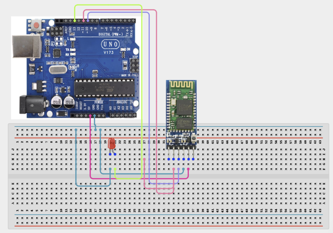

# Project 3.28: Bluetooth LED Controller

| **Description** | In this project, learners will use an HC-05 Bluetooth module to control an LED wirelessly from a smartphone using a Bluetooth serial terminal app. Characters sent from the phone over Bluetooth will turn the LED on or off. 
|------------------|----------------------------------------------------------------|
| **Use case**     | This project is connected to real-world uses such as: Bluetooth serial modules enable wireless control of Arduino from any Bluetooth-enabled device. This principle is used in wireless sensor nodes, home automation apps, Bluetooth robots, and health monitoring devices. |

## Components (Things You will need)

|  |  |  |  |  |  |  |
| --- | --- | --- | --- | --- | --- | --- |

## Building the circuit

Things Needed:

- Arduino Uno
- HC-05 Bluetooth Module
- LED
- 220Ω Resistor
- 1kΩ + 2kΩ Resistors (voltage divider)
- Breadboard
- Jumper Wires
-Arduino USB Cable
- Smartphone

## Mounting the component on the breadboard and wiring the circuit

**Step 1:**	Identify each component listed in the Required Components table before assembling the circuit.

- Place the HC-05 Bluetooth Module and 5mm LED on the breadboard or connect to the Arduino.

- Connect HC-05 VCC to 5V (Power supply.).

- Connect HC-05 GND to GND (Ground.).

- Connect HC-05 TXD to Pin 10 (SoftwareSerial RX) (Bluetooth sends data to Arduino.).

- Connect HC-05 RXD to Pin 11 via voltage divider (1kΩ + 2kΩ) (Arduino sends to Bluetooth — must be 3.3V max.).

- Connect LED Anode (+) to Pin 13 via 220Ω (LED control.).

- Connect LED Cathode (–) to GND (Ground return.).

-	Check all GND connections share a common ground.

-	Check polarity for all modules before connecting USB power.

_Note: Disconnect the Arduino USB cable while making the connections. Do not connect the HC-05 RXD directly to an Arduino 5 V digital output._



 _Make sure to connect the Arduino USB cable to the Arduino board._

## PROGRAMMING

**Step 1:** Open your Arduino IDE. See how to set up here: [Getting Started](../../Getting Started/Arduino_IDE_Setup.md).

**Step 2:** Write the complete program implementing the system logic with appropriate pin definitions, setup configuration, and the main control loop.

```cpp

// Bluetooth LED Controller (HC-05)
#include <SoftwareSerial.h>

SoftwareSerial bluetooth(10, 11); // RX=10, TX=11
int ledPin = 13;

void setup() {
  Serial.begin(9600);     // USB Serial Monitor
  bluetooth.begin(9600);  // HC-05 default baud rate
  pinMode(ledPin, OUTPUT);
  Serial.println("Bluetooth LED Controller Ready");
  Serial.println("Send '1' to turn LED ON, '0' to turn LED OFF.");
}

void loop() {
  if (bluetooth.available()) {
    char cmd = bluetooth.read();
    Serial.print("Received: ");
    Serial.println(cmd);

    if (cmd == '1') {
      digitalWrite(ledPin, HIGH);
      bluetooth.println("LED ON");
      Serial.println("LED ON");
    } else if (cmd == '0') {
      digitalWrite(ledPin, LOW);
      bluetooth.println("LED OFF");
      Serial.println("LED OFF");
    }
  }
}


```

**Step 3:** Save your code. _See the [Getting Started](../../Getting Started/Arduino_IDE_Setup.md) section_

**Step 4:** Select the arduino board and port _See the [Getting Started](../../Getting Started/Arduino_IDE_Setup.md) section:Selecting Arduino Board Type and Uploading your code_.

**Step 5:** Upload your code. _See the [Getting Started](../../Getting Started/Arduino_IDE_Setup.md) section:Selecting Arduino Board Type and Uploading your code_

## CONCLUSION

After pairing the smartphone with the HC-05 Bluetooth module using the default PIN 1234, open a Bluetooth serial terminal application.
When 1 is sent from the smartphone, the Arduino turns the LED ON, and the message “LED ON” is displayed. When 0 is sent, the Arduino turns the LED OFF, and the message “LED OFF” is displayed.
This demonstrates wireless control of an Arduino output using Bluetooth communication.
