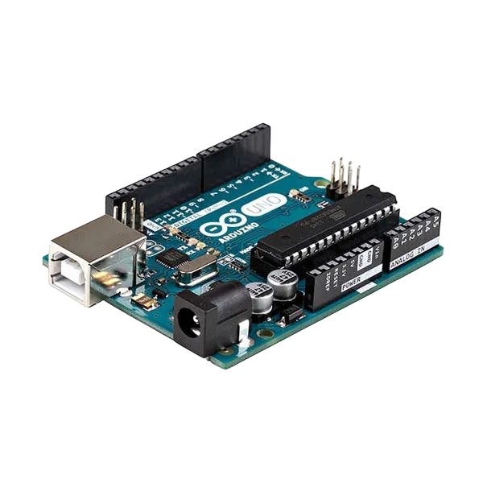
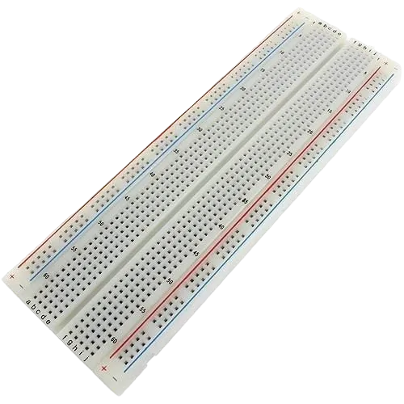
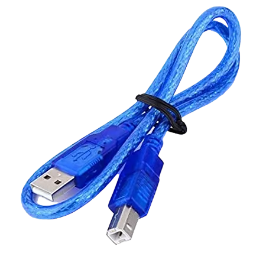
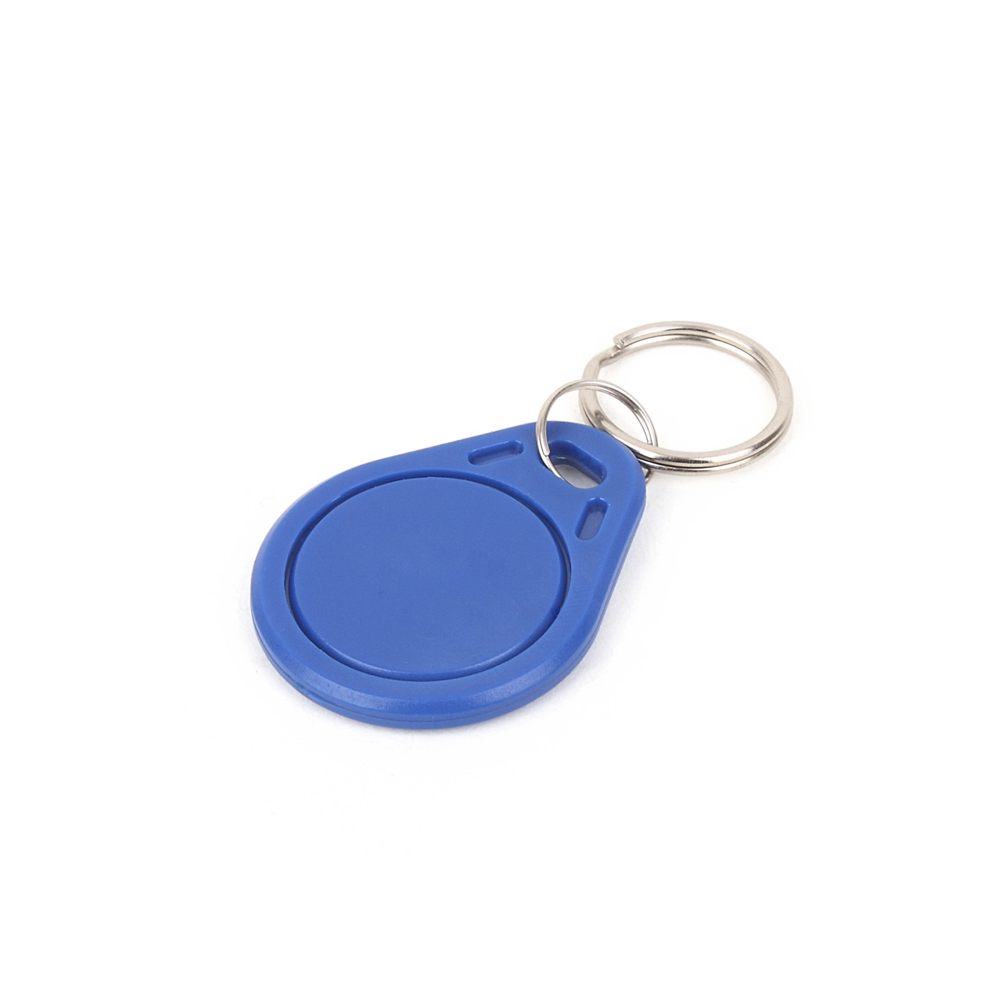
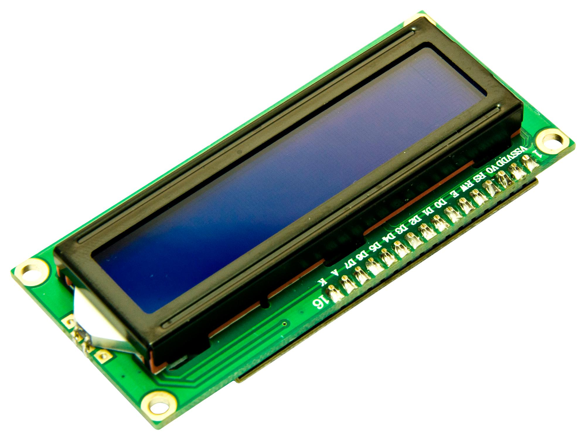
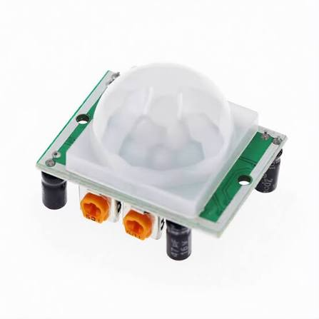
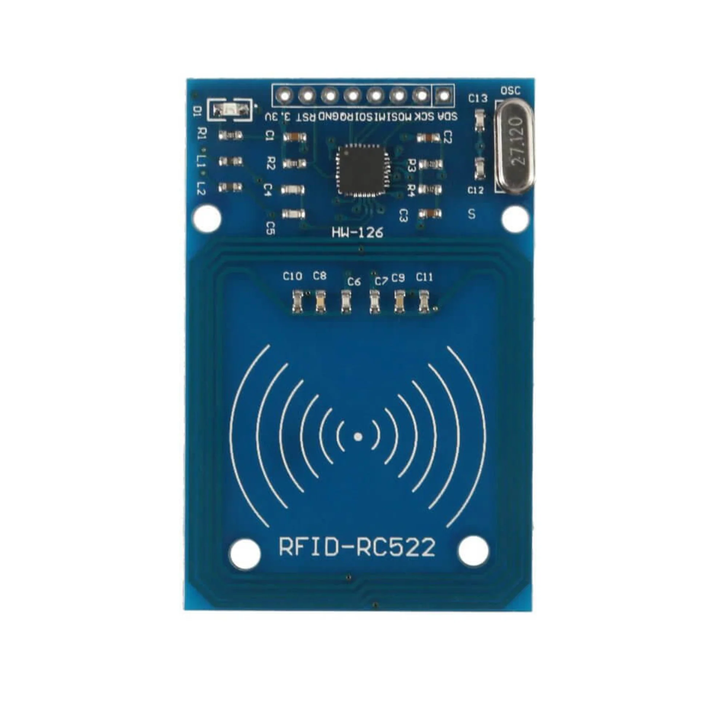

# Project 3.2: Smart Home Security Dashboard

| **Description** | In this project, learners will build a centralized security dashboard that combines motion detection, RFID authentication, LCD feedback, and audible alarms. The system monitors room activity and verifies authorized users before granting access. |
|------------------|----------------------------------------------------------------|
| **Use case**     | This project demonstrates how multiple technologies can work together to improve building security and access control. It reflects real-world applications such as smart homes, offices, and secure entry systems. |

## Components (Things You will need)

|  |  |  |  |  |  |  |  |  |
| --- | --- | --- | --- | --- | --- | --- | --- | --- |

## Building the circuit

Things Needed:

- Arduino Uno 
- Arduino USB cable 
- Jumper Wires
- RFID Reader
- Breadboard
- 12C LCD Display
- Buzzer
- PIR Motion Sensor
- RFID Card/Tag

## Mounting the component on the breadboard and wiring the circuit

**Step 1:**	Identify each component listed in the Required Components table before assembling the circuit.
- Place the RFID Reader (MFRC522), PIR sensor, I²C LCD module, and buzzer on the breadboard.

- Connect the RFID Reader (MFRC522) by connecting the SDA pin to Digital Pin 10, SCK to Digital Pin 13, MOSI to Digital Pin 11, MISO to Digital Pin 12, RST to Digital Pin 9, 3.3V to the 3.3V pin on the Arduino Uno, and GND to GND.

## Important: The MFRC522 operates at 3.3V only. Do not connect it to the 5V pin, as this may permanently damage the module.

- Connect the PIR sensor according to the circuit diagram by connecting its VCC, GND, and signal pins to the specified Arduino pins.

- Connect the I²C LCD module by connecting the VCC pin to 5V, the GND pin to GND, the SDA pin to Analog Pin A4, and the SCL pin to Analog Pin A5.

- Connect the buzzer by connecting its positive (+) pin to the specified digital pin on the Arduino Uno and its negative (–) pin to GND.

- Ensure all components share a common GND connection, then carefully verify every connection before connecting the Arduino Uno to your computer using the USB cable.


_Make sure to connect the Arduino USB cable to the Arduino board._

## PROGRAMMING

**Step 1:** Open your Arduino IDE. See how to set up here: [Getting Started](../../Getting Started/Arduino_IDE_Setup.md).

**Step 2:** Write the complete program implementing the system logic with appropriate pin definitions, setup configuration, and the main control loop.

```cpp

// Include required libraries
#include <SPI.h>
#include <MFRC522.h>
#include <Wire.h>
#include <LiquidCrystal_I2C.h>

// Define pins
#define SS_PIN 10
#define RST_PIN 9
#define PIR_PIN 2
#define BUZZER_PIN 8

// Create objects
MFRC522 rfid(SS_PIN, RST_PIN);
LiquidCrystal_I2C lcd(0x27, 16, 2);

void setup() {
  Serial.begin(9600);
  SPI.begin();
  rfid.PCD_Init();
  lcd.init();
  lcd.backlight();
  pinMode(PIR_PIN, INPUT);
  pinMode(BUZZER_PIN, OUTPUT);
  lcd.print("System Ready");
}

void loop() {
  // Read motion sensor
  int motion = digitalRead(PIR_PIN);

  // Check for RFID card
  if (rfid.PICC_IsNewCardPresent() && rfid.PICC_ReadCardSerial()) {
    lcd.clear();
    lcd.print("Access Granted");
    digitalWrite(BUZZER_PIN, LOW); // Turn off alarm
    delay(2000);
    lcd.clear();
    lcd.print("System Armed");
    rfid.PICC_HaltA();
    rfid.PCD_StopCrypto1();
  } 
  // If motion is detected
  else if (motion == HIGH) {
    lcd.clear();
    lcd.print("Motion Alert");
    digitalWrite(BUZZER_PIN, HIGH);
  }
  // If no motion or valid card
  else {
    digitalWrite(BUZZER_PIN, LOW);
  }
}


```

**Step 3:** Save your code. _See the [Getting Started](../../Getting Started/Arduino_IDE_Setup.md) section_

**Step 4:** Select the arduino board and port _See the [Getting Started](../../Getting Started/Arduino_IDE_Setup.md) section:Selecting Arduino Board Type and Uploading your code_.

**Step 5:** Upload your code. _See the [Getting Started](../../Getting Started/Arduino_IDE_Setup.md) section:Selecting Arduino Board Type and Uploading your code_

## CONCLUSION

When the system detects motion, the LCD displays: `Motion Alert` and the buzzer sounds to indicate a possible intrusion. Scanning an authorized RFID card temporarily disables the alarm, demonstrating secure access control and alarm management.
