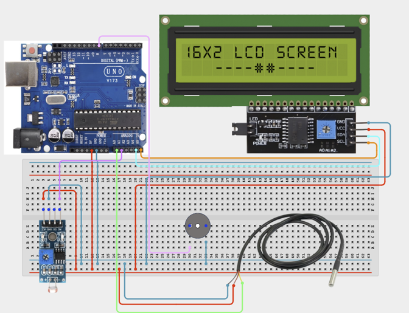

# Project 3.3: Automated Classroom Environment Monitor

| **Description** | This project combines temperature sensing, light sensing, LCD visualization, and buzzer alerts to monitor classroom conditions and improve learner comfort.|
|------------------|----------------------------------------------------------------|
| **Use case**     |This project is connected to real-world uses such as: This project demonstrates how technology can improve comfort, productivity, and safety in educational environments.|

## Components (Things You will need)

|  |  |  |  |  |  |  |  |
| --- | --- | --- | --- | --- | --- | --- | --- |

## Building the circuit

Things Needed:

- Arduino Uno 
- Arduino USB cable 
- Jumper Wires
- Breadboard
- LCD Display
- Buzzer
- Temperature Sensor
- LDR Module

## Mounting the component on the breadboard and wiring the circuit

**Step 1:**	Identify each component listed in the Required Components table before assembling the circuit.

- Place the Temperature Sensor and LDR Module on the breadboard.

- Connect the Temperature Sensor by connecting the VCC pin to 5V, the GND pin to GND, and the signal/output pin to the specified Arduino pin in the circuit diagram.

- Connect the LDR Module by connecting the VCC pin to 5V, the GND pin to GND, and the signal/output pin to the specified Arduino pin in the circuit diagram.

- Ensure all components share a common 5V and GND connection, then carefully verify every connection before connecting the Arduino Uno to your computer using the USB cable.



_Make sure to connect the Arduino USB cable to the Arduino board._

## PROGRAMMING

**Step 1:** Open your Arduino IDE. See how to set up here: [Getting Started](../../Getting Started/Arduino_IDE_Setup.md).

**Step 2:** Write the complete program implementing the system logic with appropriate pin definitions, setup configuration, and the main control loop.

```cpp

#include <Wire.h>
#include <LiquidCrystal_I2C.h>
// Create LCD object
LiquidCrystal_I2C lcd(0x27,16,2);
// Sensor pins
int tempPin = A0;
int lightPin = A1;
// Alarm pin
int buzzerPin = 8;
void setup() {
 lcd.init();
 lcd.backlight();
 pinMode(buzzerPin,OUTPUT);
}
void loop() {
 // Read sensors
 int temp = analogRead(tempPin);
 int light = analogRead(lightPin);
 // Display readings
 lcd.setCursor(0,0);
 lcd.print("T:");
 lcd.print(temp);
 lcd.print(" L:");
 lcd.print(light);
 // Check classroom conditions
 if(temp > 700){
   digitalWrite(buzzerPin,HIGH);
   lcd.setCursor(0,1);
   lcd.print("Too Hot!      ");
 }
 else{
   digitalWrite(buzzerPin,LOW);
   lcd.setCursor(0,1);
   lcd.print("Environment OK");
 }
 delay(500);
}


```

**Step 3:** Save your code. _See the [Getting Started](../../STEMAIDE_CODER_Kit_Manual/Getting_Started/Arduino_IDE_Setup.md) section_

**Step 4:** Select the arduino board and port _See the [Getting Started](../../STEMAIDE_CODER_Kit_Manual/Getting_Started/Arduino_IDE_Setup.md)

**Step 5:** Upload your code.

## CONCLUSION

When the program is running, the LCD continuously displays the environmental conditions. If the temperature exceeds the preset threshold, the buzzer sounds to alert the user, providing real-time monitoring of the environment.
