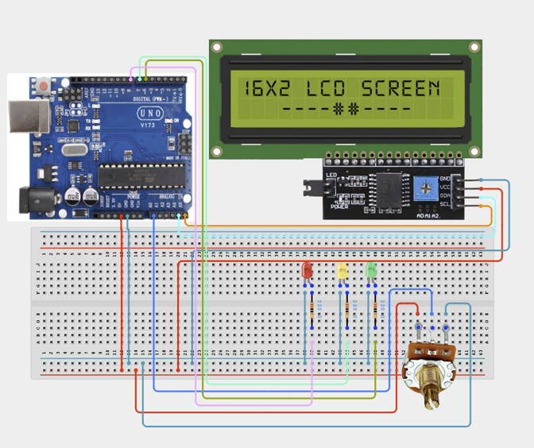

# Project 3.4: Smart Energy Consumption Monitor

| **Description** | In this project, learners will create a Smart Energy Consumption Monitor that simulates monitoring electrical appliance usage. A potentiometer represents varying power consumption levels, while LEDs indicate low, medium, and high energy usage. An LCD displays the current energy level. This project introduces monitoring systems used in smart homes and energy management applications.|
|------------------|----------------------------------------------------------------|
| **Use case**     |This project is connected to real-world uses such as: This project demonstrates how monitoring systems categorize and visualize resource consumption. Similar systems are used in smart meters and home energy dashboards.|

## Components (Things You will need)

|  |  |  |  |  |  |  |  |  | | 
| --- | --- | --- | --- | --- | --- | --- | --- | --- | --- |

## Building the circuit

Things Needed:

- Arduino Uno
- Potentiometer
- I2C LCD Display
- Red LED
- Yellow LED
- Green LED
- 220Ω Resistors
- Breadboard
- Jumper Wires

## Mounting the component on the breadboard and wiring the circuit

**Step 1:** Connect the Arduino 5V pin to the breadboard's positive (+) power rail and the Arduino GND pin to the negative (-) power rail.

**Step 2:** Ensure that all GND connections share the same ground line to maintain stable and reliable circuit operation.



**Step 3:** After confirming that all connections are correct, connect the USB cable to the Arduino Uno board and the computer to power the circuit.

_Make sure to connect the Arduino USB cable to the Arduino board._

## PROGRAMMING

**Step 1:** Open your Arduino IDE. See how to set up here: [Getting Started](../../STEMAIDE_CODER_Kit_Manual/Getting_Started/Arduino_IDE_Setup.md).

**Step 2:** Write the complete program implementing the system logic with appropriate pin definitions, setup configuration, and the main control loop.

```cpp
#include <Wire.h>
#include <LiquidCrystal_I2C.h>
// Create LCD object
LiquidCrystal_I2C lcd(0x27,16,2);
// Potentiometer pin
int energyPin = A0;
// LED pins
int greenLED = 6;
int yellowLED = 7;
int redLED = 8;
void setup() {
 lcd.init();
 lcd.backlight();
 pinMode(greenLED, OUTPUT);
 pinMode(yellowLED, OUTPUT);
 pinMode(redLED, OUTPUT);
}
void loop() {
 // Read energy level
 int energyValue = analogRead(energyPin);
 // Display value
 lcd.setCursor(0,0);
 lcd.print("Energy:");
 lcd.print(energyValue);
 lcd.print("   ");
 // Low usage
 if(energyValue < 350){
   digitalWrite(greenLED,HIGH);
   digitalWrite(yellowLED,LOW);
   digitalWrite(redLED,LOW);
   lcd.setCursor(0,1);
   lcd.print("Low Usage     ");
 }
 // Medium usage
 else if(energyValue < 700){
   digitalWrite(greenLED,LOW);
   digitalWrite(yellowLED,HIGH);
   digitalWrite(redLED,LOW);
   lcd.setCursor(0,1);
   lcd.print("Medium Usage  ");
 }
 // High usage
 else{
   digitalWrite(greenLED,LOW);
   digitalWrite(yellowLED,LOW);
   digitalWrite(redLED,HIGH);
   lcd.setCursor(0,1);
   lcd.print("High Usage    ");
 }
 delay(300);
}

```

**Step 3:** Save your code. _See the [Getting Started](../../STEMAIDE_CODER_Kit_Manual/Getting_Started/Arduino_IDE_Setup.md) section_

**Step 4:** Select the arduino board and port _See the [Getting Started](../../STEMAIDE_CODER_Kit_Manual/Getting_Started/Arduino_IDE_Setup.md)

**Step 5:** Upload your code.

## CONCLUSION

When the program is running, the Smart Energy Consumption Monitor continuously monitors user input and sensor readings. The display updates with the current system status, while connected outputs such as the LED, buzzer, servo, motor, relay, or RGB LED respond according to the program logic. When a predefined threshold or event is detected, the system provides appropriate visual, audible, or movement-based feedback to indicate the condition.
