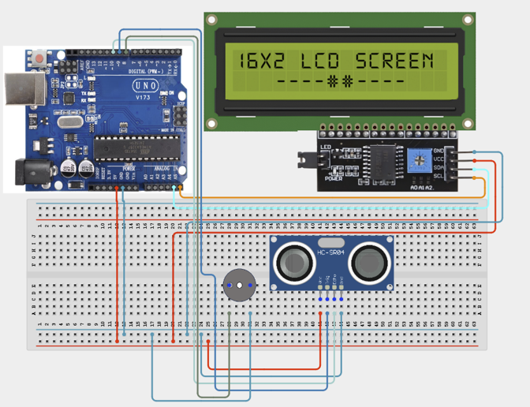

# Project 3.5: Automated Warehouse Monitoring System

| **Description** | This project combines an Ultrasonic Sensor, LCD Display, and Buzzer to monitor storage spaces in a warehouse. The system measures the distance to stored items and alerts users when inventory reaches a predefined level.
|
|------------------|----------------------------------------------------------------|
| **Use case**     |This project is connected to real-world uses such as: This project demonstrates how sensors can automate inventory monitoring and storage management processes commonly used in logistics and warehousing.|

## Components (Things You will need)

|  |  |  |  |  |  |  | 

## Building the circuit

Things Needed:

- Arduino Uno
- Ultrasonic Sensor
- LCD Display
- Arduino USB Cable
- Buzzer
- Breadboard
- Jumper Wires

## Mounting the component on the breadboard and wiring the circuit

**Step 1:**	Identify each component listed in the Required Components table before assembling the circuit.

- Place the Ultrasonic Sensor and I²C LCD Display on the breadboard.

- Connect the Ultrasonic Sensor by connecting the positive (+) pin to Digital Pin 8 and the negative (–) pin to the GND pin on the Arduino Uno.

- Connect the I²C LCD Display by connecting the SDA pin to Analog Pin A4, the SCL pin to Analog Pin A5, the VCC pin to 5V, and the GND pin to GND on the Arduino Uno.

- Ensure all components share a common 5V and GND connection, then carefully verify every connection before connecting the Arduino Uno to your computer using the USB cable.



_Make sure to connect the Arduino USB cable to the Arduino board._

## PROGRAMMING

**Step 1:** Open your Arduino IDE. See how to set up here: [Getting Started](../../Getting Started/Arduino_IDE_Setup.md).

**Step 2:** Write the complete program implementing the system logic with appropriate pin definitions, setup configuration, and the main control loop.

```cpp

#include <Wire.h>
#include <LiquidCrystal_I2C.h>
LiquidCrystal_I2C lcd(0x27,16,2);
int trigPin = 9;
int echoPin = 10;
int buzzerPin = 8;

void setup() {
 lcd.init();
 lcd.backlight();
 pinMode(trigPin, OUTPUT);
 pinMode(echoPin, INPUT);
 pinMode(buzzerPin, OUTPUT);
}
void loop() {
 // Send ultrasonic pulse
 digitalWrite(trigPin, LOW);
 delayMicroseconds(2);
 digitalWrite(trigPin, HIGH);
 delayMicroseconds(10);
 digitalWrite(trigPin, LOW);
 // Measure echo duration
 long duration = pulseIn(echoPin, HIGH);

 // Calculate distance
 int distance = duration * 0.034 / 2;
 // Display distance
 lcd.setCursor(0,0);
 lcd.print("Stock Dist:");
 lcd.print(distance);
 lcd.print(" ");
 // Check storage level

 if(distance < 10){
   digitalWrite(buzzerPin,HIGH);
   lcd.setCursor(0,1);
   lcd.print("Storage Full ");
 }
 else{
   digitalWrite(buzzerPin,LOW);
   lcd.setCursor(0,1);
   lcd.print("Space Avail. ");
 }
 delay(300);
}


```

**Step 7:** Save your code. _See the [Getting Started](../../Getting Started/Arduino_IDE_Setup.md) section_

**Step 8:** Select the arduino board and port _See the [Getting Started](../../Getting Started/Arduino_IDE_Setup.md) section:Selecting Arduino Board Type and Uploading your code_.

**Step 9:** Upload your code. _See the [Getting Started](../../Getting Started/Arduino_IDE_Setup.md) section:Selecting Arduino Board Type and Uploading your code_

## CONCLUSION

When the program is running, the Automated Warehouse Monitoring System continuously monitors sensor inputs and user interactions. The LCD displays the current system status, while connected outputs such as LEDs, the buzzer, servo, relay, or motor respond according to the programmed logic. When a predefined condition or event is detected, the system provides appropriate visual, audible, or movement-based feedback to indicate the warehouse status.
