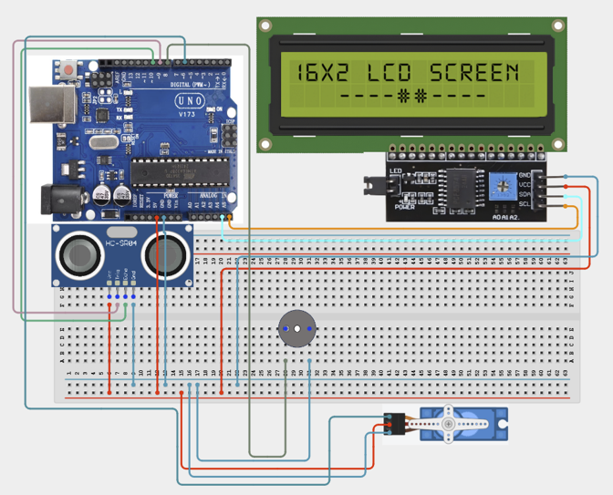

# Project 3.7: Smart Vehicle Parking Management System

| **Description** | In this project, learners will build an automated parking management system using an Ultrasonic Sensor, Servo Motor, LCD Display, and Buzzer. The system detects approaching vehicles, automatically opens a gate when space is available, and alerts users when the parking area is full. This project demonstrates automation systems commonly used in shopping malls, office complexes, and smart city infrastructure.|
|------------------|----------------------------------------------------------------|
| **Use case**     | This project is connected to real-world uses such as: demonstrates automated vehicle access systems used in modern parking facilities and smart transportation infrastructure. |

## Components (Things You will need)

|  |  |  |  |  |  |  |  |
|---|---|---|---|---|---|---|---|

## Building the circuit

Things Needed:

- Arduino Uno
- Ultrasonic Sensor (HC-SR04)
- Servo Motor
- I2C LCD Display
- Buzzer
- Breadboard
- Jumper Wires

## Mounting the component on the breadboard and wiring the circuit

**Step 1:**	Identify each component listed in the Required Components table before assembling the circuit.

- Place the Ultrasonic Sensor (HC-SR04) and Servo Motor on the breadboard.

- Connect the Ultrasonic Sensor by connecting the VCC pin to 5V, the GND pin to GND, the TRIG pin to Digital Pin 9, and the ECHO pin to Digital Pin 10 on the Arduino Uno.

- Connect the Servo Motor by connecting the red (VCC) wire to 5V, the brown/black (GND) wire to GND, and the orange/yellow (signal) wire to Digital Pin 8 on the Arduino Uno.

- Ensure both the ultrasonic sensor and servo motor share a common 5V and GND connection. If necessary, use the breadboard power rails to distribute power.

- Carefully verify all wiring before connecting the Arduino Uno to your computer using the USB cable.



_Make sure to connect the Arduino USB cable to the Arduino board._

## PROGRAMMING

**Step 1:** Open your Arduino IDE. See how to set up here: [Getting Started](../../Getting Started/Arduino_IDE_Setup.md).

**Step 2:** Write the complete program implementing the system logic with appropriate pin definitions, setup configuration, and the main control loop.

```cpp

#include <Servo.h>
#include <Wire.h>
#include <LiquidCrystal_I2C.h>

// Create LCD object
LiquidCrystal_I2C lcd(0x27,16,2);
// Create servo object
Servo gateServo;
// Pin definitions
int trigPin = 9;
int echoPin = 10;
int buzzerPin = 8;

void setup() {
 // Initialize LCD
 lcd.init();
 lcd.backlight();
 // Configure pins
 pinMode(trigPin, OUTPUT);
 pinMode(echoPin, INPUT);
 pinMode(buzzerPin, OUTPUT);
 // Attach servo
 gateServo.attach(6);
 // Keep gate closed initially
 gateServo.write(0);
}

void loop() {
 // Generate ultrasonic pulse
 digitalWrite(trigPin, LOW);
 delayMicroseconds(2);
 digitalWrite(trigPin, HIGH);
 delayMicroseconds(10);
 digitalWrite(trigPin, LOW);

 // Read distance
 long duration = pulseIn(echoPin, HIGH);
 int distance = duration * 0.034 / 2;
 lcd.setCursor(0,0);
 lcd.print("Vehicle:");
 lcd.print(distance);
 lcd.print("cm ");

 // Vehicle detected
 if(distance < 15){
   lcd.setCursor(0,1);
   lcd.print("Gate Opening ");
   // Open gate
   gateServo.write(90);
   delay(3000);
   // Close gate

   gateServo.write(0);
 }
 else{
   lcd.setCursor(0,1);
   lcd.print("Waiting...   ");
 }
 delay(200);
}

```

**Step 3:** Save your code. _See the [Getting Started](../../Getting Started/Arduino_IDE_Setup.md) section_

**Step 4:** Select the arduino board and port _See the [Getting Started](../../Getting Started/Arduino_IDE_Setup.md) section:Selecting Arduino Board Type and Uploading your code_.

**Step 5:** Upload your code. _See the [Getting Started](../../Getting Started/Arduino_IDE_Setup.md) section:Selecting Arduino Board Type and Uploading your code_

## CONCLUSION

When the program is running, the Smart Vehicle Parking Management System continuously monitors the distance between the ultrasonic sensor and nearby objects. When a vehicle is detected within the predefined range, the servo motor automatically responds according to the programmed logic, such as opening or closing a parking barrier. The system provides real-time feedback through the connected outputs, demonstrating automated vehicle detection and parking access control.
