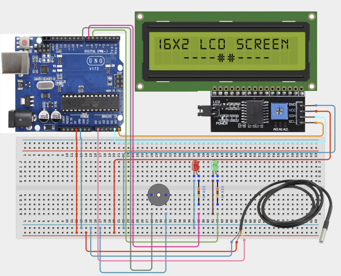

# Project 3.8: Smart Hospital Patient Monitoring System

| **Description** | This project combines a Temperature Sensor, LCD Display, LEDs, and Buzzer to create a simplified patient monitoring system. The system continuously monitors body temperature and alerts medical personnel when abnormal readings occur.|
|------------------|----------------------------------------------------------------|
| **Use case**     | This project is connected to real-world uses such as: demonstrates health-monitoring systems used in hospitals, clinics, and patient-care environments. |

## Components (Things You will need)

|  |  |  |  |  |  |  |  |  |
|---|---|---|---|---|---|---|---|---|

## Building the circuit

Things Needed:

- Arduino Uno
- Temperature Sensor (LM35)
- LCD Display
- Green LED
- Red LED
- Buzzer
- Ω Resistors
- Breadboard
- Jumper Wires

## Mounting the component on the breadboard and wiring the circuit

**Step 1:** Connect the Arduino 5V pin to the breadboard's positive (+) power rail and the Arduino GND pin to the negative (-) power rail.

**Step 2:** Ensure that all GND connections share the same ground line to maintain stable and reliable circuit operation.



**Step 3:** After confirming that all connections are correct, connect the USB cable to the Arduino Uno board and the computer to power the circuit.

_Make sure to connect the Arduino USB cable to the Arduino board._

## PROGRAMMING

**Step 1:** Open your Arduino IDE. See how to set up here: [Getting Started](../../Getting Started/Arduino_IDE_Setup.md).

**Step 2:** Write the complete program implementing the system logic with appropriate pin definitions, setup configuration, and the main control loop.

```cpp

#include <Wire.h>
#include <LiquidCrystal_I2C.h>

LiquidCrystal_I2C lcd(0x27, 16, 2);

const int tempPin = A0;
const int greenLED = 6;
const int redLED = 7;
const int buzzerPin = 8;

void setup() {

  lcd.init();
  lcd.backlight();

  pinMode(greenLED, OUTPUT);
  pinMode(redLED, OUTPUT);
  pinMode(buzzerPin, OUTPUT);

}

void loop() {

  // Read LM35 sensor
  int sensorValue = analogRead(tempPin);

  // Convert to voltage
  float voltage = sensorValue * (5.0 / 1023.0);

  // Convert voltage to temperature (°C)
  float temperature = voltage * 100.0;

  // Display temperature
  lcd.setCursor(0, 0);
  lcd.print("Temp:");
  lcd.print(temperature, 1);
  lcd.print((char)223);   // Degree symbol
  lcd.print("C ");

  // Check temperature
  if (temperature < 37.5) {

    digitalWrite(greenLED, HIGH);
    digitalWrite(redLED, LOW);
    digitalWrite(buzzerPin, LOW);

    lcd.setCursor(0, 1);
    lcd.print("Normal        ");

  }
  else {

    digitalWrite(greenLED, LOW);
    digitalWrite(redLED, HIGH);
    digitalWrite(buzzerPin, HIGH);

    lcd.setCursor(0, 1);
    lcd.print("High Temp!    ");

  }

  delay(500);
}

```

**Step 3:** Save your code. _See the [Getting Started](../../STEMAIDE_CODER_Kit_Manual/Getting_Started/Arduino_IDE_Setup.md) section_

**Step 4:** Select the arduino board and port _See the [Getting Started](../../STEMAIDE_CODER_Kit_Manual/Getting_Started/Arduino_IDE_Setup.md).

**Step 5:** Upload your code.

## CONCLUSION

When the program is running, the Smart Hospital Patient Monitoring System continuously measures the patient's temperature and displays the reading on the LCD. If the temperature remains within the normal range, the green LED stays on and the buzzer remains off. When the temperature exceeds the preset threshold, the red LED lights up, the buzzer sounds, and the LCD displays a high-temperature warning, providing an immediate visual and audible alert.
